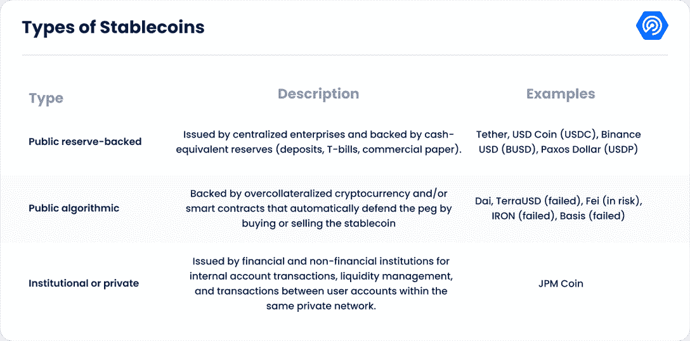
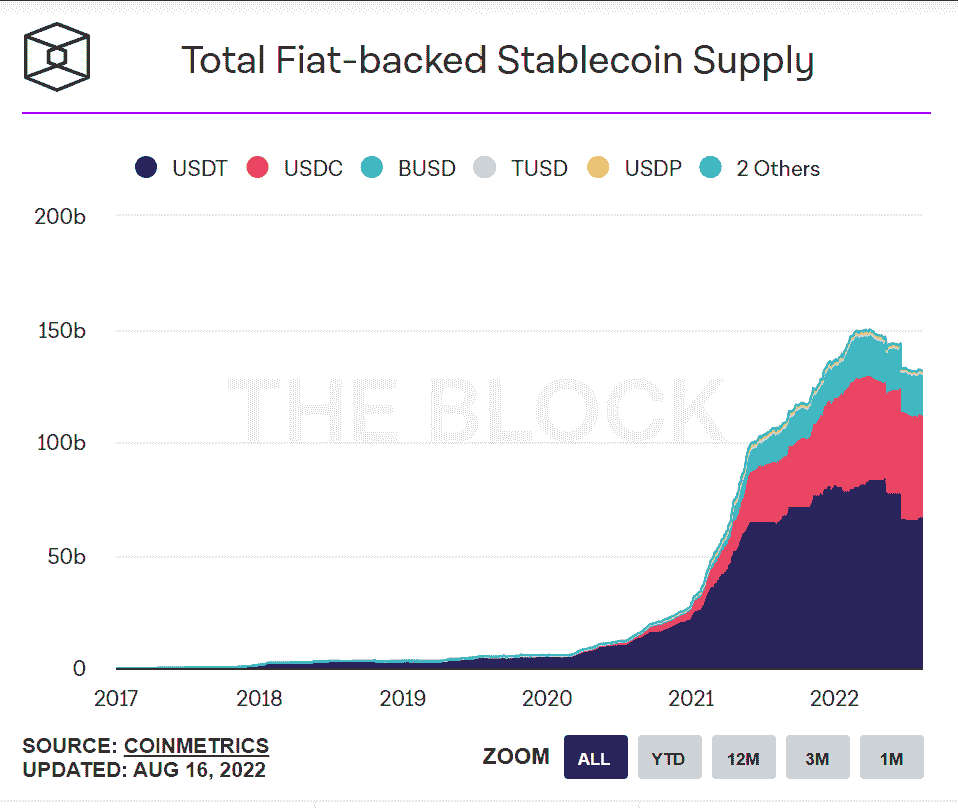
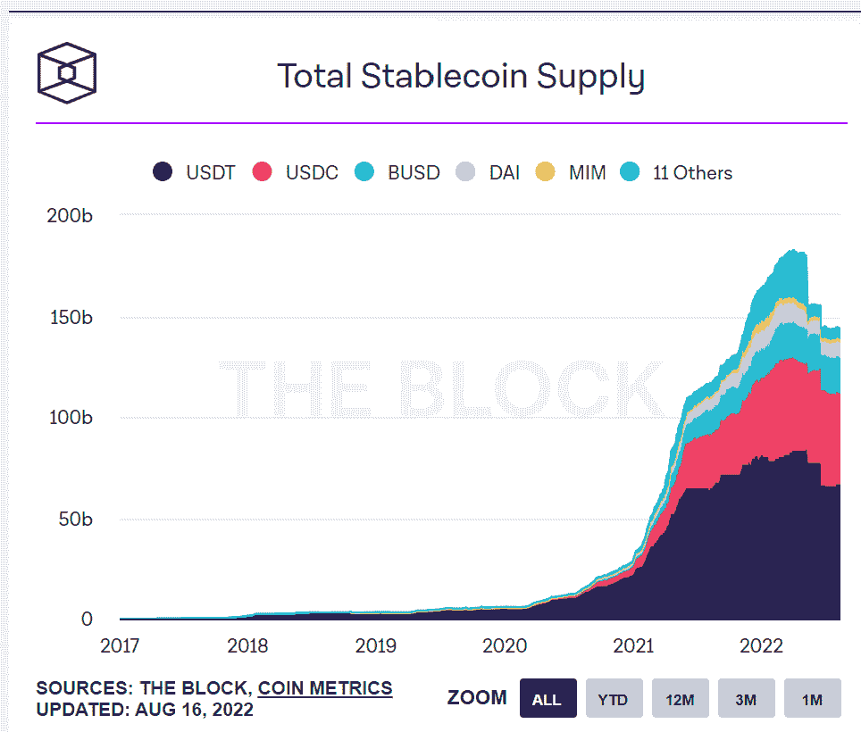
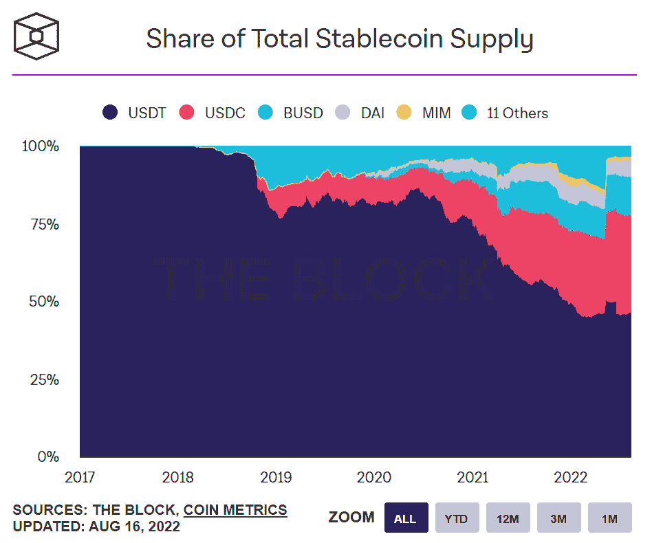
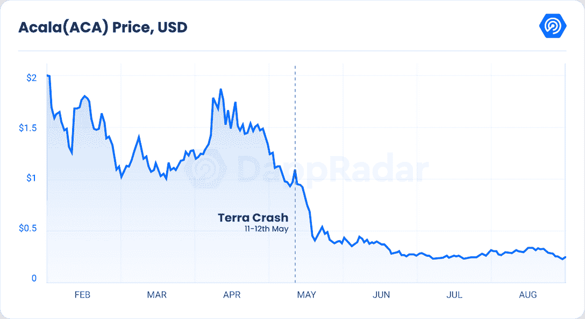
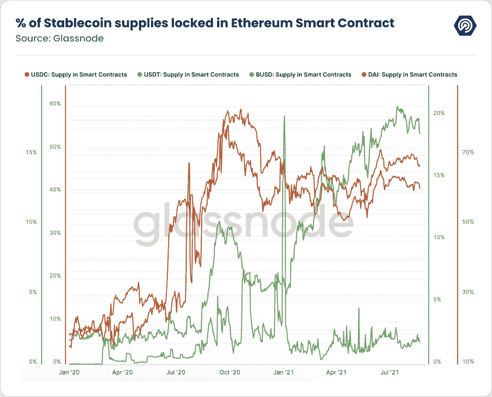
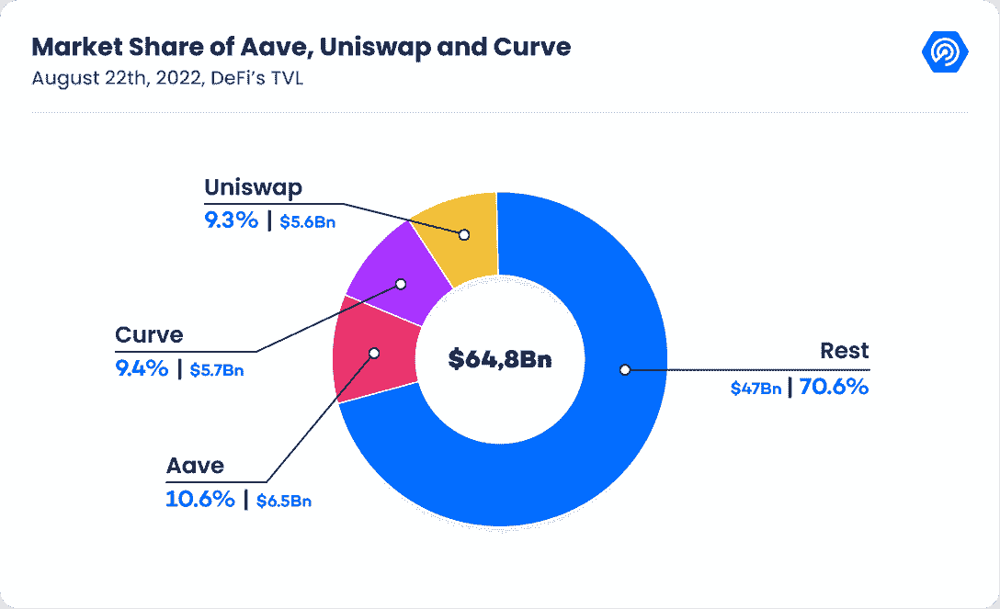
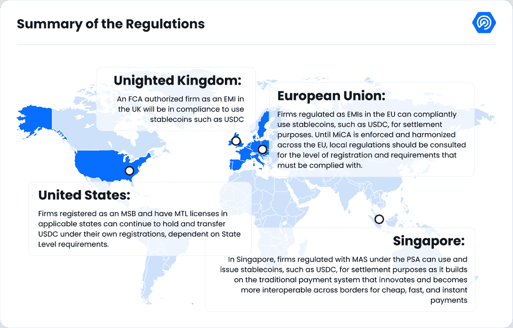

# DeFi 的 Stablecoins 在 Terra 和 Tornado 现金后挣扎

> 原文：<https://web.archive.org/web/https://dappradar.com/blog/defis-stablecoins-battle-fallout-from-terra-tornado-cash-and-the-ethereum-merge>

## 稳定密码是加密生态系统中最重要的组成部分之一。

过去两年来，stablecoins 的市场显著增长，现在已经成为加密生态系统中最重要的组成部分之一。稳定货币依靠不同的方法来维持相对于一种或几种货币或其他资产(包括加密资产)的稳定价值。相比之下，其他人利用算法来保持稳定的值。Stablecoin 市值最高时超过 1600 亿美元，目前为 1428.2 亿美元。

2022 年，该行业目睹了大量财富从不稳定的加密资产中流出，这增强了稳定的加密资产的重要性。由于 Terra (LUNA)的崩溃和随后的流动性危机，价值离开了不稳定的持有量，进入了稳定的持有量。最近，围绕龙卷风现金的新闻和法律行动描绘了这种资产的有趣前景。

*   [通过我们的简单指南学习稳定硬币的基础知识](https://web.archive.org/web/20221129080335/https://dappradar.com/blog/stablecoins-the-simple-guide)

## 内容

*   Stablecoins:它们是什么，市值有多大？
*   是什么保持了稳定的货币汇率？从 UST 和澳大利亚吸取的教训
*   [龙卷风现金揭开马克道的致命弱点](https://web.archive.org/web/20221129080335/https://dappradar.com/blog/defis-stablecoins-battle-fallout-from-terra-tornado-cash-and-the-ethereum-merge/#Tornado-Cash)
*   [以太坊的“合并”会影响稳定圈的稳定性吗？](https://web.archive.org/web/20221129080335/https://dappradar.com/blog/defis-stablecoins-battle-fallout-from-terra-tornado-cash-and-the-ethereum-merge/#Will-Ethereum’s-“Merge”-)
*   DeFi 协议宣布寻求用户和流动性的新稳定账户；行得通吗？
*   [可能影响稳定信贷未来的潜在法规](https://web.archive.org/web/20221129080335/https://dappradar.com/blog/defis-stablecoins-battle-fallout-from-terra-tornado-cash-and-the-ethereum-merge/#Potential-regulations)
*   [结论](https://web.archive.org/web/20221129080335/https://dappradar.com/blog/defis-stablecoins-battle-fallout-from-terra-tornado-cash-and-the-ethereum-merge/#Conclusion-)

## 关键要点

*   两年间，稳定资本的总供给增加了 816%，达到 1428.2 亿美元
*   Tether (USDT)是交易第二活跃的加密货币(约占 BTC 每日交易量的 60%)，今年早些时候进入了市场价值排名前十的加密资产
*   自 2020 年以来，系绳(USDT)的优势减少了 44%
*   Aave 正在推出一种去中心化的、算法化的、能产生收益的稳定货币——GHO，它的作用是增强其贷款协议
*   USDC 的发行人 Circle 和 USDT 的发行人 Tether 宣布支持以太坊合并；马克尔道(戴)和灰度，投资公司表示担忧

## Stablecoins:它们是什么，市值有多大？

稳定货币是存储在分布式账本技术(DLT)上的数字货币，通常是区块链，与参考值相关联。绝大多数现有稳定货币与美元挂钩，但是稳定货币也可能与其他法定货币、货币篮子、其他加密货币或黄金等商品挂钩。

稳定货币在两个关键方面不同于普通的数字货币记录，如银行存款账户。首先，stablecoins 受到密码保护。这使得用户能够非常快速地完成交易，而无需重复花费或第三方服务商。这也支持在公共区块链上进行一年 365 天、一周 7 天、一天 24 小时的交易。

其次，稳定的副本通常基于可编程的 DLT 标准，这些标准提供了服务的可组合性。从这个意义上说，“可组合性”指的是 stablecoins 作为独立的构建模块进行操作的能力，这些模块与智能合约(自动执行的可编程合约)进行交互，以产生支付和其他金融服务。这两个基本特征支持金融和非金融领域的创新，也是现有 stablecoin 用例的基础。

Source: DappRadar

## 兴奋剂的使用激增

自 2020 年以来，在以太坊、BNB 链和多边形等公共区块链上记录的 stablecoins 的使用显著增加。截至 2022 年 8 月 17 日，最大的固定汇率公共债券的发行量约为 1320 亿美元。两年间，流通供应量增长了 880%。然而，在 Terra LUNA 崩溃后的短短四个月内，stablecoins 的流通供应量暴跌了 10%(149.4 亿美元)。

*   [这些是你可以信任的最稳定的点数](https://web.archive.org/web/20221129080335/https://dappradar.com/blog/these-are-the-best-stablecoins-you-can-trust)

Source: DappRadar

从 stablecoins 的总供应量来看，我们可以发现 92.42%的价值来自菲亚特支持的 stablecoins，目前为 1428.2 亿美元，自 2020 年 8 月以来增长了 816%。5 月 9 日 Terra Luna 崩盘后，短短 5 天内，总供应量减少了 14.6%(263.5 亿美元)。6 月，当加密公司 Celsius 宣布冻结提款时，它又继续下降了 7%(113.4 亿美元)。

Source: DappRadar

从市场份额来看，以 46.65%的市场份额遥遥领先，以 31.41%、以 12.57%、戴以 5.09%、其他以 4.28%的市场份额紧随其后。

值得注意的是，2020 年 8 月，系绳(USDT)的优势度为 83.76%，两年内下降了 44%。另一方面，BUSD 和 USDC 的优势自 2020 年 8 月以来分别增加了 845%和 298%。

Source: DappRadar

在上图中，我们可以观察到当 Terra 崩溃时，3 个主要稳定点的优势是如何增加的。然而，当 [Celsius 宣布冻结提款](https://web.archive.org/web/20221129080335/https://dappradar.com/blog/insolvency-looms-as-celsius-freezes-customers-out)时，Tether 损失了 5%(120 亿美元)。这种情况的发生主要是因为 Tether 是 lending crypto 公司的早期投资者，在 2020 年向 lending 平台提供了 1000 万美元的股权投资。此外，第二年，也就是 2021 年，据报道，Celsius 以比特币(BTC)为抵押，从 Tether 借了 10 亿美元。

值得注意的是，Tether 发布了一份声明，解释其在 Celsius 的投资组合与 USDT 的健康和支持无关。

*   [了解更多关于 Celcius 冻结客户的信息](https://web.archive.org/web/20221129080335/https://dappradar.com/blog/insolvency-looms-as-celsius-freezes-customers-out)

### 是什么让硬币保持稳定？从 UST 和澳大利亚吸取的教训

也许衡量任何稳定货币表现的最重要指标是该资产将如何保持其与参考价值的挂钩。如上表所示，stablecoins 可以从不同的角度进行分类，每种类型都有自己的缺点。

目前，公共储备支持的稳定债券挂钩不稳定的主要原因是投资者将资金从发行人手中撤出的风险以及二级市场的价格波动。首先是一个稳定货币的储备有多安全和可靠。

如果稳定币持有者开始怀疑稳定币的支持，这可能会导致动态挤兑。随着稳定币储备被抛售或抛售以满足赎回需求，稳定币的挤兑增加了溢出到其他资产类别的危险。

通过使用可互操作的智能合约，稳定币挤兑也可能损害依赖稳定币的市场和服务。

第二种盯住不稳定可能发生在公共储备支持的稳定货币上。在这种情况下，二级市场上的供求出现了不均衡。因为这些稳定的硬币在集中和分散的交易所交易，它们会受到需求突然变化的影响。

这可能导致他们的挂钩暂时中断，直到稳定的硬币发行者改变供应。尤其是当市场不稳定时，投资者会争先恐后地将他们的投机性资产转化为稳定的债券，这些债券在区块链的公开市场上充当价值储存库。随着发行者改变供应量，主要公共储备支持的稳定债券的价格通常会在短期内上涨。

第二种类型的稳定积分，即那些由算法模型支持的积分，似乎是一种风险更大的方法。一个例子是 Terra 的老 UST，那里的社区控制着他们稳定的硬币的价格。

例如，如果 UST 价格跌至 0.99 美元，LUNA 持有者可以用价值 1 美元的 UST 交易价值 1 美元的 LUNA，获得套利差价。因此，LUNA 依靠其客户套利差价并保持价格稳定。这个体系要想成功，就必须有大量的人口能够吸收市场抛给他们的任何数量的 UST。

Source: DappRadar

由于 UST 在 UST 的 8400 万美元被抛售时没有实际价值作为抵押，政府缺乏快速套利的购买力。在那一刻，套利利用开始让整个系统陷入瘫痪，这也被称为死亡螺旋。

在这个时期，一个 UST 的价格已经是 0.8 美元。这意味着任何为了生产一小部分月神令牌而摧毁 UST 的人将获得 0.20 美元。人们继续使用这种套利方法，直到卢娜和 UST 几乎失去所有价值。

算法稳定币波动的另一个例子是 Acala 的本地稳定币 aUSD。然而，aUSD 的案例是由利用其流动性池中的“错误配置”引起的。一旦攻击者利用了这个漏洞，大量铸造稳定币就会导致其价值崩溃。

Source: DappRadar

该网络迅速恢复，销毁了 Acala 新宣布的 iBTC/aUSD liquidity pool 智能合约黑客攻击中涉及的 16 个钱包地址拥有的 12.9 亿澳元代币。根据 CoinGecko 的数据，Acala 社区于 8 月 16 日对这一焚烧计划进行了投票，这帮助澳元迅速恢复了与美元的联系，目前交易价格为 0.89 美元。

*   [了解 Acala 网络如何在暴跌为零后挽救其稳定的硬币](https://web.archive.org/web/20221129080335/https://dappradar.com/blog/acala-network-saves-stablecoin-after-it-plummets-to-zero)

虽然秘密传染对稳定硬币的现状产生了重大影响，但最近围绕 Tornado Cash 发生的事件可能会对稳定硬币的未来产生最终影响。

### 龙卷风现金揭示了马克道的致命弱点

美国财政部于 2022 年 8 月 7 日制裁了 [Tornado Cash](https://web.archive.org/web/20221129080335/https://dappradar.com/multichain/other/tornado-cash) ，因其涉嫌帮助朝鲜黑客(可能是 Lazarus Group)清洗价值数十亿美元的被盗加密货币。负责实施制裁的监管部门美国财政部外国资产控制办公室(OFAC)已经核实了这一消息，阻止美国密码用户和公司与该系统打交道。

OFAC 名单包括与龙卷风现金直接相关的地址，如其多个混合池。它还提到了加密赠款项目 Gitcoin 使用的 Tornado 现金帐户来接受捐款，其中最大的一笔捐款来自对 2 月份 3750 万美元的铁银行入侵事件负责的黑客。

*   [了解龙卷风现金禁令如何引发言论自由之战](https://web.archive.org/web/20221129080335/https://dappradar.com/blog/how-the-tornado-cash-ban-instigates-a-free-speech-battle)

将地址添加到 OFAC 列表可以防止所有者发送或接收 USDC。过去，包括 Circle 和 Tether 在内的大多数集中式 stablecoin 发行者都禁止恶意个人。

这一次，随着美国财政部对 Tornado Cash 的新处罚成为公众所知，领先的 stablecoin 发行商 Circle 开始将 45 个以太坊地址列入黑名单。这种钱包否决方法也被领先的 DeFi 协议采用，如 UniSwap、Aave、Balancer 和 dYdX，据报道它们已经阻止了黑名单用户。

对龙卷风现金的行动无疑会影响下一波监管。然而，本报告将重点关注对 MakerDAO 及其 stablecoin DAI 的潜在影响，stablecoin DAI 是业内最分散的 stable coin 产品之一。戴是第四大稳定币，流通供应量为 70 亿美元，其稳定机制依赖于。

*   [阅读龙卷风现金余波如何波及比特币](https://web.archive.org/web/20221129080335/https://dappradar.com/blog/tornado-cash-fallout-could-spread-to-bitcoin)

有鉴于此，马克尔道可能面临一场生存危机。该体系宣传自己是一种“公正的”和“分散的”稳定货币，任何人都可以使用，但它已变得依赖 USDC 来维持其盯住美元的汇率制度。

一半的戴最初是由的存款创造的，但今天的马克道以的三分之一支持其稳定的货币。过去，戴受益于 USDC，该基金在今年的市场动荡中表现非常稳定。

然而，该协议对 USDC 的敏感性不仅限于中央集权的财政部。稳定币的稳定性由价格稳定模块(PSM)维持。

顾名思义，货币供应机制有助于使戴的价格与美元挂钩，尤其是在供不应求的情况下。DAI 仅在超额抵押存款存入系统时创建；如果许多个人想要代币，但没有足够的抵押品，供应短缺可能导致代币价格超过计划的 1 美元。

MakerDAO 的答案是 PSM，它允许持有者以美元汇率将他们的代币兑换成“昂贵的”DAI。当戴的价格超过 1 美元时，它提供了一个即时且可能有利可图的套利机会，这将促使戴的价格与 USDC 相等。任何人都可以把 USDC 转到马克道的 PSM，之后代币就正式归马克道保管了。

本周，MakerDAO 社区成员开始制定“应急策略”，以防暂停影响其“核心”钱包。

### 以太坊的“合并”会影响稳定圈的稳定性吗？

稳定债券是 DeFi 运作的核心，因为它们经常在 DeFi 安排中使用，以促进交易或作为借贷的抵押品。例如，stablecoins 通常是在所谓的“自动做市商”或“AMM”安排中使用的一对数字资产中的一项资产。

AMM 旨在为寻求完成交易的其他人创造流动性。作为另一个例子，稳定资本经常被“锁定”在 DeFi 安排中，以从其他人从杠杆交易或其他活动的安排中借入这些稳定资本所支付的利息支付中获得收益。

Source: [Glassnode](https://web.archive.org/web/20221129080335/https://glassnode.com/)

尽管未经证实，行业对 DeFi 参与规模的衡量包括以太坊智能合约中“锁定”的稳定点数的百分比。以太坊目前是 DeFi 协议和应用运行的主要区块链。这就是为什么“合并”是区块链历史上最令人期待的事件之一，并在过渡完成后提出了许多关于稳定的问题。

*   [了解以太坊合并是什么](https://web.archive.org/web/20221129080335/https://dappradar.com/blog/what-is-the-ethereum-merge)

此次合并将把以太坊区块链(本机令牌 ETH 或 ether)从工作证明(PoW)共识机制转变为利益证明(PoS)共识机制，其能耗降低了 99.9%以上。因此，交易将在新的利益证明网络上进行，新的以太网令牌将由网络上的节点生成，并将相当数量的以太网令牌放入池中，以保护网络和验证交易。

8 月 9 日，美元硬币(USDC) stablecoin 的发行者 Circle 通过[博客文章](https://web.archive.org/web/20221129080335/https://www.circle.com/blog/usdc-and-ethereums-upcoming-merge)承诺全力支持“合并”。目前，USDC 是以太坊上发行的最大的美元支持稳定币，也是 ERC 20 国集团中最大的资产，在发行时，生态系统中的市值超过 450 亿美元。其储备由贝莱德等美国金融机构审计和持有。

在 Circle 宣布支持后，世界上最大的稳定币——USDT 币的发行者—[已经确认支持](https://web.archive.org/web/20221129080335/https://tether.to/en/usdt-supports-eth-proof-of-stake-transition/)即将到来的以太坊合并。他们表示，接受合并是确保在 DeFi 平台中使用其令牌时不会对社区造成破坏的基础。

鉴于这些 stablecoins 的庞大规模及其在加密市场中的重要地位，他们对以太坊合并的支持意义重大。这种支持可以让整个加密领域平稳过渡到以太坊 2.0。

区块链以太坊的联合创始人 Vitalik Buterin 早些时候警告说 stablecoins 拥有的权力可能会在未来的区块链硬叉子中引发问题。根据 Buterin 的说法，像 Tether 和 Circle 这样的集中式机构可以选择使用分叉的区块链来满足自己的需求，而不是专注于以太坊社区提出的建议。

但并非所有人都对这种“合并”充满热情。马可道()是 stablecoin DAI 的建造者，他在 Twitter [帖子](https://web.archive.org/web/20221129080335/https://twitter.com/MakerDAO/status/1555626931034415104)中声称合并弊大于利。他们解释说，合并可能导致永久的合约现货溢价和负融资。此外，MakerDAO 提到，该产品的推出可能会引发 PoW 上现有连锁店的抛售压力。

另一个被强调的风险是，已经押上的以太坊(stETH)的资产可能变得一文不值。Maker 认为这是一个大问题，因为它是通过系统借贷协议运行的。此外，它指出，由于合并分叉导致流动性增加，贷款协议有可能获得更高的 ETH 存款利率。

还有网络停机的可能性，因为不是所有基于以太坊的协议都会随着以太坊链转移到 PoS 上。Maker 指出，这可能会影响用户和交易。同样，对戴-福克或 MKR-福克的重演攻击也不排除在外。

此外，gray[表达了对合并的潜在影响的担忧，特别是对以太坊上本地运行的令牌。该加密投资公司认为，合并可能会导致一个分叉，可能会产生意想不到的不利结果。](https://web.archive.org/web/20221129080335/https://twitter.com/Grayscale/status/1559623699170529284)

gray 的担心是，合并可能会造成智能合约中锁定的稳定硬币和令牌不可赎回的情况。

这家加密投资公司还指出，代币和稳定币持有者可能会感到恐慌，并开始清算他们的持股。这样的结果将产生巨大的抛售压力。

虽然灰度和 MakerDAO 的担忧是真实的，但以太坊的开发者可能已经考虑到了它们。“合并”大概会传送能量以太坊数据并作为一个移交。平行的链条将不可避免地导致重复。然而，解决这些问题的战略和措施仍然存在。

### DeFi 协议宣布寻求用户和流动性的新稳定账户；行得通吗？

最近算法 stablecoins 越来越受欢迎，Terra 项目的失败引起了人们对 stablecoins 的关注，因为它突显了与美元挂钩的资产在加密货币生态系统中发挥的关键作用。

多个协议提出了新的稳定货币努力来填补美元(USD)留下的空白并获得流动性。DeFi 部门充斥着旨在提高用户参与度的噱头，而且，稳定币发布活动可能只是用于提高 DeFi 平台 TVL 的最新趋势。

### 让我们来看看一些最近宣布的可能进入市场的稳定产品。

7 月 27 日， [Aave 公司向他们的社区](https://web.archive.org/web/20221129080335/https://twitter.com/AaveAave/status/1552272472640294912)提议在 Aave 协议上部署新的 stablecoin GHO，并允许所有用户通过提供足够的抵押品来铸造额外的 GHO 令牌。这种稳定币将是一种算法稳定币，为基础资产支付利息，它将得到许多加密货币的支持，而不是美元。

Aave Companies 此前曾就发行限额、联系汇率稳定机制、由 DAO 决定的利率以及潜在的协助者向潜在的 GHO 用户发出警告。

DeFi Aave 协议对 TVL 来说是世界上第三大最有价值的协议，价值约为 65 亿美元，其次是 Uniswap 和 Curve。为了给加密货币市场提供流动性，它的主要工作是借入和借出加密货币。

Source: DappRadar

此外，[柴犬生态系统展示了它自己的稳定币](https://web.archive.org/web/20221129080335/https://shytoshikusama.medium.com/shib-army-we-march-on-498bdfb79cff)，一种新的代币，以及一款为它未来的元宇宙准备的值得收藏的卡牌游戏。

该项目的创始人在他的博客帖子中说，UST 的崩溃引发了 stablecoin 市场的危机，促使柴犬社区创建了 stablecoin。

草间弥生声称，柴犬即将推出的 stablecoin 可以“避免在这一类别的其他资产中发现的缺陷”，因为它是由“我们分散网络中的一群开发者”独立开发的

关于令牌和新卡集的其他细节尚未透露，发布日期也无法确定。然而，草间弥生说，如果一切按计划进行，稳定币将于今年晚些时候发行。

鲸声优是一个建立在 Terra Classic 区块链上的加密项目，在 Terra 内爆后转移到了第一层协议 Cosmos，[于 8 月 8 日](https://web.archive.org/web/20221129080335/https://medium.com/team-kujira/kujira-usk-stablecoin-launch-kickstarting-grown-up-defi-26b4372d7aef)宣布，它将开发 USK，一种过度抵押的 Cosmos stablecoin，与美元软挂钩，最初由 ATOM 支持，以应对 Terra 及其附属 stablecoin TerraUSD 在 5 月份的崩溃。

该项目还希望避免依赖较大的中央稳定资本，如 USD Coin (USDC)和 Tether (USDT)，称“分散的资金需要分散的稳定资本”，以维护项目主权并防止审查的可能性。

除了新的 USK 令牌，鲸声优目前为散户投资者提供三种独立的 DeFi 产品:用于资本清算的 ORCA、FIN 分散式交易所(DEX)和蓝色治理协议。本地加密货币钱包也正在开发中。

### 可能影响稳定资本未来的潜在法规

长期以来，监管落后于加密货币行业的爆炸式增长和持续的技术进步。由于法律环境的不确定性，向加密资产的转移被推迟了，但稳定资产继续呈指数增长。

一些世界上最大的经济体现在已经开始建立立法，以识别、理解和构建加密资产，提供清晰度和安全性，并跟上变化的速度。Stablecoins 之前已经由英国、欧盟、美国和新加坡建立，表明这些国家相信它们并期望它们被广泛采用。

*   [以下是您需要了解的全球加密法规](https://web.archive.org/web/20221129080335/https://dappradar.com/blog/guide-to-all-crypto-regulations-worldwide)

Source: DappRadar

以下是目前为止稳定币监管的概述:

### 欧洲联盟

自 2018 年以来，欧盟一直在制定加密资产市场监管(MiCA)措施，以帮助监管欧盟范围外的加密资产和相关服务提供商。2022 年 6 月 30 日，欧盟立法者批准了这项历史性的法律，该法律将管理欧洲大陆 27 个成员国的加密货币资产和服务提供商。

通过要求稳定的硬币发行者以 1:1 的比例积累足够的流动性储备，部分以存款的形式，MiCA 将保护客户。发行人将随时免费向每一个所谓的“稳定币”持有者提出索赔。控制准备金活动的法规将保证足够的最低流动性。发行人必须有足够的准备金来支付所有索赔，并为持有人提供快速赎回的机会。每日 2 亿欧元的交易限额将适用于 stablecoins。

到 2024 年，MiCA 希望在整个欧盟范围内提供一个统一的许可系统。该法案通过后，将立即适用于所有希望在那里做生意的欧盟成员国和公司。欧洲议会对 MiCA 的批准为有利于创新并可能成为全球标准的加密监管打开了大门。然而，它要到 2023 年底才可能生效。

像 USDC 这样的稳定货币在加密资产的“电子货币令牌”类别下进行分析，该类别被描述为一种数字资产，其主要功能是用作交换媒介，并声称通过参考法定货币的价值来保持稳定的价值。代币和法定支持的稳定币发行可能属于“加密资产服务提供商”类别。

最近，有人建议对 MiCA 进行修改，以限制采用高功耗工作证明算法的加密货币的使用。议会委员会在 2022 年 3 月拒绝了这一想法，因为拟议的法规可能会使加密货币在欧盟范围内成为非法。然而，欧盟委员会将在 2025 年前将加密资产开采纳入欧盟可持续活动分类，以减少加密货币的碳影响。此外，消费者安全和保护倡议获得批准。

### 美国

“汇款服务”的定义目前包括使用 stablecoins 的交易。这表明，根据《银行保密法》,如果一家公司接受并传递稳定的货币活动，则该公司被视为汇款人。由于美国的监管环境分为几个区域，因此必须注意到各州的规则有所不同。在这种情况下，稳定的货币可能受货币转移法管辖，根据活动水平，货币转移许可证(MTL)是必要的。此外，企业必须注册为货币服务企业(MSB)。

像 Circle 这样的稳定币发行者，申请在 2021 年成为一家完全储备的国家商业银行，受到目前关于稳定币监管的谈判的影响。获得银行牌照后，它将像银行一样受到政府的控制和监管。换句话说，USDC 发行人圈完全符合所有现行要求，并将继续这样做。

美国宣布了“2022 年稳定币储备透明度和统一安全交易法案”，简称“稳定币信托法案”，以概述该国各种监管机构如何应对发行价格与美元或其他资产挂钩的加密货币的企业。

“支付稳定币”将在立法讨论草案中定义，货币监理署(OCC)将被授权专门为稳定币发行者开发新的许可证，受保存款银行将被允许发行支付稳定币，加密货币行业这一领域的国家监管将得到解决。

### 联合王国

2022 年 7 月 20 日，英国政府公布了《金融服务和市场法案》进行首读。这份长达 335 页的法案声称，其主要目标是“为金融服务和市场的监管提供依据；和相关的目的。”然而，该法案强调实施有关“数字结算资产”的法律和法规，这是一个尚未在法律中定义的新术语，对于使用数字资产的区块链社区和个人具有根本的相关性。

术语“数字结算资产”(DSA)在整个立法中使用，定义为价值或权利的数字表示，无论它们是否受到加密保护:

*   采用支持数据捕获或存储的技术，
*   可以电子方式共享、保存或交换，
*   并可用于履行支付义务(可包括分布式账本技术)。

英国政府打算逐步规范这一领域。它现在的目标是改变当前的电子货币和支付系统监管框架，将促进使用某些稳定货币作为支付方法的行为纳入英国监管范围。

鉴于该法案最近刚刚进行了一读，二读定于 2022 年 9 月 7 日在议会举行，它可能需要一段时间才能成为英国的主要法律。在二读之后，它将被送到一个委员会进行评估并形成一份报告，然后返回议会进行三读即最后一读。通过后，在考虑任何修改之前，该程序在上议院重复，该法案(无论以何种形式)获得御准成为联合王国法律，可能是在尚未制定的二级立法的帮助下。

### 新加坡

新加坡金融管理局(MAS)高度鼓励在增值用例中创造性地使用加密令牌，MAS 是负责监管 stablecoins 的监管机构。作为一家具有前瞻性的监管机构，新加坡金融管理局早在 2016 年就开始关注 CBDC 的项目，这证明了这一点。

《2019 年支付服务法》适用于 stablecoins，它可能被归类为“数字支付令牌”(PSA)。与货币价值挂钩的法定抵押稳定货币可能属于 PSA 对“电子货币”的定义。

在新加坡，受新加坡证券管理局监管的企业可以使用 Stablecoins。不得向公众宣传，但可以在商业网站、移动应用程序或社交媒体账户上进行营销或宣传。

## 结论

稳定的粒子不存在于真空中；除了与更不稳定的加密资产(如比特币)竞争，它们还与国家法定货币竞争。各国央行控制本国货币的成败无疑会影响稳定货币和加密货币的未来。

然而，稳定的货币不仅在货币市场上提供了强大的竞争。包括稳定硬币在内的数字资产正在开创一个货币创新的新时代，并促使央行等老牌机构重新审视我们最古老的机构之一货币的性质和潜力，以及它在金融系统中的功能。

 NewsletterUnsubscribe at any time. [T&Cs](https://web.archive.org/web/20221129080335/https://dappradar.com/terms) and [Privacy Policy](https://web.archive.org/web/20221129080335/https://dappradar.com/privacy-policy)