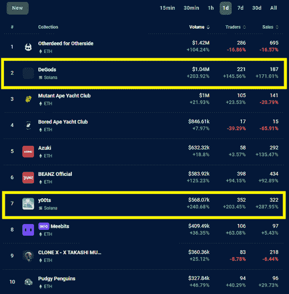

# 从索拉纳到以太坊和多边形

> 原文：<https://web.archive.org/web/https://dappradar.com/blog/degods-y00ts-solana-bridge-polygon-ethereum-announcement-frankdegods-dust-labs>

## Dust Labs 在周末宣布了布景的改变

来自 Dust Labs 的两大 NFT 系列产品 DeGods 和 y00ts 将从索拉纳区块链转移到以太坊和 Polygon。Web3 工作室希望在 2023 年 3 月左右整合所有资产，同时推出一个 launchpad。

令人惊讶的是，Dust Labs 宣布将 DeGods 和 y00ts 从 Solana 迁移到 Ethereum 和 Polygon。项目负责人 FrankDeGods 认为这是“探索新机遇”的一种方式，并将这种转变称为“可计算的风险”。

但是，远离索拉纳区块链可能也与区块链今年不得不处理的问题有关。它经历了各种各样的停机，并且受到了 FTX 垮台后的影响。

Dust Labs 将把 DeGods 移动到以太坊，同时将 y00ts 连接到 Polygon。灰尘令牌仍将绑定两个社区，并将移动到两个区块链。FrankDeGods 还透露，从举办 NFT 中收集的积分可以用于即将推出的 launchpad 平台。

> 这只是开始。[pic.twitter.com/F3vxzXQAOy](https://web.archive.org/web/20230102102314/https://t.co/F3vxzXQAOy)
> 
> — Frank III (@frankdegods) [December 25, 2022](https://web.archive.org/web/20230102102314/https://twitter.com/frankdegods/status/1607155074224250881?ref_src=twsrc%5Etfw)

## 交易量显示炒作

环顾 Twitter，你会得到各种各样的信号。一些社区成员很兴奋，而其他人则认为此举是对索拉纳的背叛。然而，交易量不会说谎。

在过去的 24 小时内，DeGods 的交易量增长了 203%，仅在这段时间内就达到了 100 多万美元。这使得 DeGods 排名第二，仅次于宇迦实验室的另一项元宇宙收藏。

在同一时期，y00ts 的交易量增长了 240%,但价值较低。y00ts 系列的交易量为 568，000 美元，超过了 Meebits、志那都红豆、CryptoPunks、Pudgy Penguin、CloneX 和 Doodles 等老牌蓝筹股系列。

[<picture></picture>](https://web.archive.org/web/20230102102314/https://dappradar.com/nft)

Source: [https://dappradar.com/nft](https://web.archive.org/web/20230102102314/https://dappradar.com/nft)

在查看过去 7 天的交易量时，DeGods 排名第 9。该项目本周的总交易额翻了一番，达到 237 万美元。同时，y00ts 排名第 16 位，交易量略有 32%的增长。

## 搭桥的挑战

Dust Labs 在宣布和实际行动之间花了 3 个月的时间，这不是没有原因的。他们将有相当多的工作要做，从 Solana 到以太坊和 Polygon 桥接资产，因为他们需要桥接技术来正确地在区块链之间移动令牌。

正如我们在 2023 年所看到的，桥梁是目前黑客最喜欢的目标。领先的令牌桥虫洞[在二月份经历了一次 3 . 25 亿美元的黑客攻击，这是由以太坊和索拉纳之间的桥上的漏洞造成的。仅今年一年，DappRadar](https://web.archive.org/web/20230102102314/https://blog.chainalysis.com/reports/wormhole-hack-february-2022/) [就注册了](https://web.archive.org/web/20230102102314/https://dappradar.com/blog/dapp-industry-report-2022-dapp-industry-proves-resilient-in-crypto-winter) 312 次黑客攻击和利用，导致 487.4 亿美元的资金被盗。

## 上周值得注意的 NFT 销售额

虽然 Dust Labs 的声明无疑是本周 NFT 最大的新闻，但我们也看到了许多有趣的销售。

### 乌托邦——393，170 美元/ 325 瑞士法郎

4 年前以 0.75 ETH 收购，现在以 325 ETH 出售。乌托邦是由 XCOPY 创作的艺术品，他是 NFT 空间中领先的数字艺术家之一。看看[买家的钱包](https://web.archive.org/web/20230102102314/https://dappradar.com/hub/wallet/eth/0xb379b56bcacdd58ae0768654763881849bfaad94?utm_source=rankings&utm_medium=nft&utm_campaign=nft_sales)。

### 沃尔夫# 6294–128，120 美元/ 105 人

狼游戏是以太坊区块链上的一款 NFT 驱动的游戏，允许玩家赚取羊毛代币。狼是最有价值的资产之一，就在圣诞节前，其中一只狼在模糊市场以 105 ETH 的价格售出。[买家拥有](https://web.archive.org/web/20230102102314/https://dappradar.com/hub/wallet/eth/0x11360f0c5552443b33720a44408aba01a809905e)各种矮胖的企鹅、狼的游戏道具和一些雷达代币。

### 政治是狗屎# 61——85，620 美元/ 70 瑞士法郎

两年前，数字艺术家 Beeple 差点因为丢掉一堆 NFT 而破坏了互联网。政治是扯淡最初在 Nifty Gateway 上卖 1 美元，现在[转手 85620](https://web.archive.org/web/20230102102314/https://dappradar.com/hub/assets/eth/0x12f28e2106ce8fd8464885b80ea865e98b465149/100030061#tradingHistory)。然而，这并不是该系列的最大销售额。两年前，有人支付了 333 ETH

## 随身携带您的 Web3 之旅

使用 DappRadar 移动应用程序，再也不会错过 Web3。查看最受欢迎的 dapps 的性能，并关注您投资组合中的 NFT。您在 DappRadar 上的帐户会与我们的移动应用程序同步，这样您很快就可以选择实时接收提醒。

[Download the DappRadar app now](https://web.archive.org/web/20230102102314/https://dappradar.app.link/blog)[<picture></picture>](https://web.archive.org/web/20230102102314/https://play.google.com/store/apps/details?id=com.portfolio.dappradar)