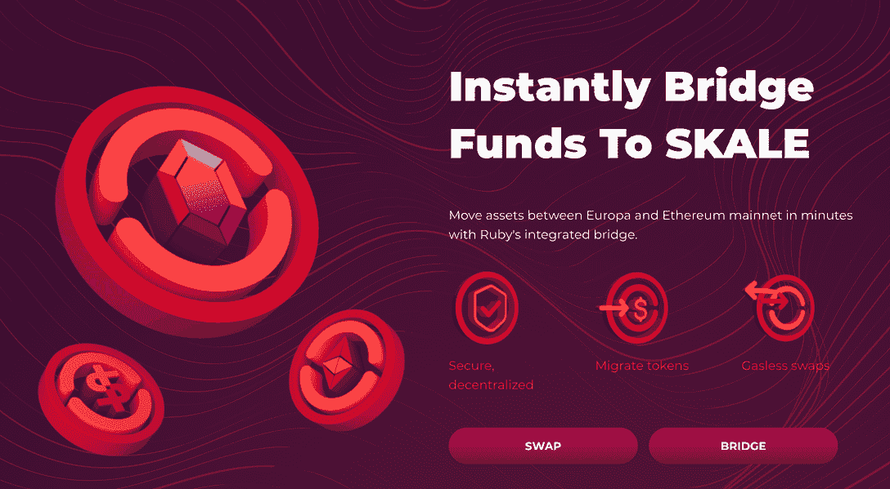
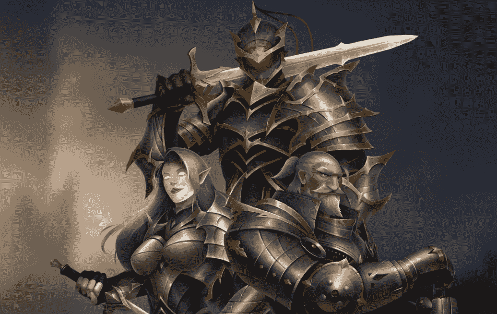
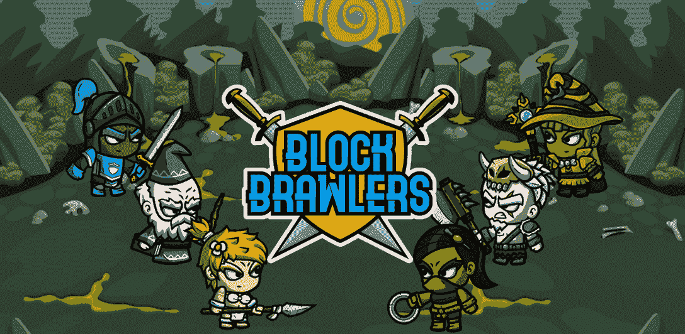

# 在 SKALE 上部署将为用户带来轻松、零油费的体验

> 原文：<https://web.archive.org/web/https://dappradar.com/blog/deploying-on-skale-will-bring-users-an-easy-zero-gas-fee-experience>

## SKALE 支持无限数量的以太坊本地的独立区块链

作为区块链的解决方案，SKALE 脱颖而出，为用户带来了零排放的体验。高度可扩展的多链区块链网络备受开发者青睐，大量 dapps 加入了快速扩展的生态系统。

**概要:**

*   SKALE ( [SKL](https://web.archive.org/web/20220810174125/https://dappradar.com/hub/token/eth/SKL/ETH?from=0x00c83aecc790e8a4453e5dd3b0b4b3680501a7a7) )推出了一个可配置的 dapp 专用区块链网络，该网络具有互操作性、EVM 兼容性和模块化。
*   最终用户可以免费体验强大的 SKALE 网络。
*   因此，越来越多的 dapps 加入 SKALE，以提供极致的用户体验。
*   最新加入 SKALE 的 dapps 包括 Ruby。交换，隐刀，和街区斗殴者。
*   DappRadar 将很快整合 SKALE。

Web 2.0 已经免费几十年了，但 Web3 目前还没有。智能合约的先驱区块链以太坊(Ethereum)在过去几年里一直受到高额天然气费的困扰，这限制了该平台的可扩展性。

因此，以太坊正在失去主导地位，其他扩展解决方案如[乐观](https://web.archive.org/web/20220810174125/https://dappradar.com/rankings/protocol/optimism)、[仲裁](https://web.archive.org/web/20220810174125/https://dappradar.com/ethereum/other/arbitrum)和 SKALE 正在获得以太坊在 [NFT](https://web.archive.org/web/20220810174125/https://dappradar.com/nft) 和 [DeFi](https://web.archive.org/web/20220810174125/https://dappradar.com/defi) 的市场份额。然而，在所有注重即时终结和经济实惠的解决方案中，SKALE 是唯一一个能够为最终用户提供零区块链体验的解决方案。

## SKALE 无汽油体验

[SKALE 推出了一个可配置的按需区块链网络](https://web.archive.org/web/20220810174125/https://dappradar.com/blog/the-multichain-future-with-skale-network)，该网络完全可与以太坊互操作和兼容。此外，SKALE 的独特架构允许开发人员创建他们自己的 dapp 专用和 EVM 兼容的链。这样，特定于 dapp 的链可以使用专用资源来执行基于场景的命令，从而提供最高的效率。

同样值得一提的是, [SKALE 拥有一个模块化架构](https://web.archive.org/web/20220810174125/https://dappradar.com/blog/how-skales-hybrid-modular-layer-1-stands-out-as-a-blockchain-scalability-solution/),它提供了一个开放的协作网络。因此，它允许 oracles、indexers、fiat on/off ramps 等合作伙伴服务在 SKALEverse 中部署理想的功能模块来运行 dapps。

在 SKALE 上运行 dapps 最令人印象深刻的是，网络为最终用户带来了强大、安全的功能，而不会给他们带来任何负担。

## Dapps 加入 SKALE up

SKALE 为开发人员提供了一个安全的分散式网络，该网络支持高吞吐量 EVM 兼容性，并提供终极用户体验。最重要的是，SKALE 确保最终用户拥有无摩擦的网络体验，无需支付任何费用。

这些美妙的好处吸引了大量的项目加入 SKALE 生态系统。比如说 Ruby。交易所丰富了 SKALE 的 DeFi 景观，成为一个独特的 NFT 供电的加密交易所。与此同时，在 SKALE 游戏领域，CryptoBlades 和 Block Brawlers 使玩家的 P2E 选择多样化。

### 露比。交换

[红宝石色。交易所](https://web.archive.org/web/20220810174125/https://ruby.exchange/)是有史以来第一个由 NFT 驱动的交易所。Ruby 的核心设计是利用 NFTs 创建一个可访问的、吸引人的交易体验，为不同的活动奖励用户。

显然，SKALE 网络是 Ruby 的核心支柱之一。凭借 SKALE 的高速、安全、无气技术，Ruby 可以建立其独特的卖点，并为 DeFi 领域带来多样性。

### 隐叶片

[CryptoBlades](https://web.archive.org/web/20220810174125/https://www.cryptoblades.io/) 是铆钉游戏公司打造的一款玩赚 RPG 游戏。游戏的中心是获得传说中的利刃和使用它们的强大英雄。玩家可以在战斗中使用他们的资产来赢得游戏的本地令牌，技能。

CryptoBlades 建立在 SKALE 的基础上，可以以最低的成本向玩家提供各种 GameFi 体验，同时确保最高程度的可靠性。

### 街区斗殴者

[Block Brawlers](https://web.archive.org/web/20220810174125/https://blockbrawlers.com/) 是另一款从 SKALE 的无汽油用户体验中获益的游戏。在 Block Brawlers 中，玩家可以在竞技场中相互战斗并挥汗如雨。但是，更重要的是，赢得这些战斗不仅会赢得玩家的名声，还会赢得游戏中的令牌——争吵。

我们不要忘记，只要开发者在 SKALE 的生态系统中构建 dapps，无气机制就可以应用。例如，如果玩家想用 SKALE 上的 Ruby 交换其他代币，交易是免费的。或者，如果用户需要为 CryptoBlades 购买游戏中的 NFT 物品，他们不必担心为使用 SKALE 网络支付额外费用。

## DappRadar 将很快整合 SKALE

许多区块链已经能够提供极低的交易成本，以减少用户体验 web 3.0 的障碍。然而，SKALE 的零汽油体验才是真正的游戏规则改变者。因此，令人兴奋的项目正在加入快速扩展的 SKALE 网络。

值得一提的是，SKALE 将很快融入 DappRadar。届时，用户可以更加全面、及时地了解 SKALE 的动态生态系统及其潜力。

了解更多关于 SKALE 的信息

[网站](https://web.archive.org/web/20220810174125/https://skale.space/)

[SKALE Docs](https://web.archive.org/web/20220810174125/https://docs.skale.network/develop/)

[白皮书](https://web.archive.org/web/20220810174125/https://skale.space/whitepaper)

[推特](https://web.archive.org/web/20220810174125/https://twitter.com/SkaleNetwork?ref_src=twsrc%5Egoogle%7Ctwcamp%5Eserp%7Ctwgr%5Eauthor)

[博客](https://web.archive.org/web/20220810174125/https://skale.network/blog)

[不和](https://web.archive.org/web/20220810174125/https://discord.com/invite/gM5XBy6)

[电报](https://web.archive.org/web/20220810174125/https://discord.com/invite/gM5XBy6)

**免责声明** —这是一篇赞助文章。DappRadar 不认可本页面上的任何内容或产品。DappRadar 旨在提供准确的信息，但读者应该在采取行动之前总是自己做研究。DappRadar 的文章不能被认为是投资建议。