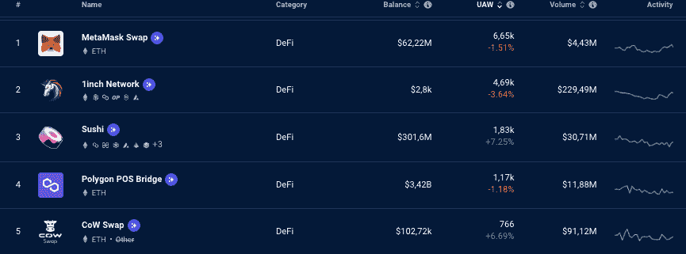
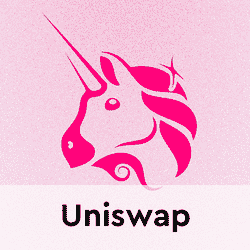

# 德克斯与 CEX:哪个对你更有利？

> 原文：<https://web.archive.org/web/https://dappradar.com/blog/dex-vs-cex-which-is-right-for-you>

## 通过 DappRadar 了解 DEX 和 CEX 的区别

分散交易所(DEX)是越来越受欢迎的获得新加密货币的方式。在分散交易中，你掌控着你的资产。另一方面，CEX(集中交易所)是由以集中方式拥有它并保管你的资产的公司运营的。它们是如何工作的，你应该选择哪一个？让我们开始吧！

**内容**

*   [什么是去中心化交易所(DEX)？](https://web.archive.org/web/20221201051743/https://dappradar.com/blog/dex-vs-cex-which-is-right-for-you/#What-is-a-decentralized-exchange-(DEX)?)
*   DEX 是如何工作的？
*   使用 DEX 有什么利弊&？
*   您应该使用哪种 DEX？
*   什么是集中交易所(CEX)？
*   使用 CEX 有哪些利弊&？
*   [德克斯 Vs 德克斯:你该选哪个？](https://web.archive.org/web/20221201051743/https://dappradar.com/blog/dex-vs-cex-which-is-right-for-you/#DEX-Vs-CEX:-Which--should-you-pick?)

密码交易所提供了人们可以自由交易的平台。但是，它们的工作方式不同，这取决于它们是集中式还是分散式交换。

[Connect your wallet](https://web.archive.org/web/20221201051743/https://dappradar.com/hub/wallet)

## 什么是分散式交易所(DEX)？

分散交易所或 DEX 是一个加密交易平台，它不依赖中介来帮助两个不同的个人之间执行交易。

它的运作不需要办公桌或办公室职员。DEX 上的用户交互通过智能合约进行，智能合约是区块链上的软件。

*   通过我们的初学者指南了解更多关于[智能合约](https://web.archive.org/web/20221201051743/https://dappradar.com/blog/what-is-a-smart-contract/)

最受欢迎的 dex 建立在以太坊区块链之上。**在 DappRadar 上看看吧！**

[<picture></picture>](https://web.archive.org/web/20221201051743/https://dappradar.com/rankings/protocol/ethereum/category/defi)

## DEX 是如何工作的？

分散式交易所通过利用智能合约来操作自动订单簿或自动做市商(AMM)。这使得它们真正实现了点对点，允许用户高效透明地为交易者交换代币。

分散交易是匿名的，不需要用户的 KYC(了解你的客户)参与任何交易。

[Swap your tokens here](https://web.archive.org/web/20221201051743/https://dappradar.com/hub/swap/eth)

[https://web.archive.org/web/20221201051743if_/https://www.youtube.com/embed/ZHiHfYvNjJU?feature=oembed](https://web.archive.org/web/20221201051743if_/https://www.youtube.com/embed/ZHiHfYvNjJU?feature=oembed)

DEX 有三个不同的部分，下面是其工作原理的概述:

### *自动赚钱机器*

AMMs 不使用订单簿。他们利用智能合约创建自动执行交易的流动性池。

### *链上订单簿*

通过这种方法，区块链网络上的每个节点都将永远保留订单记录，从而为用户带来高额费用。

这意味着用户必须等待矿工将他们的消息添加到区块链。这样的过程可能很复杂，执行起来令人沮丧。

### *非连锁订单簿*

它们比链上的对等物更集中。它不是作为一个单一的 DEX 发挥作用，而是创建了一个框架，在这个框架中，被称为“中继者”的各方可以处理链外订单。

## 使用分散交换的利弊是什么？

### 赞成的意见

#### 完全控制你的资产

分散的交易所让用户完全控制他们的私人钥匙和资金。任何政府或其他实体都不能声称获得用户的资金。

密码行业最近发生的事件提醒我们，成为我们资产的自我保管者非常重要。

#### 更好的安全性

分散式交易所的安全性远远领先于集中式交易所。黑客经常从集中的交易所窃取信息。

### 骗局

#### 不便于用户使用

大多数 dex 的用户界面都很复杂，这使得普通用户很难上手。

#### 非永久性损失

与他们的初始资产相比，流动性提供者可能会收回更多失去价值的代币，而较少收回获得价值的代币。

## 你应该选择哪个 DEX？

首先，这需要做一些研究，将您的需求与特定平台所能提供的相匹配。

以下是一些最佳交易所的简要概述:

### Uniswap

使用 Uniswap，您可以通过 Uniswap 的流动性池从您的加密资产中赚取利息。它是市场上最受欢迎的分散式交易所(DEX)之一。

UNI 是 Uniswap 平台的治理令牌。治理令牌赋予用户参与和塑造平台未来的权利。

[Explore Uniswap](https://web.archive.org/web/20221201051743/https://dappradar.com/multichain/exchanges/uniswap-v3)

### Sushiswap

Sushiswap 允许交换和被动收入。你可以增加流动性到它的池中，或者在 xSUSHIBAR 协议上下注，以获得被动收入。

该交易所有一个名为寿司的公用令牌，用户可以在交易所下注，甚至交易一些竞争对手的股票。[雷达](https://web.archive.org/web/20221201051743/https://dappradar.com/token/overview)代币持有者可以使用 SushiSwap 让代币为自己工作，并保留 [DappRadar PRO 功能](https://web.archive.org/web/20221201051743/https://dappradar.com/token/pro)？

[Explore SushiSwap](https://web.archive.org/web/20221201051743/https://dappradar.com/multichain/defi/sushi)

### 薄饼交换

PancakeSwap 是一个在 BNB 链上运行的去中心化金融 dapp。它为 DeFi 用户提供了各种各样的功能和加密工具，如交换、流动性耕作和赌注。PancakeSwap 生态系统由平台的本机令牌 [CAKE](https://web.archive.org/web/20221201051743/https://dappradar.com/hub/token/bsc/CAKE) 提供支持。

Discover PancakeSwap

### 曲线

Curve 据说是最人性化的去中心化交流平台之一，类似于 Uniswap。最大的不同是 Curve 侧重于稳定的曲线，其中我们可以找到[戴](https://web.archive.org/web/20221201051743/https://dappradar.com/hub/token/eth/DAI?from=0x6b175474e89094c44da98b954eedeac495271d0f)、[、](https://web.archive.org/web/20221201051743/https://dappradar.com/hub/token/eth/USDC?from=0xa0b86991c6218b36c1d19d4a2e9eb0ce3606eb48)、【】、、[、](https://web.archive.org/web/20221201051743/https://dappradar.com/hub/token/eth/BUSD?from=0x4fabb145d64652a948d72533023f6e7a623c7c53)等等。****

[<picture></picture>](https://web.archive.org/web/20221201051743/https://dappradar.com/ethereum/exchanges/uniswap-1)[<picture></picture>](https://web.archive.org/web/20221201051743/https://dappradar.com/matic/defi/sushi)[<picture></picture>](https://web.archive.org/web/20221201051743/https://dappradar.com/binance-smart-chain/defi/pancakeswap)

## 什么是集中交易所(CEX)？

集中交换是 Web3 新手进入加密世界的通常方式。这些交易所由公司集中所有，它们充当你资金的保管人，这与分散式交易所形成对比，在分散式交易所，你始终控制着你的资产。

## 使用 CEX 的利弊是什么？

### 赞成的意见

#### 新手的理想选择

那些寻找一种简单的方法进入加密的人会看到许多集中交换的专业人士。它们将用户从处理其私钥的责任中解放出来。

### 骗局

#### 更容易受到黑客攻击

与集中式交换一样，黑客攻击的可能性随着中心故障点的增加而增加。

#### 失去资产的风险

最大的缺点是，经营交易所的中央公司财务不稳定，最终会损失你的资产。

## 德克斯 Vs CEX:你该选哪个？

如果你把更多的价值放在安全上，完全控制你的资产，降低费用，那么你的理想选择是 DEX。

相反，如果你觉得放弃对你的资产的控制更舒服，从而获得更友好的用户体验和不处理你的私钥的方便，那么 CEX 是你的正确选择。

## 随身携带您的 Web3 之旅

使用 DappRadar 移动应用程序，再也不会错过 Web3。查看最受欢迎的 dapps 的性能，并关注您投资组合中的 NFT。您在 DappRadar 上的帐户会与我们的移动应用程序同步，这样您很快就可以选择实时接收提醒。

[Download the DappRadar app now](https://web.archive.org/web/20221201051743/https://dappradar.app.link/blog)[<picture></picture>](https://web.archive.org/web/20221201051743/https://play.google.com/store/apps/details?id=com.portfolio.dappradar)