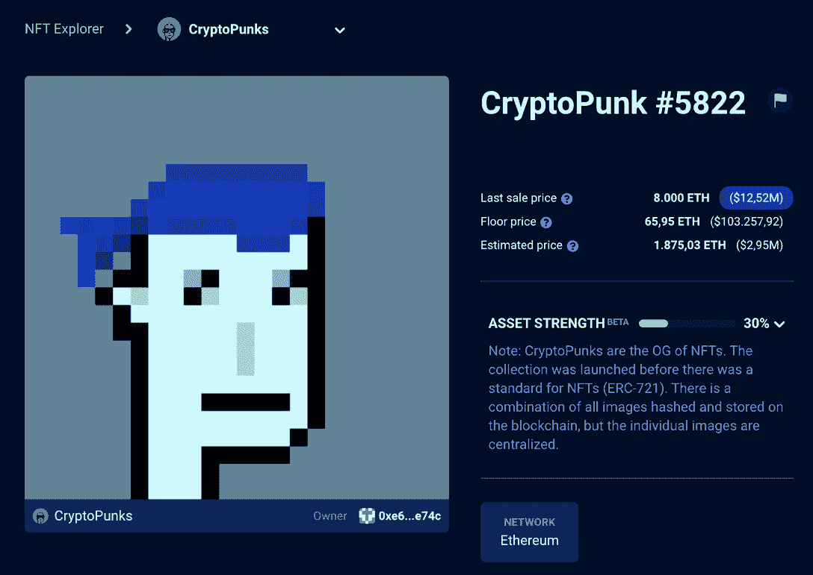
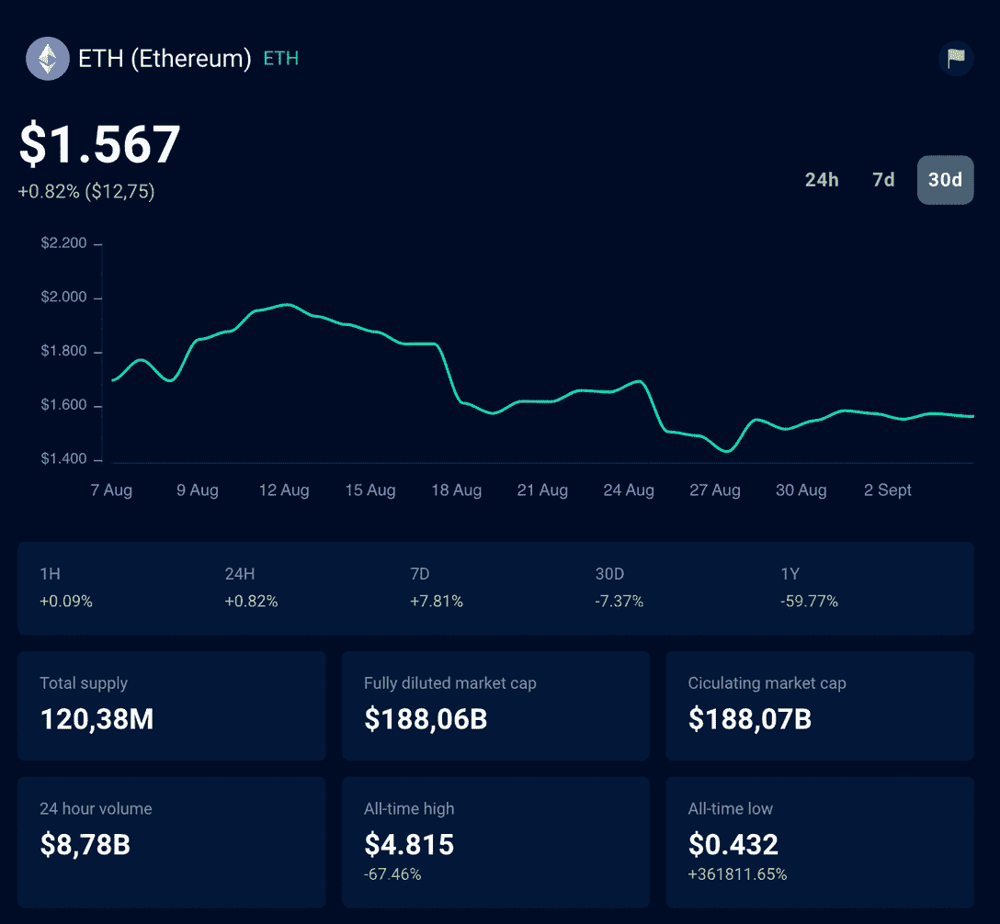
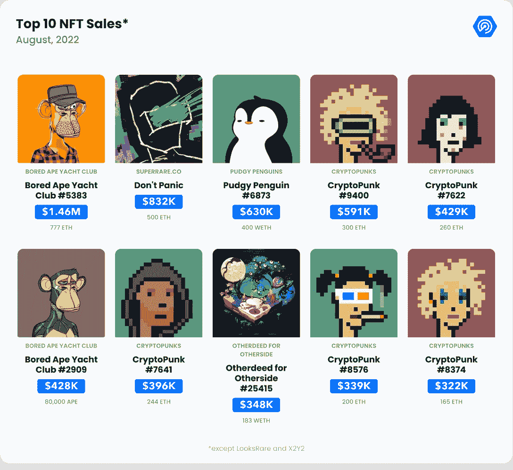

# NFT 和加密有什么区别？初学者指南

> 原文：<https://web.archive.org/web/https://dappradar.com/blog/difference-between-nft-and-crypto>

## 通过这份简单的 Web3 指南探索未来

进入区块链科技的世界，总有一个新术语需要了解。欢迎来到 DappRadar 的初学者指南系列！在学习所有关于 Web3 的知识时,“NFT 和加密有什么不同”可能是你首先会问的问题之一——而且你并不孤单。立即了解加密货币与不可替代代币的区别。请继续阅读！

## 目录

*   [NFT 和 crypto 解释了](https://web.archive.org/web/20221003034743/https://dappradar.com/blog/difference-between-nft-and-crypto/#NFT-and-crypto-explained)
    *   什么是 NFT？
    *   [什么是加密货币？](https://web.archive.org/web/20221003034743/https://dappradar.com/blog/difference-between-nft-and-crypto/#What-is-cryptocurrency?)
*   [最著名的 NFT 和加密货币有哪些？](https://web.archive.org/web/20221003034743/https://dappradar.com/blog/difference-between-nft-and-crypto/#What-are-the-most-famous-NFTs-and-cryptocurrencies?)
*   NFTs 和加密是安全的投资吗？
*   为什么人们会购买 NFT 和 crypto？
*   谁投资 NFTs 和 crypto？
*   如何开始使用 NFT 和加密？
*   [概要:NFT 和密码](https://web.archive.org/web/20221003034743/https://dappradar.com/blog/difference-between-nft-and-crypto/#Summary:-NFT-and-crypto)
    *   [他们的共同点](https://web.archive.org/web/20221003034743/https://dappradar.com/blog/difference-between-nft-and-crypto/#What-they-have-in-common)
    *   [它们有什么不同](https://web.archive.org/web/20221003034743/https://dappradar.com/blog/difference-between-nft-and-crypto/#How-they-are-different)
*   [跟踪和管理您的 NFT 和加密产品组合](https://web.archive.org/web/20221003034743/https://dappradar.com/blog/difference-between-nft-and-crypto/#Track-and-manage-your-NFT-and-crypto-portfolio)
*   [继续学习 DappRadar](https://web.archive.org/web/20221003034743/https://dappradar.com/blog/difference-between-nft-and-crypto/#Keep-learning-with-DappRadar)

## NFT 和 crypto 解释说

虽然 NFT 和加密是与数字资产、区块链和去中心化有关的概念，但它们是非常不同的东西。我们将在下面逐一介绍。

### 什么是 NFT？

一个 [NFT，或不可替代的令牌](https://web.archive.org/web/20221003034743/https://dappradar.com/blog/what-are-non-fungible-tokens-nfts)，是一种独特的数字资产，不能与任何其他资产互换。

它们存储在区块链上，这意味着它们是分散的，不受审查，可以代表任何类型的资产，从 jpeg 格式的艺术、视频或歌曲，到游戏中的物品或虚拟合同。

This is the NFT sold at the most expensive price in history and belongs to the [CryptoPunks collection](https://web.archive.org/web/20221003034743/https://dappradar.com/hub/nft-explorer/collection/cryptopunks).

NFTs 在 2021 年末和 2022 年初开始流行，被数百万美元购买，并被全球名人分享。自那以后，虽然加密市场一落千丈，NFT 项目也看到了利率下降。然而，最好的 NFT 项目继续与 web3 gaming 和元宇宙虚拟世界合作。

*   **继续学习我们的文章** : [什么是不可替代令牌，或 NFT？](https://web.archive.org/web/20221003034743/https://dappradar.com/blog/what-are-non-fungible-tokens-nfts)

### 什么是加密货币？

另一方面，加密货币代表代币或硬币，作为交换媒介和/或价值储存手段。这些可以用来在[分散应用](https://web.archive.org/web/20221003034743/https://dappradar.com/blog/what-are-dapps)上购买商品和服务，但也可以作为投资持有。

它们也存储在区块链上，并且是分散的，但它们与 NFT 的不同之处在于它们是可互换的，这意味着一个比特币等于另一个比特币，并且没有办法区分它们。

[Ether](https://web.archive.org/web/20221003034743/https://dappradar.com/hub/token/eth/ETH) is the world’s second most famous cryptocurrency, after bitcoin.

虽然加密市场自 2009 年以来经历了许多起伏，一些项目越来越受欢迎，然后消失，但最可靠的加密资产的价值和使用量仍在持续增长。

在 DappRadar，你可以[了解区块链的所有技术](https://web.archive.org/web/20221003034743/https://dappradar.com/blog/what-is-a-blockchain-dappradars-ultimate-guide)，也可以了解最新的[行业统计数据和报告](https://web.archive.org/web/20221003034743/https://dappradar.com/reports)。

## 最著名的 NFT 和加密货币有哪些？

一些最著名的 NFT 收藏包括[隐朋克](https://web.archive.org/web/20221003034743/https://dappradar.com/hub/nft-explorer/collection/cryptopunks)、[无聊猿游艇俱乐部](https://web.archive.org/web/20221003034743/https://dappradar.com/hub/nft-explorer/collection/bored-ape-yacht-club)、[涂鸦](https://web.archive.org/web/20221003034743/https://dappradar.com/hub/nft-explorer/collection/doodles-official)、[女性世界](https://web.archive.org/web/20221003034743/https://dappradar.com/hub/nft-explorer/collection/world-of-women-nft)和[艺术街区策划](https://web.archive.org/web/20221003034743/https://dappradar.com/hub/nft-explorer/collection/art-blocks-curated)。使用 [DappRadar NFT 探索者](https://web.archive.org/web/20221003034743/https://dappradar.com/hub/nft-explorer)详细了解以太坊网络上的 NFT 和收藏。

如果你想找到最佳 NFT 收藏、市场排名和多个连锁店的实时销售的完整列表，请访问 [DappRadar 的 NFT 概览](https://web.archive.org/web/20221003034743/https://dappradar.com/nft)。

Top NFT sales of August via [DappRadar](https://web.archive.org/web/20221003034743/https://dappradar.com/blog/dapp-industry-report-q2-nfts-and-web3-games-keep-enduring-market-conditions-as-shockwaves-from-the-terra-collapse-reach-cefi-and-vcs)

有兴趣了解更多关于加密货币的信息吗？您可以使用 [DappRadar 代币浏览器](https://web.archive.org/web/20221003034743/https://dappradar.com/hub/tokens/ethereum/all/1)查看最新的代币价格、交易量和市值。此外，通过以太坊、币安智能链和 Polygon 发现市场中的顶级赢家、输家和新代币。

最著名的加密货币有比特币(BTC)、[以太](https://web.archive.org/web/20221003034743/https://dappradar.com/hub/token/eth/ETH) (ETH)、[币安币](https://web.archive.org/web/20221003034743/https://dappradar.com/hub/token/bsc/BNB) (BNB)、索拉纳(SOL)、波尔卡多(dot)。

## NFTs 和加密是安全的投资吗？

整个区块链行业仍处于非常早期的阶段，要成长为安全的类别还有很多事情要证明。加密货币和数字收藏品市场比传统市场波动更大，部分原因是它们更容易进入。

因此，你应该从一开始就知道投资 NFTs 或加密货币是有风险的。你可能会在几个月、几天甚至几秒钟内失去全部投资。

关于投资的信息和经验越多，你的投资就会越好——但这并不能保证任何利润。任何想投资的人都应该提前寻求专业建议。

## 为什么人们购买 NFT 和加密？

虽然很多人在交易 NFTs 和 crypto 时确实亏损，但一些投资者确实看到他们的投资组合增值了。这种轻松赚钱的希望火花是大多数人进入加密和 NFT 空间的原因——即使他们忽略了风险。

但除了用数字资产赚钱之外，尽管它们与金融直接相关，但它们代表着更大的东西。

区块链技术不是赌博致富的赌场，而是一个令人兴奋的行业，给我们联系、娱乐、制作和分发艺术、信息，当然还有金钱的方式带来了根本性的变化。

权力下放，虽然对那些新来的人来说可能有点极端，但并不是要破坏世界的现状，而是要分享机会。

人们购买 NFT 和加密货币，因为他们相信 Web3 和元宇宙是引导我们走向未来的概念，因为这些项目是它的开始。他们投资数字资产，因为他们认为这些是合理的项目，随着时间的推移会获得更多的价值。

## 谁投资 NFTs 和 crypto？

虽然它们并不完全是新东西，但在真正成为主流之前，NFT 和加密货币还有很长的路要走。特别是自 2021 年加密和 NFT 牛市以来，更多的人通过大众媒体了解了区块链技术。

尽管这些新的赚钱方式经常被低估或解释不清，但它们获得了许多新的采纳者。此外，传统的大品牌加入了 Web3 运动——例如脸书成为 Meta，环球音乐、育碧、三星、古驰和可口可乐加入了元宇宙和 NFT 的大项目。

***“不管比特币和其他加密货币未来会发生什么，我们将开始看到更多的传统金融机构融入区块链和令牌化，因此，更多的人将参与资本市场。是时候了。”***

[雷米·雅各布森，纳斯达克撰稿人](https://web.archive.org/web/20221003034743/https://www.nasdaq.com/articles/crypto-was-meant-to-democratize-finance-and-its-finally-about-to-2020-04-06)

因此，很难准确指出谁投资了 NFT 和加密货币，并将其全部放在一个袋子里。然而，我们能够并且应该做的是看看事实。

[DappRadar 的区块链行业报告](https://web.archive.org/web/20221003034743/https://dappradar.com/reports)展示了不同地区的两个项目和投资的人的确切数据，以及他们如何做出决策。关于性别，我们的【2021 年 9 月报告显示，女性仅占该领域投资者的 23%。

此外，你可以查看投资 crypto 和 NFTs 的 50 位名人的名单，并先睹为快。

## 我如何开始使用 NFT 和加密？

开始使用 crypto 和 NFTs 非常简单，但是仍然需要谨慎。首先，你需要给自己弄一个类似 [Metamask](https://web.archive.org/web/20221003034743/https://dappradar.com/blog/what-is-metamask) 的 Web3 钱包。然后，你可以在 Uniswap 或币安等交易所用法定货币交易加密货币，或者用 DappRadar Token Swap。

一旦你把你的密码存在你的钱包里，你就可以去 NFT 市场购买 NFT。

同样，建议谨慎小心。这些投资是有风险的，你应该经常做自己的研究。在采取任何行动之前，寻求专业的财务建议。

## 摘要:NFT 和加密

加密货币和 NFT 代表了该行业非常重要的一部分。正如我们的 [2021 年 Dapp 行业报告](https://web.archive.org/web/20221003034743/https://dappradar.com/blog/2021-dapp-industry-report)所示，在分散金融(DeFi)应用中使用的 NFT 和加密货币是该行业的一些主要类别。

随着新的更新的出现，任何在这个行业寻找机会的人都应该关注新闻，并总是寻求获得更多的知识。

### 他们的共同点是

*   它们都是用区块链技术制造的；
*   你需要一个 Web3 钱包地址来存储它们；
*   NFT 和加密货币被认为是高风险投资。

### 它们是多么的不同

*   加密货币是可互换的，这意味着每个单位都是可互换的，而非加密货币是不可互换的，这意味着每个单位都是独一无二的；
*   NFT 代表数字资产的所有权，而加密货币主要是作为一种交换手段。

## 跟踪和管理您的 NFT 和加密产品组合

既然您已经熟悉了 NFT 和加密的概念以及围绕它们的一切，那么您也知道这些投资并不容易管理。

项目和市场是不断变化的，如果你不更新和专注，你可能会看到你的投资组合瞬间归零。这就是为什么 DappRadar 创建了一个[投资组合追踪器](https://web.archive.org/web/20221003034743/https://dappradar.com/hub/wallet/)，让你可以管理你的 NFT 和加密货币投资。请看下面的视频，获得直观的解释:

[https://web.archive.org/web/20221003034743if_/https://www.youtube.com/embed/WHL_uYv8riA?feature=oembed](https://web.archive.org/web/20221003034743if_/https://www.youtube.com/embed/WHL_uYv8riA?feature=oembed)

您可以在桌面或移动设备上使用 DappRadar Portfolio Tracker，适用于 iOS 和 Android。这是一个免费的工具，可以帮助你获得对你的资产的完全控制。现在就开始追踪你的投资组合。

## 跟着 DappRadar 继续学习

我们希望你喜欢在这个 DappRadar 指南中学习 NFT 和加密之间的区别。如果你有任何问题或者想继续你的学习之路，请在 [Twitter](https://web.archive.org/web/20221003034743/https://twitter.com/DappRadar) 上和我们交流，并访问我们的[博客](https://web.archive.org/web/20221003034743/https://dappradar.com/blog/)。

我们再次提醒您，管理您的 NFT 和加密投资对于任何成功的策略都至关重要。

将你的 Web3 钱包连接到 DappRadar，开始使用[投资组合跟踪器](https://web.archive.org/web/20221003034743/https://dappradar.com/hub/wallet/)来监督、跟踪和管理你的投资。

***以上不构成投资建议。此处给出的信息仅供参考。请尽职调查并自行研究。***

 NewsletterUnsubscribe at any time. [T&Cs](https://web.archive.org/web/20221003034743/https://dappradar.com/terms) and [Privacy Policy](https://web.archive.org/web/20221003034743/https://dappradar.com/privacy-policy)