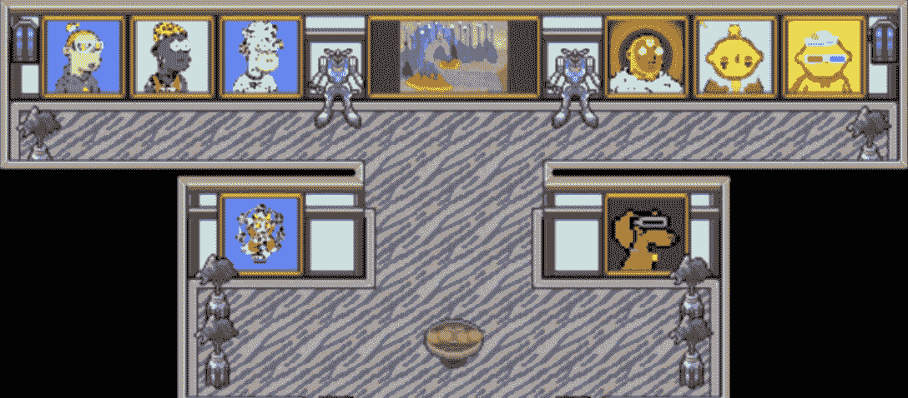
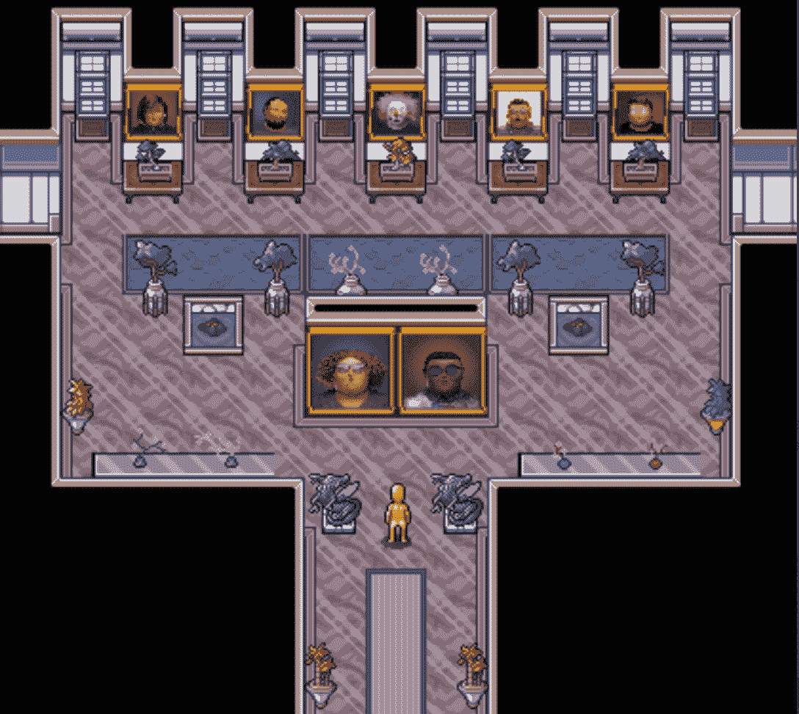
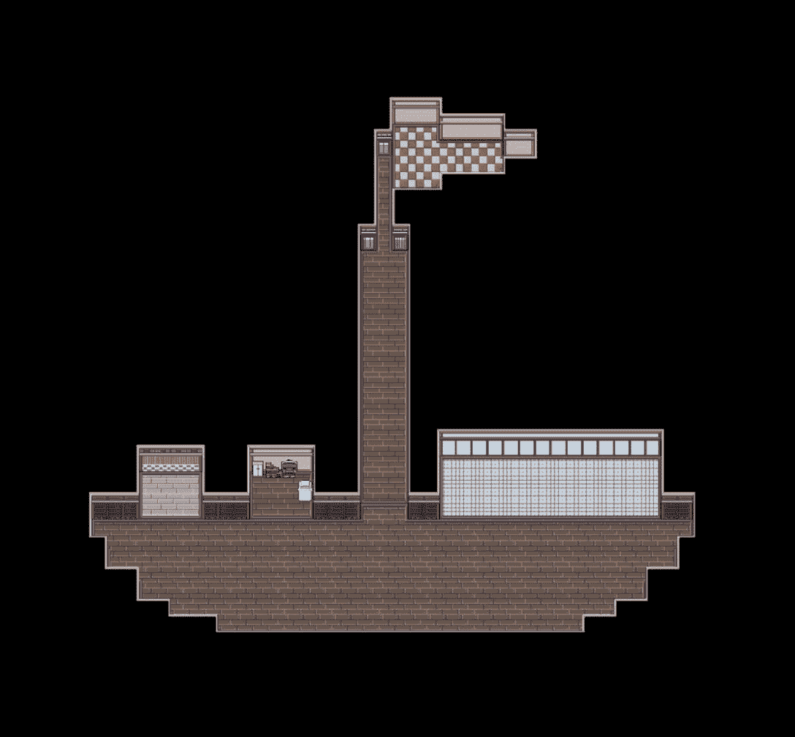
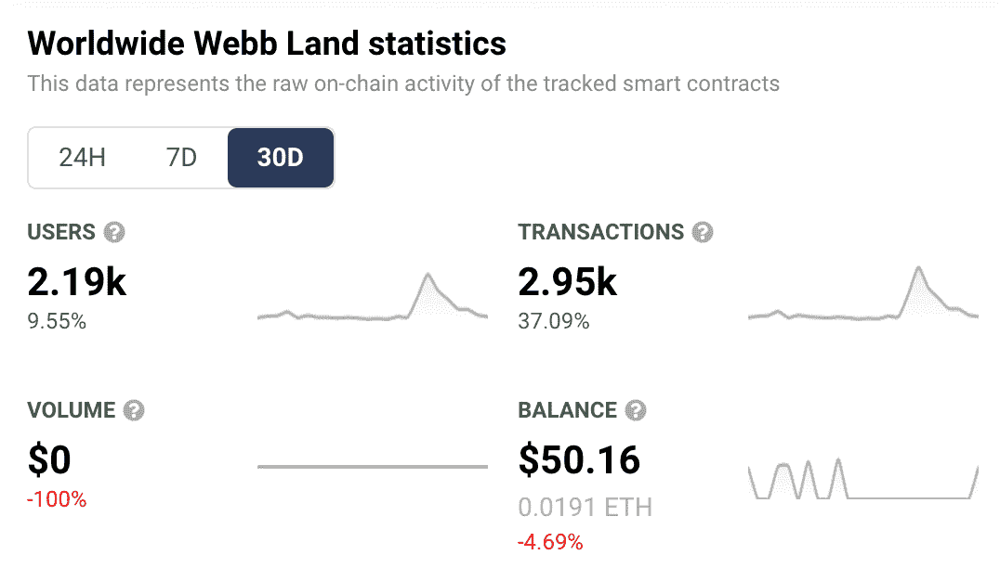

# 今天，数字房主可以在万维网上设计他们的公寓

> 原文：<https://web.archive.org/web/https://dappradar.com/blog/digital-homeowners-get-to-design-their-apartment-today-in-worldwidewebb>

## 游戏制造商称这次更新是他们“迄今为止最大的一次发布”

**用户手持 WEBBLAND NFT 作**[**world wide Webb**](https://web.archive.org/web/20221228103555/https://dappradar.com/ethereum/collectibles/worldwide-webb-land)**很快就能创建自己的虚拟家园。元宇宙平台今天发布了它的公寓建造者，达到了另一个重要的里程碑。DappRadar 介绍了一些与项目相关的关键特性和链上活动。**

全球韦伯于 2021 年 11 月推出了“可互操作的反乌托邦像素艺术元宇宙”。受《Ready Player One》的启发，这是一款非常强调互操作性的 MMORPG。他们的目标是在各种不同的项目中为流行的 NFT 提供实用性。
最新更新的《公寓建造者》是 world wide Webb[路线图](https://web.archive.org/web/20221228103555/https://worldwidewebb.notion.site/Roadmap-a34560bb349941499cc8f5b724cc3cb4)上的下一个重要里程碑。它允许玩家构建游戏世界，从而让社区对平台的未来方向有所控制。NFT 持有者可以建造自己的公寓，展示其他资产或用于社区社交聚会。

Source: Twitter

更新包括引入各种旨在促进社区参与的新功能:

*   免费构建模式–任何人都可以使用，这是一个先试后买的功能。自由构建就像一个沙盒，并不是完整游戏的一部分。我们鼓励用户大胆创新他们的公寓设计。
*   **户型选择**——户型有:小、中、大、顶层。目前，更大的公寓有一个简单的目的:它们允许更大的建筑。公寓建设者还允许玩家定义他们的房间平面图。
*   **新物品**–新的更新推出了数百种不同的物品，供用户存放在房间里。有些是同一项目的变体；例如，不同类型的椅子。和其他的可以结合起来；例如，一盏灯可以放在桌子上。
*   **NFT 展示策展**——world wide Webb 使用像素着色器渲染，允许玩家展示他们可能持有的任何 NFT。
*   **NPC 功能**–玩家可以在他们的新设计中添加非玩家角色(NPC)。任何与全球韦布整合的 NFT 都可以作为角色或宠物[被放入公寓](https://web.archive.org/web/20221228103555/https://twitter.com/i/status/1498031881320865796)。
*   **改进的定制化**–由建筑商决定他们想如何设计他们的公寓。他们有许多定制选项。游戏测试人员已经提出了不同的房间变化，其中一些你可以在下面看到。

One design with a focus on displaying art

What are we calling this? A boat room? Or is it a room boat?

## 一些链上分析

全球韦伯土地的底价目前为 2.59 ETH(6828 美元)，90 天平均价格为 1.33 ETH(3506 美元)。随着源源不断的更新，这个数字可能会继续上升。在 2022 年上半年，玩家可以期待看到:

*   游戏开发/元宇宙进程开源代码的发布
*   一个神奇宝贝风格的游戏进程战斗引擎
*   一款 PvP 马里奥赛车风格的赛车游戏
*   通过基于治理的投票迁移到 DAO

与全球 Webb 智能合约互动的独立活动钱包数量增长了 9.55%。交易数量上升了 37%，达到 2950 笔。在撰写本文时，有 9，069 个 LAND NFTs 分布在 4，811 个不同的钱包中。

WorldWideWebb’s 30-day analytics

30 天的数据并不构成我们大概率做出预测的强大趋势。但是 Worldwide Webb 稳健的路线图和对互操作性的开放性意味着该平台是现在和未来值得关注的平台。与 DappRadar 保持联系，从分散的空间获得关于这个项目的[最新更新](https://web.archive.org/web/20221228103555/https://twitter.com/DappRadar)和所有其他[新闻](https://web.archive.org/web/20221228103555/https://dappradar.com/blog/)。