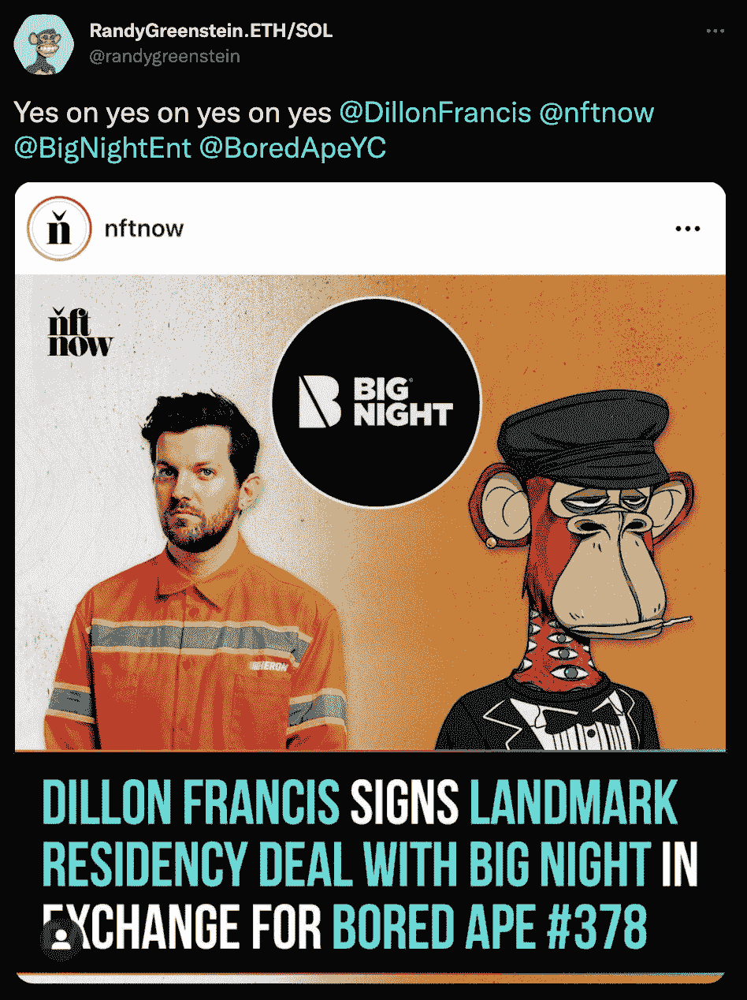

# 狄龙·弗朗西斯通过居住权协议加入 BAYC 家族

> 原文：<https://web.archive.org/web/https://dappradar.com/blog/dillon-francis-joins-the-bayc-family-through-residency-deal>

## 这位音乐家也是《看不见的朋友》的粉丝

美国音乐家狄龙·弗朗西斯是最新加入不断壮大的 BAYC 大家庭的一员。令人印象深刻的是，这位明星收到了无聊猿#378，作为交换，他与大晚上娱乐公司签署了一项居住协议。这是一个革命性的举措，证明了 NFTs 可以成为像狄龙·弗朗西斯这样的明星的一种有吸引力的支付方式或签约奖金。

关于居留协议的细节尚未透露。然而，从 Bored Ape #378 的交易历史来看，这笔交易必须签署。3 月 1 日，[兰迪·格林斯坦](https://web.archive.org/web/20221226113841/https://dappradar.com/hub/wallet/eth/0xbda35c85e2e732398f0b334d6570f6c7041566a7)简单地把 NFT 转到了[狄龙·弗朗西斯的钱包](https://web.archive.org/web/20221226113841/https://dappradar.com/hub/wallet/eth/0x58473e9ac681c4424ca74619281ff71801d002d6)。

这是一笔相当可观的转让，因为这辆 NFT 的[估价](https://web.archive.org/web/20221226113841/https://dappradar.com/hub/nft-value-estimator/bored-ape-yacht-club/378)为 287，302 美元。兰迪·格林斯坦是大晚上娱乐公司的负责人，也是一位狂热的 NFT 收藏家。大约一个月前，他以 109 ETH 的价格购买了 BAYC #378，约合 314，714 美元。

## 狄龙·弗朗西斯还喜欢哪些系列？

Dillon Francis 被证明是相当的 NFT 收藏家，他的投资组合中有 145 幅 NFT。虽然 BAYC #378 是他的作品中最昂贵的 NFT，但这位音乐家也将目光投向了其他流行的系列。

使用 DappRadar 投资组合跟踪工具快速浏览 Dillon Francis 的投资组合，可以发现这位音乐家拥有价值超过 631，000 美元的 NFT。在他的作品集里最有趣的作品中，我们发现了[突变猿#7270](https://web.archive.org/web/20221226113841/https://dappradar.com/hub/assets/eth/0x60e4d786628fea6478f785a6d7e704777c86a7c6/7270) 。此外，弗朗西斯拥有[克隆人 X #18549](https://web.archive.org/web/20221226113841/https://dappradar.com/hub/assets/eth/0x49cf6f5d44e70224e2e23fdcdd2c053f30ada28b/8039) 和[克隆人 X #823](https://web.archive.org/web/20221226113841/https://dappradar.com/hub/assets/eth/0x49cf6f5d44e70224e2e23fdcdd2c053f30ada28b/7714) ，以及[死亡骑士#6474](https://web.archive.org/web/20221226113841/https://dappradar.com/hub/assets/eth/0x2acab3dea77832c09420663b0e1cb386031ba17b/6474) 。

令人印象深刻的是，弗朗西斯作品集里最饱和的是《看不见的朋友》。最近几周，这些收藏在 NFT 社区引起了巨大的轰动，似乎名人也对此感兴趣。查看交易历史，弗朗西斯没有铸造任何他的隐形朋友 NFT。他在二级市场上花了将近 50 ETH 买了五个隐形朋友。

其他有趣的收藏品包括一件[阿迪达斯原创 NFT](https://web.archive.org/web/20221226113841/https://dappradar.com/hub/assets/eth/0x28472a58a490c5e09a238847f66a68a47cc76f0f/0) 和一件 [RTFKT MNLTH NFT](https://web.archive.org/web/20221226113841/https://dappradar.com/hub/assets/eth/0x86825dfca7a6224cfbd2da48e85df2fc3aa7c4b1/1) ，目前正在出售。从这些收藏品来看，Dillon Francis 正在密切关注 NFT 空间，从一些目前最热门的项目中购买收藏品。

如果你对浏览更多名人 NFT 钱包感兴趣，点击这里查看 DappRadar 验证的 VIP 地址列表。此外，你可以在[推特](https://web.archive.org/web/20221226113841/https://twitter.com/dappradar)上关注 DappRadar，第一时间了解最新的 NFT 名人新闻。

 NewsletterUnsubscribe at any time. [T&Cs](https://web.archive.org/web/20221226113841/https://dappradar.com/terms) and [Privacy Policy](https://web.archive.org/web/20221226113841/https://dappradar.com/privacy-policy)