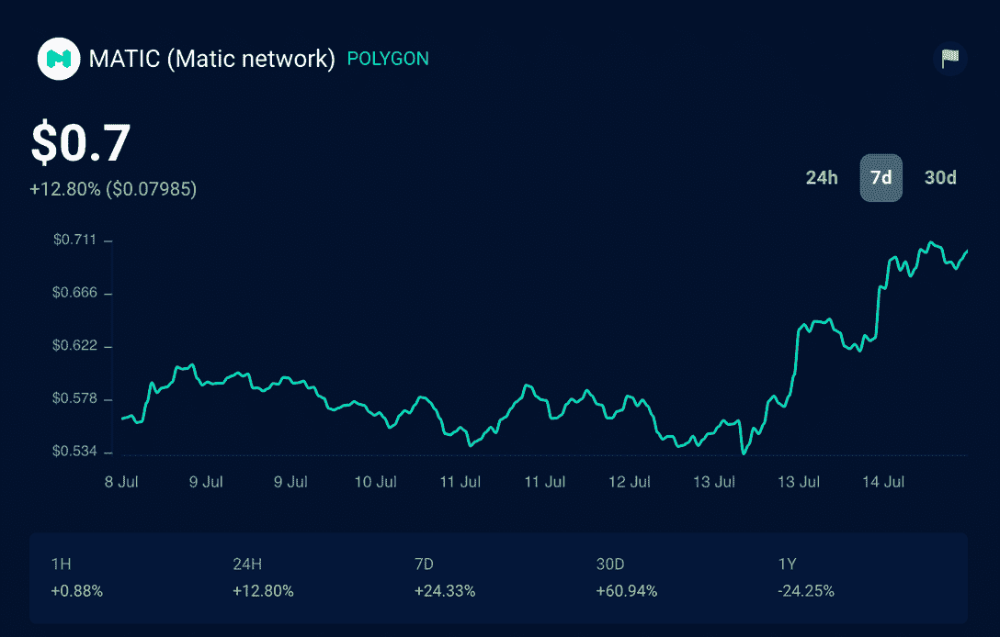

# 迪士尼选择多边形作为加速器项目&自动翱翔

> 原文：<https://web.archive.org/web/https://dappradar.com/blog/disney-selects-polygon-for-accelerator-program-matic-soars>

## Polygon 是唯一一个加入 2022 年声望很高的班级的区块链，今年专注于人工智能，NFTs 和 ar 技术

以太坊扩展平台是加入 2022 年迪士尼加速器计划的六家公司之一。今年的课程将为参与者提供迪士尼高级领导团队的指导和辅导。迪士尼全力投入 Web3 项目是全球采用的一个重要里程碑。毫不奇怪，MATIC 的价格在宣布的一周内上涨了 24%。

今年，选择的项目都是关于建筑技术，如增强现实(ar)、[不可替代令牌(NFTs)](https://web.archive.org/web/20221128044543/https://dappradar.com/blog/what-are-non-fungible-tokens-nfts) 和人工智能(AI)。

除了作为以太坊扩展开发平台的 [Polygon](https://web.archive.org/web/20221128044543/https://dappradar.com/blog/what-is-polygon-a-simple-explanation) 之外，他们还通过 [Polygon Studios](https://web.archive.org/web/20221128044543/https://polygonstudios.com/) 投资 NFTs 和元宇宙游戏项目，如[分散化](https://web.archive.org/web/20221128044543/https://dappradar.com/ethereum/games/decentraland)和[沙盒](https://web.archive.org/web/20221128044543/https://dappradar.com/ethereum/games/the-sandbox)。现在，迪士尼推出这个版本的目的是帮助***“开发新技术和讲故事的方式，创造跨越物理、数字和虚拟世界的互联体验。”***

这不是我们第一次听说娱乐巨头在追求他们自己的元宇宙。2022 年 2 月，华特·迪士尼公司任命高管麦克·怀特[监督他们的元宇宙战略](https://web.archive.org/web/20221128044543/https://www.bbc.com/news/business-60398056)。最近的消息表明，两家公司的合作将意味着未来有更多令人兴奋的项目值得关注。

此外，在整个 2022 年，我们在 [DappRadar](https://web.archive.org/web/20221128044543/https://dappradar.com/) 跟踪了 Polygon 与大牌的许多强大合作伙伴关系。

首先，您是否知道 [DappRadar 的投资组合跟踪器](https://web.archive.org/web/20221128044543/https://dappradar.com/hub/wallet/)支持多边形 NFT 和令牌？

[https://web.archive.org/web/20221128044543if_/https://www.youtube.com/embed/WHL_uYv8riA?feature=oembed](https://web.archive.org/web/20221128044543if_/https://www.youtube.com/embed/WHL_uYv8riA?feature=oembed)

这意味着，使用我们的应用程序，您可以跟踪您的数字资产在多边形网络中的实时价值。

阿迪达斯、普拉达和 Instagram 是与 Polygon 合作 Web3 项目的其他大牌公司。最近，区块链甚至宣布计划与科技初创公司 Nothing 合作推出一款新的 web3 手机。

## 多边形(MATIC)随着好消息而激增

Polygon Network 的[本地令牌 MATIC](https://web.archive.org/web/20221128044543/https://dappradar.com/blog/matic-was-trending-are-the-fundamentals-still-strong) 超过了其 50 天指数移动平均线，在迪士尼宣布后的第二天上涨至 0.72 美元。

从 [DappRadar Token Explorer](https://web.archive.org/web/20221128044543/https://dappradar.com/hub/token/polygon/MATIC) 图表中可以看到，加密货币的价值在上周增加了 24%，在过去 30 天增加了 60%。

有了 DappRadar，除了让您的钱包组合保持最新并检查 MATIC 值，您还可以使用我们的[令牌交换](https://web.archive.org/web/20221128044543/https://dappradar.com/hub/swap/polygon)在多边形区块链上交换令牌。

DappRadar 将继续密切关注 Polygon 的 Web3 合作伙伴关系和项目。请关注我们的[顶级多边形区块链 Dapps 排名](https://web.archive.org/web/20221128044543/https://dappradar.com/rankings/protocol/polygon)以保持领先地位。

如果你想进一步了解令人兴奋的去中心化应用世界中的最佳项目，请关注我们的[博客](https://web.archive.org/web/20221128044543/https://dappradar.com/blog/)、 [YouTube](https://web.archive.org/web/20221128044543/https://www.youtube.com/c/DappRadar) 频道和 [Twitter](https://web.archive.org/web/20221128044543/https://twitter.com/dappradar) 。

 NewsletterUnsubscribe at any time. [T&Cs](https://web.archive.org/web/20221128044543/https://dappradar.com/terms) and [Privacy Policy](https://web.archive.org/web/20221128044543/https://dappradar.com/privacy-policy)