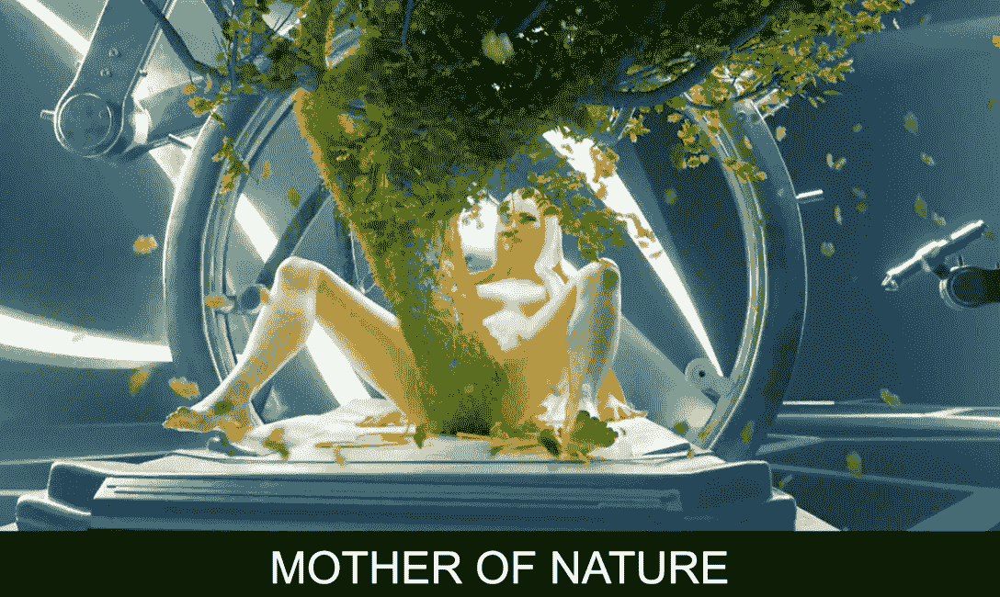
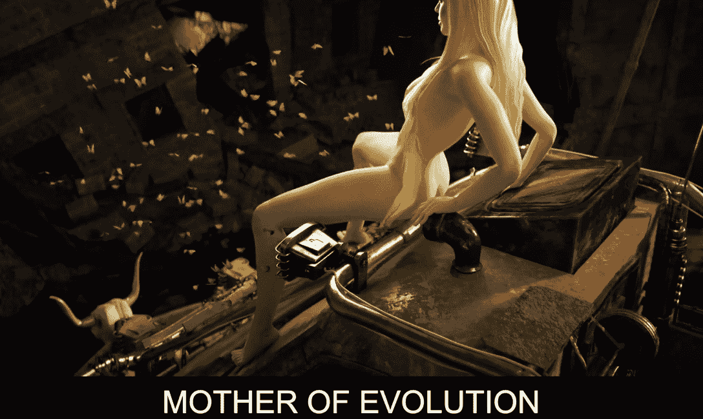
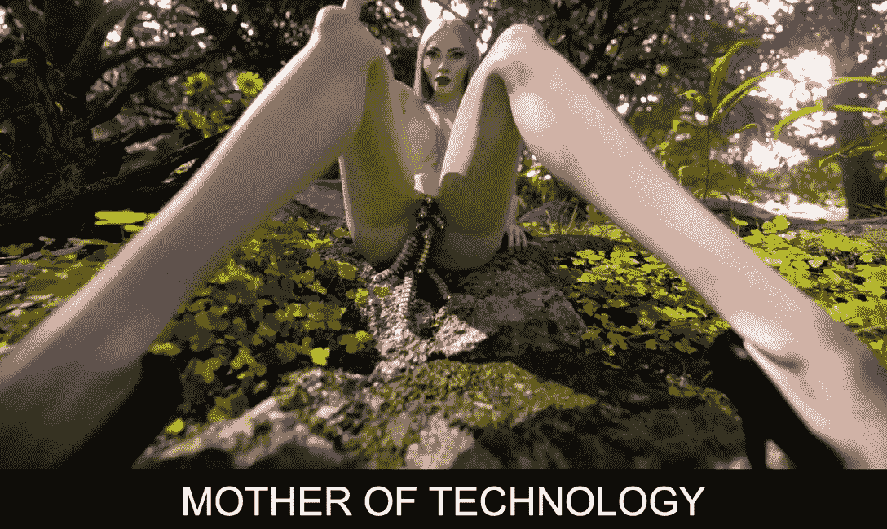

# 麦当娜生下机械蜈蚣是否终结熊市？

> 原文：<https://web.archive.org/web/https://dappradar.com/blog/does-madonna-giving-birth-to-mechanical-centipedes-end-the-bear-market>

## 这位流行歌星与 Beeple 合作了一个目前在 SuperRare 上拍卖的 NFT 独家项目

流行音乐界的大腕之一麦当娜和数码艺术界的大腕之一比尔联手合作了一个宏伟的 NFT 项目。NFT 的三幅名为《创造之母》的作品集目前正在 SuperRare 上直播，出价开始飙升。

## 总结:

*   麦当娜和比尔已经为这个项目工作了一年多，官方拍卖现在在超级稀有平台上直播
*   这三件作品聚焦于对母性和现代的不同诠释，你仍然可以在现场拍卖中为它们中的每一件出价
*   麦当娜和[皮普尔](https://web.archive.org/web/20220927111749/https://dappradar.com/hub/wallet/eth/0xc6b0562605d35ee710138402b878ffe6f2e23807)都是 NFT 收藏家，也是热情的创作者。你可以在下面浏览他们的作品集

## 麦当娜带来了远见，而比尔带来了执行力

虽然麦当娜和碧波可能不是 NFT 空间中最明显的合作组合，但乍一看，他们已经努力工作了一年多。创世之母三联画于美国东部时间 3 月 11 日下午 6 点向公众开放。该系列通过超级稀有的举办的拍卖会推出。

麦当娜和皮普尔都在他们的社交媒体上分享了这一事件，吸引了成千上万的观看和喜欢。考虑到他们在各自领域的影响力，这并不奇怪。你可以在下面看到官方公告:

> 自从有时间以来……..👀🌎🤰🫃将带着 [@beeple](https://web.archive.org/web/20220927111749/https://twitter.com/beeple?ref_src=twsrc%5Etfw)
> 
> 进入一个新的虚拟世界，在 5 月 11 日星期三下午 3 点太平洋标准时间/下午 6 点美国东部时间回来看耶稣诞生。NFTs 掉落在 [@superrare](https://web.archive.org/web/20220927111749/https://twitter.com/SuperRare?ref_src=twsrc%5Etfw) 。
> 
> 所有收益都让这些组织受益:[@国家救助](https://web.archive.org/web/20220927111749/https://twitter.com/NationalBailOut?ref_src=twsrc%5Etfw)[@ vday](https://web.archive.org/web/20220927111749/https://twitter.com/VDay?ref_src=twsrc%5Etfw)[@ voices _ org _ ua](https://web.archive.org/web/20220927111749/https://twitter.com/voices_org_ua?ref_src=twsrc%5Etfw)[pic.twitter.com/ab2RkP47kv](https://web.archive.org/web/20220927111749/https://t.co/ab2RkP47kv)
> 
> — Madonna (@Madonna) [May 9, 2022](https://web.archive.org/web/20220927111749/https://twitter.com/Madonna/status/1523758301724483586?ref_src=twsrc%5Etfw)

## 创造收藏之母是什么？

“创造之母”项目由三个 NFT 组成，每一个都代表了关于母亲和分娩的不同观点。这些照片以一位母亲分娩时麦当娜的身体为特色。

该系列中的第一幅 NFT 作品是《自然之母》。这是一个一分钟的视频，描述了麦当娜在一个未来派的实验室里，孕育一株植物。图像相当生动，但它通过不同的视角传达了麦当娜和皮普尔对母性的关注。在撰写本文时，这件作品的最高出价是 15 ETH，约合 2.8 万美元。拍卖不到 48 小时就结束了。如果你有兴趣购买这款 NFT，请在这里出价。

该系列的第二部《NFT》遵循了大致相同的艺术流程，但提供了一个关于母性的不同视角。在《进化之母》中，麦当娜扮演的角色在后世界末日的背景下生出了一大群蝴蝶。目前，“进化之母”的最高出价是 5.5 ETH，约合 1.05 万美元。拍卖不到 48 小时就结束了。如果你感兴趣，你可以在这里出价[。](https://web.archive.org/web/20220927111749/https://superrare.com/0x28b19a2885b68613d89c4e38eaf5cf3849978d70/mother-of-evolution-1)

最后，“技术之母”展示了这位流行歌星的数字版本，同时诞生了无数机械蜈蚣。麦当娜周围的场景提供了一个完整的交付技术方面的并列。在撰写本文时，“技术之母”的最高出价是 5.5 ETH，约合 1.05 万美元。您可以查看 NFT，并在此出价[。](https://web.archive.org/web/20220927111749/https://superrare.com/0x28b19a2885b68613d89c4e38eaf5cf3849978d70/mother-of-technology-3)

三个视频中的每一个都呈现了麦当娜对世界的独特感知和 Beeple 的鲜明风格。这两个有创意的组合已经成功地调整了他们的艺术视野，为分娩和母亲提供了一个全新的视角。

重要的是，一级销售的收益将捐给三个慈善机构。这三个组织都致力于支持全世界的妇女和儿童。

## 作为 NFT 收藏家的麦当娜和碧波

除了是才华横溢的艺术家和梦想家，麦当娜和碧波都是 NFT 收藏家。毕普拥有最大的名人 NFT 收藏品之一，他的钱包里有超过 4400 件独特的收藏品。

他是收藏者、艺术家和网络 3 爱好者专属会员俱乐部[PROOF collection](https://web.archive.org/web/20220927111749/https://dappradar.com/hub/assets/eth/0x08d7c0242953446436f34b4c78fe9da38c73668d/48)的成员。多亏了他的会员资格，毕普现在拥有了 [2 辆月鸟 NFT](https://web.archive.org/web/20220927111749/https://dappradar.com/hub/wallet/eth/0xc6b0562605d35ee710138402b878ffe6f2e23807/nfts/1/moonbirds)。除了热门项目的热门收藏品，皮普尔还在数字艺术上下了重注。他持有[大量稀有作品](https://web.archive.org/web/20220927111749/https://dappradar.com/hub/wallet/eth/0xc6b0562605d35ee710138402b878ffe6f2e23807/nfts/1/rarible)，甚至还有一张[散列表《NFT》](https://web.archive.org/web/20220927111749/https://dappradar.com/hub/wallet/eth/0xc6b0562605d35ee710138402b878ffe6f2e23807/nfts/1/hashmasks)。

查看麦当娜在 NFT 的作品组合，我们看到了一个非常不同的选择。这位流行歌星在今年早些时候购买了 [Bored Ape #4988](https://web.archive.org/web/20220927111749/https://dappradar.com/hub/assets/eth/0xbc4ca0eda7647a8ab7c2061c2e118a18a936f13d/4988) 后才加入 NFT 空间。令人印象深刻的是，这个 NFT 已经不在当初购买时的钱包里了；然而，没有出售交易，只有转让。[的新钱包](https://web.archive.org/web/20220927111749/https://dappradar.com/hub/wallet/eth/0x8ea95bdc5cdddc0b7ebad841f0c1f2ca6168b6a9/nfts)只包含 5 个 NFT，包括 BAYC，很可能剩下的 4 个是粉丝送的礼物。从这个意义上说，麦当娜还没有开始建立她的 NFT 收藏，或者至少没有公开。不过，这位流行歌星参与 Bored Ape 游艇俱乐部表明她对 NFT 空间感兴趣。

此外,《创造之母》有望成为今年春天 NFT 最热门的作品之一，它也将有效地把麦当娜推上数字艺术舞台。达普拉达将继续关注麦当娜和毕普的 NFT 之旅。要查看官方拍卖，请访问 [SuperRare](https://web.archive.org/web/20220927111749/https://dappradar.com/ethereum/marketplaces/superrare) 网站。此外，你可以在[的 Twitter](https://web.archive.org/web/20220927111749/https://twitter.com/dappradar) 上关注 DappRadar，首先获得最新的 NFT 新闻。

 NewsletterUnsubscribe at any time. [T&Cs](https://web.archive.org/web/20220927111749/https://dappradar.com/terms) and [Privacy Policy](https://web.archive.org/web/20220927111749/https://dappradar.com/privacy-policy)