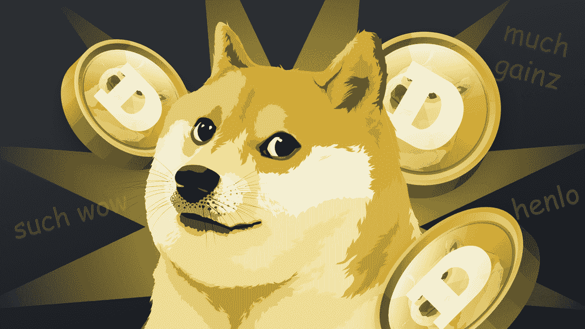
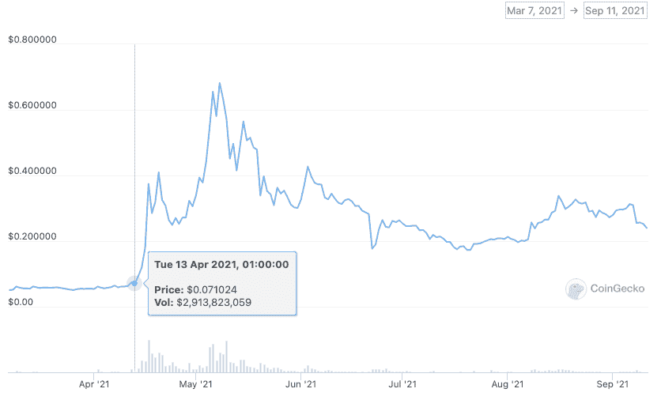
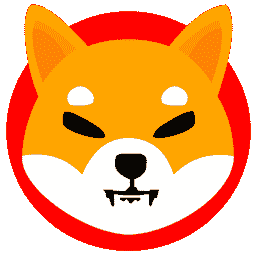

# 2022 年 Doge Day 将玩笑推向了一个新的高度

> 原文：<https://web.archive.org/web/https://dappradar.com/blog/doge-day-2022-takes-joke-to-the-next-level>

## 市值 186.3 亿美元的 dog 不再是一个笑话

**总结**

*   在 2021 年狗日之前的一周，代币价格飙升了 470%。
*   Doge Day 始于 2021 年，社区试图将价格提高到 1 美元。
*   硬币的批评者认为这是一个庞氏骗局，早期采用者赚钱，其余的人亏损。

Doge Day 是一年一度庆祝最著名的迷因硬币:Dogecoin。尽管最近加密货币价格下跌，但这种“作为一个笑话”推出的代币仍然表现强劲。随着 2022 年 4 月 20 日第二个 Doge 日的到来，人们会开始更认真地对待这个笑话吗？

Dogecoin 于 2013 年 12 月 6 日作为玩笑代币推出。近十年后，这个著名的带有柴犬标志的迷因币有了自己的一天，也有了一群粉丝和追随者。

## Dogecoin 简史

Dogecoin 由比利·马库斯和杰克逊·帕尔默于 2013 年 12 月 6 日推出。这两个人说，他们想创造一种比比特币更容易被用户使用的东西。

与著名的 OG 加密货币不同，该货币的发行量有 2100 万枚硬币的上限，Dogecoin 的供应量没有限制。每个新块创建 10，000 个 Dogecoin，块时间为一分钟。每年有 50 亿枚金币进入流通领域。

几乎立刻，硬币升值了。2013 年 12 月 9 日，Dogecoin 上涨了 300%，人们每天交易数十亿只。我们都应该注意到，这是在区块链技术和加密货币广为人知之前。此时人们已经知道了比特币，但以太坊在 Dogecoin 之后 18 个月才推出。这些都是非常早期的日子。

在 10 年代中期的一些疯狂的价格波动之后，没有值得广泛采用的杰出公用事业，Dogecoin 在 2021 年初开始认真抽水。由于一位著名的亿万富翁在推特上发布了这枚硬币，它在 24 小时内上涨了 800%(稍后会有更多关于他的消息)。

当它在 2021 年 5 月 4 日超过 0.5 美元时，Dogecoin 的价格飙升了 20，000%。2021 年 5 月 8 日，这枚硬币在一天内损失了 350 亿美元的价值。

NBA 球队达拉斯小牛队(Dallas Mavericks)的老板马克·库班很快称赞了硬币的“确定性通胀”机制，并称赞硬币作为日常货币的有效形式的潜力。他宣布持有者可以用它来支付团队商品。

2021 年 5 月 9 日，一项 SpaceX rideshare 任务完全由 Dogecoin 资助，成为第一次由加密货币资助的太空之旅。以太坊的发明者 Vitalik Buterin 加入董事会，英超沃特福德将 Dogecoin 作为其球衣赞助商。

尽管如此，这枚硬币还是有点像个笑话。可能是名字的原因。也许是狗的象征。时间将会证明 Dogecoin 是否会超越一个迷因符号，但现在，我们可以享受狗的笑脸。

Dogecoin’s logo is a Shiba Inu dog

## 为什么硬币有一天？

Dogecoin 福音传道者在 2021 年开始 Doge 日。就像硬币本身一样，这开始部分是一个玩笑，部分是一个实验，看看一个玩笑能开多远。很难说是谁首先想到了 Doge Day。

一些报道称，这是一名来自亚利桑那州凤凰城的男子，名叫肖恩·贝克尔。不管是谁，互联网很快就开始了这项事业，Doge Day 的既定目标是让硬币的价值达到 1 美元。不幸的是，他们从未实现他们的目标。Dogecoin 在 2021 年 5 月 8 日达到 0.73 美元的高点。现在的价格是 0.14 美元。

## Doge 日效应

2021 年总督日可能对硬币的价格产生了重大影响。在 2021 年 4 月 20 日之前的一周，Dogecoin 的价格上涨了 470%，从 0.07 美元涨到 0.4 美元。

Source: CoinGecko

与此同时，加密货币全线飙升。在这样一个狂热的牛市中，在一个似乎不知从何而来的上涨和下跌的秘密牛市中，很难确切地说出价格飙升发生的原因。

我们可以说今年没有类似的增长。在过去的七天里，道指相对温和地上涨了 4.6%。过去两周，该指数下跌了 5.4%。在加密货币市场，识别短期趋势相对简单；为它们寻找原因要复杂得多。

## 仿制硬币

在 Dogecoin 惊人的、完全不可持续的成功之后，许多仿制硬币进入了市场。或者应该是抄袭？无论我们如何称呼这些模仿者，其中最著名的是臭名昭著的柴犬币。

Shiba Inu coin logo

这枚硬币由不知名的 Ryoshi 于 2020 年 8 月创作，以 Dogecoin 的象征符号中描绘的柴犬命名。不要忘记，Dogecoin 最初是一个没有内在价值或用途的玩笑项目，如果另一枚硬币的内在价值和用途都更少，那就有点可笑了。

尽管有缺点，柴犬目前的市值为 138 亿美元，并在 2022 年的大部分时间里保持这一水平。而现在，柴犬项目有了自己的去中心化交易所: [ShibaSwap](https://web.archive.org/web/20221002001617/https://dappradar.com/multichain/defi/shibaswap) 。所以它似乎在建立某种合法性。

Floki Inu 是一款基于笑话币的笑话币，市值 2.58 亿美元。没有人知道它会做什么，也没有人知道它会做什么。但人们还是会交易它。它目前的日交易量接近 1100 万美元。这比一些[硬币](https://web.archive.org/web/20221002001617/https://dappradar.com/hub/token/eth/RADAR?from=0x44709a920fccf795fbc57baa433cc3dd53c44dbe)和[要多得多，这些硬币有实际用途](https://web.archive.org/web/20221002001617/https://dappradar.com/token/overview)。

为了证明弗洛基·伊努硬币是一个多大的笑话，它以弗洛基命名，弗洛基是一位古怪的亿万富翁的狗，他几乎是 Dogecoin 价格飙升的唯一原因。

## 埃隆·马斯克——我们时代的狗屎圣人

如果没有马斯克，可能就不会有迷因币。这个人在推特上有 8250 万粉丝，是少数几个能一眼认出他名字的人之一:埃隆。

当他在 2020 年 12 月 20 日发推文“一个词:Doge”时，这是一个定义秘密狂热时代的传奇的开始。这枚硬币立即上涨了 20%，其趋势线在全年上下波动，这取决于特斯拉首席执行官的突发奇想。马斯克并没有预测 Dogecoin 即将流行。他在创造它。

就像硬币本身一样，我们不能把马斯克看得太重。因此，当他在推特上说“Dogecoin 是人民的密码”时，我们应该持保留态度，并记住即使是世界上最富有的人也需要偶尔的笑声。