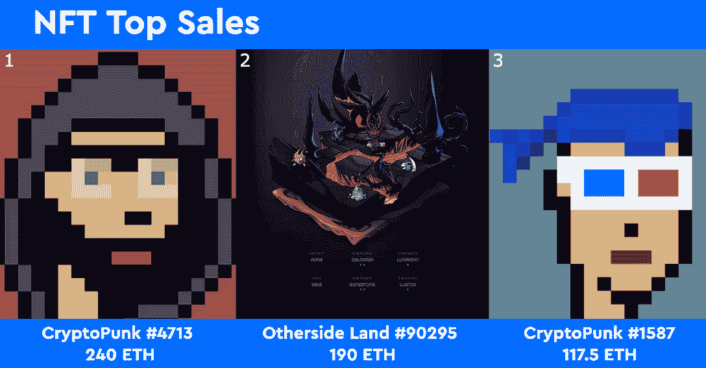
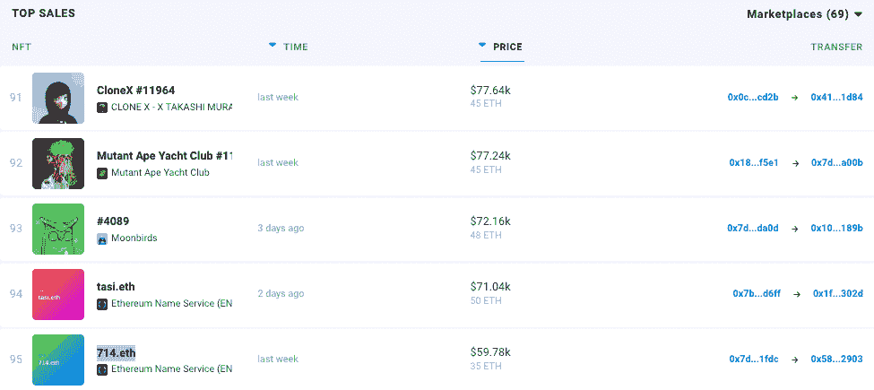
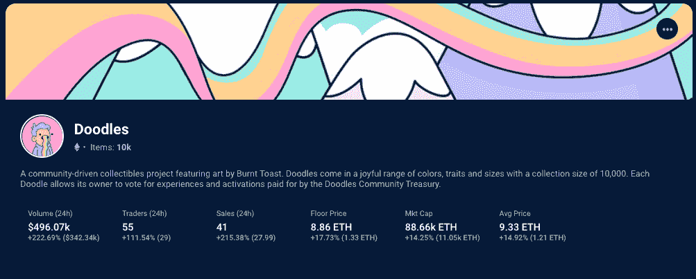
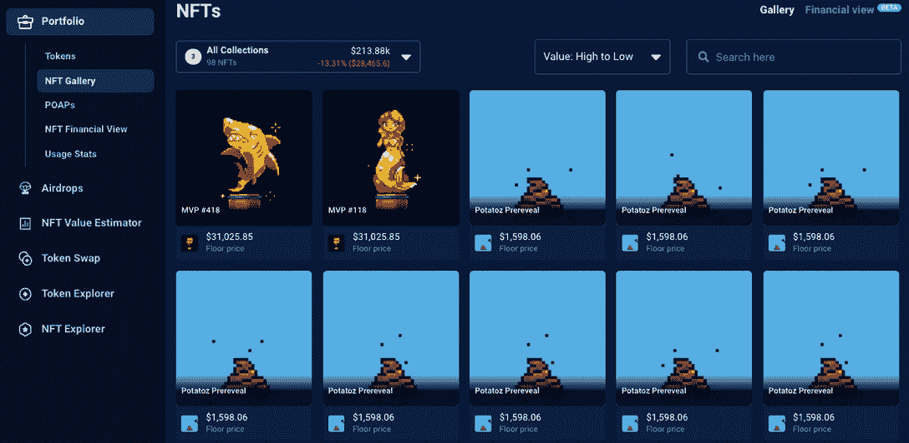

# 涂鸦 2 NFT 炒作推动销售激增-NFT 销售亮点

> 原文：<https://web.archive.org/web/https://dappradar.com/blog/doodles-2-nft-hype-drives-sales-surge-nft-sales-highlights>

## 查看 2022 年 9 月 11 日至 18 日期间的 NFT 销售亮点排名

每周 DappRadar 不仅会重点报道 NFT 最贵的商品，还会报道过去七天中最有趣的商品。虽然大数字肯定会占据头条，但突出新兴趋势并让 DappRadar 社区保持领先也是至关重要的。

在过去的七天里，最高价值的 NFT 拍卖会是[的 CryptoPunk #4713 以 240 ETH](https://web.archive.org/web/20220925233810/https://dappradar.com/hub/assets/eth/0xb47e3cd837ddf8e4c57f05d70ab865de6e193bbb/4713) 成交，约合 41.2 万美元。第二个位置属于 [Otherdeed #90295](https://web.archive.org/web/20220925233810/https://dappradar.com/hub/assets/eth/0x34d85c9cdeb23fa97cb08333b511ac86e1c4e258/90295) ，即将在元宇宙另一边出售的一块土地，售价为 190 ETH，或略高于 30 万美元。第三名属于 [CryptoPunk #1587，它以 117.5 ETH](https://web.archive.org/web/20220925233810/https://dappradar.com/hub/assets/eth/0xb47e3cd837ddf8e4c57f05d70ab865de6e193bbb/1587) 或 18.7 万美元左右的价格易手。虽然这三种销售从价值角度来看很突出，但还会出现无数其他趋势。

CryptoPunks 和 Bored Ape Yacht Club [NFT 销售额占据](https://web.archive.org/web/20220925233810/https://dappradar.com/nft/sales)周最高销售额排行榜。然而，其他蓝筹股离群值不断易手，获得可观的价值，而其他收藏则引发了巨大的兴趣。

如前所述，上周第二高的销售额是即将到来的元宇宙彼岸的一块土地，它是 BAYC 生态系统的一部分。一旦登上按价值排名的 NFT 顶级销售排行榜的第七页，我们开始看到其他系列的销售从这些生态系统中脱颖而出。

## 在最高销售额之外

在 NFT 销售额前 100 名中，我们发现 [CloneX #11964](https://web.archive.org/web/20220925233810/https://dappradar.com/hub/assets/eth/0x49cf6f5d44e70224e2e23fdcdd2c053f30ada28b/4383) 易手为 [45 ETH，或约 77，000 美元](https://web.archive.org/web/20220925233810/https://dappradar.com/hub/assets/eth/0x49cf6f5d44e70224e2e23fdcdd2c053f30ada28b/4383)。随着数字收藏品与现实世界物品的碰撞，设计工作室 RTFKT(现归耐克所有)和日本当代艺术家村上隆(Takashi Murakami)之间的合作越来越受欢迎。

仍然在 BAYC 生态系统中，但通常不会获得如此高价值的销售的是[突变猿游艇俱乐部#11364](https://web.archive.org/web/20220925233810/https://dappradar.com/hub/assets/eth/0x60e4d786628fea6478f785a6d7e704777c86a7c6/11364) ，它也以 45 ETH 的价格出售。有趣的是，这辆特殊的 MAYC·NFT 跑车的卖家在九个月前铸造它时就一直保留着它，直到[以将近 78，000 美元](https://web.archive.org/web/20220925233810/https://dappradar.com/hub/assets/eth/0x60e4d786628fea6478f785a6d7e704777c86a7c6/11364)的价格卖掉了它。

在这两笔交易下面，我们看到 4089 号月鸟以 48 ETH 的价格售出，也就是购买时的 72，000 美元左右。Moonbirds 是 PROOF Collective 制作的 10，000 个 NFT 的集合，PROOF Collective 是一群技术和媒体行业的资深人士，他们通过他们的播客建立了一个基层社区。

Source: [DappRadar NFT Rankings](https://web.archive.org/web/20220925233810/https://dappradar.com/nft)

另一个不会消失的趋势是三个和四个字母或数字的 ENS 域名的易手。每周，我们都会报道这些系列中破纪录的 ENS 销售，以太坊的合并只是加强了这一趋势。本周，我们看到 714.eth 以 35 ETH 的价格售出，将近 6 万美元，而 [tasi.eth 以高达 50 ETH](https://web.archive.org/web/20220925233810/https://dappradar.com/hub/assets/eth/0x57f1887a8bf19b14fc0df6fd9b2acc9af147ea85/34620588829851939537435988196637389195770044441537817858760535722276056117068)的价格售出，超过 7.1 万美元。

本文作者所知的与四个字母单词“TASI”唯一相关的经济指数是沙特的 Tadawul 指数，即 TASI。鉴于[买家的钱包里只有这个 NFT](https://web.archive.org/web/20220925233810/https://dappradar.com/hub/wallet/eth/0x1ff67aed2304df2e782bbbe7580297ec79c1302d) 和少量的 ETH 在里面，这可能是组织的官方购买。

与此同时，数字 [714 与精神世界的](https://web.archive.org/web/20220925233810/https://dappradar.com/hub/assets/eth/0x57f1887a8bf19b14fc0df6fd9b2acc9af147ea85/74655015159532772265480723858124846509863706846225177456430490510732071325525)相关，因为它被认为是一个“天使数字”第 714 条建议，这是一个将你的意图付诸行动的好时机，让你变得自信和乐观，并专注于你未来道路的下一步。对于想在熊市投机的人来说，这是一个非常合适的 NFT！

## 涂鸦 2 炒作

我们经常看到的一个趋势是，与即将推出的系列相关的 NFT 销售激增，引起了人们的关注。几周前，随着这位创造者的第二个系列 y00ts 的销量即将下降，我们看到 Solana DeGods NFTs 的销量和价值都有所上升。原因是已经在一个生态系统中的 NFT 持有者可以偶尔从一个创作者的新收藏或等候名单上的优先空间中获得免费的 NFT 掉落。

> 涂鸦 2…即将推出。[https://t.co/8gw3OeeQfs](https://web.archive.org/web/20220925233810/https://t.co/8gw3OeeQfs)pic.twitter.com/c33BB0GLqPT2
> 
> — doodles (@doodles) [June 22, 2022](https://web.archive.org/web/20220925233810/https://twitter.com/doodles/status/1539444678642352129?ref_src=twsrc%5Etfw)

涂鸦 2 的宣传列车于 2022 年 6 月离开车站，当时一份公告和随附的视频开始在网上出现。最近，Doodles 宣布了一轮 5400 万美元的投资，由 Reddit 联合创始人亚历克西斯·奥哈尼安的[七七六](https://web.archive.org/web/20220925233810/https://twitter.com/sevensevensix)领投，尽管目前的市场条件下估值为 7.04 亿美元。

随着数字收藏品的投机阶段可能结束，持有者寻求真正的效用和长期价值，预计这笔投资将用于为涂鸦 NFT 持有者增加额外的效用。尽管如此，投资公告和即将推出的涂鸦系列还是让 NFT 的崇拜者们兴奋不已，交易也达到了顶峰。

[在过去的 24 小时](https://web.archive.org/web/20220925233810/https://dappradar.com/hub/nft-explorer/collection/doodles-official)内，交易者的数量增加了 111%以上，而平均价格上涨了近 15%，达到 9.3 ETH。[随着交易者放大这个不太知名的蓝筹股 NFT 集合，各种指标全面上涨](https://web.archive.org/web/20220925233810/https://dappradar.com/hub/nft-explorer/collection/doodles-official)。

Source: [NFT Explorer](https://web.archive.org/web/20220925233810/https://dappradar.com/hub/nft-explorer/collection/doodles-official)

在过去的七天里，最高价值的涂鸦作品是 4447 号涂鸦作品，以 37 ETH 的价格售出，接近 60，000 美元。在那次拍卖的背后，我们看到[涂鸦#1684 以 15 ETH](https://web.archive.org/web/20220925233810/https://dappradar.com/hub/assets/eth/0x8a90cab2b38dba80c64b7734e58ee1db38b8992e/1684) 的价格售出，大约 26000 美元，这与我们上面看到的平均价格非常接近。上周，[总共有 285 张涂鸦手转手](https://web.archive.org/web/20220925233810/https://dappradar.com/hub/nft-explorer/collection/doodles-official/sales-activity?period=week&page=19)。

Doodles 2 将允许任何人以艺术家烤焦吐司的独一无二的艺术风格创建独特的个性化和可定制的角色。角色可以更新他们的外貌并保存到区块链，不收取交易费，并且将包含最著名艺术家的音乐，可以解锁和使用。

## 你是真正的 MVP

另一组 NFT 引起了人们的注意，它是由广受欢迎的 9GAG 网站以及 Memeland 和 Potatoz NFT 项目背后的团队发布的。你们这些真正的 MVP NFTs 是一个由 420 名 Memeland 传奇 MVP 组成的私人团体。

NFT 是 Memeland 生态系统的高级会员，包括两个免费的 Memeland 初级系列铸币厂，允许所有未来 9GAG Memeland NFT 系列，如 Potatoz，MVP role & MVP lounge in Discord，以及更多内容。

在过去七天中，该系列非功能性纺织品的最高销售额来自 [MVP #118](https://web.archive.org/web/20220925233810/https://dappradar.com/hub/assets/eth/0x6efc003d3f3658383f06185503340c2cf27a57b6/118)

25.5 ETH 的价格约为 44，000 美元， [MVP #418 的价格为 23.99 ETH](https://web.archive.org/web/20220925233810/https://dappradar.com/hub/assets/eth/0x6efc003d3f3658383f06185503340c2cf27a57b6/418) 的价格约为 42，000 美元。更有趣的是，[同一个钱包购买了两个](https://web.archive.org/web/20220925233810/https://dappradar.com/hub/wallet/eth/0x13dd771f9aa09d309305fea84255d8113de2826c/nfts)，而且那个钱包还装了 90 多个 Potatoz NFTs，其中很多没有透露，估计价值在 15.1 万美元左右。

Source: [DappRadar Portfolio Tracker](https://web.archive.org/web/20220925233810/https://dappradar.com/hub/wallet/eth/0x13dd771f9aa09d309305fea84255d8113de2826c/nfts)

## 查看 NFT 销售亮点列表

***注意:出售时给出的美元价值是正确的***

*   [other side # 90295](https://web.archive.org/web/20220925233810/https://dappradar.com/hub/assets/eth/0x34d85c9cdeb23fa97cb08333b511ac86e1c4e258/90295)的其他契约——302.6 万美元/190 ETH——[买家钱包](https://web.archive.org/web/20220925233810/https://dappradar.com/hub/wallet/eth/0x980abb7b56511da463223a79f76933a1211b9e1f)
*   [CloneX # 11964](https://web.archive.org/web/20220925233810/https://dappradar.com/hub/assets/eth/0x49cf6f5d44e70224e2e23fdcdd2c053f30ada28b/4383)-$ 77.64k/45 ETH-[买家钱包](https://web.archive.org/web/20220925233810/https://dappradar.com/hub/wallet/eth/0x416390a69c3826fef844b97e27b5087fa98f1d84)
*   [变种人猿游艇俱乐部# 11364](https://web.archive.org/web/20220925233810/https://dappradar.com/hub/assets/eth/0x60e4d786628fea6478f785a6d7e704777c86a7c6/11364)-$ 77.24k/45 ETH-[买家钱包](https://web.archive.org/web/20220925233810/https://dappradar.com/hub/wallet/eth/0x7dd8fa29637a9e0c545a689c080093a80ce1a00b)
*   [月鸟# 4089](https://web.archive.org/web/20220925233810/https://dappradar.com/hub/assets/eth/0x23581767a106ae21c074b2276d25e5c3e136a68b/4089)-$ 72.16k/48 ETH-[买家钱包](https://web.archive.org/web/20220925233810/https://dappradar.com/hub/wallet/eth/0x1008b08f8bbf1cd933dd3948c94bd238092d189b)
*   [tasi . ETH](https://web.archive.org/web/20220925233810/https://dappradar.com/hub/assets/eth/0x57f1887a8bf19b14fc0df6fd9b2acc9af147ea85/34620588829851939537435988196637389195770044441537817858760535722276056117068)-$ 71.04k/50 ETH-[买家钱包](https://web.archive.org/web/20220925233810/https://dappradar.com/hub/wallet/eth/0x1ff67aed2304df2e782bbbe7580297ec79c1302d)
*   [VeeFriends 导师会猫鼬](https://web.archive.org/web/20220925233810/https://dappradar.com/hub/assets/eth/0xa3aee8bce55beea1951ef834b99f3ac60d1abeeb/6311)–$ 59.59k/37.5 ETH——[买家钱包](https://web.archive.org/web/20220925233810/https://dappradar.com/hub/wallet/eth/0x1883a95e5d862c8f43b6272fef9b64dfc8438bca)
*   [Doodle # 4447](https://web.archive.org/web/20220925233810/https://dappradar.com/hub/assets/eth/0x8a90cab2b38dba80c64b7734e58ee1db38b8992e/4447)-$ 59.45k/37 ETH-[买家钱包](https://web.archive.org/web/20220925233810/https://dappradar.com/hub/wallet/eth/0x59333ece7ac3ed22f33298dc2f2996beda1c0edf)
*   [MVP # 118](https://web.archive.org/web/20220925233810/https://dappradar.com/hub/assets/eth/0x6efc003d3f3658383f06185503340c2cf27a57b6/118)-$ 44.67k/25.5 ETH-[买家钱包](https://web.archive.org/web/20220925233810/https://dappradar.com/hub/wallet/eth/0x13dd771f9aa09d309305fea84255d8113de2826c/nfts)
*   [死亡地球的已知起源回声(蓝色)](https://web.archive.org/web/20220925233810/https://dappradar.com/hub/assets/eth/0xfbeef911dc5821886e1dda71586d90ed28174b7d/65403)–$ 39.08k/30 ETH——[买家钱包](https://web.archive.org/web/20220925233810/https://dappradar.com/hub/wallet/eth/0x6695d667579390f1b94db3a8a05cc42a32ba29ec)
*   [Doodle # 9590](https://web.archive.org/web/20220925233810/https://dappradar.com/hub/assets/eth/0x8a90cab2b38dba80c64b7734e58ee1db38b8992e/9590)-$ 35.06k/22 ETH-[买家钱包](https://web.archive.org/web/20220925233810/https://dappradar.com/hub/wallet/eth/0xd32c6912f604c3e66f8f9e299f751ae869d7e631)

## NFT 骗局警报！

从真藏品中分辨出假藏品，会让你以后少很多心痛。它会让你不失去你的加密货币。下面，我们列出了识别 NFT 骗局的六种方法，这样你就不会成为不诚实的骗子的受害者。

***以上不构成投资建议。此处给出的信息仅供参考。请行使尽职调查，做你的研究。作者持有多种加密货币的头寸，包括 BTC、瑞士法郎和雷达。***

 NewsletterUnsubscribe at any time. [T&Cs](https://web.archive.org/web/20220925233810/https://dappradar.com/terms) and [Privacy Policy](https://web.archive.org/web/20220925233810/https://dappradar.com/privacy-policy)