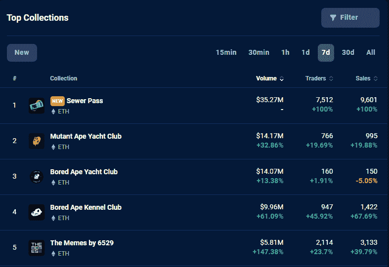

# 独家 Dookey Dash 游戏的交易额达到 3500 万美元

> 原文：<https://web.archive.org/web/https://dappradar.com/blog/dookey-dash-sewer-pass-nft-trading-volume-first-week>

## 一个简单的游戏，花费 3000 美元来玩，设置分数，并解锁更多

宇迦实验室推出了 Dookey Dash，这是一款由 NFT 控制的无止境跑步游戏，其交易量已超过 3570 万美元。在它的第一周，玩家们已经交易了下水道通行证 NFTs 9601 次。

宇迦实验室向其 BAYC、MAYC 和 BAKC 持有者发放了 21，791 张下水道通行证。长话短说，下水道通行证给你一个超级休闲的技能为基础的无尽的跑步者游戏，这将解锁新 NFT 下降线。目前对所有这些宇迦实验室 NFT 的需求非常大。

任何市场上列出的最便宜的下水道通行证 NFTs 将花费你 1.89 ETH 或刚刚超过 3000 美元。仅在过去的 24 小时内，这些通行证中就有 447 次换了钱包。对下水道通行证的需求似乎是不可否认的，这些给了一个永无止境的跑步游戏。

[More Sewer Pass data](https://web.archive.org/web/20230215222033/https://dappradar.com/ethereum/collectibles/sewer-pass)

社区可以从 1 月 18 日到 2 月 8 日玩 Dookey Dash。之后，游戏关闭，下水道通行证上登记的分数将被冻结。排名第一的玩家将获得一把钥匙，而所有其他参与者可以在 2 月 15 日加入召唤。

Dookey Dash 只是宇迦实验室称之为“基于技能的铸造”过程的第一步。路线图建议再推出一个强制性的迷你游戏，然后要么与无聊的 NFT 猿舍俱乐部合并，要么推出第三个游戏。所有这些迷你游戏据称都将由 ApeCoin 驱动，Ape coin 是无聊猿生态系统的本地货币。

[Get ApeCoin](https://web.archive.org/web/20230215222033/https://dappradar.com/hub/token/eth/APE/ETH?from=0x4d224452801aced8b2f0aebe155379bb5d594381)

## 3000 美元开始游戏

宇迦实验室空投下水道通行证给那些持有无聊猿游艇俱乐部或 NFT 变异猿游艇俱乐部的人。根据玩家持有的物品，玩家可以获得一点奖励。他们还举办了一个无聊的猿养狗俱乐部，他们可以期待额外的刺激。毫不奇怪，一些人将这种机制称为“付费取胜”，这是一种在移动游戏行业取得胜利的商业模式。

> 想象一下在 [#dookeydash](https://web.archive.org/web/20230215222033/https://twitter.com/hashtag/dookeydash?src=hash&ref_src=twsrc%5Etfw) 中以 400，000 点完成这一动作。🤯
> 
> 这是我跑步的一个片段，让我获得了 448，476 分，目前排名第五🙏【pic.twitter.com/tPFSYA9wH0 
> 
> — TFG (@TFGmykL) [January 22, 2023](https://web.archive.org/web/20230215222033/https://twitter.com/TFGmykL/status/1617118705678446599?ref_src=twsrc%5Etfw)

然而，下水道通行证的价格标签现在是 3000 美元。这是市场愿意为获得下水道通行证而支付的价格。这无疑是目前进入宇迦实验室生态系统最便宜的入口之一。此外，拥有其他宇迦实验室 NFT 可以提高分数，创造效用，并反过来带来一些需求。

以下是宇迦实验室 NFT 的底价:

*   无聊猿游艇俱乐部——65.95 ETH
*   变种人猿游艇俱乐部 13.25 ETH
*   无聊猿养狗俱乐部 6.75 ETH
*   下水道通道 1.89 ETH
*   另一边的其他契约 1.35 ETH

此外，Dookey Dash 并不是一个公开发行的游戏，而是纯粹的游戏化铸造体验，适合无聊的猿和其他方面的故事情节。也许在未来，宇迦实验室将开放其生态系统，允许任何人参与并拥有基于他们在游戏中的活动。

[Discover your favorite Bored Ape](https://web.archive.org/web/20230215222033/https://dappradar.com/ethereum/collectibles/bored-ape-yacht-club)

## 10 大 NFT 亮点

尽管 Dookey Dash 和下水道通行证是目前的热门话题，但它们并不是最引人注目的 NFT 销售。在 DappRadar 上，你总能[找到最近或最贵的 NFT 拍卖会](https://web.archive.org/web/20230215222033/https://dappradar.com/nft/sales)。我们选出了上周脱颖而出的 10 个 NFT 销售案例。

*   [fiden za # 561](https://web.archive.org/web/20230215222033/https://dappradar.com/hub/assets/eth/0xa7d8d9ef8d8ce8992df33d8b8cf4aebabd5bd270/78000561)——240，600 美元/145 ETH—[买家的钱包](https://web.archive.org/web/20230215222033/https://dappradar.com/hub/wallet/eth/0x1061c9caf9c6c0af925636098ddea1055d1952ea)几乎空了
*   [Wolf Game Deed # 13025](https://web.archive.org/web/20230215222033/https://dappradar.com/hub/assets/eth/0x2c88aa0956bc9813505d73575f653f69ada60923/13025)-$ 66，950/42 ETH-[买家的钱包](https://web.archive.org/web/20230215222033/https://dappradar.com/hub/wallet/eth/0xa7ad4296d9f41434d1982a4c4cd98df88121858f)是 Wolf Game 的新品
*   [American . ETH](https://web.archive.org/web/20230215222033/https://dappradar.com/hub/assets/eth/0x57f1887a8bf19b14fc0df6fd9b2acc9af147ea85/5464167787027335866648967224014420170157301512578653367253601789891021882048)-50400 美元/31 ETH-[买家的钱包](https://web.archive.org/web/20230215222033/https://dappradar.com/hub/wallet/eth/0x3a43f8a3118544e8a523a06b965e46da0b1b0abe)押注更多域名
*   [Gm-week . NFT](https://web.archive.org/web/20230215222033/https://dappradar.com/hub/assets/polygon/0xa9a6a3626993d487d2dbda3173cf58ca1a9d9e9f/110072960033378161455312714081268330026411104173252914076297919504426449565215)-25860 美元/26k MATIC-[买家的钱包](https://web.archive.org/web/20230215222033/https://dappradar.com/hub/wallet/polygon/0x47639c44fc5880045c2a981cf62e31ef692f5558)只包含 MATIC
*   [志那都红豆# 4104](https://web.archive.org/web/20230215222033/https://dappradar.com/hub/assets/eth/0xed5af388653567af2f388e6224dc7c4b3241c544/4104)——194080 美元/ 127.5 瑞士法郎—[买家的钱包](https://web.archive.org/web/20230215222033/https://dappradar.com/hub/wallet/eth/0x2079c29be9c8095042edb95f293b5b510203d6ce)里有 127 万美元
*   [Ringers # 905](https://web.archive.org/web/20230215222033/https://dappradar.com/hub/assets/eth/0xa7d8d9ef8d8ce8992df33d8b8cf4aebabd5bd270/13000905)-129，390 美元/85 ETH-[买家的钱包](https://web.archive.org/web/20230215222033/https://dappradar.com/hub/assets/eth/0xa7d8d9ef8d8ce8992df33d8b8cf4aebabd5bd270/13000905)包含 QQL mint 通票
*   [NFTfi 贷款# 22067](https://web.archive.org/web/20230215222033/https://dappradar.com/hub/assets/eth/0x5660e206496808f7b5cdb8c56a696a96ae5e9b23/10145108386847586813)——116，450 美元/70.25 ETH—[买家的钱包](https://web.archive.org/web/20230215222033/https://dappradar.com/hub/wallet/eth/0xc9ff792d842ce164478d810437834725e4aa330e)可能偿还贷款？
*   买家的钱包是一条价值 600 万美元的巨鲸
*   [证据集合](https://web.archive.org/web/20230215222033/https://dappradar.com/hub/assets/eth/0x08d7c0242953446436f34b4c78fe9da38c73668d/662)-49，600 美元/ 31.99 瑞士法郎-[买家的钱包](https://web.archive.org/web/20230215222033/https://dappradar.com/hub/wallet/eth/0x420d6426e695f1d9eeba3693c465607819eb4417)包含拜耳和可乐士
*   [7777 . bnb](https://web.archive.org/web/20230215222033/https://dappradar.com/hub/assets/bsc/0xe3b1d32e43ce8d658368e2cbff95d57ef39be8a6/85949467339115089603144779785477181619893441704551277480484830508641507337400)——10570 美元/35 WBNB—[买家的钱包](https://web.archive.org/web/20230215222033/https://dappradar.com/hub/wallet/bsc/0x6ccfcff8dcbcc3a153dbda00420a872f1c2ef0c6)有更多的空间 ID 资产

## 随身携带您的 Web3 之旅

使用 DappRadar 移动应用程序，再也不会错过 Web3。查看最受欢迎的 dapps 的性能，并关注您投资组合中的 NFT。您在 DappRadar 上的帐户会与我们的移动应用程序同步，这样您很快就可以选择实时接收提醒。

[Download the DappRadar app now](https://web.archive.org/web/20230215222033/https://dappradar.app.link/blog)[<picture></picture>](https://web.archive.org/web/20230215222033/https://play.google.com/store/apps/details?id=com.portfolio.dappradar)