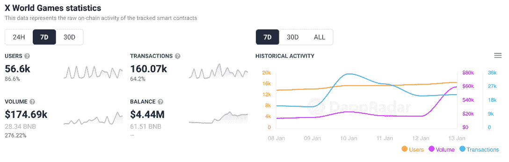
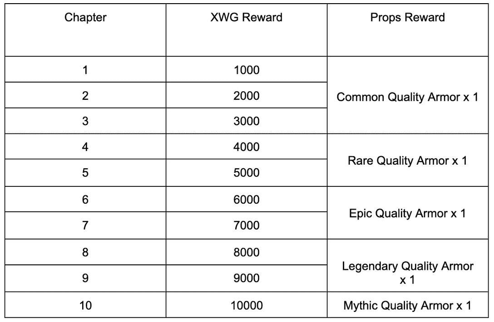
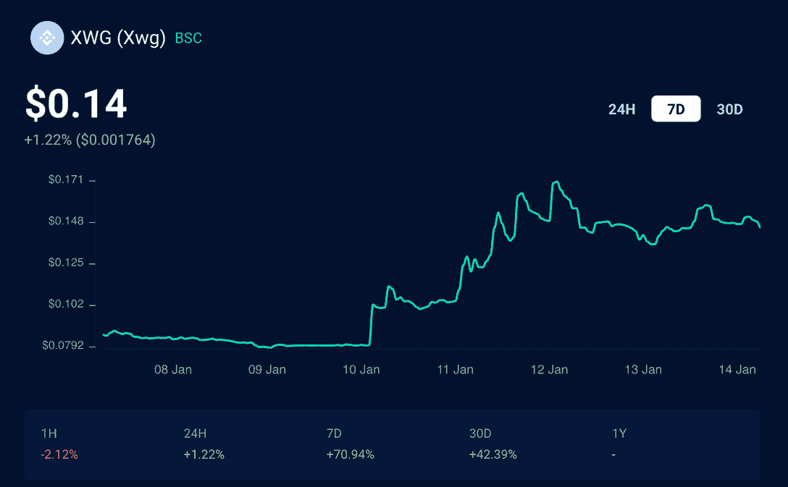
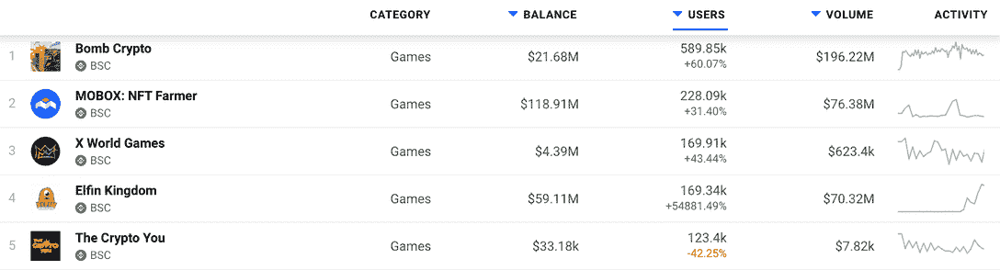
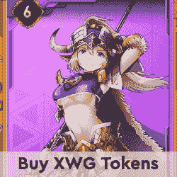

# 梦卡 2 将 X 世界游戏推入前 3

> 原文：<https://web.archive.org/web/https://dappradar.com/blog/dream-card-2-pushes-x-world-games-into-top-3>

## 三重惊喜赠品带来测试版测试者

币安智能连锁平台 X World Games 上已经流行的梦幻卡牌游戏的重装版本周为该平台带来了超过 86%的用户。新版本以 PvE 模式为特色，拥有新的英雄和 NFT，并于 1 月 13 日推出了 [**公测**](https://web.archive.org/web/20221206114219/http://bit.ly/3zTVWba) **和“三重惊喜赠品”**

随着游戏继续蓬勃发展，梦卡 2.0 的推出在本周引起了轰动。在过去的七天里，超过 56，000 个钱包连接到了 X 世界游戏，这是对新游戏的兴奋，测试奖励也增加了。随着越来越多的用户连接到 dapp，交易和交易量出现了上升。

[<picture></picture>](https://web.archive.org/web/20221206114219/https://dappradar.com/binance-smart-chain/games/x-world-games)

重要的是，梦卡 2.0 并不是取代梦卡。两个版本同时可用和运行，所有游戏资产在两个版本之间可互操作。梦想卡 1.0 玩家可以申请成为 2.0 测试员，并有机会参与赠品，申请将在 12 月的第一周开放。

## 三重惊喜赠品

2022 年 1 月 13 日-19 日，前 5000 名登录梦想卡 2.0，同时钱包地址中有 100 个 XWG 以上的玩家，将获得一件拥有标准品质护甲的梦想卡 V2 物品。

此外,“发现并赚取”机制将是一项长期活动，奖励发现并报告 bug 的玩家。第一期于 2022 年 1 月 13 日-19 日举行。玩家可以通过加入梦卡 2.0 beta 测试，提交任何 bug 或改进建议，分享 XWG 奖励。奖励是根据 XWG 团队确定的 bug 的严重性或提议的质量来分配的。

测试者面临的最后一个挑战叫做“第一滴血”。玩家竞争成为第一章 boss 杀手赢得奖励。2022 年 1 月 13 日-19 日，梦卡 2.0 中第一个击败各章节 boss(第一个完成)的玩家，将获得 XWG 和特殊装备奖励。你可以在这里找到全部细节[。](https://web.archive.org/web/20221206114219/https://docs.google.com/document/d/1U6Lrn7NT5XXcYmbFL28bxO0kH22I62awinJ0qc8kdow/edit)

[X World Games 原生 XWG token](https://web.archive.org/web/20221206114219/https://dappradar.com/binance-smart-chain/games/x-world-games) 也有不错的一周，在撰写本文时上涨超过 70%，至 0.14 美元。如前所述，那些想要参加挑战并获得奖励的人需要在连接时在钱包里放 100 XWG。这可能在上周刺激了一些 XWG 的购买。

## 有什么新鲜事？

梦卡 2.0 [的特点是全新的 PVE 模式](https://web.archive.org/web/20221206114219/https://twitter.com/xwg_games/status/1481780795517906946)，不同于梦卡的 PVP 模式。梦卡 2.0 提供了十个等级，还增加了 22 个新英雄，在梦卡 1.0 中已经增加了 40 个英雄。该团队向玩家承诺，通过引入新的 NFT 资产，可以为持有者提供与游戏内交易量相关的持续收入，从而增强游戏性和盈利机制。最新版本还为升级的用户生成了一张彩票，有机会赢得奖金池的一部分。

X World Games 也在本周[推出了 DAO 平台](https://web.archive.org/web/20221206114219/https://community.xwg.games/)，允许玩家和 XWG 令牌持有者在平台上参与决策。

## 新来的孩子

尽管只有 7 个月大，X 世界游戏和梦想卡已经成为 BSC 上最受欢迎的游戏之一。在过去的 30 天里，这款“玩即赚”纸牌游戏的用户活跃度提高了 43%以上，活跃钱包数量超过 169，000 个。使其成为币安智能链上第三受欢迎的游戏 dapp。

要了解更多关于 X 世界游戏及其原生令牌 XWG 的信息，请查看下面的链接。如果你已经是 X 世界游戏生态系统的一部分，并且拥有自己的 XWG，你可以使用 DappRadar Portfolio 轻松查看你的持有量。

[<picture></picture>](https://web.archive.org/web/20221206114219/https://dappradar.com/rankings/protocol/binance-smart-chain/category/games)[<picture></picture>](https://web.archive.org/web/20221206114219/https://dappradar.com/binance-smart-chain/games/x-world-games)[<picture></picture>](https://web.archive.org/web/20221206114219/https://dappradar.com/hub/swap/bsc/BNB/XWG?to=0x6b23c89196deb721e6fd9726e6c76e4810a464bc)

***以上不构成投资建议。此处给出的信息仅供参考。请行使尽职调查，做你的研究。作者持有 ETH、BTC、AGIX、HEX、LINK、GRT、CRO、OMI、不变 X、ENS、GALA、AVASTR、GMEE、CUBE、RADAR、FLOW、FTM、BNB、SPS、WRLD、ATOM 和 ADA。***