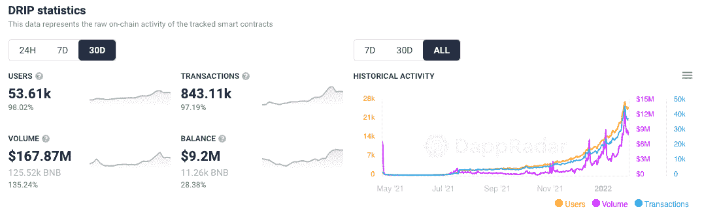
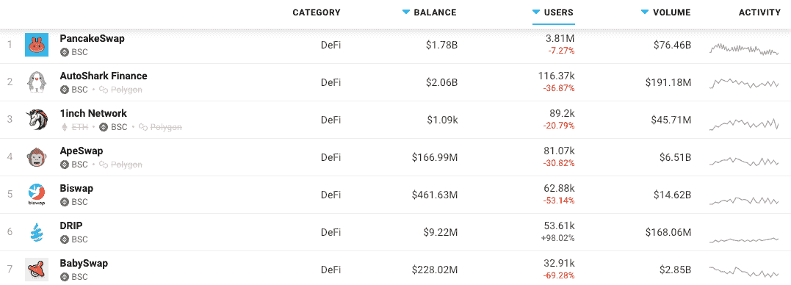
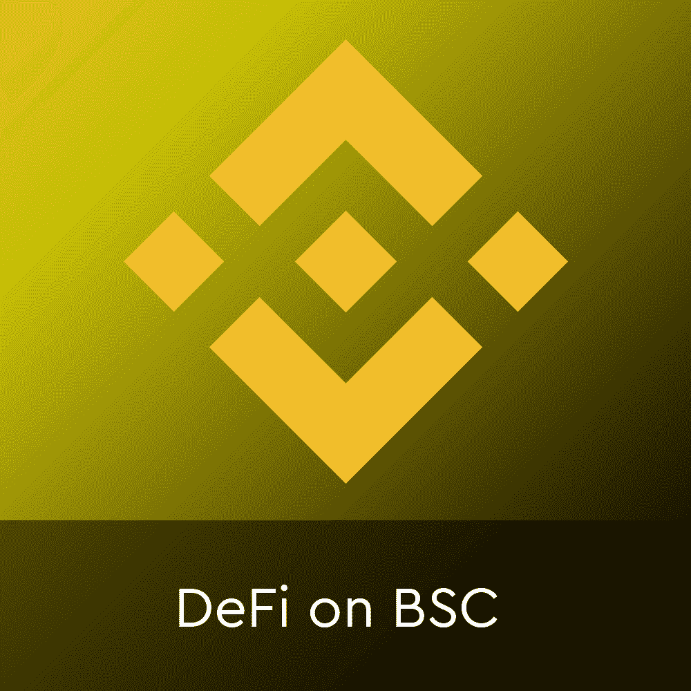
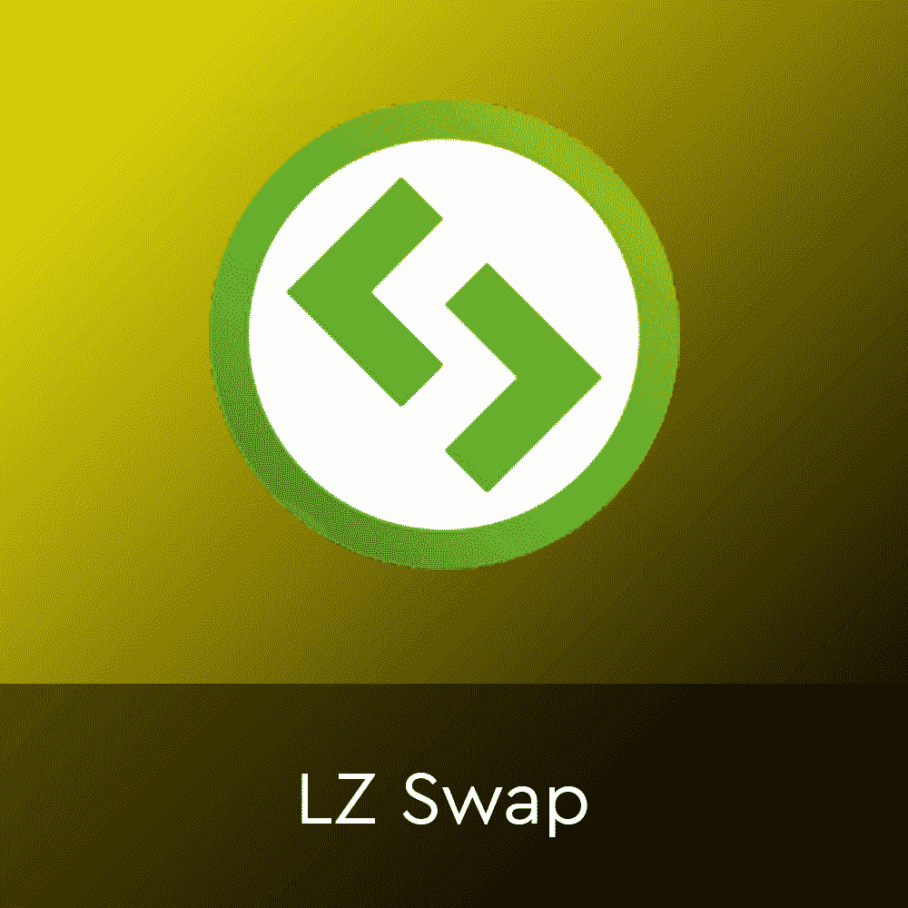
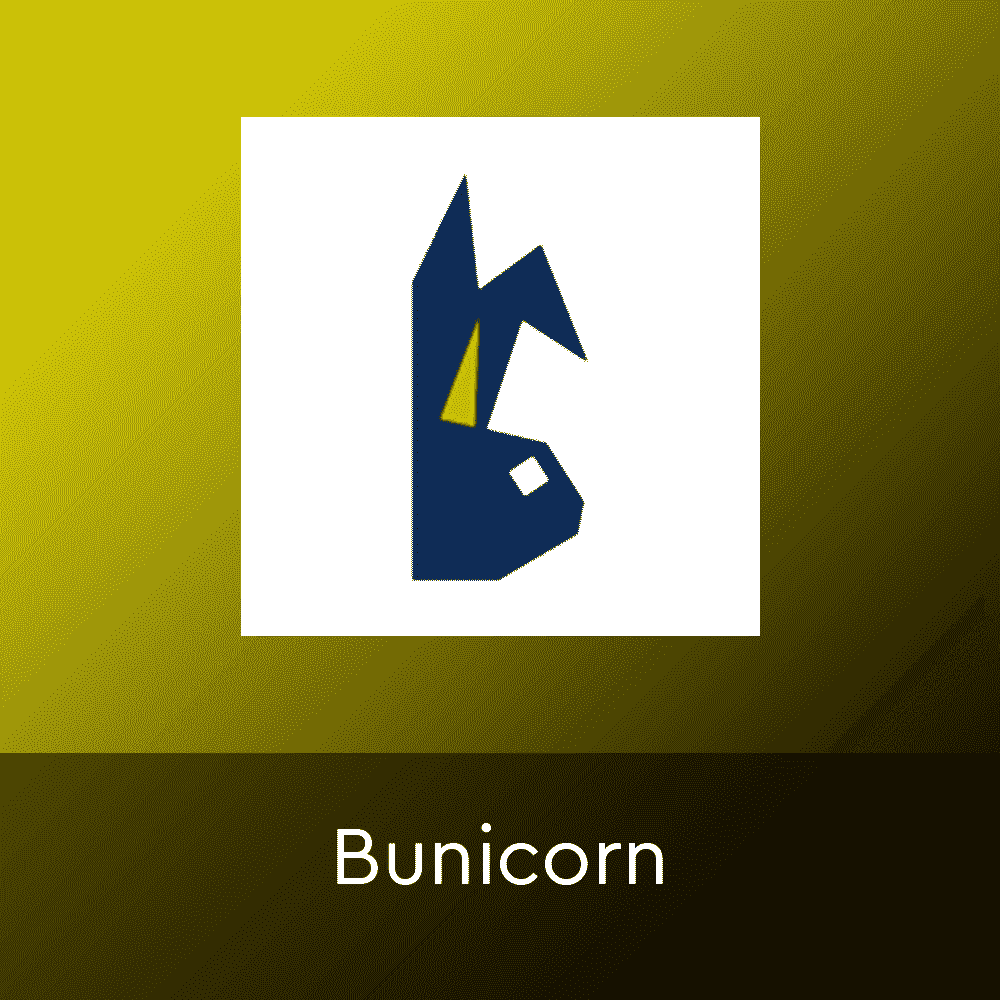
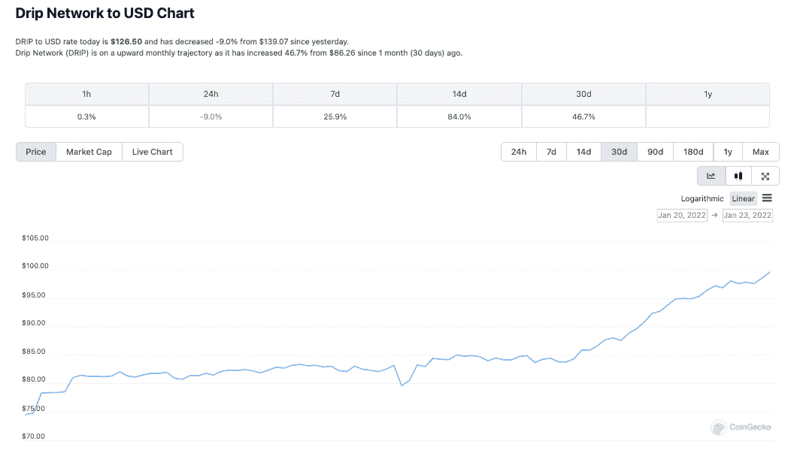

# 在 BSC 巨头的阴影下，滴滴 DeFi 用户群翻倍

> 原文：<https://web.archive.org/web/https://dappradar.com/blog/drip-defi-doubles-user-base-in-shadow-of-bsc-giants>

## 滴滴给出的 365%投资回报率来自税收，而不是通货膨胀

**滴滴网络是币安智能链上的一个 DeFi 协议，在 BSC 上的其他分散式金融 dapps 遭受打击之际，它的兴趣持续增长，用户活动激增。虽然 BSC 上的大多数 DeFi dapps 的活跃用户逐月大幅下降，但滴滴网络的用户群却翻了一番。**

在过去的 30 天里，[滴滴吸引了超过 98%的用户钱包](https://web.archive.org/web/20221208054750/https://dappradar.com/binance-smart-chain/defi/drip)到其平台，使用户数量超过 53，000。这些钱包推动了超过 843，000 笔交易，产生了超过 1.67 亿美元的交易量。有趣的是，这使得过去 30 天滴滴上的平均交易价值约为 200 美元。

此外，当其他在 BSC 上建立的 [DeFi 协议(如 PancakeSwap、ApeSwap 和 1inch)看到连接到其平台的钱包减少时，滴滴增长了近 100%，与 BSC 的趋势相反。](https://web.archive.org/web/20221208054750/https://dappradar.com/rankings/protocol/binance-smart-chain/category/defi)

[<picture></picture>](https://web.archive.org/web/20221208054750/https://dappradar.com/rankings/protocol/binance-smart-chain/category/defi)

## 滴滴是什么？

滴滴是币安智能链上的 [DeFi 协议，承诺用户每日被动收入。](https://web.archive.org/web/20221208054750/https://dappradar.com/binance-smart-chain/defi/drip)

增长的核心原因是，滴滴不像标准的金融应用，而是滴滴网络承诺的被动收入，允许用户每天获得 1%，或每年 365%。该平台从其他用户的初始存款中为奖励提供资金。

[滴滴是一种可下注的加密货币](https://web.archive.org/web/20221208054750/https://dappradar.com/binance-smart-chain/defi/drip),具有稀缺性凭证和零通胀，本质上允许所有者通过两种不同的选择获得资金:

#### **1。水龙头**

水龙头是一种通过滴滴代币赚取的低风险方式，其操作类似于高收益的存单，每天支付 1%的投资回报。在这里，用户可以将他们的收入提取到外部钱包，并通过首次存款的推荐直接赚取额外收入。再加上间接的，通过推荐建立的网络，可以运行 15 级深。

#### 2.蓄水池

此外，还有水库，一个社区可以提供流动性或下降的手段。这意味着你通过存入 BNB 来资助滴滴，这就变成了一种被称为滴滴的代币。Drop 是一种 BEP-20 代币，具有稳定、不波动的价值，是 Drop 本地流动性池代币。提供流动资金可以让你从流动资金池的典型费用中获得回报，并提高你的点滴股份的价格，但要知道，无论何时存入或取出存款，都要征收 10%的可持续性税。

说白了，一个用户可以往滴滴网络里存一定量的滴滴。例如 10，000 美元。投资者拿不回这 1 万美元。而是每天在滴滴赚回 1%。收回初始投资大约需要三个半月的时间。之后，它生产的任何东西都属于投资者。

[<picture></picture>](https://web.archive.org/web/20221208054750/https://dappradar.com/rankings/protocol/binance-smart-chain/category/exchanges)[<picture></picture>](https://web.archive.org/web/20221208054750/https://dappradar.com/binance-smart-chain/exchanges/lz-swap)[<picture></picture>](https://web.archive.org/web/20221208054750/https://dappradar.com/binance-smart-chain/exchanges/bunicorn)

## 这个项目怎么能一直给人发工资？

滴滴奖励是从所有交易的 10%的税中支付的。这是正确的，当投入最初的 10，000 美元时，其中的 10%进入税池，所以你最终只投资了 9000 美元。起初，这听起来不太妙，但每个人都要为每笔交易缴税。投资者每天就是这样得到报酬的。

总之，你投入 10，000 美元(结果是 9000 美元)，在滴滴，你每天会得到 1%的回报。

这种机制造成了一种情况，即由于存款和取款的税收，你每天只能提取 1%的现金，以及鲸税，滴滴拥有相对的价格稳定性。这是设计的一部分——没有千万富翁操纵市值。

我们可以看看最近 BTC 价格的下跌来证明这一点。2022 年 1 月 22 日，BTC 一度跌破 34000 美元。但是滴滴不变，开始增加。在过去的 30 天里增加了超过 46%。

一个担忧是，那些可能选择重复复利而从不获利的人可能会承担更大的风险。也就是说，因为在这种情况下，用户可以重复复利一年，但永远不会获利。那么滴滴的价格可能会暴跌，这些投资者将一无所有。

## 总结中的点滴

对于那些对风险有更大胃口的人来说，滴滴代表了一个独特的机会。最终，当存款达到 365%时，钱包就完蛋了。因此，用户可以投资 1000 美元，而不是复利，最终获得 3650 美元减去任何税费。有兴趣了解更多关于滴滴的信息的人可以阅读白皮书[这里](https://web.archive.org/web/20221208054750/https://drip.community/docs/DRIP_LIGHTPAPER_v0.8_Lit_Version.pdf)。

 NewsletterUnsubscribe at any time. [T&Cs](https://web.archive.org/web/20221208054750/https://dappradar.com/terms) and [Privacy Policy](https://web.archive.org/web/20221208054750/https://dappradar.com/privacy-policy)

*以上不构成投资建议。此处给出的信息仅供参考。请行使尽职调查，做你的研究。作者持有 ETH、BTC、AGIX、HEX、LINK、GRT、CRO、OMI、不可变 X、GALA、AVASTR、GMEE、CUBE、RADAR、FLOW、FTM、BNB、SPS、WRLD、ATOM 和 ADA。*