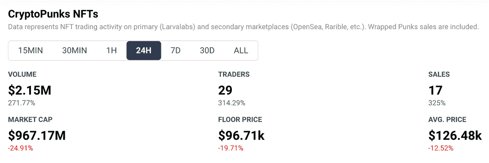
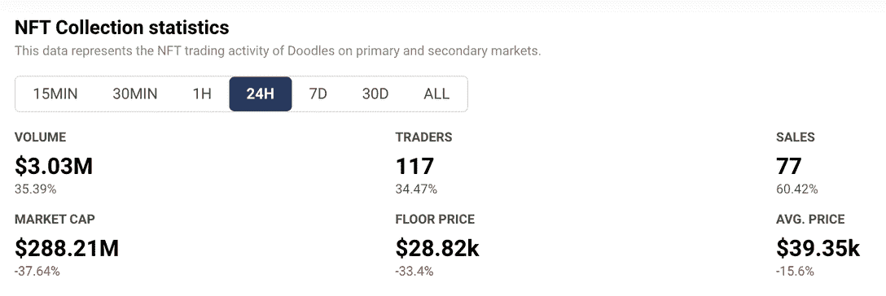
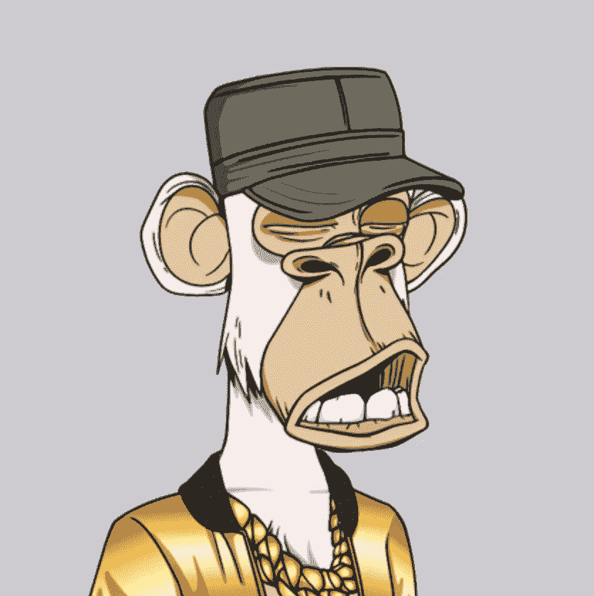
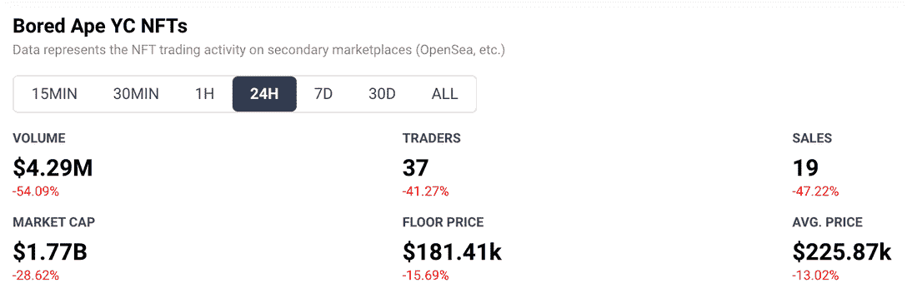
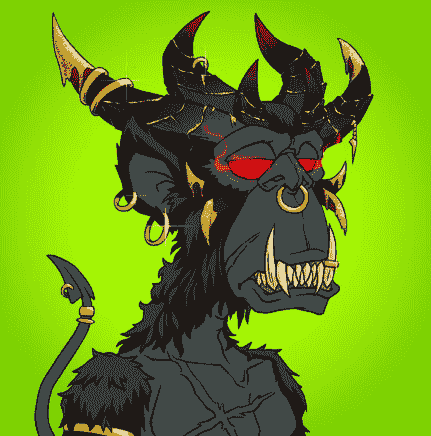
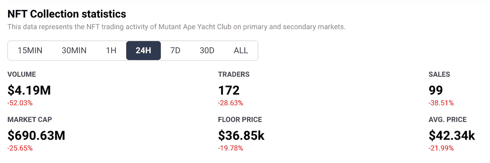
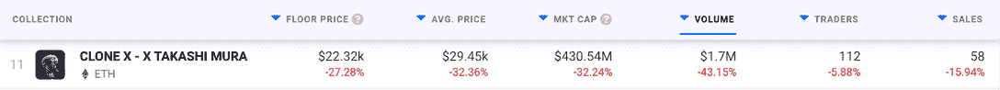

# 价格的下降使得买家涌向朋克、猿和涂鸦

> 原文：<https://web.archive.org/web/https://dappradar.com/blog/dropping-eth-price-has-buyers-flocking-to-punks-ape-and-doodles>

## 但他们是在熊市中买入还是对冲？

ETH 的价格持续下跌，但 NFT 的爱好者们看到了蓝筹股收藏的价值，因为每个人都在寻找渡过难关的方法。过去的 24 小时对大多数拥有 crypto 和 NFT 股份的人来说并不好过。但是如果你做了调查，看了数字，就有机会减少你的损失。

**总结**

*   ***尽管本周加密和 NFT 市场出现[动荡](https://web.archive.org/web/20221007101314/https://dappradar.com/blog/terra-usd-loses-its-dollar-peg-as-whale-dumps-285-million)，但一些收藏品相对于 ETH 价格的下跌保持了它们的价值。[密码朋克](https://web.archive.org/web/20221007101314/https://dappradar.com/ethereum/collectibles/cryptopunks)、[涂鸦](https://web.archive.org/web/20221007101314/https://dappradar.com/ethereum/collectibles/doodles)和[无聊猿](https://web.archive.org/web/20221007101314/https://dappradar.com/ethereum/collectibles/bored-ape-yacht-club)的下跌幅度都小于[以太](https://web.archive.org/web/20221007101314/https://dappradar.com/hub/token/eth/ETH)，以太币。***
*   ***[变异猿](https://web.archive.org/web/20221007101314/https://dappradar.com/ethereum/collectibles/mutant-ape-yacht-club)[克隆 X](https://web.archive.org/web/20221007101314/https://dappradar.com/ethereum/collectibles/clone-x-x-takashi-murakami) 和[志那都红豆](https://web.archive.org/web/20221007101314/https://dappradar.com/ethereum/collectibles/azuki)在过去一天的跌幅超过了 ETH 的 20%，但这种情况随时可能发生变化。***
*   ***此刻事情变化非常快，因此使用*** [***可信数据源***](https://web.archive.org/web/20221007101314/https://dappradar.com/rankings) ***并仔细查看哪些***[***NFTs***](https://web.archive.org/web/20221007101314/https://dappradar.com/nft)***和*** [***集合提供最佳价值***](https://web.archive.org/web/20221007101314/https://dappradar.com/nft/collections) ***非常重要***

本周，对于密码爱好者和 NFT 收藏家来说，赚钱不是首要任务。我们的短期目标是减少损失，使我们不会损失太多。中期目标是，当情况好转，熊市成为过去时，让自己处于有利位置。

过去 24 小时内，ETH 的美元价值下跌了 20%。全能的 [BTC](https://web.archive.org/web/20221007101314/https://dappradar.com/hub/token/eth/WBTC?from=0x2260fac5e5542a773aa44fbcfedf7c193bc2c599) 同期下跌 12%。 [Terra](https://web.archive.org/web/20221007101314/https://dappradar.com/hub/token/eth/UST?from=0xa47c8bf37f92abed4a126bda807a7b7498661acd) 的挣扎[遍布新闻](https://web.archive.org/web/20221007101314/https://dappradar.com/blog/terra-ust-stablecoin-hits-0-67-low-as-dollar-peg-slips-further)，该平台的 LUNA token 一天之内暴跌了惊人的 97%。在撰写本文时，该指数处于 0.03 美元的低位，本周初为 65 美元。

在坏消息中，有人想方设法把损失降到最低，有人在蓝筹股 NFT 收藏中找到了安慰。这些股票也遭受了美元价格的下跌，考虑到本周的动荡，这并不奇怪。但它们的跌幅没有加密货币那么大。由于这个原因，它们可以作为比下落的硬币更安全的价值储存手段。

## 密码朋克

[CryptoPunk #7523](https://web.archive.org/web/20221007101314/https://dappradar.com/hub/assets/eth/0xb47e3cd837ddf8e4c57f05d70ab865de6e193bbb/7523)

*   征集规模: **1 万**
*   平均销售价格 24 小时下跌: **12.5%**
*   当前平均售价: **$126，480**
*   过去 24 小时内的交易: **29**
*   过去 24 小时的交易活动:**增加 314.3%**
*   [**链接到收藏**](https://web.archive.org/web/20221007101314/https://dappradar.com/ethereum/collectibles/cryptopunks)

也许是蓝筹股中最安全的，[crypto 朋克](https://web.archive.org/web/20221007101314/https://dappradar.com/ethereum/collectibles/cryptopunks)是由以太坊上的幼虫实验室于 2017 年 6 月推出的。2022 年 3 月 11 日，[宇迦实验室收购了 CryptoPunks](https://web.archive.org/web/20221007101314/https://dappradar.com/blog/yuga-labs-takeover-pushes-cryptopunk-meebit-sales-1000/) ，并立即将 NFT 的全部商业权利交给其持有者。

人们免费铸造密码朋克，只需支付当时很少的以太坊汽油费。从那以后，价格当然上涨了。Shalom Meckenzie 以 1175 万美元的价格在苏富比购买了 7523 号 CryptoPunk，成为最昂贵的一件作品。

密码朋克之所以如此昂贵，完全是因为稀有和传统。这是一个真正的 OG 集合，甚至早于 ERC-721 令牌标准的实现。这意味着它是一个 NFT，甚至在 NFTs 开发出来之前就存在了。对于任何收藏家来说，持有朋克仍然是如此令人向往，即使在真正的熊市中，它们仍然可以保值。

[<picture></picture>](https://web.archive.org/web/20221007101314/https://dappradar.com/ethereum/collectibles/cryptopunks)

[DappRadar’s on-chain analytics for CryptoPunks](https://web.archive.org/web/20221007101314/https://dappradar.com/ethereum/collectibles/cryptopunks)

## 涂鸦

[Doodle #5337](https://web.archive.org/web/20221007101314/https://dappradar.com/hub/assets/eth/0x8a90cab2b38dba80c64b7734e58ee1db38b8992e/5337)

*   征集规模: **1 万**
*   平均销售价格 24 小时下跌: **15.6%**
*   当前平均销售价格: **$39，350**
*   过去 24 小时的交易: **117**
*   过去 24 小时的交易活动:**增加 34.5%**
*   [**链接到收藏**](https://web.archive.org/web/20221007101314/https://dappradar.com/ethereum/collectibles/doodles)

和加密朋克一样，[涂鸦](https://web.archive.org/web/20221007101314/https://dappradar.com/ethereum/collectibles/doodles)的平均销售价格已经下降。与 CryptoPunks 类似，Doodle NFTs 的平均销售价格在过去 24 小时内没有像 ETH 那样下降。这意味着，如果你在 24 小时前买了一张涂鸦，你损失的钱会比你持有加密货币并看着它贬值少。

过去七天也是如此。过去一周，涂鸦 NFT 的美元价值下跌了 15.6%，而同期 ETH 下跌了 33.4%。

Doodles 于 2021 年 10 月 17 日推出，因此它们不是密码朋克或密码猫咪的传奇系列。但这个项目确实来自参与后者的三位艺术家，他们从一开始就希望赋予涂鸦社区力量。在这个困难时期，正是这种来自忠实粉丝的承诺帮助保持了涂鸦的价值。

[<picture></picture>](https://web.archive.org/web/20221007101314/https://dappradar.com/ethereum/collectibles/doodles)

[DappRadar’s on-chain analytics for Doodles](https://web.archive.org/web/20221007101314/https://dappradar.com/ethereum/collectibles/doodles)

## 无聊的类人猿

[Eminem’s Bored Ape #9055](https://web.archive.org/web/20221007101314/https://dappradar.com/hub/assets/eth/0xbc4ca0eda7647a8ab7c2061c2e118a18a936f13d/9055)

*   征集规模: **1 万**
*   平均销售价格 24 小时下降: **13%**
*   当前平均售价: **$225，870**
*   过去 24 小时内的交易: **37**
*   过去 24 小时的交易活动:**减少 41.3%**
*   [**链接到收藏**](https://web.archive.org/web/20221007101314/https://dappradar.com/ethereum/collectibles/bored-ape-yacht-club)

尽管 Bored Apes 游艇俱乐部项目的所有指标都在下降，但在过去 24 小时内，NFTs 的平均销售价格没有 ETH 的价格下降得那么多。无聊的猿类可能是区块链社区之外最著名的 NFT，所以难怪它们相对于 ETH 下降保持了它们的价值。

Bored Apes 于 2021 年 4 月 23 日推出，拥有一长串名人持有人。史努比狗狗，[吉米·法伦](https://web.archive.org/web/20221007101314/https://dappradar.com/hub/wallet/eth/0x0394451c1238cec1e825229e692aa9e428c107d8/nfts)，[贾斯汀比伯](https://web.archive.org/web/20221007101314/https://dappradar.com/hub/wallet/eth/0xe21dc18513e3e68a52f9fcdacfd56948d43a11c6/nfts)，[帕丽斯希尔顿](https://web.archive.org/web/20221007101314/https://dappradar.com/hub/wallet/eth/0xb6aa5a1aa37a4195725cdf1576dc741d359b56bd)，[麦当娜](https://web.archive.org/web/20221007101314/https://dappradar.com/hub/wallet/eth/0x8ea95bdc5cdddc0b7ebad841f0c1f2ca6168b6a9/nfts)，[内马尔](https://web.archive.org/web/20221007101314/https://dappradar.com/hub/wallet/eth/0xc4505db8cc490767fa6f4b6f0f2bdd668b357a5d)，[阿姆](https://web.archive.org/web/20221007101314/https://dappradar.com/hub/wallet/eth/0x79f261f483b7cef4f995c1f8a0f46f88450423e3)和[史蒂夫·青木](https://web.archive.org/web/20221007101314/https://dappradar.com/hub/wallet/eth/0xe4bbcbff51e61d0d95fcc5016609ac8354b177c4/nfts)是一些钱包里有一只猩猩的人。尽管平均售价下降了 13%，最低价格为 181，410 美元，但大多数人仍然买不起无聊的类人猿。对于大多数人来说，情况需要变得更糟才能买得起。

有趣的是，无聊猿类的交易量下降了 41.3%，这表明该群体目前处于停滞状态。这可能是因为交易量和销售价格在另一方土地造币厂之前都很高，而现在人们不愿意以巨大的损失出售他们的 NFT。未来几周，我们将密切关注无聊的 Ape 交易活动，看看事情会如何发展。

[<picture></picture>](https://web.archive.org/web/20221007101314/https://dappradar.com/ethereum/collectibles/bored-ape-yacht-club)

[DappRadar’s on-chain analytics for Bored Apes](https://web.archive.org/web/20221007101314/https://dappradar.com/ethereum/collectibles/bored-ape-yacht-club)

## 一些相对于 ETH 已经失去价值的大型收藏

### 变异猿

[Mutant Ape #4849](https://web.archive.org/web/20221007101314/https://dappradar.com/hub/assets/eth/0x60e4d786628fea6478f785a6d7e704777c86a7c6/4849)

[突变猿](https://web.archive.org/web/20221007101314/https://dappradar.com/ethereum/collectibles/mutant-ape-yacht-club)NFT 的链上分析全面下降。平均售价略低于 [ETH](https://web.archive.org/web/20221007101314/https://dappradar.com/hub/token/eth/ETH) 价格的跌幅，相比 ETH 的 20%下降了 22%。20，000 系列是 Bored Ape 系列的一个分支，具有其兄弟姐妹的许多优点。

它有一个强大的社区，它有名人粉丝，它有很好的公关和营销。但它也不那么稀有，也不那么受欢迎。大概是这些原因，它的价值跌的更多，抛售的人也更多。在过去的 24 小时里，变异猿类发生了 172 起交易，而无聊猿类只有 37 起。

[<picture></picture>](https://web.archive.org/web/20221007101314/https://dappradar.com/ethereum/collectibles/mutant-ape-yacht-club)

[DappRadar’s on-chain analytics for Mutant Apes](https://web.archive.org/web/20221007101314/https://dappradar.com/ethereum/collectibles/mutant-ape-yacht-club)

### 克隆 X

[Clone X #12675](https://web.archive.org/web/20221007101314/https://dappradar.com/hub/assets/eth/0x49cf6f5d44e70224e2e23fdcdd2c053f30ada28b/8316)

在过去的 24 小时内，克隆 X NFT 的平均销售价格下降了 32.4%。这代表了同期比 ETH 大得多的下降，是较大集合中最大的下降之一。

克隆 X 项目由 2 万个下一代虚拟角色组成，由设计师 Takashi Murkami 和 [RTFKT](https://web.archive.org/web/20221007101314/https://dappradar.com/blog/new-rtfkt-nft-drops-boost-trading-volume-55) 工作室合作完成。在每一个环比指标上，集合都下降了。克隆 X 的整体价值下降了 32.2%，至 4.3054 亿美元，这意味着 24 小时内的美元价值损失为 2.0579 亿美元。

[<picture></picture>](https://web.archive.org/web/20221007101314/https://dappradar.com/nft/collections)

[Clone X in DappRadar’s Top NFT Collections](https://web.archive.org/web/20221007101314/https://dappradar.com/nft/collections)

### 志那都红豆

[Azuki #386](https://web.archive.org/web/20221007101314/https://dappradar.com/hub/assets/eth/0xed5af388653567af2f388e6224dc7c4b3241c544/386)

我们还应该提到志那都红豆 NFT 系列。过去 24 小时内，平均售价下降了 26.9%，但底价却上涨了 10.6%。由于底价和平均售价之间的差异很小，看起来大多数人都在努力摆脱他们的志那都红豆。似乎有些人扫地是希望他们的价值会及时上升。

对志那都红豆来说不幸的是，还有其他原因导致其非金融资产价值下降，你可以在这里阅读。

[<picture></picture>](https://web.archive.org/web/20221007101314/https://dappradar.com/nft/collections)

[Azuki in DappRadar’s Top NFT Collections](https://web.archive.org/web/20221007101314/https://dappradar.com/nft/collections)

## 艰难时期的明智策略

我们不确定收藏者是在购买蓝筹股 NFT 以对冲下跌的加密价值，还是在它们暂时变得更便宜时出手。这可能是两者的混合，但这似乎是区块链社区最有经验的投资者的明智之举，以减少他们的损失，安然度过这场风暴。

在 DappRadar，我们将密切关注我们的 [NFT 排名和分析页面](https://web.archive.org/web/20221007101314/https://dappradar.com/nft)，看看哪些收藏能够幸存下来。我们还将关注加密货币的[价格，并希望其中一些红色数字会变成绿色。](https://web.archive.org/web/20221007101314/https://dappradar.com/hub/tokens/ethereum/all/1)

请继续关注我们的[博客](https://web.archive.org/web/20221007101314/https://dappradar.com/blog/)，我们将为您带来最新消息，并在世界协调时每周四下午 4 点关注我们的播客，我们将讨论从 NFT 项目到 DeFi 和元宇宙的一切。

 NewsletterUnsubscribe at any time. [T&Cs](https://web.archive.org/web/20221007101314/https://dappradar.com/terms) and [Privacy Policy](https://web.archive.org/web/20221007101314/https://dappradar.com/privacy-policy)