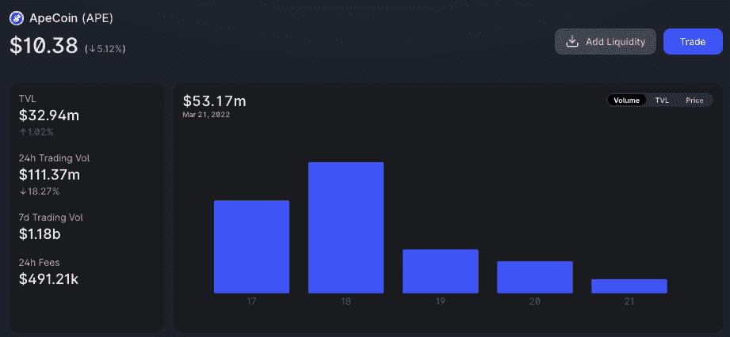
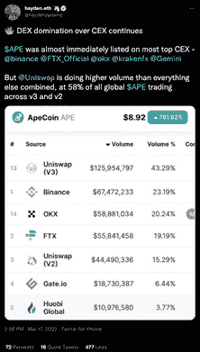
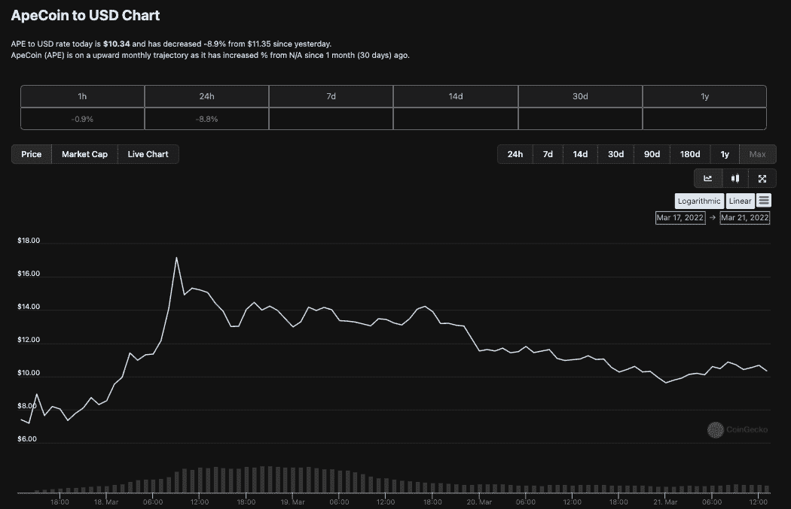

# 早期采用者在 DEX 上交易 APE，但是 APE 在 CEX 上有很大的吸引力

> 原文：<https://web.archive.org/web/https://dappradar.com/blog/early-adopters-traded-ape-on-dex-but-ape-finds-mass-appeal-on-cex>

## Uniswap 展示其金属时，分散交易大放异彩

上周无聊的 APE 游艇俱乐部 APE [空投](/web/20221001233641/https://dappradar.com/blog/bored-ape-yacht-club-launch-apecoin-with-ape-token-airdrop/)在密码世界引起了不小的轰动，成千上万的 NFT 持有者收集了 Ape 代币。然而，尽管 APE 立即在 FTX 和币安等受欢迎的集中交易所上市，但在最初几天，大多数 APE 通过分散交易所 dapp Uniswap 进行交易。

一个趋势持续了几天，直到更多的人抓住 APE 令牌及其潜力，并被吸引到币安和比特币基地等交易所进行交易。

前两天，Uniswap 处理了近 8.5 亿美元的 APE 代币交易。这一数字在此前几天大幅下降，3 月 19 日降至 1.65 亿美元，3 月 20 日降至 1.2 亿美元。[在撰写本文时，仅有 5300 万美元被交易。](https://web.archive.org/web/20221001233641/https://info.uniswap.org/#/tokens/0x4d224452801aced8b2f0aebe155379bb5d594381)

3 月 17 日，在 APE 空投和交易开始几个小时后，Uniswap 创始人海顿·亚当斯(Haydn Adams)的截图清楚地显示了这种情况。Uniswap 以超过 1.25 亿美元的交易量高居交易量排行榜榜首。几乎是币安中央交易所的两倍。

这种趋势可以解释为早期的代币交易将几乎被那些持有 BAYC NFTs 的人所主导。因此，对于这位作者来说，Uniswap 是 APE 交易量的早期捐助者是有道理的，原因有几个。

## NFT 收藏家比交易者更精明

BAYC 是一个优质的 NFT 系列，受到新一波投资者的欢迎，这些投资者了解区块链钱包和分散的交易所。可以说，NFT 持有者比其他任何人都更容易接受 dex。

集中式 exchange 用户往往更关心安全性，可能不太擅长使用 Metamask 或其他 Web3 钱包工具。然而，所有的信号都是在上周 APE 在 48 小时内从 7 美元攀升至 17 美元时触发的。APE 在 CEXs 上的出现产生了滚雪球效应。

查看 3 月 21 日 CoinMarketCap 上的 APE 交易，我们看到分散交易所已经远远超过分散交易所交易，Uniswap V3 和 V2 仅占 4.6%，SushiSwap 仅占撰写时交易量的 0.06%。

以中国为中心的集中交易平台币安遥遥领先，APE/USDT 交易量超过 5.7 亿美元，APE/BUSD 交易量超过 9700 万美元。曼陀罗交易所也是一个受欢迎的 APE 集中交易所，在撰写本文时，其 APE/USDT 交易量已超过 5.72 亿美元。

这些最初的交易趋势表明，围绕 APE 的早期炒作始于空投索赔者在 dex 上出售和交换 APE，并随着价格的积极发展迅速泄露到更广泛的秘密领域。尽管如此，领先的分散化交易所 Uniswap 的初步表现显示了 dex 的真正力量，以及它们在某些交易员和 NFT 爱好者群体中的吸引力。此外，这是一个趋势，我们将继续跟踪。

## CEX 对德克斯

简而言之，[DEX 旨在提供](https://web.archive.org/web/20221001233641/https://dappradar.com/rankings/category/exchanges)更低的交易费用，让用户直接持有他们的资产，并避免一些监管负担。另一方面，它们面临补偿流动性提供者的成本。CEX 也有好处，主要是容易上车，平坦的坡道和坡道，以及中央集权的安全感。它们也有附加费用，但可以说它们隐藏在代币价格的差价中。

分散式交换机是 DeFi 的基础层，对于大多数网络来说，是网络健康的关键组成部分。没有代币，区块链就不能让它的用户交换代币或参与耕作或赚钱。他们在行业中的成长和发展对于大规模采用至关重要，在这个阶段看到如此出色的表现无疑是令人鼓舞的。

DEX's like [Sushi 正在以太坊](https://web.archive.org/web/20221001233641/https://twitter.com/SushiSwap/status/1505799218581192707)之外扩展，每天都在增加新的区块链兼容性和用户。寿司让用户可以在超过 10 个区块链的寿司上操作，并避免以太坊燃气费。随着这些发展继续展开，投资者可以更容易地与 dex 互动，它们将取代 cex，让真正分散的未来蓬勃发展。

 NewsletterUnsubscribe at any time. [T&Cs](https://web.archive.org/web/20221001233641/https://dappradar.com/terms) and [Privacy Policy](https://web.archive.org/web/20221001233641/https://dappradar.com/privacy-policy)

***以上不构成投资建议。此处给出的信息仅供参考。请行使尽职调查，做你的研究。作者持有多种加密货币的头寸，包括 BTC、瑞士法郎和雷达。***