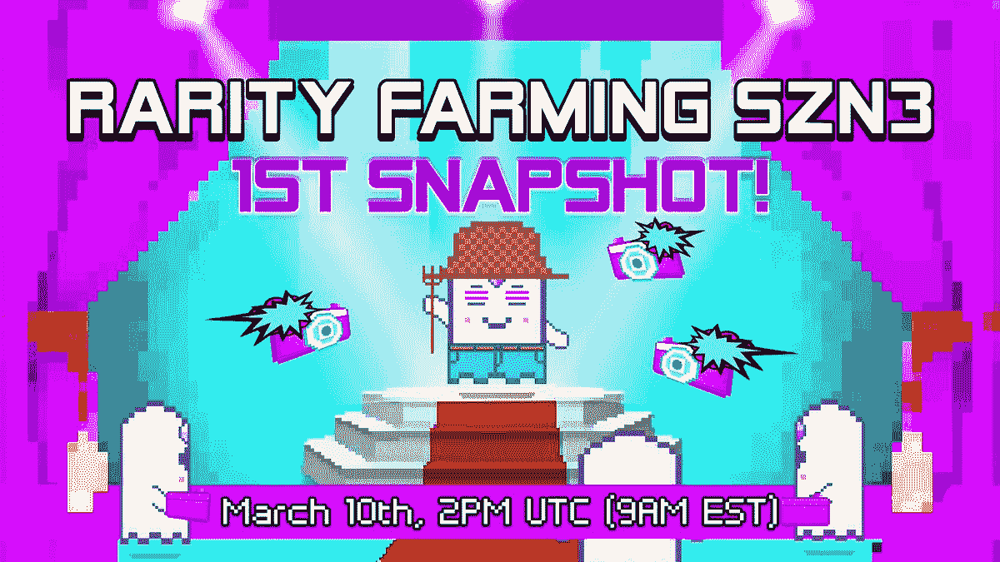
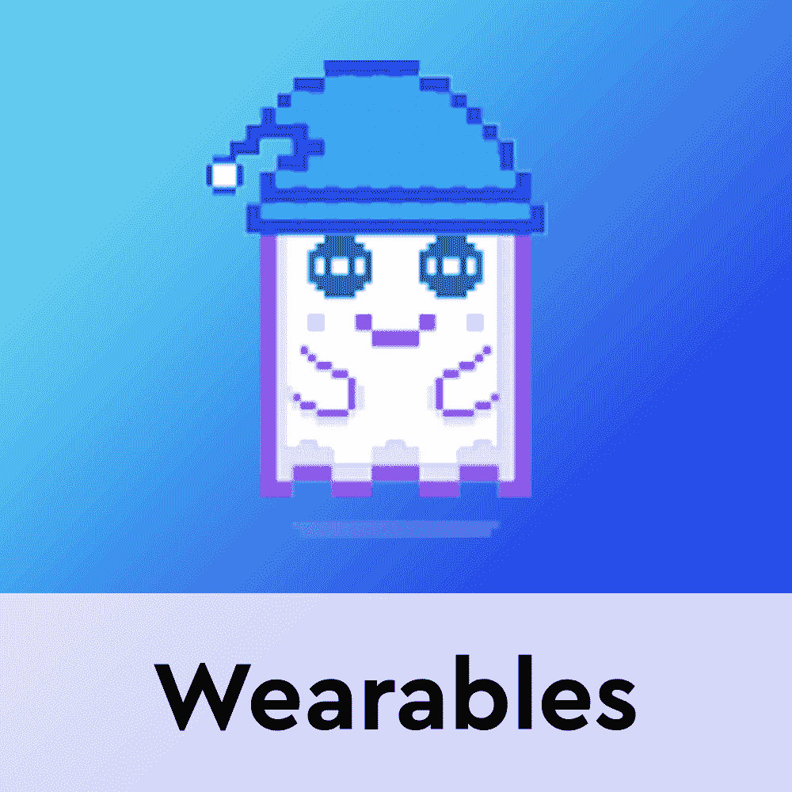

# 赚取 GHST 在 Aavegotchi 稀有农业季节 3

> 原文：<https://web.archive.org/web/https://dappradar.com/blog/earn-ghst-in-aavegotchi-rarity-farming-season-3>

## 总共价值 375，000 美元的 GHST 代币将空投给玩家

Aavegotchi 最近一直在宣布，因为他们今天早些时候推出了《稀有农场》第三季。farming event 将向每个排行榜类别的前 7，500 名玩家分发总价值 375，000 美元的 GHST 代币。

稀有农场是一种游戏赚钱机制，旨在奖励 Aavegotchi 生态系统中最积极的成员。这些活动奖励玩家使他们的 Gotchi NFTs 尽可能稀有。给它们配备可穿戴的 NFT，每天抚摸它们两次，并参加 XP 活动可以获得 GHST 代币奖励。重要的是，玩家可以获得三个排行榜类别的奖励:稀有度、亲缘度和经验值。

重要的是，奖励池在这三个类别中的分配并不平等。由于这是一个稀有农场活动，稀有排行榜将获得池中价值 375，000 美元的 GHST 代币的 70%。亲属获奖者将分享 20%的奖金，而经验丰富的领导者将获得 10%的奖励。

随着《稀有农场》第三季于 3 月 10 日开播，Aavegotchi 社区开始兴奋起来。稀有农场是从你的 Aavegotchi NFTs 中获得被动收入的方法之一。想要参加活动的玩家需要穿上他们最好的可穿戴设备。令人印象深刻的是，Aavegotchi 团队并没有仅仅停留在宣布稀有养殖上。事实上，[昨天](https://web.archive.org/web/20221006045522/https://dappradar.com/blog/aavegotchi-launches-gotchiverse-on-march-31)发布了一个更大的更新，发布了 got chiverse——即将推出的 Aavegotchi 虚拟世界。

## Aavegotchi 宇宙膨胀

Aavegotchi 已经组建了区块链游戏领域最强大的社区之一。为了更好地迎合这个社区的期望，Aavegotchi 团队已经[宣布在 3 月 31 日](https://web.archive.org/web/20221006045522/https://dappradar.com/blog/aavegotchi-launches-gotchiverse-on-march-31)推出 Gotchiverse。

即将到来的虚拟世界将成为所有 Aavegotchi 粉丝的统一场所。更重要的是，它将为玩家带来新的游戏赚钱机会。结合稀有农业活动第三季的推出，Aavegotchi 正在稳步推进其社区的多种游戏赚取机制。

[https://web.archive.org/web/20221006045522if_/https://www.youtube.com/embed/PtgZT-dVERI?start=1&feature=oembed](https://web.archive.org/web/20221006045522if_/https://www.youtube.com/embed/PtgZT-dVERI?start=1&feature=oembed)

Gotchiverse 将为玩家提供新的游戏，拥有土地的机会，以及与元宇宙同龄人自由交流的机会。这也将是一个展示你的 Gotchis 和稀有的可穿戴 NFT 的好方法，你可能已经收集了这些物品，以便在稀有农业活动中竞争。

随着更多玩家的加入，DappRadar 将继续监测 Aavegotchi 生态系统，并体验它提供的游戏赚取功能。如果你想了解更多关于 Aavegtochi 的知识，请查看下面有用的链接。此外，你可以在 Twitter 上关注 DappRadar，首先了解最新的 NFT 和区块链博彩新闻。

[<picture></picture>](https://web.archive.org/web/20221006045522/https://dappradar.com/polygon/games/aavegotchi)[<picture></picture>](https://web.archive.org/web/20221006045522/https://dappradar.com/hub/token/polygon/GHST/MATIC?from=0x385eeac5cb85a38a9a07a70c73e0a3271cfb54a7)[<picture></picture>](https://web.archive.org/web/20221006045522/https://dappradar.com/blog/aavegotchi-to-launch-new-set-of-defi-nft-wearables/) NewsletterUnsubscribe at any time. [T&Cs](https://web.archive.org/web/20221006045522/https://dappradar.com/terms) and [Privacy Policy](https://web.archive.org/web/20221006045522/https://dappradar.com/privacy-policy)