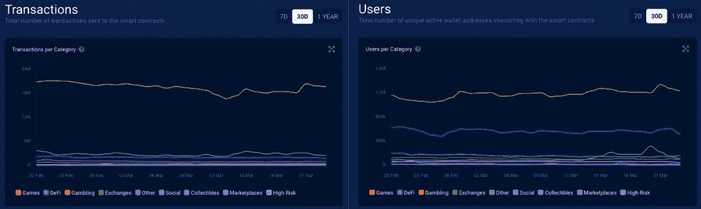

# Edensol GameFi 集成了 Secretum 消息和交易 Dapp

> 原文：<https://web.archive.org/web/https://dappradar.com/blog/edensol-gamefi-integrates-secretum-messaging-and-trading-dapp>

## Edensol 和 Secretum 联手提供无缝的元宇宙体验

下一代 GameFi 项目 Edensol 集成了 Secretum messaging dapp，为两个社区的用户提供全面且高度安全的元宇宙体验。在与 Edensol 的合作中，Secretum 使该项目的用户能够以完全分散和匿名的方式交流和交易游戏中的资产。

自 2021 年夏天以来，GameFi 一直是区块链领域最热门的产品类别之一。Edensol 介入并希望提升用户体验。这不仅意味着 Edensol 将带来强大的游戏化体验，还需要更多。这就是秘密开始发挥作用的地方。让 GameFi 更上一层楼。

## GameFi 正在蓬勃发展！

GameFi 引领游戏行业的创新已经有一段时间了。本质上，GameFi 项目利用区块链的基础设施，使玩家能够进入传统游戏领域从未存在过的动态加密经济。多亏了 GameFi，过去不可能带来现实世界价值的数字资产现在变成了收入来源。因此，GameFi 像区块链世界的一颗新星一样迎来了前所未有的繁荣。

2 月份，[平均每天有 110 万个独立活跃钱包(UAW)连接到区块链游戏](https://web.archive.org/web/20221207185836/https://dappradar.com/blog/dappradar-x-bga-games-report-february-2022)，占区块链整个行业使用量的 49%。

这些 GameFi dapps 通常有其内在的经济性和游戏性，让玩家享受乐趣并获得利润。Edensol 融合了高质量 GameFi 项目的所有必要属性。此外，该团队通过集成 Secretum dapp 来提供无缝而全面的元宇宙 GameFi 体验，将这一概念向前推进了一步。

## Edensol 推动 GameFi 上升趋势

通过将身临其境的虚拟世界与社交元素和金融潜力相融合，游戏迅速占据了区块链产业的中心舞台。根据 DappRadar 行业概览工具的[显示，尽管我们目前正在观察加密货币市场的动荡，但区块链博彩的表现相对稳定。根据下面的图表，我们还可以发现区块链博彩最近略有上升趋势。可以说，像 Edensol 这样的高质量 GameFi 项目满足了游戏爱好者的强烈需求，从而增强了行业的可持续性。](https://web.archive.org/web/20221207185836/https://dappradar.com/industry-overview)

Edensol 游戏和令牌组学解释

Edensol 推出了一款革命性的游戏元宇宙，结合了幻想和动作，利用了 Solana 区块链上开创性的 NFTs。玩到赚的游戏是令人兴奋和容易理解的。在 Edensol 中，玩家必须与越来越强的怪物战斗才能获得奖励。为此，你需要购买一个角色。怪物偶尔会掉落盔甲碎片、剑和其他稀有的收藏品。当然这些都是可交易的 NFT！此外，玩家可以使用这些棋子装备他们的角色，升级，变得更强。随着玩家变得更加强大，他们可以与更强大的怪物战斗，以赢得稀有的装备物品和更显著的奖励。

在 Edensol 经济的核心，我们发现了 nsol，本地令牌。玩家可以使用 NSOL 购买 NFT，包括英雄、装备、能量提升、锦标赛门票、宠物等。当然，玩家可以在市场上找到这些 NSOL 代币，但也有其他方式:

*   通过游戏赢得游戏奖励。具体来说，你可以在击败怪物或其他玩家时赚取 NSOL。
*   通过赢得战斗结果的赌注。

## 为终极元宇宙体验添加秘方

Secretum 提供端到端加密和完全分散的索拉纳区块链交易。所有数据都安全地存储在秘密网络中独立的、经过验证的节点上。此外，Secretum 还引入了一个完全匿名的安全注册流程，以用户的加密钱包地址作为唯一身份。最后，Secretum 通过消息和交易功能的混合，使用户能够在元宇宙前所未有地体验 GameFi。而 Edensol 只是众多受益于 Secretum 创新的 GameFi 项目之一。

与 Secretum 整合后，Edensol 可以为其玩家提供高度安全的端到端通信。同时，Secretum 的加密 P2P 交易允许游戏玩家在不暴露身份的情况下安心地交换资产。

值得一提的是，Edensol 和 Secretum 之间的合作是互利的。Edensol 将是 Secretum 社区的一个很好的补充，带来梦幻般的元宇宙和游戏赚取额外津贴。

要想在区块链游戏这样一个充满活力、快节奏的行业中成功竞争，项目需要找到完美的盟友。毫无疑问，Secretum 和 Edensol 之间的联盟是一个稳固的联盟，将会蓬勃发展。

**链接:**

[网站](https://web.archive.org/web/20221207185836/https://secretum.io/)

[电报](https://web.archive.org/web/20221207185836/https://t.me/secretum_global)

Edensol

**免责声明** —这是一篇赞助文章。DappRadar 不认可本页面上的任何内容或产品。DappRadar 旨在提供准确的信息，但读者应该在采取行动之前总是自己做研究。DappRadar 的文章不能被认为是投资建议。