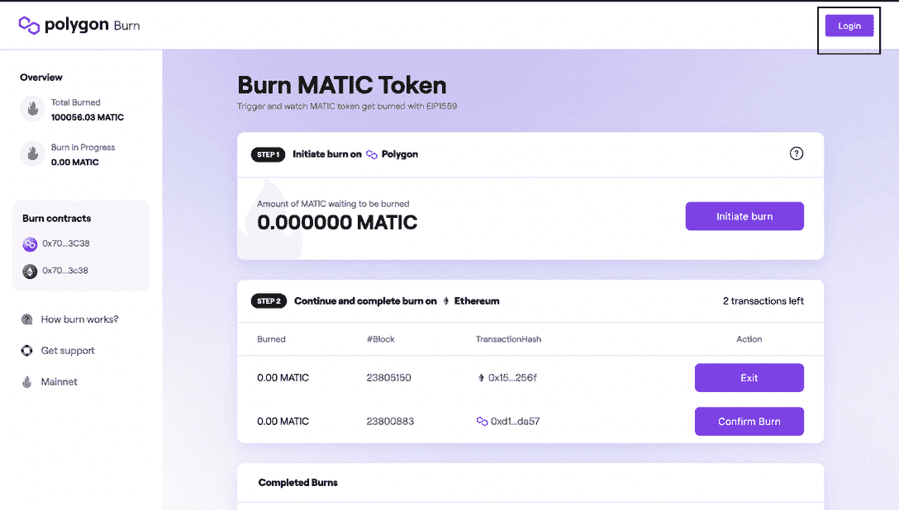

# 多边形上的 EIP-1559 带来了自动刻录和费用可见性

> 原文：<https://web.archive.org/web/https://dappradar.com/blog/eip-1559-on-polygon-brings-matic-burn-fee-visibility>

## 升级于世界协调时 1 月 18 日凌晨 3 点开始。

**以太坊改进提案 1559，更广为人知的名称是以太坊伦敦硬分叉，于本周抵达多边形区块链。此次升级为用户带来了原生 MATIC 令牌的刻录和改进的费用可见性。** [**它于世界标准时间 1 月 18 日凌晨 3 点**](https://web.archive.org/web/20221007180439/https://twitter.com/0xPolygon/status/1483108516122570753) **上线。**

EIP-1559 于去年八月在以太坊主网上线，这是该网络历史上最重大的变化之一。现在，在孟买测试网上推出成功的升级后，Polygon 的开发团队正在 mainnet 上推出升级。

## 更加透明

此次升级的一个突出特点是，它摆脱了第一价格拍卖作为网络费用计算的核心机制。将有一个离散的交易基本费用和优先费用，以加快处理。网络会烧基础费，基础费会根据网络拥塞情况有所波动。刻录在[多边形网络](https://web.archive.org/web/20221007180439/https://dappradar.com/rankings/protocol/polygon)上开始，在以太坊网络上完成。升级完成后，用户可以监控并参与刻录过程。

尽管 Polygon 是一个二层扩展网络，但它最近也受到了天然气费用飙升的影响。据报道，Polygon 天然气费用飙升，原因是一款名为向日葵农民的分散式金融产量农业游戏导致网络交易需求溢出。人们还认为，此举将减少垃圾邮件和网络拥堵。

## 好处

对于 MATIC 持有者来说，代币有 100 亿的固定供应量，因此可用代币数量的任何减少都会产生通缩效应。即，可用的代币越少，代币应该变得越有价值。该团队以以太坊的经历为出发点，模拟对 MATIC 总供应量的潜在影响。分析表明，年化燃烧将代表总 MATIC 供应量的 0.27%。

Polygon 上的分散应用程序 d apps 的用户将从更可预测的天然气价格中受益，这些应用程序已经拥有业内最低的[费用](/web/20221007180439/https://dappradar.com/blog/defi-users-stick-with-polygon-despite-lower-ethereum-gas-fees/)。缺点是由于燃烧和更类似以太坊的燃气费曲线，可用的自动令牌更少。一言以蔽之，随着时间的推移，在 MATIC 上的交易会变得更加昂贵。

通货紧缩的压力将有利于验证者和委托者，因为处理交易的报酬是以 MATIC 支付的。因为如果区块已满，基本费用会自动增加，所以这些变化将减少垃圾邮件交易和网络拥塞。现在收到全部费用的验证者，在将来将只得到优先权费用，因为基础费用被烧掉了。

在多边形生态系统中使用最多的 dapps 中，我们发现塔防游戏[疯狂防御英雄](https://web.archive.org/web/20221007180439/https://dappradar.com/polygon/games/crazy-defense-heroes)，分散交换[快速交换](https://web.archive.org/web/20221007180439/https://dappradar.com/polygon/exchanges/quickswap)和前面提到的向日葵农民。随着[寿司](https://web.archive.org/web/20221007180439/https://dappradar.com/polygon/defi/sushi)和 ApeSwap 的出现，这个生态系统有了一些熟悉的 DeFi 品牌，同时它也拥有了[创新的 GameFi](https://web.archive.org/web/20221007180439/https://dappradar.com/rankings/protocol/polygon/category/games) ，DeFi，即玩即赚解决方案 Aavegotchi。

[点击此处](https://web.archive.org/web/20221007180439/https://forum.polygon.technology/t/eip1559-implementation-on-mumbai-testnet/399)了解更多关于 EIP-1559 如何在 Polygon 上实现的技术概述。

[<picture></picture>](https://web.archive.org/web/20221007180439/https://dappradar.com/blog/what-is-polygon-a-simple-explanation)[<picture></picture>](https://web.archive.org/web/20221007180439/https://dappradar.com/polygon/exchanges/quickswap)[<picture></picture>](https://web.archive.org/web/20221007180439/https://dappradar.com/blog/what-is-a-dapp-on-the-blockchain)[<picture></picture>](https://web.archive.org/web/20221007180439/https://dappradar.com/polygon/defi/sushi)[<picture></picture>](https://web.archive.org/web/20221007180439/https://dappradar.com/blog/set-up-metamask-on-layer-2-and-avoid-ethereum-gas-fees)[<picture></picture>](https://web.archive.org/web/20221007180439/https://dappradar.com/polygon/defi/1inch-network-on-polygon)

***以上不构成投资建议。此处给出的信息仅供参考。请行使尽职调查，做你的研究。作者持有 ETH、BTC、AGIX、HEX、LINK、GRT、CRO、OMI、不变 X、ENS、GALA、AVASTR、GMEE、CUBE、RADAR、FLOW、FTM、BNB、SPS、WRLD、ATOM 和 ADA。***