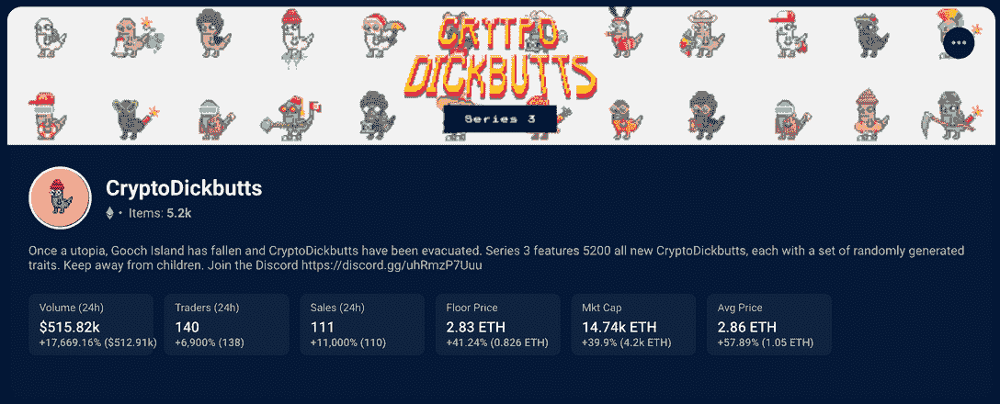
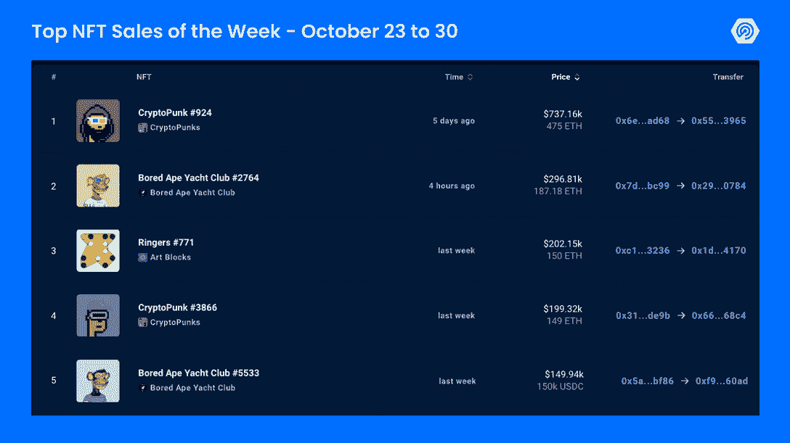
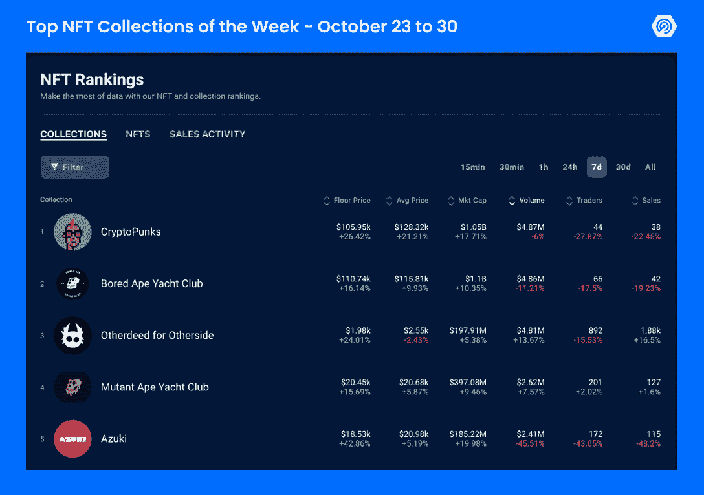

# 埃隆·马斯克推文推动 CryptoDickButts 销量增长 11k%

> 原文：<https://web.archive.org/web/https://dappradar.com/blog/elon-musk-tweet-pushes-cryptodickbutts-sales-11k>

## 查看 2022 年 10 月 23 日至 30 日之间的 NFT 亮点排名

本周，CryptoPunks 和 Bored Apes 继续占据 NFT 销量排行榜的首位，Punk #924 和 Ape #2764 分别以 475 和 187 ETH 的价格售出。这两个系列的市值再次达到 10 亿美元，同时它们的藏品和瑞士法郎都在升值。出乎所有人的意料，在埃隆·马斯克在推特上发布了一个类似他们收藏品的模因后，NFT 收藏的 CryptoDickButts 的销量增加了 2161%。这又是 NFT 精彩有趣的一周，请继续阅读，了解更多。

## CryptoDickButts 在埃隆·马斯克的推特上看到了越来越多的活动

上周日，在 NFT 似乎还未达到预期的一周里，埃隆·马斯克给市场带来了惊喜。不管是有意还是无意，Twitter 的新主人经常通过他的漫画推文和讽刺性的观点对加密世界产生影响。

尽管上周六 CryptoDickButts 系列的交易量小幅增加了 4.54 ETH，但在埃隆发布推文后，该系列在本周结束时增加了 252.93 ETH，增幅为 2161%。

> [pic.twitter.com/gSjeJniK4u](https://web.archive.org/web/20230111091904/https://t.co/gSjeJniK4u)
> 
> — Elon Musk (@elonmusk) [October 30, 2022](https://web.archive.org/web/20230111091904/https://twitter.com/elonmusk/status/1586690742151307264?ref_src=twsrc%5Etfw)

在撰写本文时，该系列的底价为 2.68 埃特(4，226 美元)，总量已经达到 11，000 埃特(17，346，450 美元)。

[<picture></picture>](https://web.archive.org/web/20230111091904/https://dappradar.com/hub/nft-explorer/collection/cryptodickbutts-s3)[See CryptoDickButts NFT Stats & Sales](https://web.archive.org/web/20230111091904/https://dappradar.com/ethereum/collectibles/cryptodickbutts)

Dogecoin 和 [Baby Dodge Swap](https://web.archive.org/web/20230111091904/https://dappradar.com/binance-smart-chain/defi/baby-doge-swap) 是其他 Web3 项目，过去也间接受益于 Elon Musk 的推文，显示了社区群众行动的力量。

## CryptoPunks & Bored Ape 市值达到 10 亿美元

对于蓝筹股 NFT 投资者来说，这也是不错的一周。巨头 CryptoPunks 和 Bored Ape 游艇俱乐部(BAYC)的市值回到了 10 亿美元以上。

同样在本周，ETH 价值突然上涨 12%，导致在区块链以太坊建造的 NFT 价值相应上涨，从而导致 Bored Ape Yacht Club (BAYC)和 CryptoPunks 等高价值 NFT 藏品的交易量激增。

在那些日子里，BAYC 和 MAYC NFTs 的交易量增加了 100 %( T1 ),这意味着收藏者正在利用突然的升值来出售 ETH。

## 查看 NFT 销售亮点列表

*注意:出售时给出的美元价值是正确的。*

每周，DappRadar 不仅会重点报道 NFT 最昂贵的[销售](https://web.archive.org/web/20230111091904/https://dappradar.com/nft/sales)，还会报道过去七天中最有趣的销售。虽然庞大的数字肯定会占据头条，但同样重要的是[突出新兴趋势](https://web.archive.org/web/20230111091904/https://dappradar.com/nft/sales)并保持 DappRadar 社区的领先地位。

1.  [crypto punk # 924](https://web.archive.org/web/20230111091904/https://dappradar.com/hub/assets/eth/0xb47e3cd837ddf8e4c57f05d70ab865de6e193bbb/924)-$ 737160/475 ETH-[主人的钱包](https://web.archive.org/web/20230111091904/https://dappradar.com/hub/wallet/eth/0x55c0c8186541868c03f434e9606e112ee0153965?utm_source=rankings&utm_medium=nft&utm_campaign=nft_sales)
2.  [无聊猿游艇俱乐部# 2764](https://web.archive.org/web/20230111091904/https://dappradar.com/hub/assets/eth/0xbc4ca0eda7647a8ab7c2061c2e118a18a936f13d/2764)-296810 美元/187.18 ETH-[业主的钱包](https://web.archive.org/web/20230111091904/https://dappradar.com/hub/wallet/eth/0x29fc52da4178c6ebedd47a91d65ebae93dfd0784)
3.  [Ringers # 771](https://web.archive.org/web/20230111091904/https://dappradar.com/hub/assets/eth/0xa7d8d9ef8d8ce8992df33d8b8cf4aebabd5bd270/13000771)-$ 202，150/150 ETH-[车主的钱包](https://web.archive.org/web/20230111091904/https://dappradar.com/hub/wallet/eth/0x1da5331994e781ab0e2af9f85bfce2037a514170?utm_source=rankings&utm_medium=nft&utm_campaign=nft_sales)
4.  [crypto punk # 3866](https://web.archive.org/web/20230111091904/https://dappradar.com/hub/assets/eth/0xb47e3cd837ddf8e4c57f05d70ab865de6e193bbb/3866)-$ 199320/149 ETH-[主人的钱包](https://web.archive.org/web/20230111091904/https://dappradar.com/hub/wallet/eth/0x66362b929c1a9aaf14c51aab9b455ad7fb8268c4?utm_source=rankings&utm_medium=nft&utm_campaign=nft_sales)
5.  [无聊猿游艇俱乐部# 5533](https://web.archive.org/web/20230111091904/https://dappradar.com/hub/assets/eth/0xbc4ca0eda7647a8ab7c2061c2e118a18a936f13d/5533)——149，940 美元/ 150，000 USDC—[所有者的钱包](https://web.archive.org/web/20230111091904/https://dappradar.com/hub/wallet/eth/0xf94085ac29870595ad32ea3ab6121fce9e9460ad?utm_source=rankings&utm_medium=nft&utm_campaign=nft_sales)
6.  [Bored Ape 游艇俱乐部# 7110](https://web.archive.org/web/20230111091904/https://dappradar.com/hub/assets/eth/0xbc4ca0eda7647a8ab7c2061c2e118a18a936f13d/7110)-146530 美元/107.5 ETH-[业主的钱包](https://web.archive.org/web/20230111091904/https://dappradar.com/hub/wallet/eth/0xabf98cde9966abf4c968786331dc1e3b8ba5809d?utm_source=rankings&utm_medium=nft&utm_campaign=nft_sales)
7.  [crypto punk # 7235](https://web.archive.org/web/20230111091904/https://dappradar.com/hub/assets/eth/0xb47e3cd837ddf8e4c57f05d70ab865de6e193bbb/7235)-$ 146160/92 ETH-[主人的钱包](https://web.archive.org/web/20230111091904/https://dappradar.com/hub/wallet/eth/0xb4079f1e529309eff78f634cb1a82397547e9d30?utm_source=rankings&utm_medium=nft&utm_campaign=nft_sales)
8.  [crypto punk # 5736](https://web.archive.org/web/20230111091904/https://dappradar.com/hub/assets/eth/0xb47e3cd837ddf8e4c57f05d70ab865de6e193bbb/5736)-$ 146030/99.95 ETH-[主人的钱包](https://web.archive.org/web/20230111091904/https://dappradar.com/hub/wallet/eth/0x4f205182790b2dec2c25838d1d6e9d85b92a8418)
9.  [无聊猿游艇俱乐部# 7686](https://web.archive.org/web/20230111091904/https://dappradar.com/hub/assets/eth/0xbc4ca0eda7647a8ab7c2061c2e118a18a936f13d/7686)——141.51 万美元/91 WETH—[业主的钱包](https://web.archive.org/web/20230111091904/https://dappradar.com/hub/wallet/eth/0xc0738649740929ef714cc5c0229a1d5fa8138c29)
10.  [Bored Ape 游艇俱乐部# 1563](https://web.archive.org/web/20230111091904/https://dappradar.com/hub/assets/eth/0xbc4ca0eda7647a8ab7c2061c2e118a18a936f13d/1563)-$ 139.17k/90 ETH-[业主的钱包](https://web.archive.org/web/20230111091904/https://dappradar.com/hub/wallet/eth/0x6bee7c98ca5a1e42ec5f8b2fb9c09442a192ac1b?utm_source=rankings&utm_medium=nft&utm_campaign=nft_sales)

本周最大的 NFT 拍卖会:不出所料，排行榜的第一名又是 CryptoPunk 系列。CryptoPunk #924 以 475 ETH(超过 737，160 美元)的价格售出，成为 10 月份第三大拍卖。这件收藏品在它之前的钱包里放了一年多，之前的主人以 269.69 ETH 购买了它，并从超过 205 ETH 的交易中获得了可观的利润。

[<picture></picture>](https://web.archive.org/web/20230111091904/https://dappradar.com/nft/sales)[Explore DappRadar’s NFT Rankings](https://web.archive.org/web/20230111091904/https://dappradar.com/nft/sales)

来自[艺术板块](https://web.archive.org/web/20230111091904/https://dappradar.com/ethereum/collectibles/art-blocks)系列的 [NFT 响尾蛇#771](https://web.archive.org/web/20230111091904/https://dappradar.com/hub/assets/eth/0xa7d8d9ef8d8ce8992df33d8b8cf4aebabd5bd270/13000771) ，也在我们本周的销售亮点中首次亮相，以 150 ETH(202，150 美元)的价格购得。

## 本周 NFT 顶级收藏

关于 NFT 收藏总量，本周的排名还包括宇迦实验室。五个最大的收藏中有四个属于工作室，其中 [CryptoPunks](https://web.archive.org/web/20230111091904/https://dappradar.com/hub/nft-explorer/collection/cryptopunks) 和 [Bored Ape Yacht Club](https://web.archive.org/web/20230111091904/https://dappradar.com/hub/nft-explorer/collection/bored-ape-yacht-club) 领先，尽管其周成交量分别亏损 6%和 11.21%。然而，所有主要收藏品都有一个模式:与前一周相比，它们的底价和总市值都有所上升。

[其他事迹](https://web.archive.org/web/20230111091904/https://dappradar.com/hub/nft-explorer/collection/otherdeed-for-otherside)保持上周的模式，增加销售数量。虽然上周销售数量增加了 128%，但这次增加了 16.5%。同样，[变种人猿游艇俱乐部](https://web.archive.org/web/20230111091904/https://dappradar.com/hub/nft-explorer/collection/mutant-ape-yacht-club)保持了积极的趋势，也是前 5 名中唯一一个增加交易人数的集合。

[<picture></picture>](https://web.archive.org/web/20230111091904/https://dappradar.com/nft/sales)

[志那都红豆](https://web.archive.org/web/20230111091904/https://dappradar.com/hub/nft-explorer/collection/azuki)最低起拍价涨幅最大，底价上涨 **42.86%** 。

对于这个品牌来说，这是忙碌的一周，在推出加密豆芯片[和创造实体支持令牌](https://web.archive.org/web/20230111091904/https://dappradar.com/blog/azuki-nfts/#A-new-era:-Azuki%E2%80%99s-Physical-Backed-Tokens)以及金色滑板热潮之后，它吸引了许多好奇的目光。

## 使用 DappRadar 跟踪 NFT

如果你想了解更多关于 NFTs 的信息，我们的[指南和报道](https://web.archive.org/web/20230111091904/http://dappradar.com/blog/) DappRadar 将向你介绍这个不断发展的领域。

此外，DappRadar 允许您监督和管理您的 NFT 投资组合，并跟踪以太坊上的最佳收藏。请看下面的视频。

[https://web.archive.org/web/20230111091904if_/https://www.youtube.com/embed/fkEaXYLOW-s?feature=oembed](https://web.archive.org/web/20230111091904if_/https://www.youtube.com/embed/fkEaXYLOW-s?feature=oembed)

不要错过最新的 NFT 新闻。在 [Twitter](https://web.archive.org/web/20230111091904/https://twitter.com/DappRadar) 上关注我们，或者加入我们的 [Discord](https://web.archive.org/web/20230111091904/https://discord.com/invite/4ybbssrHkm) 服务器，实时更新热门应用和收藏。

### 有用的链接

*   [查看以太坊上的 NFT 收藏浏览器](https://web.archive.org/web/20230111091904/https://dappradar.com/hub/nft-explorer)
*   [查看您的加密和 NFT 投资组合跟踪器](https://web.archive.org/web/20230111091904/https://dappradar.com/hub/wallet/)
*   [查看最近 NFT 销量排行榜](https://web.archive.org/web/20230111091904/https://dappradar.com/nft/sales)
*   [通过 DappRadar 的指南了解所有关于 NFT 的知识](https://web.archive.org/web/20230111091904/https://dappradar.com/blog/category/nft)

***以上不构成投资建议。此处给出的信息仅供参考。请尽职调查并自行研究。***

 NewsletterUnsubscribe at any time. [T&Cs](https://web.archive.org/web/20230111091904/https://dappradar.com/terms) and [Privacy Policy](https://web.archive.org/web/20230111091904/https://dappradar.com/privacy-policy)