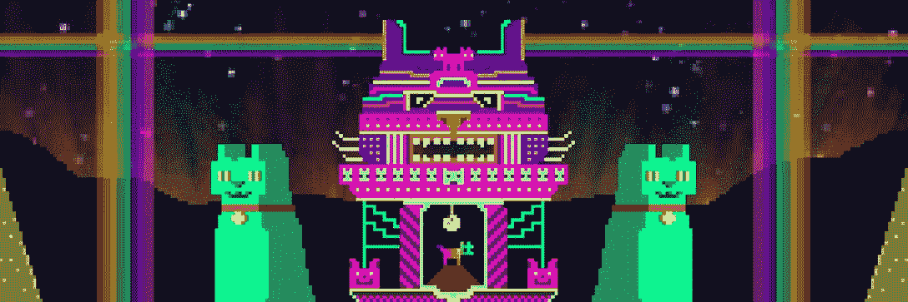
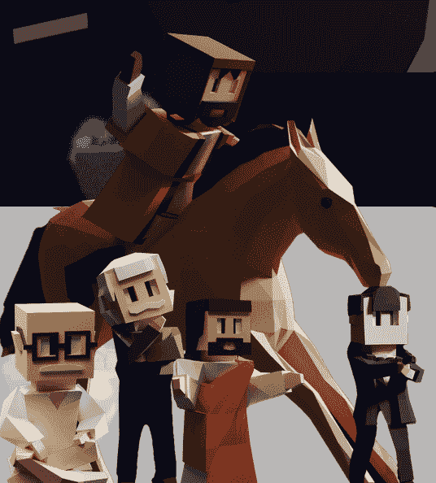

# Elysium 区块链的生态友好型 Dapp 生态系统正在蓬勃发展

> 原文：<https://web.archive.org/web/https://dappradar.com/blog/elysium-blockchains-eco-friendly-dapp-ecosystem-is-thriving>

## 极乐世界是一个具有动态生态系统的碳中和区块链

**区块链极乐世界致力于通过象征性的树木抵消二氧化碳来建立一个生态友好的生态系统。它的绿色本质赢得了 dapps 和各个领域的合作伙伴的支持。值得注意的是，极乐世界的区块链世界比以往发展得更快。**

不可否认的是，区块链技术正在使传统互联网朝着更加透明和高效的生态系统进行变革。然而，工作验证共识阻止了这项技术进一步发挥其威力。例如，基于以太坊的区块链游戏因其巨大的能耗而成为环保主义者批评的目标。

作为回应，Vulcan Forged 推出了其环保的区块链极乐世界，推动了一个专注于环保 dapps 的叙事。由于这种努力，极乐世界的区块链基础设施赢得了许多项目的青睐。今天的文章将介绍一些选择了绿色道路的优秀游戏和 dapps。

## vulcanvarse

VulcanVerse 是一款由独特的陆地组成的梦幻开放世界游戏。利用不可替代的代币技术，玩家可以拥有、建造、购买和出售游戏中的资产以获取财富。

在过去的 30 天里，VulcanVerse 的人气一直在上升。根据 DappRadar 的数据，在此期间有超过 4000 名玩家参与了游戏互动，增幅高达 89%。此外，VulcanVerse 还记录了同期的 68，224 笔交易，截至本文撰写时增长了 115%。

[https://web.archive.org/web/20220925195442if_/https://www.youtube.com/embed/u_eNX400QHc?feature=oembed](https://web.archive.org/web/20220925195442if_/https://www.youtube.com/embed/u_eNX400QHc?feature=oembed)

## 锻造竞技场

[锻造竞技场](https://web.archive.org/web/20220925195442/https://dappradar.com/vulcanforged/games/forge-arena)是极乐世界区块链上的另一款游戏，在过去的 30 天里势头越来越猛。Forge Arena 是一款战术性的第一人称射击(FPS)游戏，旨在成为主要的电子竞技明星。在游戏中，玩家将不得不在地图上互相战斗，并试图获得最多的杀戮。

截至发稿时，该游戏记录了 1868 名用户与 dapp 的智能合约互动，根据 DappRadar 的数据，这一数字增长了 175%。此外，在此期间，dapp 的智能合约完成了 16，783 笔交易，增长了 200%以上。

## 狂暴

[Berserk](https://web.archive.org/web/20220925195442/https://dappradar.com/vulcanforged/games/berserk-vulcanites-unleashed) 是火神锻造的另一款热门游戏。截至发稿时，该游戏的用户数量增长了 10%，交易量增长了 11%。这款游戏在瓦肯宇宙中是一款值得收藏的卡牌游戏(CCG ),每张狂战士卡牌都有不同的生物和咒语。此外，玩家可以报名参加锦标赛并获得赠品以赢得稀有的卡**。**此外，无论你的技能如何，你都可以获得熔岩和 PYR，因为总有办法获得！

## GeoCats

GeoCats 是一款超维度的 NFT 游戏，玩家在 GeoTerra 世界的旅程中收集 GeoCats。这些地理藏宝图包含宝藏和小饰品，用户可以收集和交易不可替代的令牌。该游戏还提供了所有游戏赚取额外津贴:收集新的猫，种植猫薄荷，并赚取 PYR。

## 相反的

你自己的“R 级”元宇宙，是一款 3D 动作惊悚游戏，以世界上一些最有争议的犯罪城市为原型。这款“玩赚”游戏将采用逼真的图像，以及语音和文本聊天功能，将玩家带入一个增强现实空间。

[https://web.archive.org/web/20220925195442if_/https://www.youtube.com/embed/xvNLi8NCM3E?feature=oembed](https://web.archive.org/web/20220925195442if_/https://www.youtube.com/embed/xvNLi8NCM3E?feature=oembed)

## SatoshiCity

如果你想沉浸在一个迷人的世界，SatoshiCity 就是游戏。如果你想沉浸在一个迷人的世界，SatoshiCity 就是游戏。SatoshiCity 的故事运行在从公元前 9000 年到公元 3060 年的线性时间线上。游戏世界从龙、野蛮人、上古之神和法老开始，一直到人类将进入星系际的未来。

在低多风格的 SatoshiCity 世界，你可以拥有土地，开始你的帝国，创造平行历史，赢得世界大战，成为超级大国，创造遗产。

## 溺爱宠物(菲拉的寓言)

溺爱宠物是 NFT 的一个收藏项目，以可爱的龙为特色。你可以通过玩游戏把这些小可爱变成成年巨龙。龙越稀有，它们就越值钱。作为一名瓦肯锻造宇宙成员，那些 NFT 龙已经可以在瓦肯市场上与 PYR 交易了。

## 阻止婴儿

BlockBabies 是一款快节奏的收藏卡牌游戏(CCG)。这些 NFT 宝宝将战斗，获得经验，并爬上托儿所排行榜。每个宝宝都拥有可爱、耐心、睡眠技能、智力和灵巧等属性，这些宝宝是你获得经验和帮助你赢得奖励的小战士！

[https://web.archive.org/web/20220925195442if_/https://www.youtube.com/embed/CTiF_aALKgM?start=3&feature=oembed](https://web.archive.org/web/20220925195442if_/https://www.youtube.com/embed/CTiF_aALKgM?start=3&feature=oembed)

## 无子

Bornless 是一款用虚幻引擎打造的第一人称射击恐怖游戏。无子元宇宙从 NFTs 跨越到虚拟现实。在游戏中，玩家竞争收集熏香，游戏中的令牌，他们可以花在项目上，以保持他们的团队活着。Bornless 团队精心制作了这款游戏，以身临其境的游戏体验让玩家激动不已。漫游森林，玩家会发现自己处于激烈的交火中，同时逃离最邪恶的恶魔。

[https://web.archive.org/web/20220925195442if_/https://www.youtube.com/embed/Y3LtwQuLtks?feature=oembed](https://web.archive.org/web/20220925195442if_/https://www.youtube.com/embed/Y3LtwQuLtks?feature=oembed)

## 巴拉托农的打手

巴拉特龙的打手(Goons of Balatroon)是一款总部位于区块链的交易卡牌游戏，允许玩家拥有自己的数字资产。这款游戏展现了一个迷人的世界，玩家用古怪的卡片战斗。此外，GOB 令牌是游戏中的货币，为游戏经济提供燃料，并作为平台的公用令牌。玩家可以通过简单地玩游戏或出租他们的 Goon NFTs 给其他玩家并分享他们的游戏奖励来赚取 GOB。

## eve 逃逸

艺术文化品牌也青睐极乐世界。例如， [EverScapes 是一个幻想、科幻和恐怖的 NFT 收藏平台](https://web.archive.org/web/20220925195442/https://dappradar.com/blog/elysium-joined-hands-with-fantasy-giant-committing-to-green-nfts/)最初在多边形区块链推出，但现在将转移到极乐世界。这个策划平台吸引了高度参与、目标明确的艺术爱好者和收藏家。Everscapes 组合中有许多大牌艺术家，包括《星球大战》电影海报的创作者希尔德布兰特兄弟，以及为漫威和 DC 工作的胡安·希门尼斯。

## 重金属杂志

《重金属》创刊于 1977 年，是一本科幻奇幻漫画杂志。重金属设计了 NFTs，加密资产来代表数字领域的艺术，音乐，游戏中的项目和视频，将数字艺术收藏提升到了一个新的水平。随着《极乐世界区块链》的发行，这本传奇杂志赋予了其经典封面和人物以生命。

## 燕子数码

另一个案例是创新的纹身 NFT 项目燕子数码。它允许用户购买由独特的纹身师创造的杰出和非凡的 NFT 纹身。此外，你可以通过元宇宙和游戏应用程序，将这些数字化的、可收藏的纹身艺术转化为皮肤深层的可穿戴设备。幸运的是，VulcanVerse 玩家将成为第一批在头像上使用这些纹身图案的玩家。

## 胡斯韦尔斯

HUSL 是创作者的平台。这是一个全球音乐市场，允许世界各地的个人上传他们的最新音乐作为 NFTs。由 Vulcan Forged 提供动力，HUSLVerse 将成为音乐、体育、娱乐和时尚领域一些最大品牌的首选目的地。此外，HUSLVerse 将在其元宇宙中添加 P2E 元素，这样用户可以在享受这个奇妙世界的同时从生态系统中获得回报。

## 反面的

EdVerse 将成为第一个由 Elysium 驱动的教育元宇宙，将学习和教学与游戏化相结合。在 EdVerse 的元宇宙教育中，创作者可以创建 Ed NFTs，使教育者和学习者都受益。当然，这些 NFT 不仅仅是学习资料。用户可以拥有、租赁和交易它们。通过这种方式，EdVerse 致力于教育的分散化和民主化，以建立最具互动性、沉浸式和洞察力的元宇宙教育！

## 许多环保人士选择极乐世界

极乐世界采用利害关系证明共识机制来解决早期区块链引起的环境问题。此外，极乐世界将通过使用“象征化树木”来抵消二氧化碳排放。因此，许多生态友好项目青睐极乐世界的绿色自然，并选择与之建立合作伙伴关系。这些伙伴关系包括:

*   DRIFE :类似于优步的 Web 3 打车平台，利用区块链为行业带来透明度。
*   **Mirai 未来组合实验室:**一家积极培育和支持卓越计划的公司，这些计划有助于加速可持续 Web 3.0 的创建和过渡。
*   **Coorest:** 一个组织提出了一个可持续发展的世界的解决方案，将二氧化碳交易与森林的产出可能性结合起来。NFTrees 将产生碳代币，其数量相当于现实生活中它们从大气中移除的碳量。

## 极乐世界的未来

凭借其快速的交易速度、低廉的费用和绿色自然，区块链极乐世界已经发展成为一个蓬勃发展的生态系统，为各个领域提供支持。Elysium 将自己定位为“元宇宙的区块链”，致力于提供利用行业领先技术的解决方案。在不久的将来，Vulcan Forged 将有一些领先的时尚品牌加入，以进一步丰富其生态系统。如果你不想错过任何激动人心的消息，请在社交媒体上关注 Vulcan Forged，敬请关注！

**链接:**

[火神锻造网站](https://web.archive.org/web/20220925195442/https://vulcanforged.com/)

[不和](https://web.archive.org/web/20220925195442/https://discord.gg/vulcanverse)

[推特](https://web.archive.org/web/20220925195442/http://twitter.com/vulcanforged)

[中等](https://web.archive.org/web/20220925195442/http://vulcanforgedco.medium.com/)

[电报](https://web.archive.org/web/20220925195442/http://tg.me/veriarti)