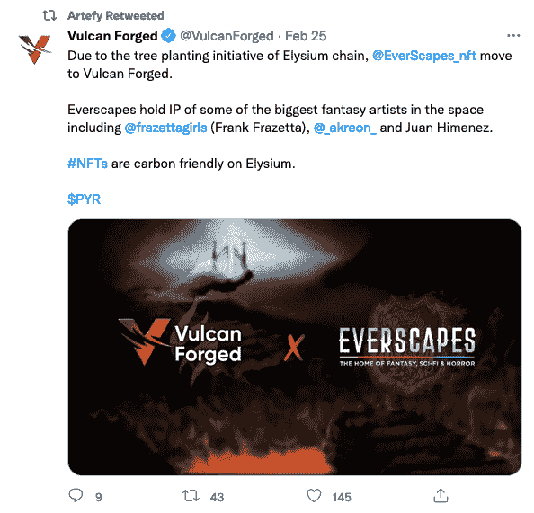

# 极乐世界携手梦幻巨人致力于绿色 NFTs

> 原文：<https://web.archive.org/web/https://dappradar.com/blog/elysium-joined-hands-with-fantasy-giant-committing-to-green-nfts>

## 极乐世界让瓦肯锻造的生态系统变得环保

为了向用户提供绿色 NFTs，Artefy 最近与区块链极乐世界合作开发碳中和解决方案。新的区块链解决方案不仅环保，还带来了友好的用户体验。使用 Elysium 又快又便宜，这对于那些想进入 Artefy 的人来说听起来很完美。

基于工作证明共识的区块链，如比特币和以太坊，因其巨大的能量消耗而引发争议。根据美国消费者新闻与商业频道的一篇文章，比特币的碳足迹与纽西兰相当，每年产生 36.95 兆吨二氧化碳[。](https://web.archive.org/web/20221230090733/https://www.cnbc.com/2021/02/05/bitcoin-btc-surge-renews-worries-about-its-massive-carbon-footprint.html)因此，区块链技术的可持续发展与环境的可持续发展密不可分。在这方面，技术小组已经投资开发绿色区块链来处理上述问题。普遍采用的解决方案包括使用利害关系证明(POS)作为共识机制，并采取进一步措施抵消温室气体排放。

元宇宙游戏平台 Vulcan Forged 推出了区块链极乐世界，并将其命名为“元诗句的区块链”。极乐世界的绿色本质赢得了许多高度参与项目的青睐。其中一个是革命性的幻想数字艺术平台，Artefy 的 Everscapes marketplace。

## Artefy 的 Everscapes 是什么

幻想、科幻和恐怖的 NFT 品牌 EverScapes 最初在多边形区块链推出其服务，但现在将转移到极乐世界。他们与 NFT 市场平台 Artefy 共同完成这项工作。

这个策划平台吸引了高度参与、目标明确的艺术爱好者和收藏家。Everscapes 组合中有许多大牌艺术家，包括《星球大战》电影海报的创作者希尔德布兰特兄弟，以及为漫威和 DC 工作的胡安·希门尼斯。此外，著名艺术家如圣朱利安、安娜·波德沃纳、法兰克·法拉捷特、理查德·赫斯考克斯等也榜上有名。此外，传奇的重金属杂志也加入了 Everscapes 的合作伙伴关系，随着 NFTs 的发行，它的经典封面和角色变得栩栩如生。

在 Artefy 的推动下，幻想、科幻和恐怖是 Everscapes 品牌专注的三个主题。随着许多备受瞩目的项目正在进行中，用户可以发现、收集和分享这些产品领域中的知名知识产权。最重要的是，Artefy 坚持“绿色 NFTs”的努力。NFT 平台将进行广泛的研究和探索过程，以审查评估区块链合作伙伴时的所有选项。这是为了确保团队的决定对能源使用的 NFTs 问题产生积极的影响。

Artefy 利用尖端技术提供了一个可靠的平台和一个沉浸式艺术体验的梦幻世界。Artefy 采取的方法已经使自己成为一个独特的数字艺术平台，拥有忠实的粉丝群。

## 极乐世界的绿色食物

极乐世界和 Artefy 的合作并不令人惊讶。极乐世界是一个不需要大量电力的区块链，因此是碳中和的，因此是生态友好的。游戏一直是区块链用户最活跃的领域之一。作为一个区块链游戏平台，《火神锻造》从一开始就必须解决能源问题。因此，瓦肯锻造公司推出了自己的区块链生态系统——极乐世界。

除了使用股权证明，极乐世界将通过使用“令牌化树木”来抵消二氧化碳排放。如何让这成为可能？极乐世界将利用区块链交易的汽油费来植树。最初的目标是覆盖近 70，000 英亩土地。此外，极乐世界将保证 NFT 的铸造、交易、赌注和链条上的其他操作都是碳中和的。

艺术界是绿色能源最活跃的声音之一。所以极乐世界和 Artefy 的合作似乎是天作之合。同样值得一提的是，凭借 Elysium 的游戏基础和来自 Artefy 的艺术元素，我们有理由相信两个团队在未来可能会引发其他精彩。

**了解更多关于火神锻造和 Artefy:**

[Artefy](https://web.archive.org/web/20221230090733/https://artefy.io/greennft) [不和](https://web.archive.org/web/20221230090733/https://discord.gg/vulcanverse)
[推特](https://web.archive.org/web/20221230090733/http://twitter.com/vulcanforged) [中](https://web.archive.org/web/20221230090733/http://vulcanforgedco.medium.com/) [电报](https://web.archive.org/web/20221230090733/http://tg.me/veriarti)