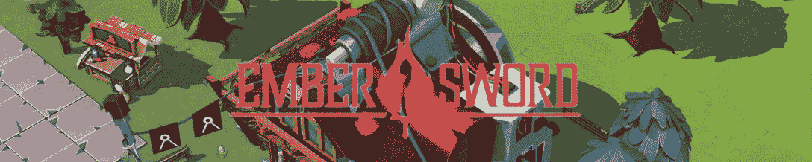
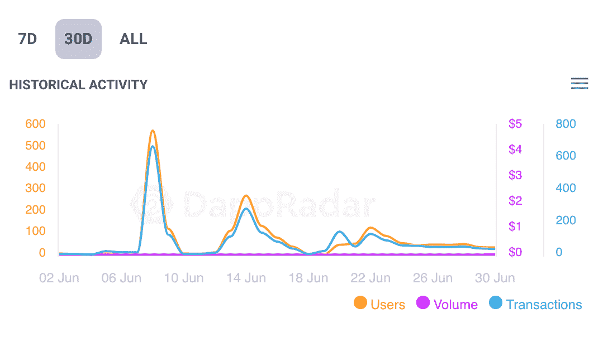
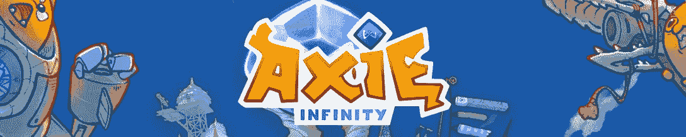
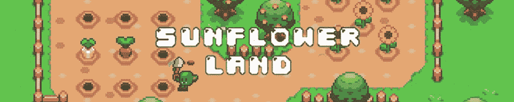
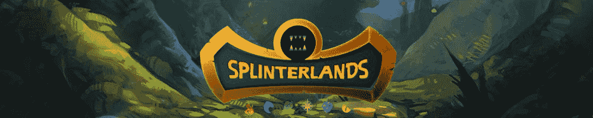
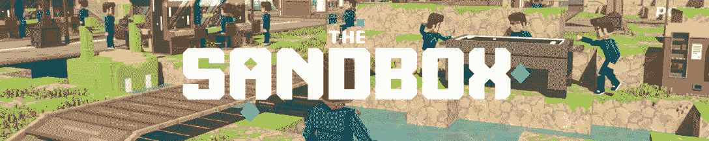

# 燃烧的余烬之剑意外登上第一名

> 原文：<https://web.archive.org/web/https://dappradar.com/blog/ember-sword-on-fire-as-it-makes-surprise-entry-at-number-one>

## MMORPG 在转向不可改变的 X 之后，已经开辟了一条通往榜首的道路

**尽管目前处于低迷状态******[**NFT 的交易量**](https://web.archive.org/web/20230113161531/https://dappradar.com/blog/dappradar-industry-report-may-2022/#Blue-chip)**[**【区块链博彩业一直保持着强劲的势头**](https://web.archive.org/web/20230113161531/https://dappradar.com/blog/dappradar-crypto-games-report-5-blockchain-games-continue-to-defy-the-bear-market) **。余烬剑平视本月游戏排行榜为六月后将网络平台移至** [**【不可变 X】**](https://web.archive.org/web/20230113161531/https://dappradar.com/rankings/protocol/immutablex)**。该游戏的用户数量增长了 1，292%，而该行业的其他用户数量都出现了不同程度的下降。********

 ****虽然《余烬之剑》的观众数量有所增长，但我们追踪的其他游戏的用户数量都在下降。考虑到网络 3 和更广阔世界的不确定性，这并不奇怪。这意味着游戏在 6 月份表现良好，表现最差，不一定比之前有所改善。

## 灰烬之剑

余烬之剑是六月的月度游戏中令人惊讶的第一名。该平台凭借其用户数量的突破性增长，登上了榜首。虽然访问游戏平台的独立活跃钱包(DappRadar 衡量用户的指标)数量每隔一个游戏就下降一次，但 Ember Sword 却飙升了 1，292%。

DappRadar 30-day analytics for Ember Sword

6 月 8 日和 14 日的高峰是在[余烬剑](https://web.archive.org/web/20230113161531/https://dappradar.com/polygon/games/ember-sword)移至[不变 X](https://web.archive.org/web/20230113161531/https://dappradar.com/rankings/protocol/immutablex) 网络之后到来的。该平台向每个转移到第二层链的人提供了丰厚的奖励。对于每一个迁移到不可变 X 的余烬剑资产用户，游戏制造商会给他们一个 [IMX](https://web.archive.org/web/20230113161531/https://dappradar.com/hub/token/eth/IMX?from=0xf57e7e7c23978c3caec3c3548e3d615c346e79ff) 令牌。没有什么比免费的钱更能吸引观众了！

## 无限轴

Sky Mavis 和 Axie Infinity 背后的开发者希望将 2022 年上半年的艰难时光抛诸脑后。不过，现在游戏赚钱的大热门看起来确实有所好转。 [600，000 个账号注册了 Axie Infinity Origin](https://web.archive.org/web/20230113161531/https://dappradar.com/blog/600000-accounts-have-registered-with-axie-infinity-origin/) ，游戏内的土地赌注现已上线。最重要的是，这款游戏在我们的榜单上排名第二。

[https://web.archive.org/web/20230113161531if_/https://www.youtube.com/embed/GbdlbDCpcI0?feature=oembed](https://web.archive.org/web/20230113161531if_/https://www.youtube.com/embed/GbdlbDCpcI0?feature=oembed)

## 全球韦伯

全球 Webb 团队一直在全力以赴开发第二版的公开测试版。目前，只有土地所有者可以进入当前的测试版。游戏中的社区正在建立，土地销售进展顺利。在过去的一个月里，买家和卖家为游戏中的土地做了 [450 笔交易。](https://web.archive.org/web/20230113161531/https://dappradar.com/hub/nft-explorer/collection/worldwidewebbland/sales-activity)

> 我们正在不知疲倦地进行 V2 公测🎮🌐
> 
> 目前，只有土地所有者可以进入最新的测试版:【https://t.co/US9t4pEJDO】T2🏠pic.twitter.com/Jbb8uiSuqH
> 
> — Worldwide Webb (@Worldwide_WEB3) [June 18, 2022](https://web.archive.org/web/20230113161531/https://twitter.com/Worldwide_WEB3/status/1538116826957238273?ref_src=twsrc%5Etfw)

Source: Twitter

## 向日葵地

[向日葵地](https://web.archive.org/web/20230113161531/https://dappradar.com/polygon/games/sunflower-land)是 2022 年的美好故事。继最初的成功之作《向日葵之花》之后，[这款游戏经历了混乱的更名](https://web.archive.org/web/20230113161531/https://dappradar.com/blog/sunflower-land-revived-from-the-ashes-of-sunflower-farmers/)，之后[重新夺回了它在游戏赚钱游戏中的地位](https://web.archive.org/web/20230113161531/https://dappradar.com/blog/sunflower-land-finds-tremendous-success-after-relaunch/)。该平台的 [SFL](https://web.archive.org/web/20230113161531/https://dappradar.com/hub/token/polygon/SFL?from=0xd1f9c58e33933a993a3891f8acfe05a68e1afc05) token 在困难的条件下表现非常好，过去一个月仅下跌 1.8%。

## 分散游戏

作为一个去中心化的自治组织(DAO)，[去中心化游戏](https://web.archive.org/web/20230113161531/https://dappradar.com/multichain/games/decentral-games)是一个去中心化的元宇宙游戏。这是一个数字赌场，用户可以在这里玩扑克、二十一点、轮盘赌、双陆棋和老虎机。用户数量下降了 15%，本地治理令牌 DG 下降了 23%。但与其他一些 dapps 相比，分散式游戏的情况看起来并不太糟。

[https://web.archive.org/web/20230113161531if_/https://www.youtube.com/embed/_-WxabVbVMw?feature=oembed](https://web.archive.org/web/20230113161531if_/https://www.youtube.com/embed/_-WxabVbVMw?feature=oembed)

## 外星世界

六月，外星世界的指标大幅下降。但该游戏当月仍吸引了 549，480 个独特的活动钱包。因此，即使这个平台目前不是最好的时候，它仍然是一个拥有忠诚社区的巨大游戏。

## 夹板地

6 月份，Splinterlands 的用户数量下降了 10%，至 461，060 人。但是这款游戏仍然遥遥领先于 T2 蜂巢区块链 T3。尽管经历了糟糕的一个月，但 Splinterlands 在 6 月份结束时表现良好。[过去 24 小时](https://web.archive.org/web/20230113161531/https://dappradar.com/multichain/games/splinterlands)，用户数、交易数、交易量都在上升。

[https://web.archive.org/web/20230113161531if_/https://www.youtube.com/embed/8tixPvXvolg?feature=oembed](https://web.archive.org/web/20230113161531if_/https://www.youtube.com/embed/8tixPvXvolg?feature=oembed)

## 分散土地

分散的土地是 T2 元宇宙最著名的虚拟世界之一。它也是最大的游戏平台之一和数字土地的[卖家](https://web.archive.org/web/20230113161531/https://dappradar.com/hub/nft-explorer/collection/decentraland/sales-activity)。在分散土地购买的最昂贵的一块土地，以 [ETH](https://web.archive.org/web/20230113161531/https://dappradar.com/hub/token/eth/ETH) 价值计算，为 1,019.09 ETH。

## 隐叶片

刚刚在上周五的每周排名中登上[榜首的](https://web.archive.org/web/20230113161531/https://dappradar.com/blog/cryptoblades-scythes-its-way-to-the-top-of-our-rankings/) [CryptoBlades](https://web.archive.org/web/20230113161531/https://dappradar.com/multichain/games/cryptoblades) 在 6 月份排名第九。在过去 30 天里，与该平台互动的唯一活跃钱包数量仅下降了 3.3%。在这个大肆宣传和对所有 web3 的兴趣都被动摇的时代，小的下跌也算是大的胜利。

[https://web.archive.org/web/20230113161531if_/https://www.youtube.com/embed/D-E6iMRD7h8?feature=oembed](https://web.archive.org/web/20230113161531if_/https://www.youtube.com/embed/D-E6iMRD7h8?feature=oembed)

## 沙盒

[沙盒](https://web.archive.org/web/20230113161531/https://dappradar.com/multichain/games/the-sandbox)凭借其六月在 [NFT 的销售，在我们的月度游戏中排名第十。交易量可能下降了 40%，但交易商仍然买卖了 373 万美元的游戏内资产。该平台的用户数量仅下降了 10%，考虑到市场形势，这是相对强劲的。时间也只是在沙盒里建造了时代广场。建筑商正在建造。](https://web.archive.org/web/20230113161531/https://dappradar.com/ethereum/marketplaces/the-sandbox-marketplace)

[https://web.archive.org/web/20230113161531if_/https://www.youtube.com/embed/YW30NI5TA8k?feature=oembed](https://web.archive.org/web/20230113161531if_/https://www.youtube.com/embed/YW30NI5TA8k?feature=oembed)****