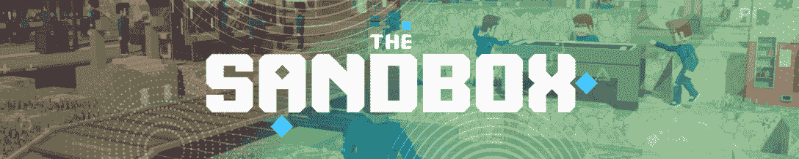
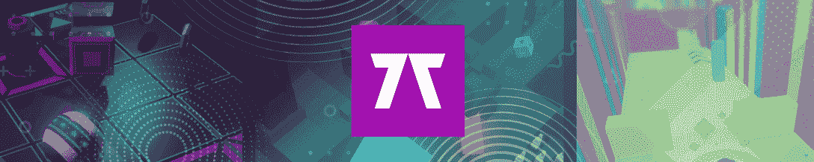

# 烬剑的不可变 X 迁移提升活跃度

> 原文：<https://web.archive.org/web/https://dappradar.com/blog/ember-swords-immutable-x-migration-boosts-activity>

## 查看 2022 年 6 月第一周表现最佳的游戏

Ember Sword 已经成功迁移到不可变的 X 链，资产迁移过程极大地促进了该平台的活动。这一重大变化的结果是，Ember Sword 荣登 DappRadar 顶级区块链游戏每周排名榜首。

Crypto Blades 的生日庆祝活动也对游戏的表现产生了积极影响，使其在本周排名第二。在过去的七天里，向日葵王国以超过 60，000 个独特的活动钱包连接到游戏来完成前三名。

使用全新的 dappar Dar NFT 探索者发现您最喜爱的游戏内 NFT 资源。

随着 web3 空间迎来越来越多的玩家，区块链游戏 dapps 正在成倍增加。根据最新的 [DappRadar 行业报告](https://web.archive.org/web/20230113155803/https://dappradar.com/blog/dappradar-industry-report-may-2022)，区块链游戏 dapps 正在有效抵御加密崩溃，其活动量仅下降 5%，同比增长 197%。

在下面浏览本周十大区块链游戏的完整列表。您还可以点击相应的图片，了解每个平台的更多信息。

[https://web.archive.org/web/20230113155803if_/https://www.youtube.com/embed/edalFwm9rck?feature=oembed](https://web.archive.org/web/20230113155803if_/https://www.youtube.com/embed/edalFwm9rck?feature=oembed)

## 区块链十大运动会–第 23 周

### 1.[余烬剑](https://web.archive.org/web/20230113155803/https://dappradar.com/polygon/games/ember-sword)

[<picture></picture>](https://web.archive.org/web/20230113155803/https://dappradar.com/polygon/games/ember-sword)

在成功迁移到[不可变 X](https://web.archive.org/web/20230113155803/https://dappradar.com/rankings/protocol/immutablex) 链后，Ember Sword 本周排名第一。迁移过程将平台上的活动提高了 2000%以上。这是一个显著的增长，部分是由于 Ember Sword 提供的丰厚的移民奖励。玩家将获得 1 个 [IMX](https://web.archive.org/web/20230113155803/https://dappradar.com/hub/token/eth/IMX?from=0xf57e7e7c23978c3caec3c3548e3d615c346e79ff) 令牌，以换取他们转移到新链的每一把余烬剑。

### 2.[隐刃](https://web.archive.org/web/20230113155803/https://dappradar.com/binance-smart-chain/games/cryptoblades-1)

[<picture></picture>](https://web.archive.org/web/20230113155803/https://dappradar.com/binance-smart-chain/games/cryptoblades-1)

CryptoBlades 上周庆祝了它的生日，并举行了一系列的活动、聚会和比赛。节日气氛对游戏活动产生了积极的影响，在过去的七天里，游戏吸引了超过 33，000 个独特的活动钱包。

### 3.[向日葵地](https://web.archive.org/web/20230113155803/https://dappradar.com/polygon/games/sunflower-land)

[<picture></picture>](https://web.archive.org/web/20230113155803/https://dappradar.com/polygon/games/sunflower-land)

向日葵地继续对抗熊市，成为多边形区块链上访问量最大的游戏场所之一。过去一周，该平台吸引了超过 60，000 个独特的活跃钱包，其本土令牌 SFL 的估值增长了 29%。

### 4.[沙盒](https://web.archive.org/web/20230113155803/https://dappradar.com/ethereum/games/the-sandbox)

[<picture></picture>](https://web.archive.org/web/20230113155803/https://dappradar.com/ethereum/games/the-sandbox)

虚拟世界沙盒正准备迎接繁忙的六月，日程上有许多事件和海盗。一些亮点包括月底在纽约与花花公子和华纳音乐集团的真实活动。围绕这些事件的炒作有助于推动沙盒上的活动，在过去七天里，NFT 的交易量超过 85 万美元。

### 5. [Arc8](https://web.archive.org/web/20230113155803/https://dappradar.com/polygon/games/arc8-by-gamee-1)

[<picture></picture>](https://web.archive.org/web/20230113155803/https://dappradar.com/polygon/games/arc8-by-gamee-1)

Arc8 正在稳步建立其用户群，第三季的推出进一步推动了活动。第三季带来了全新的篮球迷你游戏体验。在过去的七天里，Arc8 吸引了超过 43，000 个独特的活动钱包。

### 6.[高地](https://web.archive.org/web/20230113155803/https://dappradar.com/eos/games/upland)

[<picture></picture>](https://web.archive.org/web/20230113155803/https://dappradar.com/eos/games/upland)

Upland 本周排名第六，吸引了超过 130，000 个独特的活动钱包。这款游戏仍然是 EOS 区块链上访问量最大的游戏。更重要的是，高地目前正在举办其现实生活中的拉斯维加斯寻宝活动。

### 7.[被解放的神](https://web.archive.org/web/20230113155803/https://dappradar.com/ethereum/games/gods-unchained)

[<picture></picture>](https://web.archive.org/web/20230113155803/https://dappradar.com/ethereum/games/gods-unchained)

《被解放的上帝》(Gods Unchained)度过了令人印象深刻的一周，其用户群增长了 100%以上，吸引了超过 6000 个独特的活动钱包。这款游戏仍然在《致命审判》卡包发行的热潮中，本周排名第七。

### 8.世界

[<picture></picture>](https://web.archive.org/web/20230113155803/https://dappradar.com/ethereum/games/nft-worlds)

本周排名第八的 NFT 世锦赛重返排行榜，尽管其本土标志 WRLD 的价值略有下降。该平台在过去一周创造了超过 40 万美元的 NFT 交易量，并宣布游戏客户端将很快获得重大更新。

### 9.[夹板垫](https://web.archive.org/web/20230113155803/https://dappradar.com/hive/games/splinterlands)

[<picture></picture>](https://web.archive.org/web/20230113155803/https://dappradar.com/hive/games/splinterlands)

上个月领先的游戏 dapp Splinterlands 在过去七天吸引了 40%以上的用户后，本周受到了轻微的打击。尽管如此，该游戏在过去一周吸引了超过 25 万个独特的活动钱包，这不是一个小壮举。

### 10.[分散游戏](https://web.archive.org/web/20230113155803/https://dappradar.com/multichain/games/decentral-games)

[<picture></picture>](https://web.archive.org/web/20230113155803/https://dappradar.com/multichain/games/decentral-games)

虚拟世界扑克和赌场游戏平台分散游戏本周排名第十，独特的活动钱包略有 5%的增长。更令人印象深刻的是，该平台的原生令牌 DG 在过去七天的估值增长了 15%以上。

## 余烬剑移动到不变的 X

几个月来，余烬剑一直在多边形区块链稳步增长。在进行了一次相当成功的土地销售后，该团队决定寻找新的发展机会。不变的 X 就是答案。

Ember Sword 于去年 11 月宣布了其不可变 x 合作伙伴关系，现在迁移过程已经完成。剩下要做的就是让用户把自己的烬剑资产转移到不可变的 X 链上。

为了激励这一过程并推动迁移，Ember Sword 宣布了一项利润丰厚的奖励计划。该队已经设立了 20，000 IMX 的资金池，以奖励最渴望迁移资产的球员。本质上，玩家每迁移一项资产将获得 1 IMX，直到资源枯竭。这是一个甜蜜的交易，因为一个 IMX 代币目前价值 0.96 美元，这意味着玩家将每移动到不可变 x 的资产接近 1 美元

DappRadar 将继续关注区块链的游戏市场，因为各个项目都在逆熊市趋势而动。您可以在此查看完成[顶级区块链游戏排名](https://web.archive.org/web/20230113155803/https://dappradar.com/rankings/category/games)。它为您提供了 DappRadar 上跟踪的所有链中游戏 dapps 的详细信息。此外，你可以在 [Twitter](https://web.archive.org/web/20230113155803/https://twitter.com/dappradar) 上关注 DappRadar，抢先获得最新的游戏新闻。

 NewsletterUnsubscribe at any time. [T&Cs](https://web.archive.org/web/20230113155803/https://dappradar.com/terms) and [Privacy Policy](https://web.archive.org/web/20230113155803/https://dappradar.com/privacy-policy)