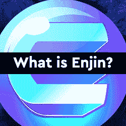

# 金恩在 Polkadot 上推出面向游戏和非功能游戏的功能

> 原文：<https://web.archive.org/web/https://dappradar.com/blog/enjin-launches-efinity-on-polkadot-for-gaming-nfts>

## 元宇宙的基础层已经到来

区块链游戏和 NFT 公司金恩本周在 Polkadot 上发布了期待已久的 Efinity parachain。Efinity 项目历时四年，将欢迎像《铁锈时代》、《失落的遗迹》和微软的《Azure Heroes》这样的项目。此外，它旨在成为元宇宙和区块链游戏的基础层。

在波尔卡多特生态系统中，完美是一个副链。Polkadot parachains 允许单个项目大规模创建自己的专用区块链，这是基于 NFT 的平台的一种变通办法，这些平台经常因大量交易而导致网络拥塞。此举允许金恩开始为寻求大规模启动 NFT 项目的项目分配资源、资金和支持。

四年前，当 NFT 的工业和技术快速发展，还没有找到主流的吸引力时，金恩引入了 Efinity 这个概念。从那以后，这个项目鲜为人知，直到 2021 年 7 月第一笔主要资金到位，当时它在由 Crypto.com 资本、DFG 集团和 Hashed 牵头的私人代币销售中筹集了 1900 万美元，随后通过 CoinList 进行了 2000 万美元的公开代币销售。

可以说，波尔卡多特通过其互操作性将自己定位为以太坊网络的有力竞争者。除了其他重要功能外，Polkadot parachain 平台是金恩和 Efinity NFTs 的理想选择。对于金恩生态系统和更广阔的 NFT 空间来说，这是一个重要的里程碑，[Efinity para chain 现已在 Polkadot](https://web.archive.org/web/20220929121744/https://polkadot.js.org/apps/?rpc=wss%3A%2F%2Frpc.efinity.io#/explorer) 上线。

[https://web.archive.org/web/20220929121744if_/https://www.youtube.com/embed/QQtRNr_aNIM?feature=oembed](https://web.archive.org/web/20220929121744if_/https://www.youtube.com/embed/QQtRNr_aNIM?feature=oembed)

## 游戏空间升温

金恩宣布这一消息的同时，竞争对手的平台开始找到自己的吸引力。Avalanche 最近宣布了一项 2.9 亿美元的基金，用于在其子网上推广 NFT 和 DeFi dapps，其中第一个是领先的 GameFi 平台 DeFi Kingdoms。

此外，金恩表示，它计划在 3 月底之前发布其 NFT.io 市场和原生钱包的测试版。其他确认将扩展到 Efinity 的项目包括 Lost 遗物、Dvision Network、SwissBorg、MyMetaverse、Age of Rust 和 PlayNFT Twitch 插件。

## 区块链游戏持续增长

根据最新的 [DappRadar x BGA 区块链游戏报告](https://web.archive.org/web/20220929121744/https://dappradar.com/blog/dappradar-x-bga-games-report-february-2022)，在 2 月份，平均每天有 110 万个独立活跃钱包(UAW)连接到一个区块链游戏，占更广泛的区块链行业使用量的 49%。

尽管最近的全球事件和短期内注意力从区块链游戏转移，游戏趋势和模式预示着乐观的前景。此外，投资继续流入区块链游戏和基础设施，2 月份筹集了 7.2 亿美元，Animoca Brands 成为领先的参与者。

或许更重要的是，顶级的赚钱游戏和 GameFi dapps 一直在保留——甚至扩大——它们的玩家基础。游戏类别正在不断发展和扩大。虽然趋势可能不像两个月前那样稳固，但观察到越来越多拥有大量观众的游戏 dapps 是一个强有力的增长指标。

## 为什么是波尔卡多？

Polkadot 是由以太坊的联合创始人和前首席技术官 Gavin Wood 博士构想的，旨在支持公平、安全、去中心化和弹性的网络愿景，在这种网络中，用户处于控制之中。这个想法现在被称为 Web 3.0，它基于以下核心原则:

*   真正的互操作性
*   经济和交易可扩展性
*   易区块链创新
*   能量效率
*   人人安全
*   用户驱动的治理

金恩在 Polkadot 上下了很大的赌注，并选择它作为技术堆栈来实现他们雄心勃勃的计划，并实现为世界 31 亿游戏玩家提供区块链家园的首要目标。

## 什么是完美？

“完美”是金恩对元宇宙基础层的分散式构想。Efinity 的第一个版本侧重于核心功能和链稳定性。创建者可以在每笔交易中为不同的钱包铸造多达 2200 个代币，批量转移允许每笔交易有类似的号码。

如前所述，Efinity 的动力来自于在区块链为全球 31 亿游戏玩家提供一个家的梦想。金恩需要区块链具有足够的可伸缩性来支持主流游戏，并且可以无限扩展来交付这样一个项目。同时，它需要一个跨链系统，可以托管任何加密货币或 NFT，无需智能合约部署。有了 Polkadot，用户无需征得创作者的同意，就可以将他们的资产转移到 Efinity 上。

超过 160，000 名 NFT 创作者已经在使用金恩平台，超过 100 个项目致力于建设 Efinity，更多项目将会公布。此外，这些早期采用者将首先通过新的金恩平台获得[服务。](https://web.archive.org/web/20220929121744/https://enjin.io/)

交易费用很低，允许团队和早期采用者在不损害安全性的情况下运行测试和基准。例如，一次标准的 NFT 转账目前应花费 0.016 EFI，约合 0.50 美元。然而，在链运行时代码的最初几次升级之后，这些数字将会改变。

## 什么是金恩？

简而言之，金恩是一种软件，它让开发者能够在以太坊区块链上创建和管理虚拟商品。其核心思想是，金恩可以帮助降低困扰区块链虚拟游戏内商品和收藏品转让的高额费用。该平台的核心是金恩本土的加密货币 ENJ，在金恩上创建的每个游戏内物品在 ENJ 都被赋予一个价值。

金恩发布了软件开发工具包(SDK)，允许用户在以太坊上创建数字资产，并将它们集成到游戏和应用程序中。每项铸造的资产都可以定制以适应平台，并记录在智能合同中，使这些物品具有加密货币的优势:速度、成本和安全性。

从三月初开始，Efinity 就已经在 Polkadot 的洛可可测试网络上上线了——今天，[它正式作为 parachain 在 Polkadot](https://web.archive.org/web/20220929121744/https://polkadot.js.org/apps/?rpc=wss%3A%2F%2Frpc.efinity.io#/explorer) 上上线了。

[<picture></picture>](https://web.archive.org/web/20220929121744/https://dappradar.com/blog/explained-enjin-enj-token-learn-about-the-enj-token/)[<picture></picture>](https://web.archive.org/web/20220929121744/https://dappradar.com/hub/token/eth/ENJ?from=0xf629cbd94d3791c9250152bd8dfbdf380e2a3b9c)[<picture></picture>](https://web.archive.org/web/20220929121744/https://dappradar.com/blog/search/?q=enjin)

***以上不构成投资建议。此处给出的信息仅供参考。请行使尽职调查，做你的研究。作者持有多种加密货币的头寸，包括 BTC、ETH 和 RADAR。***

 NewsletterUnsubscribe at any time. [T&Cs](https://web.archive.org/web/20220929121744/https://dappradar.com/terms) and [Privacy Policy](https://web.archive.org/web/20220929121744/https://dappradar.com/privacy-policy)