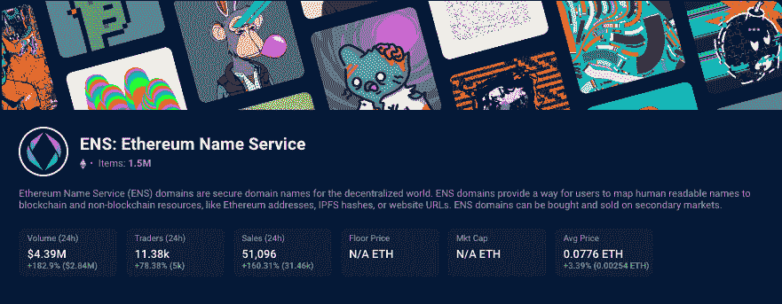

# ENS 域名大放异彩，Galz 崭露头角

> 原文：<https://web.archive.org/web/https://dappradar.com/blog/ens-domain-names-shine-and-galz-make-a-mark>

## 查看 6 月 26 日至 7 月 3 日之间的 NFT 销售亮点排名。

Bored Ape Yacht Club 和 CryptoPunk NFT 销售额占据了上周销售额前十名，因为逢低买入者继续利用 ETH 价值下跌获利。一如既往，DappRadar 希望为您带来 NFT 销售世界中最令人兴奋的事情，而不仅仅是最昂贵的事情。

CryptoPunk #7971 是过去七天中 NFT 最高的销售额，为 398.95 ETH，或 440，337 美元。然而，紧随其后的是一个三位数的以太坊域名服务域名，000.eth，售价为 300 ETH，约合 331，122 美元。前一周 NFT 销量排行榜的前五页揭示了许多三位数的 ENS 名称销量。包括 20 多万美元的 porno.eth。

[其他值得注意的销售](https://web.archive.org/web/20220813153434/https://dappradar.com/nft)包括售价近 21.5 万美元的 Autoglyphs#132、售价近 16 万美元的 Moonbird#6949，以及售价 130 ETH(约 14.3 万美元)的 BAYC Otherside 元宇宙的一块土地。除此之外，我们还看到了 Galz 系列的两次值得注意的销售，Galz#3749 和#3548 分别以 150 ETH 和 120 ETH 的价格售出。

**查看以下 NFT 销售亮点的完整列表:**

1.  [000 . ETH](https://web.archive.org/web/20220813153434/https://dappradar.com/hub/assets/eth/0x57f1887a8bf19b14fc0df6fd9b2acc9af147ea85/24293655359084398983762148957951887367734741115283469135310733710692111186993)-322，587 美元/300 ETH-[买家钱包](https://web.archive.org/web/20220813153434/https://dappradar.com/hub/wallet/eth/0xb34d849c0551c6a4c0d491224bcc6114b906afc4)
2.  [名词 25](https://web.archive.org/web/20220813153434/https://dappradar.com/hub/assets/eth/0x9c8ff314c9bc7f6e59a9d9225fb22946427edc03/25)-$ 221，148/200 ETH-[买家钱包](https://web.archive.org/web/20220813153434/https://dappradar.com/hub/wallet/eth/0x4548d498460599286ce29baf9e6b775c19385227)
3.  [Autoglyphs # 132](https://web.archive.org/web/20220813153434/https://dappradar.com/hub/assets/eth/0xd4e4078ca3495de5b1d4db434bebc5a986197782/132)-214，840.28 美元/ 199.79 瑞士法郎-[买家钱包](https://web.archive.org/web/20220813153434/https://dappradar.com/hub/wallet/eth/0xe0366455ef80c955c459adadbd54a5b0b6078a6f)
4.  [porno . ETH](https://web.archive.org/web/20220813153434/https://dappradar.com/hub/assets/eth/0x57f1887a8bf19b14fc0df6fd9b2acc9af147ea85/97256159826329296614326690875995122876421461714645313495292961881457211382476)-$ 200，192/184 ETH-[买家钱包](https://web.archive.org/web/20220813153434/https://dappradar.com/hub/wallet/eth/0x252e00419fa7b35f4bef92b6244097acc5c220a5)
5.  高尔兹·🦾💓⚡# 3749-166，095 美元/150 eth-[买家钱包](https://web.archive.org/web/20220813153434/https://dappradar.com/hub/wallet/eth/0x1191a2793b10bfc3db93074d9636ad544953e566)
6.  [月鸟# 6949](https://web.archive.org/web/20220813153434/https://dappradar.com/hub/assets/eth/0x23581767a106ae21c074b2276d25e5c3e136a68b/6949)-159443.02 美元/ 144.03 瑞士法郎-[买家钱包](https://web.archive.org/web/20220813153434/https://dappradar.com/hub/wallet/eth/0x3eaa1cbab87b235e1e5ca4585fd37811356ee46a)
7.  [other side # 95175](https://web.archive.org/web/20220813153434/https://dappradar.com/hub/assets/eth/0x34d85c9cdeb23fa97cb08333b511ac86e1c4e258/95175)的其他契约——143，880.89 美元/130 ETH——[买家钱包](https://web.archive.org/web/20220813153434/https://dappradar.com/hub/wallet/eth/0xba528b2e785b1e05c64b5c48c009fca19bf23df0)
8.  高尔兹·🦾💓⚡# 3548-132，786 美元/120 eth-[买家钱包](https://web.archive.org/web/20220813153434/https://dappradar.com/hub/wallet/eth/0x6e41a15d52d364f8194149fa3dcc383540781504)
9.  [fiden za # 992](https://web.archive.org/web/20220813153434/https://dappradar.com/hub/assets/eth/0xa7d8d9ef8d8ce8992df33d8b8cf4aebabd5bd270/78000992)-96782.41 美元/ 90 瑞士法郎-[买家钱包](https://web.archive.org/web/20220813153434/https://dappradar.com/hub/wallet/eth/0xca616ad592eaa206e60a9f6536d5769592685f21)
10.  [证明集体](https://web.archive.org/web/20220813153434/https://dappradar.com/hub/assets/eth/0x08d7c0242953446436f34b4c78fe9da38c73668d/456)-80，692.5 美元/75 ETH-[买家钱包](https://web.archive.org/web/20220813153434/https://dappradar.com/hub/wallet/eth/0x45632d932579861ca72dc93b50677795253f9bab)

使用 [NFT 浏览器](https://web.archive.org/web/20220813153434/https://dappradar.com/hub/nft-explorer)发现您最喜爱的 NFT 系列，并获得可操作的准确数据。

## 三位数的 ENS 名称

我们在上周看到的另一个趋势是几个 ENS 域名的高价值销售。以太坊域名服务(ENS)域类似于 DNS 域，为持有者提供了一种分散且安全的方式，将文本和数字转换为易于记忆的以太坊地址。即不再有长钱包地址。只需提供您的 ENS 域名。此外，某些集合，如 3 位数的域名，凭借其自身的权利已经成为[理想的 NFT 集合](https://web.archive.org/web/20220813153434/https://dappradar.com/nft)

## “坠崖”还是降温

最近，媒体指出 NFT 的销售已经跌入谷底。“当然，在点击量争夺战中，标题可能具有欺骗性，在处理数据时，细微差别至关重要。理解[NFT 刚刚经历了他们最激动人心的阶段](/web/20220813153434/https://dappradar.com/blog/dapp-industry-report-q1-2022-overview/)是至关重要的。因此，从一段时期的炒作到今天的熊市场景的任何数据比较都将表明一种负面趋势。

然而，在最近一次 DappRadar 对顶级或蓝筹 NFT 藏品的评估中，我们观察到它们的实际价值超过了 ETH。自 5 月底以来，BAYC collection 的价值刚刚缩水 1.5%，而 ETH 的价格同期下跌了 47.44%。如果我们看看变异猿(-1.7%)、密码朋克(+40.5%)、涂鸦(+5.2%)，甚至克隆 X(下降了 11.5%)，公平地说，这部分已建立的 NFT 项目表现为比 ETH 本身更安全的资产。

受欢迎的 NFT 收藏品可以对冲代币价格的波动。因此，及时了解即将推出的 NFT 系列和现有系列的价值至关重要。使用 [NFT 浏览器](https://web.archive.org/web/20220813153434/https://dappradar.com/hub/nft-explorer)可以让你洞察市场上数百件 NFT 收藏品的价格。前往[您自己的 DappRadar 投资组合中心](https://web.archive.org/web/20220813153434/https://dappradar.com/hub/wallet/)，连接您的钱包，然后开始。

[<picture></picture>](https://web.archive.org/web/20220813153434/https://dappradar.com/blog/what-are-non-fungible-tokens-nfts)[<picture></picture>](https://web.archive.org/web/20220813153434/https://dappradar.com/nft/marketplaces)[<picture></picture>](https://web.archive.org/web/20220813153434/https://dappradar.com/nft/sales) NewsletterUnsubscribe at any time. [T&Cs](https://web.archive.org/web/20220813153434/https://dappradar.com/terms) and [Privacy Policy](https://web.archive.org/web/20220813153434/https://dappradar.com/privacy-policy)