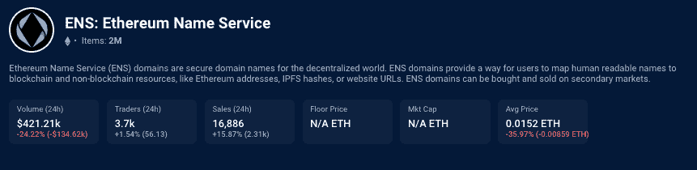
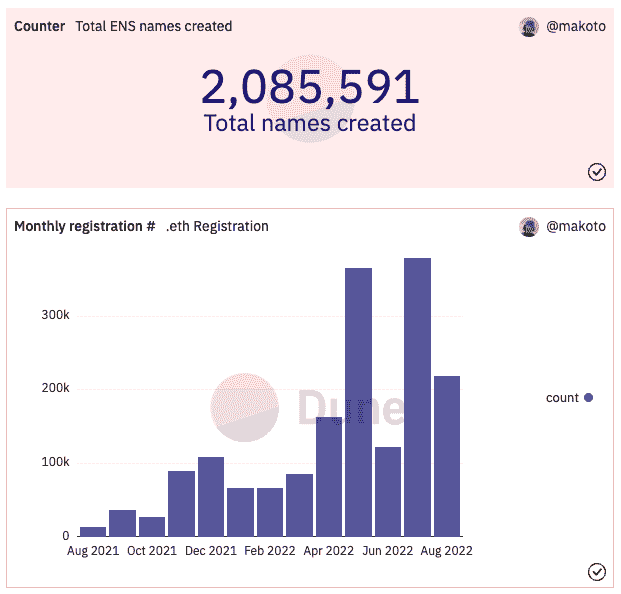
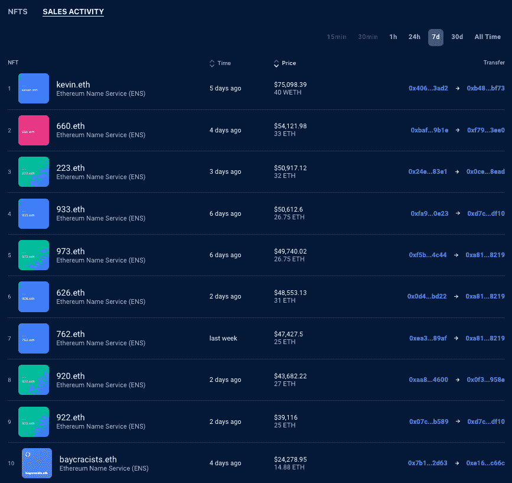
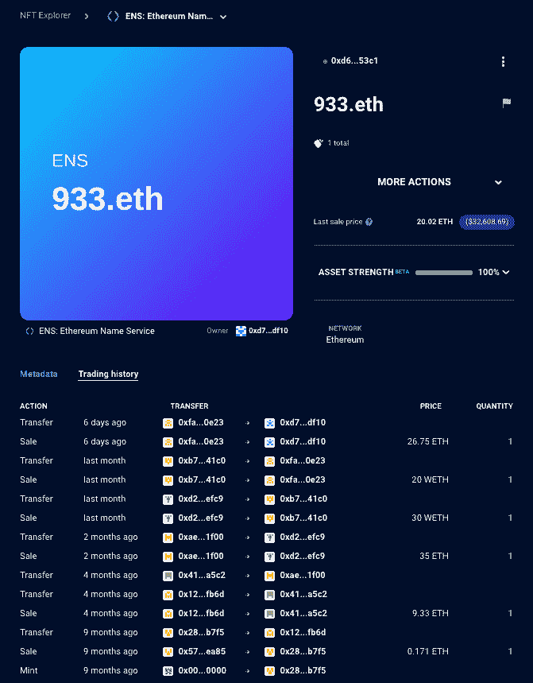

# ENS 注册在 000.eth 出售 300 ETH 后激增

> 原文：<https://web.archive.org/web/https://dappradar.com/blog/ens-registrations-surge-after-000-eth-sale-for-300-eth>

## ENS 上创建的姓名总数现已超过 200 万

对以太坊域名的需求似乎正在上升，8 月份注册了近 219，000 个。这个尖峰似乎是在域名 [**000.eth 于 2022 年 7 月以 300 ETH**](https://web.archive.org/web/20220925231815/https://dappradar.com/hub/assets/eth/0x57f1887a8bf19b14fc0df6fd9b2acc9af147ea85/24293655359084398983762148957951887367734741115283469135310733710692111186993) **或大约 315，000 美元购买之后出现的。根据 DappRadar 的数据，以 ETH 和美元计算，这是有史以来最高的销售额。**

7 月是以太坊域名创纪录的一个月，有超过 378，000 个 ENS 注册。这个数字让 6 月份刚刚超过 122，000 的注册人数相形见绌。8 月份还剩一周左右，总注册量可能会超过 7 月份，因为在过去 24 小时内，ENS 销量飙升了 15%以上。

Source: [DappRadar](https://web.archive.org/web/20220925231815/https://dappradar.com/hub/nft-explorer/collection/ens)

销售激增的刺激因素似乎是几个月来第一次低以太坊燃气费的完美风暴，以及以 000.eth '换 300 ETH 的销售，这可能引发了购买的连锁反应，导致注册量激增。根据 ENS Dune analytics 仪表板，ENS 上创建的名称总数现已超过 200 万。

Source: [Dune Analytics](https://web.archive.org/web/20220925231815/https://dune.com/makoto/ens)

查看 ENS 一级和二级市场销售额的历史数据 , [000.eth](https://web.archive.org/web/20220925231815/https://dappradar.com/hub/assets/eth/0x57f1887a8bf19b14fc0df6fd9b2acc9af147ea85/24293655359084398983762148957951887367734741115283469135310733710692111186993) 是 ENS 域名有史以来最高的美元和 eth 销售额。再往深里看，除了去年发生的 artdao.eth，有史以来最高的销售额都发生在 2022 年，很多都是在过去几个月。

考虑到 ENS 在 2017 年推出，大约五年后的激增是一个有趣的观察，因为人们争先恐后地保护自己的 Web3。000.eth 属于三位数的 ENS 域名类别，其中只有 999 个可供出售。

作为以太坊上 NFT 集合的第一个版本，000 具有很高的价值，其他 3 位数组合如 420 或 999 也是如此。[查看过去七天的 ENS 销售额](https://web.archive.org/web/20220925231815/https://dappradar.com/hub/nft-explorer/collection/ens/sales-activity?period=week&order-by=priceInFiat)可以更清楚地看出这一点，因为 10 个中有 8 个是价格标签在 40，000 美元左右的三位数域名。

Source: DappRadar

进一步放大 [ENS domain 933.eth](https://web.archive.org/web/20220925231815/https://dappradar.com/hub/assets/eth/0x57f1887a8bf19b14fc0df6fd9b2acc9af147ea85/10938272959323397018746538775688558279959463402601384644064026506419701036871) 的销售，我们可以更清楚地看到过去九个月的交易历史。一辆原本为 0.171 ETH 铸造的 NFT，最后售价超过[26.75 wet](https://web.archive.org/web/20220925231815/https://dappradar.com/hub/assets/eth/0x57f1887a8bf19b14fc0df6fd9b2acc9af147ea85/10938272959323397018746538775688558279959463402601384644064026506419701036871)。对于一个除了作为域名的预期目的之外几乎没有其他用途的 NFT 来说，这是一个不错的利润率。

Source: DappRadar

三位数名称的发布使 [ENS NFTs](https://web.archive.org/web/20220925231815/https://dappradar.com/hub/nft-explorer/collection/ens) 一夜之间变成了投机资产。随着媒体开始关注，人们开始对 [ENS 域名](https://web.archive.org/web/20220925231815/https://dappradar.com/hub/nft-explorer/collection/ens)产生了浓厚的兴趣，投机者开始圈圈下注，赌哪个品牌将很快需要 ENS，而他们还没有获得域名。在下面的前十名中，你可以看到 [opensea.eth](https://web.archive.org/web/20220925231815/https://dappradar.com/hub/assets/eth/0x57f1887a8bf19b14fc0df6fd9b2acc9af147ea85/100567917540867090294947113176792694600738763480337589720715443766007246631145) ，opensea 自己是否购买了这个还是个未知数。

Source: DappRadar

DappRadar [报道了一年多前投机者抢注 nike.eth](https://web.archive.org/web/20220925231815/https://dappradar.com/blog/speculators-eye-up-ens-nft-domains) 、tesla.eth 等品牌名称，重要的是在 [ENS 空投事件](https://web.archive.org/web/20220925231815/https://dappradar.com/blog/ethereum-name-service-ens-token-claim-now-live)之前，这让许多人非常高兴，因为数千美元被发放给了 ENS 的早期采用者

以太坊基金会最初开发了 ENS 注册表，但在 2018 年成为一个独立的基金会。随着 ENS 越来越受欢迎，ENS 生态系统越来越大，它需要一个新的治理结构来保持分散化。因此，在 2021 年 11 月，ENS 基金会[通过空投](https://web.archive.org/web/20220925231815/https://dappradar.com/blog/ethereum-name-service-ens-token-claim-now-live)向其所有现有的域名注册人推出了 ENS 令牌。

## ENS 是什么？

[以太坊域名服务](https://web.archive.org/web/20220925231815/https://dappradar.com/hub/nft-explorer/collection/ens)，或 ENS，是一个开放的分布式命名服务和域名协议，建立在[以太坊区块链，](https://web.archive.org/web/20220925231815/https://dappradar.com/blog/what-is-ethereum-dappradars-ultimate-guide)之上，允许用户为他们所有的钱包地址和分散的网站创建一个简单的用户名。

在基本层面上，它允许用户将难以记忆的区块链钱包地址替换为 Iankane.eth 之类的简单地址，而不是 0x d6e 7a 25039 ea 9 af 1 ff 1968 CD 960 e 0024 dbca 53 c 1。此外，用域名替换钱包地址也降低了输入地址时出现输入错误的几率。这些名字类似于互联网上的域名，作为 NFTs 出售[。](https://web.archive.org/web/20220925231815/https://dappradar.com/blog/what-are-non-fungible-tokens-nfts)

在某种程度上，它非常类似于域名服务(DNS)。DNS 用我们称之为 URL 的人类可读标签代替 IP 地址。在 DNS 发明之前，用户必须记住复杂的、机器友好的 IP 地址才能浏览互联网。

## 以太坊费用发生了什么变化？

在过去的两年里，以太坊的平均汽油费几乎没有低于 40 美元，2022 年 5 月接近 200 美元。随着牛市行情席卷加密市场，天然气费用飙升，围绕 NFTs 和 DeFi 的[炒作达到顶峰](https://web.archive.org/web/20220925231815/https://dappradar.com/blog/bsc-report-2021-a-year-in-review)。然而，情况似乎正在发生变化，费用正在降低。

激增的另一个原因可能是 ENS 域可以充当分散网页的 URL。虽然有某些限制。eth 网站，持有人可以创建一个 HTML 网页，人们可以使用您的 ENS 域导航。此外，如果一个分散的网站是不够的，子域功能是有用的。

如果我注册了 iankane.eth，我可以创建几个子域，如 crypto.iankane.eth 或 admin.iankane.eth。子域允许注册人将一个 ENS 域用于多个应用程序或出售子域。

子域可以帮助 [NFT 项目](https://web.archive.org/web/20220925231815/https://dappradar.com/nft)结合基于 PFP 的集合和基于名称的项目的优点，更重要的是，通过右键单击保存反对者来消除 NFT 盗窃。图像是可以伪造的。一个域不能。简单地说，在 Twitter 上找到所有的猿 PFP 并不容易，例如，只找到真正的猿 PFP 几乎是不可能的。

使用#apefollowape 这样的标签曾经在收藏数量很少的时候有效，但在过去的六个月里，对用户来说变得更加棘手了。跟踪一个领域可以说是容易得多，观察这种趋势是否会流行将会很有趣。

## 是什么推动了 NFT 项目的成功？

首先要理解的是，是什么推动了一个 NFT 项目的成功。这不是代币，空投，或被动收入。这是文化，不仅仅是 NFTs 的专利。文化根植于人性之中。人们希望感觉自己是世界上某个特殊事物的一部分。如果没有这种感觉，任何 NFT 项目都不会成功。

在 BAYC 早期，猿类突袭俱乐部会所聊天，Discord 活动猖獗，在 Twitter 上超级活跃。此外，一个社区不仅仅是许多人持有一些令牌或 NFT。这是一群代表某项事业或品牌的人，他们可能会佩戴徽章来证明这一点。你甚至可以说，一个真正的 NFT 社区更像一个家庭，而不是一个社区。当价格下跌时，他们都感受到了冲击。当它抽水时，他们都庆祝。

如今，[成功的 NFT 项目](https://web.archive.org/web/20220925231815/https://dappradar.com/nft)关注于围绕一个共同的 PFP 建立一个社区。这是一个屡试不爽的方法，看起来是一个成功的方案。然而，我们在这里看到的 ENS 域显示了一些有趣的东西。PFPs 不是建立社区的唯一方式。

[https://web.archive.org/web/20220925231815if_/https://www.youtube.com/embed/5taZqqlawV0?feature=oembed](https://web.archive.org/web/20220925231815if_/https://www.youtube.com/embed/5taZqqlawV0?feature=oembed)

***以上不构成投资建议。此处给出的信息仅供参考。请行使尽职调查，做你的研究。作者持有多种加密货币的头寸，包括 BTC、瑞士法郎和雷达。***

 NewsletterUnsubscribe at any time. [T&Cs](https://web.archive.org/web/20220925231815/https://dappradar.com/terms) and [Privacy Policy](https://web.archive.org/web/20220925231815/https://dappradar.com/privacy-policy)