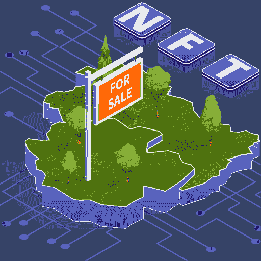
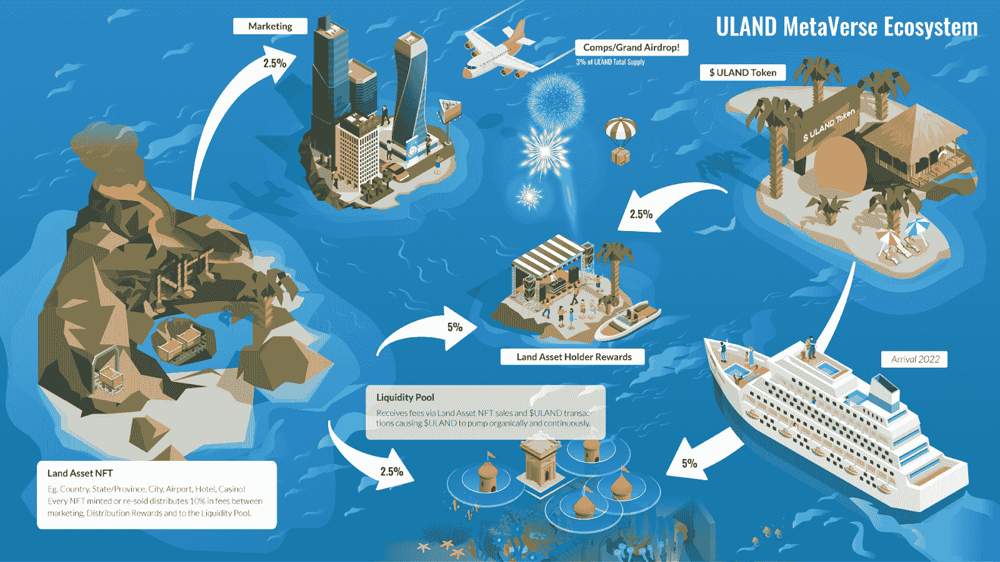

# 带着乌兰和它的乌兰令牌进入元宇宙

> 原文：<https://web.archive.org/web/https://dappradar.com/blog/enter-the-metaverse-with-uland-and-its-uland-token>

## 你需要知道的关于乌兰的一切都在这里

**乌兰是币安智能链上的一个虚拟世界和 NFT 平台，允许用户购买代表现实世界地理位置的 NFT 土地。随着元宇宙在游戏玩家、收藏家和密码爱好者中不断获得声望，乌兰德的目标是在虚拟世界和现实世界之间架起一座桥梁。**

乌兰德为密码爱好者提供了一种享受元宇宙和 NFT 空间的方式。更重要的是，有机会拥有自己的城市，州，甚至国家。在撰写本文时，乌兰德已经完成了首次全国销售。该平台现在正在积极提供各个州和地区的销售。

重要的是，乌兰德旨在创建一个完整的经济生态系统，同时绘制元宇宙现实生活中的国家地图。由于该平台的本地令牌 Uland，NFT 业主可以通过在 ULAND 拥有一块土地来获得被动收入。

拥有一个乌兰 NFT 可以让你完全决定你的土地的命运。无论是一个城市，一个地区，还是一个国家，认为 NFT 赋予你成为那片土地的国王和全能统治者的权利。当然，您可以更改您的地块名称。最终真正地将纽约改名为大苹果，将东京改名为新东京。

## 奖励和乌兰令牌

除了提供现实世界和元宇宙之间的创新桥梁，乌兰德还旨在创造一个逼真的游戏中的经济等级。实现这一点的主要设备来自平台的本机 ULAND 令牌。

例如，当收藏者购买代表美国的 NFT 时，他们将获得一笔乌兰代币的被动收入，用于此后出售的每个地区和城市。令人印象深刻的是，佣金占每笔销售额的 10%，这是一笔相当丰厚的奖励。

此外，乌兰代币有助于重要的功能，如流动性池和乌兰生态系统的营销工作。

作为 BEP-20 令牌，乌兰德可以很容易地交换和转移到其他区块链和生态系统。您可以使用 [DappRadar 代币交换服务](https://web.archive.org/web/20221208152854/https://dappradar.com/hub/token/bsc/ULAND?from=0x9789df6753b7f813a1c55ed20ecf83571dfde428)交换您的乌兰代币。只要在这里连接你的钱包[，用乌兰兑换币安智能链上的任何其他代币。](https://web.archive.org/web/20221208152854/https://dappradar.com/hub/token/bsc/ULAND?from=0x9789df6753b7f813a1c55ed20ecf83571dfde428)

随着平台进入土地出售的第三阶段，DappRadar 将继续监测 Uland。要了解乌兰，请访问他们的官方 dapp 页面[这里](https://web.archive.org/web/20221208152854/https://dappradar.com/binance-smart-chain/games/uland)。如果你想先了解最新的元宇宙新闻，请在[推特](https://web.archive.org/web/20221208152854/https://twitter.com/dappradar)上关注 DappRadar，并加入我们的 [Discord](https://web.archive.org/web/20221208152854/https://discord.gg/4ybbssrHkm) 社区。

 NewsletterUnsubscribe at any time. [T&Cs](https://web.archive.org/web/20221208152854/https://dappradar.com/terms) and [Privacy Policy](https://web.archive.org/web/20221208152854/https://dappradar.com/privacy-policy)