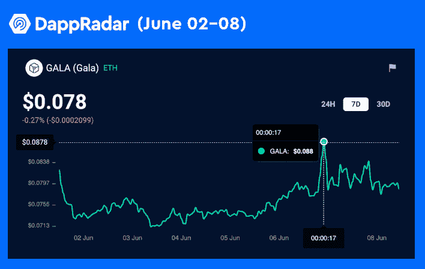
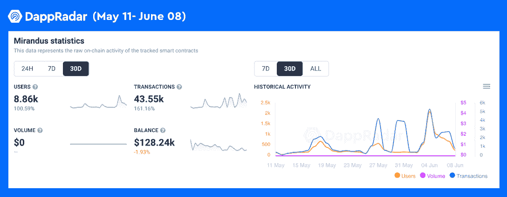

# Epic Games Store 通过 Gala Games 添加区块链游戏 GRIT

> 原文：<https://web.archive.org/web/https://dappradar.com/blog/epic-games-store-adds-blockchain-game-grit-by-gala-games>

## 《惊雷》是一款 NFT 驱动的皇家战斗射击游戏

**Gala Games 宣布其游戏赚取(P2E)射击游戏 GRIT 将登陆 Epic 游戏商店。这有可能让 Gala 的区块链游戏生态系统扩展到多元化的玩家群体。**

**概要:**

*   Gala Games 《惊雷》将是 Epic Games Store 上首批 P2E NFT 游戏之一。
*   要开始这个游戏，玩家需要去 Gala Games 商店并获得他们的 gunslingers，这是一个收集了 10，000 个独特的游戏内 NFT 角色的游戏。
*   消息公布后，春晚上涨了 18%。
*   Gala 最受欢迎的游戏 dapp[Mirandus](https://web.archive.org/web/20220705003117/https://dappradar.com/ethereum/games/mirandus)尽管市场动荡，但仍取得了出色的数据表现，用户数量和交易量分别增长了 100%和 161%。

2022 年 6 月 6 日，区块链游戏公司 [Gala Games](https://web.archive.org/web/20220705003117/https://dappradar.com/blog/tag/gala-games) 宣布其狂野西部射击游戏 [GRIT 将在 Epic Games 商店](https://web.archive.org/web/20220705003117/https://twitter.com/GoGalaGames/status/1533783142364073986)首次亮相。Epic Games 运营的店面为超过 1.9 亿 PC 和 Mac 用户提供服务。它为玩家提供世界上最受欢迎的游戏，比如堡垒之夜。

根据 [Gala 的官方媒体博客](https://web.archive.org/web/20220705003117/https://blog.gala.games/epic-news-from-grit-dbaae34c23b9)，GRIT 将是 Epic Games Store 上首批与 P2E 机械师合作的 web3 游戏之一。这表明区块链游戏开发商和发行商可以向商店提供多个游戏 dapps。由于 Epic 庞大的玩家基础，这一战略举措将使 Gala 游戏更接近主流。

## 玩家需要一个枪手 NFT 来启动砂砾

[https://web.archive.org/web/20220705003117if_/https://www.youtube.com/embed/-A7ZbEmwSl0?feature=oembed](https://web.archive.org/web/20220705003117if_/https://www.youtube.com/embed/-A7ZbEmwSl0?feature=oembed)

《惊雷》是一款皇家战役游戏，枪手们在西部荒野中以单人、双人或小队比赛的形式为奖励而战。因此，玩家需要[从 Gala Games 商店获得枪械才能开始游戏。](https://web.archive.org/web/20220705003117/https://app.gala.games/games/buy-item/0x036d00000000000000000000000000000000?currency=GALA)10，000 名独特的 NFT 枪手将在角色盒中出售。值得注意的是，每个角色都有独特的属性和特征组合。

字符盒的销售将分阶段进行，每个阶段都有不同的价格。每个阶段持续 24 小时，从欧洲中部时间下午 1:45 开始。详细的销售时间表如下:

*   6 月 6 日——Galaverse 与会者——600 美元。
*   6 月 7 日——方正节点许可证持有者——1200 美元。
*   6 月 8 日——黄金庆典——1500 美元。
*   6 月 9 日——公开销售——二级市场底价的 50%,硬底价为 1500 美元。

在撰写本文时，用户可以在 Gala 中以大约 1.5 万英镑的价格购买一个角色盒，这是 GALA 游戏的生态系统标志。那些第一次参加庆典的玩家可能钱包里还没有庆典代币，但他们不需要担心。借助 DappRadar 易于使用的[代币交换](https://web.archive.org/web/20220705003117/https://dappradar.com/hub/token/eth/GALA?from=0x15d4c048f83bd7e37d49ea4c83a07267ec4203da)工具，用户可以轻松地用 GALA 代币充值。此外，用户可以利用 [DappRadar 投资组合跟踪器](https://web.archive.org/web/20220705003117/https://dappradar.com/hub/wallet/)来显著提高他们的加密资产管理效率。无论是 NFTs 还是加密货币，DappRadar Portfolio Tracker 都为用户提供了一个直观的界面来了解他们的加密财富的表现。

## 公告发布后，GALA 上涨了 18%

GALA 是 Gala Games 生态系统的本土标志，在宣布消息后的 24 小时内上涨了近 18%，飙升至 0.088 美元。积极的表现可能是由捷报或因出售枪手 NFT 而增加的节日需求引发的。

根据五月版的 DappRadar 行业报告，区块链博彩业是行业熊市动荡中最具抵抗力的部门。例如，与 4 月份相比，[每日唯一活跃钱包](https://web.archive.org/web/20220705003117/https://dappradar.com/industry-overview)的数量仅下降了 5%。

NFT 的交易量也出现了类似的趋势。我们发现 NFT 板块在 5 月份产生了 37 亿美元。尽管以美元价值衡量，这比 4 月份下降了 20%，但代币价值的变化仅下降了 6.5%。

此外，值得注意的是，高质量的区块链游戏甚至可以跑赢熊市。一个很好的例子就是 Gala 的 [Mirandus](https://web.archive.org/web/20220705003117/https://dappradar.com/ethereum/games/mirandus) 。令人印象深刻的是，幻想 RPG 游戏在过去 30 天内吸引了 8，860 名独立用户加入 dapp，增幅高达 100%。此外，Mirandus 同期登记了 43，350 笔交易，增长超过 161%。所有这些都仅仅基于 NFT 收藏的交易，因为游戏本身还没有上线。

DappRadar 将继续关注 GRIT、Gala Games 生态系统以及 NFT 游戏领域的最新发展。在 [Twitter](https://web.archive.org/web/20220705003117/https://twitter.com/dappradar) 、 [Discord](https://web.archive.org/web/20220705003117/https://discord.gg/4ybbssrHkm) 和 [Youtube](https://web.archive.org/web/20220705003117/https://www.youtube.com/c/DappRadar) 上关注我们，跟上区块链世界的动态。