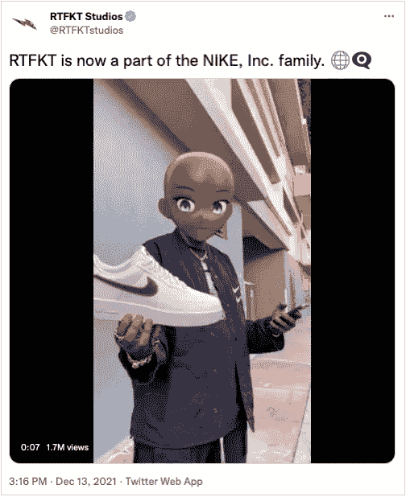

# 电竞平台连锁游戏将生态系统带入沙盒

> 原文：<https://web.archive.org/web/https://dappradar.com/blog/esport-platform-chain-games-brings-ecosystem-into-the-sandbox>

## 沙盒和连锁游戏的新伙伴关系是区块链长期互利关系中的最新一例

[**沙盒**](https://web.archive.org/web/20220929043146/https://dappradar.com/ethereum/games/the-sandbox) **和** [**连锁游戏**](https://web.archive.org/web/20220929043146/https://dappradar.com/ethereum/games/chain-games)**‘新伙伴关系’在迈向一个真正的元宇宙的征途中凸显了合作的力量。最新的配对加入了越来越多的共生杂交名单，表明在新的网络世界中没有人可以独自行动。**

合作关系很简单:Chain Games 的目录可以通过沙盒进行游戏。这种合作确保了双方的即时合作。沙盒受到追捧，高质量的内容和连锁游戏可以即时访问拥有大量受控观众的既定虚拟基础设施。

最近的新闻稿更详细:“用户可以在连锁游戏和沙盒生态系统中体验跨平台互操作的 NFT 游戏内资产。”更简单地说，用户不会被限制在他们最初设计的平台上使用他们的 NFT。用户还将能够在沙盒中使用[链](https://web.archive.org/web/20220929043146/https://dappradar.com/hub/token/eth/CHAIN_1?from=0xC4C2614E694cF534D407Ee49F8E44D125E4681c4)令牌，这意味着已经建立了一个资产商店的游戏玩家将不会在新环境中从头开始。

但是，尽管有交叉工作和合作，每个平台最终还是希望尽可能长时间地将用户控制在自己的生态系统中。这就是沙盒与 Chain Games 合作的原因，Chain Games 可以提供一些元宇宙平台自己做不到的事情:

*   AAA 游戏——这是连锁游戏的主要卖点。有趣的游戏如超级卡丁车和 Chaino 在区块链爱好者中很受欢迎。像《使命召唤》、Madden NFL 和 FIFA 这样的重量级游戏将吸引那些寻找与他们习惯的游戏类似的主机游戏玩家。
*   **忠实的粉丝群**–转向沙盒游戏的部分原因是渴望与更广泛的受众建立联系。但是连锁游戏有自己的忠实追随者，他们肯定愿意在沙盒里玩。它的[网站显示它已经有 20，000 多名粉丝](https://web.archive.org/web/20220929043146/https://chaingames.io/#partners)准备好加入这个派对。

## 交叉伙伴关系:每个人都是赢家？

没人知道区块链和元宇宙的未来会怎样。 [SAND](https://web.archive.org/web/20220929043146/https://dappradar.com/ethereum/games/the-sandbox) ，沙盒的原生令牌，去年 11 月达到 8.40 美元。这比 1 月份增长了 23，233%。当我写下这句话的时候，我已经看到价格下跌了几美分，跌至 3.95 美元。这当然是一次惊心动魄的旅程，但却不是大公司和投资者所期待的那种稳赚不赔的赌注。

然而，尽管这个全新的世界不稳定，大公司还是蜂拥加入元宇宙，因为他们认为早期采用是控制未来市场的最佳方式。阿迪达斯已经购买了土地，并在沙盒中建造了[AdiVerse](https://web.archive.org/web/20220929043146/https://dappradar.com/blog/adidas-enters-the-metaverse-joins-the-sandbox)；耐克收购了 RTFKT Studios 来设计其数字时尚品牌。[脸书将它的名字改成了 Meta](https://web.archive.org/web/20220929043146/https://dappradar.com/blog/into-the-metaverse-visa-facebook-steve-aoki-and-lionel-messi/) 和[微软收购了动视暴雪](https://web.archive.org/web/20220929043146/https://slickdeals.net/article/news/activision-blizzard-microsoft-xbox-game-pass/?utm_source=verizonnews&utm_medium=rss&utm_campaign=verizonnews&utm_term=210145&utm_content=article)，这是巩固其未来元宇宙产品的早期举措。

沙盒是众多平台中的一个，在这些平台上，知名企业可以分享这项技术的前沿。在过去的一年里，它宣布与史努比·道格、T2、里奇·霍丁、T4、马格努斯游戏和蓝精灵合作。这种关系是双向的:沙盒拥有技术诀窍；内容创作者让人们着迷。

但是，如果元宇宙仅仅是现有公司的数字店面，那么它真的是一种去中心化的方式吗？还是仅仅是我们已经拥有的世界，以像素和区块链重新呈现？

建造它，他们会来，似乎是沙盒的座右铭。在这个虚拟梦的领域里，沙盒建立了一个平台，理论上，这个平台应该是由社区为社区创造的。几年后，如果人们试图创造的数字乌托邦没有成为公司推销产品的另一个地方，这将是一件有趣的事情。