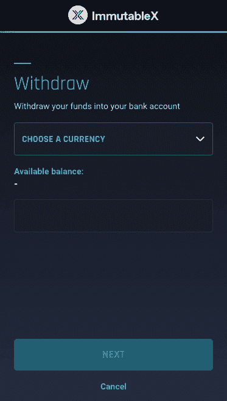
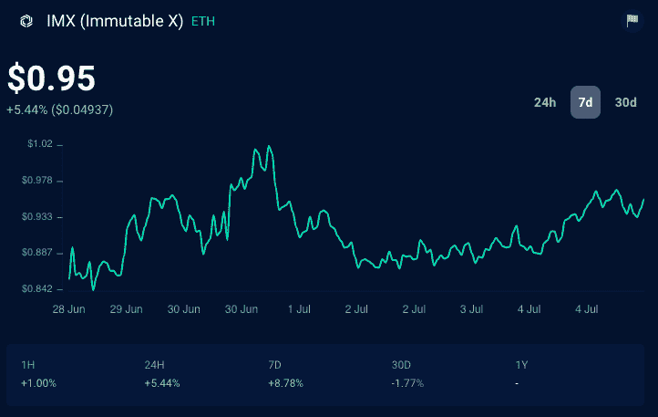
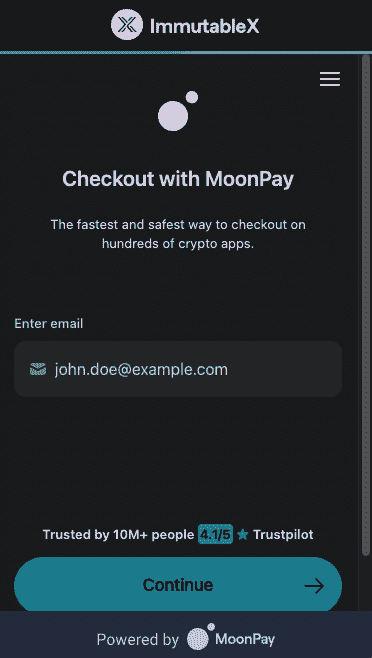

# ETH 出站现在可用于不可变的 X Dapps

> 原文：<https://web.archive.org/web/https://dappradar.com/blog/eth-off-ramp-now-available-for-immutable-x-dapps>

## Immutable 继续倾听其社区的声音，并为未来而努力

不可变 X 为 ETH 引入了一个 off-xramp。现在，基于不可变 X 区块链的 dapps 用户可以直接将他们的加密货币转移到他们的银行账户。今天来自网络背后的公司 Immutable 的消息表明，该平台正全速前进，走向光明的未来。

**总结**

*   ***不可变 X 是一个主要为游戏而建的网络。像《被解放的神》、《守护者协会》、《伊鲁威姆》和《高楼》都是在这个平台上建造的。***
*   当其他平台都在控制开支和寻求削减成本时，Immutable X 现在正在开发它的产品，以赶上行业复苏。
*   ***随着越来越多的公司让加密货币交易变得更加容易，社会应该预见到区块链技术的大规模采用。***

尽管目前围绕 web3 有一些坏消息，但 Immutable 仍在继续扩展其 Immutable X 网络的可能性。

不可变 X 背后的公司最近发布了一系列公告，所有这些都在由[报道。这一最新消息，即开发商建设的网络现在可以启用 ETH 的匝道，是另一个迹象表明，区块链技术是在良好的手中。](https://web.archive.org/web/20220813161524/https://dappradar.com/blog/staking-with-immutable-x)

## 不可变 X 实现了 ETH 出站

不可变 X 为在该平台上构建的开发人员引入了一个 [ETH](https://web.archive.org/web/20220813161524/https://dappradar.com/hub/token/eth/ETH) 出口。建立在网络上的 dapps 用户现在可以出售 ETH，并将收入直接存入他们的银行账户。

> 1/重大更新！现在，任何开发人员都可以使用 offramp 来构建一个[@不可变](https://web.archive.org/web/20220813161524/https://twitter.com/Immutable?ref_src=twsrc%5Etfw) X powered platform
> 
> 开发人员可以让他们的用户出售 L2 [$ETH](https://web.archive.org/web/20220813161524/https://twitter.com/search?q=%24ETH&src=ctag&ref_src=twsrc%5Etfw) ，并将收益直接存入他们的银行账户。[https://t.co/DmiyWV8wYy](https://web.archive.org/web/20220813161524/https://t.co/DmiyWV8wYy)
> 
> 下面继续👇[pic.twitter.com/Uhm214oy2E](https://web.archive.org/web/20220813161524/https://t.co/Uhm214oy2E)
> 
> — Immutable | $IMX ⓧ (@Immutable) [July 5, 2022](https://web.archive.org/web/20220813161524/https://twitter.com/Immutable/status/1544155189166641152?ref_src=twsrc%5Etfw)

Source: Twitter

最低取款金额设定为 0.015 ETH。使用我们的令牌资源管理器查看 ETH，了解更多的美元价值。用户可以选择将他们的 ETH 兑换成哪种法定货币。

目前，只有美国、英国和欧洲的最终用户可以使用 ETH 出口。Immutable 也将在 2022 年第三季度为其[本地市场](https://web.archive.org/web/20220813161524/https://market.immutable.com/)实现该特性。

Image: Immutable X

Immutable 的联合创始人罗比·弗格森(Robbie Ferguson)说:“每一个建立在 Immutable 基础上的游戏、市场和应用都让菲亚特走下了坡道。”。离主流化又近了一步。

最后一句话应该让 web3 社区感到兴奋。很快，加密货币的交易将如此无缝，人们将看不到瑞士法郎和美元或者 BNB 和英镑之间的区别。大规模采用已经看起来像是一个时间的问题，而不是如果。

## 不可变的 X 继续构建

此举是因为 Immutable X 背后的团队继续寻找为开发者改善其生态系统的方法。他们最近还宣布了一项 5 亿美元的基金，以吸引创作者加入该平台。

DappRadar 上周还报道了 Immutable X 的新的[自我监护协议](https://web.archive.org/web/20220813161524/https://dappradar.com/blog/staking-with-immutable-x)。在最近一连串的[账户冻结](https://web.archive.org/web/20220813161524/https://dappradar.com/blog/insolvency-looms-as-celsius-freezes-customers-out)和 [DeFi 倒闭](https://web.archive.org/web/20220813161524/https://dappradar.com/blog/terra-validators-pause-network-as-luna-drops-to-zero/)之后，Immutable 显然在有意识地努力减轻人们对使用其区块链的担忧。

在短时间内连续取得这么多里程碑式的成就丝毫没有影响不变的 X 的 [IMX](https://web.archive.org/web/20220813161524/https://dappradar.com/hub/token/eth/IMX?from=0xf57e7e7c23978c3caec3c3548e3d615c346e79ff) 令牌的价格。在过去的 24 小时里，上涨了 5.4%。在过去的七天里，它上涨了 8.8%。

[<picture></picture>](https://web.archive.org/web/20220813161524/https://dappradar.com/hub/token/eth/IMX?from=0xf57e7e7c23978c3caec3c3548e3d615c346e79ff)

[IMX seven-day trend on DappRadar’s Token Explorer](https://web.archive.org/web/20220813161524/https://dappradar.com/hub/token/eth/IMX?from=0xf57e7e7c23978c3caec3c3548e3d615c346e79ff)

总体而言，代币价值比历史最高值低 89%，但其最近的上升显示了平台在[构建社区认为有用的产品](https://web.archive.org/web/20220813161524/https://dappradar.com/blog/introducing-radar-cross-chain-token-staking)时可以发现的真正价值。

## 与 MoonPay 合作的不可变 X

不可变 X 的加密到菲亚特的功能是与 [MoonPay](https://web.archive.org/web/20220813161524/https://dappradar.com/blog/moonpay-brings-easy-crypto-purchases-to-metamask/) 合作完成的。MoonPay 是一个平台，提供了一种快速简便的买卖加密货币的方式。当 Immutable X 选择 MoonPay 作为其合作伙伴，为基于其区块链的 dapps 提供直接入口时，这两个团队已经合作过。

MoonPay 已经成为许多想要购买 NFT 但不知道如何获得加密货币的用户的首选方法。对于那些想要进入区块链世界，但还没有完全掌握[分散市场](https://web.archive.org/web/20220813161524/https://dappradar.com/rankings/category/marketplaces)、[汽油费](https://web.archive.org/web/20220813161524/https://dappradar.com/blog/when-are-ethereum-gas-fees-lowest)和[代币交换](https://web.archive.org/web/20220813161524/https://dappradar.com/token/staking)的复杂性的新 web3 用户来说，这是一个很好的入口。

MoonPay 平台实现了从加密到法定的最终交易。正如 MoonPay 所做的一切一样，这个工具是以用户为中心构建的。因此，如果你发现自己将加密货币从不可变的 X dapp 转移到银行账户，请期待易用性和直观的体验。

Image: Immutable X

随着不变的 X 故事的进展，我们将通过我们的[博客](https://web.archive.org/web/20220813161524/https://dappradar.com/blog/)和[推特](https://web.archive.org/web/20220813161524/https://twitter.com/DappRadar)更新你的一切。

 NewsletterUnsubscribe at any time. [T&Cs](https://web.archive.org/web/20220813161524/https://dappradar.com/terms) and [Privacy Policy](https://web.archive.org/web/20220813161524/https://dappradar.com/privacy-policy)