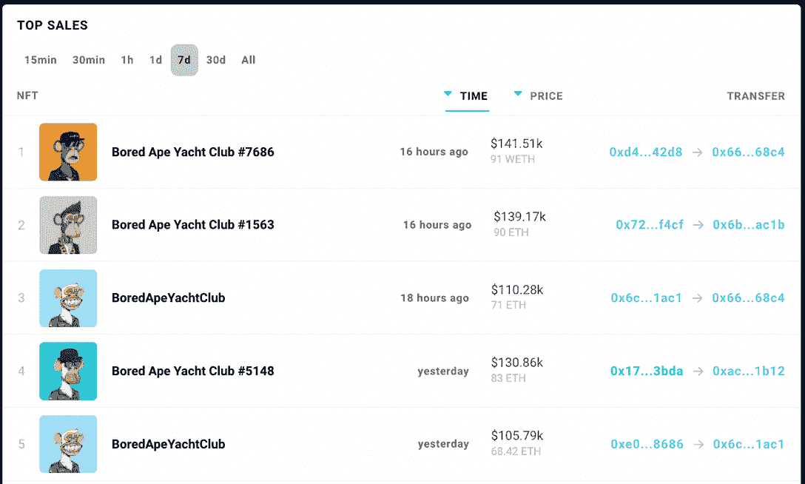
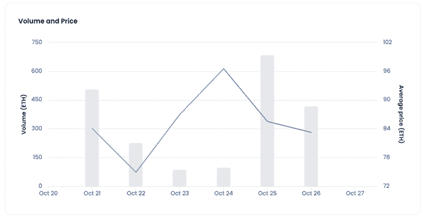
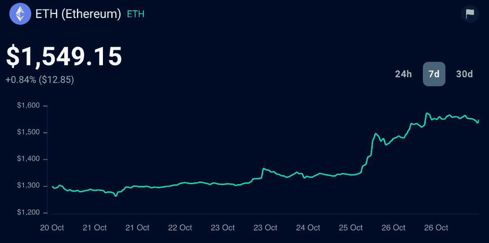

# ETH Pump 导致 Bored Ape NFTs 交易量增加 100%

> 原文：<https://web.archive.org/web/https://dappradar.com/blog/eth-pump-causes-bored-ape-nfts-trading-volume-to-increase-by-100>

## 最近乙醚价格的上涨使得非挥发性有机物的价值大大增加，这迅速影响了市场

ETH 的价值增长了 12%,这导致建造在区块链以太坊上的 NFT 的价值也相应增长，业主们利用突然的升值来出售 ETH。这使得高价值 NFT 收藏品的交易量激增，如 Bored Ape 游艇俱乐部和突变 Ape 游艇俱乐部的交易量增长了 100%。

## 突出

*   昨日，以太坊价格飙升，无聊猿游艇俱乐部(Bored Ape Yacht Club)和变异猿游艇俱乐部(variant Ape Yacht Club)等收藏品的交易量翻了一番，这一举动令 NFT 市场迅速加速。
*   以太坊最受欢迎的 NFT 市场 OpenSea 同期交易人数增加了 35%。
*   你可以在 DappRadar 的 NFT 总览看到最近最贵的 NFT 拍卖会。

## 价值越大，投机性越大

众所周知，NFT 投资者购买数字资产既是为了长期持有，也是为了短期转手。无论谁在以太升值期间持有像 BAYC 这样的蓝筹 NFT，都会发现自己有一个赚快钱的好机会(也是有风险的)。

当然，这一切都是基于一个假设，即这些收藏者以低于出售价格的价格购买了这些艺术品。

你可以在 DappRadar 上的 Bored Ape 收藏中找到所有 NFT 交易的列表，按出售时间或价值排序。

Source: DappRadar NFT Overview

[View Bored Ape NFTs Top Sales](https://web.archive.org/web/20221128090715/https://dappradar.com/nft/sales)

在撰写本文时， [Bored Ape collection](https://web.archive.org/web/20221128090715/https://dappradar.com/ethereum/collectibles/bored-ape-yacht-club) 的底价为 73.3 ETH(约合 113597 美元)，[突变 Ape NFTs](https://web.archive.org/web/20221128090715/https://dappradar.com/ethereum/collectibles/mutant-ape-yacht-club) 的底价为 13.2 ETH(约合 20493 美元)。

随着乙醚价格的上涨，NFT 成为贸易界的热门商品。无聊猿游艇俱乐部和变异猿游艇俱乐部的交易量增加了 100%，这要归功于最近的乙醚价格泵。

看看 BAYC 系列的成交量和平均售价在一周内是如何变化的。

Source: [OpenSea](https://web.archive.org/web/20221128090715/https://dappradar.com/multichain/marketplaces/opensea)

随着 ETH 价值的持续上升，我们可以期待看到 NFT 市场的更多活动。

查看以下同期价格。

Source: [DappRadar Token Explorer](https://web.archive.org/web/20221128090715/https://dappradar.com/hub/token/eth/ETH)

加密货币市场的影响已经不是第一次冲击 NFTs 了。我们最新的 NFT 行业报告显示，NFT 金融业在第三季度出现下滑，但环比指标仍保持乐观。

## 并非所有的 NFT 交易都有利可图

在炒作期间，另一个奇怪的事件引起了社区的注意。富兰克林，NFT 的一个有影响力的人，也是 BAYC 收藏中第六大非自然科学收藏家，意外地以令人难以置信的低价卖掉了他的一只猿，[无聊猿#7303](https://web.archive.org/web/20221128090715/https://dappradar.com/hub/assets/eth/0xbc4ca0eda7647a8ab7c2061c2e118a18a936f13d/7303) 。

> 无聊猿游艇俱乐部#7303 在 Blur
> 
> 上以 9.0 ETH(13221 美元)的价格售出🔗[https://t.co/76DIC0PoXD](https://web.archive.org/web/20221128090715/https://t.co/76DIC0PoXD)T4
> 🧾:0x3071297f70302473eb38e3ca47258c5ff839c83c3c400804771c6c82fe83c6c8[pic.twitter.com/bGh41xywKH](https://web.archive.org/web/20221128090715/https://t.co/bGh41xywKH)
> 
> — BAYC Sales Bot (@ape_sales_bot) [October 25, 2022](https://web.archive.org/web/20221128090715/https://twitter.com/ape_sales_bot/status/1585011639559954432?ref_src=twsrc%5Etfw)

然后，为了重新组合他的收藏和他的绰号“富兰克林有 61 只猿”,他又回来买了一只与他之前卖掉的那只相似的 NFT——这次是以正常的市场价格。

富兰克林以 69.9 ETH 买入 Bored Aped #2368，导致对他不利的交易。事故是由于他的*【胖手指】*，正如他在一条推文中所暴露的，这让他的钱包里少了 60.9 less，大约 9 万美元。

您可以使用 DappRadar 投资组合跟踪工具检查富兰克林的百万富翁钱包中的所有 NFT。

[View Franklin’s 61 Bored Ape NFTs on Portfolio Tracker](https://web.archive.org/web/20221128090715/https://dappradar.com/hub/wallet/eth/0xed2ab4948ba6a909a7751dec4f34f303eb8c7236/nfts)

## 了解最新的 NFT 新闻

如果你想了解更多关于 NFTs 的信息，[我们的指南和报告](https://web.archive.org/web/20221128090715/http://dappradar.com/blog/)将向你介绍这个不断发展的领域。

此外，DappRadar 允许您监督和管理您的 NFT 投资组合，并跟踪以太坊上的最佳收藏。请看下面的视频。

[https://web.archive.org/web/20221128090715if_/https://www.youtube.com/embed/fkEaXYLOW-s?feature=oembed](https://web.archive.org/web/20221128090715if_/https://www.youtube.com/embed/fkEaXYLOW-s?feature=oembed)

不要错过最新的 NFT 新闻。在 [Twitter](https://web.archive.org/web/20221128090715/https://twitter.com/DappRadar) 上关注我们，或者加入我们的 [Discord](https://web.archive.org/web/20221128090715/https://discord.com/invite/4ybbssrHkm) 服务器，实时更新热门应用和收藏。

### 有用的链接

*   [查看以太坊上的 NFT 收藏浏览器](https://web.archive.org/web/20221128090715/https://dappradar.com/hub/nft-explorer)
*   [查看您的加密和 NFT 投资组合跟踪器](https://web.archive.org/web/20221128090715/https://dappradar.com/hub/wallet/)
*   [查看最近 NFT 销量排行榜](https://web.archive.org/web/20221128090715/https://dappradar.com/nft/sales)
*   [通过 DappRadar 的指南了解所有关于 NFT 的知识](https://web.archive.org/web/20221128090715/https://dappradar.com/blog/category/nft)

***以上不构成投资建议。此处给出的信息仅供参考。请尽职调查并自行研究。***

 NewsletterUnsubscribe at any time. [T&Cs](https://web.archive.org/web/20221128090715/https://dappradar.com/terms) and [Privacy Policy](https://web.archive.org/web/20221128090715/https://dappradar.com/privacy-policy)