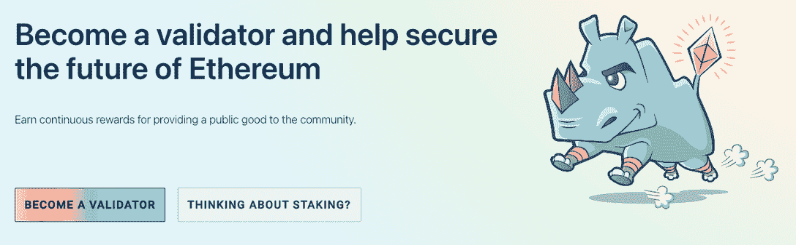
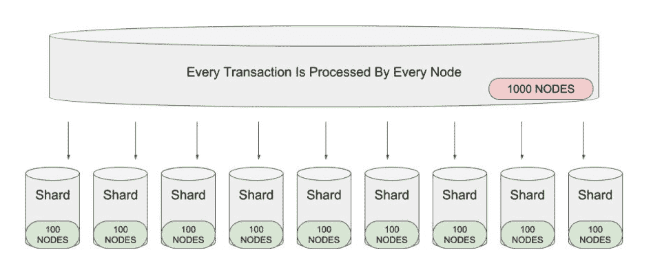
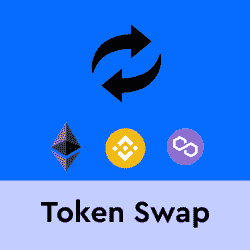

# 以太坊 2.0:你需要知道的五件事

> 原文：<https://web.archive.org/web/https://dappradar.com/blog/ethereum-2-0-five-things-you-need-to-know>

## 处于领先地位的区块链将如何重新确立其主导地位？

*原文章发表于 2021 年 7 月 13 日。*

*本故事更新于 7 月 15 日*。

7 月 30 日是以太坊的生日。以下是关于以太坊 2.0 你需要知道的五件重要事情。

以太坊第一块开采完毕，以太坊主网于 2015 年 7 月 30 日上线。

可以肯定地说，领先的区块链在过去一直受到攻击。从币安智能链到 Polygon network 的追求者都在寻求推翻以太坊，并从这一至关重要的市场份额中分一杯羹。

目前，以太坊并没有给竞争对手制造太多困难，因为网络已经成为自身成功的奴隶。缓慢的交易时间和高昂的费用是社区的主要问题。但是，以太坊正在加快 2.0 的改进和期待已久的合并。

[点击此处了解以太坊合并的最新进展](https://web.archive.org/web/20220930122415/https://dappradar.com/blog/what-is-the-ethereum-merge)

因此，了解以太坊的变化对社区和网络本身的影响是很重要的。它会变得更快、更便宜、更安全吗？

以下是关于以太坊 2.0 你需要知道的五件事。

## 以太坊 2.0 正在放弃工作证明

也许这是最重要的变化。以太坊将放弃其工作证明共识机制，转而支持利益证明系统。

早期区块链实施遇到性能问题的一个主要原因是，它们依赖于一个称为工作证明的过程来验证和记录事务。

在这样的系统中，计算机节点相互竞争以生成满足网络确定的复杂程度的加密散列。工作证明的问题在于它的设计效率低下，并且需要大量的计算能力。

根据股权证明，用户提出——或“股权”——硬币作为一种首付形式。作为回报，他们获得在网络上验证交易的权利，并获得更多代币。

每个节点都必须用自己的货币来参与，这意味着攻击网络的成本太高。虽然这代表了一个关键的变化，但它只是让以太坊变得更便宜、更快的因素之一。

[<picture></picture>](https://web.archive.org/web/20220930122415/https://launchpad.ethereum.org/en/)

## 以太坊 2.0 中的分片

将一个区块链分割成多个区块链的过程称为分片。以太坊 2.0 将使用分片来增加交易和验证的数量。

在以太坊区块链的当前设置中，添加到链中的所有数据都必须经过所有参与节点的验证。

这意味着整个系统的处理速度受限于最慢的参与者的速度。这造成了一个瓶颈，增加了交易成本，降低了吞吐量。

通过添加分片，以太坊 2.0 可以大幅提高其资源使用效率。新系统将通过将数据验证任务分解到几组节点中来实现这一点，每个节点将负责验证它收到的数据。

这使得整个区块链都可以利用并行处理，从而提高整体处理能力。结合前面提到的转换到股权证明系统，新的以太坊区块链应该更快、更高效。

## 电子瓦斯取代 EVM

以太坊作为智能合约平台的可行性的一个关键特征是它实现了所谓的以太坊虚拟机(EVM)。

EVM 是一个运行在所有网络节点上的执行环境，有助于智能合约的使用。EVM 的智能合约可以运行游戏，执行复杂的金融交易，甚至可以运营社交网络。这些是以太坊生存的支柱。

尽管 EVM 被广泛使用，但它仍然被大量误解——即使对于具有高度编程技能的人来说也是如此。为了解决这个问题，以太坊 2.0 将在一个他们称之为 eWASM 的系统中开始使用 web 汇编语言。

使得在今天的网络浏览器中执行以太坊应用程序代码成为可能，这是对 EVM 的一个显著改进。

此外，它将允许程序员从 Rust、C 和 C++等几种语言中进行选择，来编写在区块链上运行的代码。它的意图是，引入 eWASM 将增加生态系统中潜在程序员的数量，帮助以太坊进一步发展并增加其提供的服务。

## 以太坊 2.0 的燃气费

以太坊目前由一群分散的矿工保护着。要使用该平台，用户需要向矿工支付天然气费。费用由矿商根据完成交易所需的能源/天然气来确定。

他们有权忽略甚至根据你支付的油费金额来决定交易的优先顺序。当需求超过网络的处理能力时，费用就会增加，小额交易就会变得非常昂贵。

这就是以太坊的现状。这意味着它只能在一秒钟内处理 15 笔交易。费用是指数级的高，因为这个问题，网络中的许多项目没有产生很大的回报。

这无疑对网络上发生的许多发展的可伸缩性和可持续性有影响。因此，为什么在 2021 年，我们已经看到[几个高调的应用程序切换到多边形侧链或 BSC](/web/20220930122415/https://dappradar.com/blog/apeswap-swings-onto-polygon/) 给用户他们想要的。

以太坊希望将其每秒可以处理的交易数量提高到 15 万次左右。以太坊 2.0 旨在帮助实现这一目标，并使网络更加安全。

如前所述，网络拥堵是以太坊燃气费高的主要原因之一。分片将增加网络可以处理的交易数量，减少网络拥塞，从而降低交易费用。简而言之，分散负荷会降低成本。

DappRadar 社区的成员可以每周参加激动人心的加密令牌空投和赠品活动。创建一个帐户，并查看哪些[免费加密空投](https://web.archive.org/web/20220930122415/https://dappradar.com/hub/airdrops)正在进行！

[<picture></picture>](https://web.archive.org/web/20220930122415/https://dappradar.com/hub/airdrops)[<picture></picture>](https://web.archive.org/web/20220930122415/https://dappradar.com/hub/swap/eth)[<picture></picture>](https://web.archive.org/web/20220930122415/https://dappradar.com/blog/faq-token-swap-on-dappradar)[<picture></picture>](https://web.archive.org/web/20220930122415/https://dappradar.com/blog/step-by-step-guide-how-to-use-token-swap-on-dappradar)

## ETH 令牌会怎么样？

围绕社区的一个关键问题是–以太坊 2.0 会是一个全新的硬币吗？当前的 ETH 控股公司会发生什么变化？

简单来说，以太坊 2.0 不是新的，而是现有硬币的改进版本。ETH 2.0 的变化还没有完全具体化，它的发布被推迟到后续的升级阶段。

DappRadar 将继续关注以太坊在 web3 领域的发展。如果你想了解更多关于以太坊、Dapps 和 DeFi 的知识，请查看我们的[DeFi](https://web.archive.org/web/20220930122415/https://dappradar.com/blog/decentralized-finance-defi-dappradars-ultimate-guide)终极指南。

 NewsletterUnsubscribe at any time. [T&Cs](https://web.archive.org/web/20220930122415/https://dappradar.com/terms) and [Privacy Policy](https://web.archive.org/web/20220930122415/https://dappradar.com/privacy-policy)

***以上不构成投资建议。此处给出的信息仅供参考。请行使尽职调查，做你的研究。作者在瑞士联邦理工学院、BTC、ADA、NIOX、AGIX、SAFEMOON、SDAO、CAIT、CAKE、LINK、GRT、CRO、SHIBA INU 和 OCEAN 任职。***