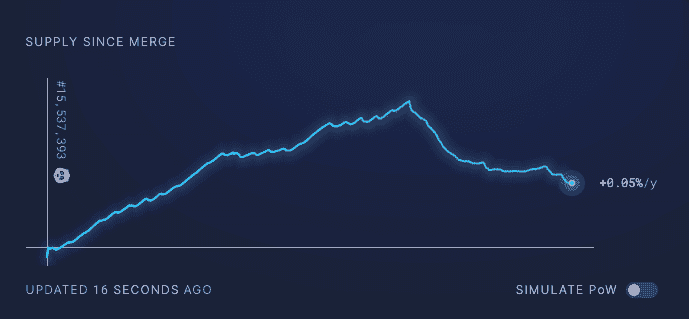
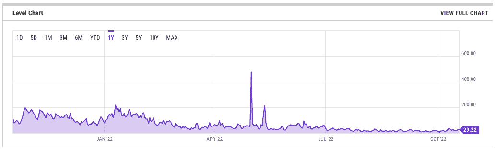
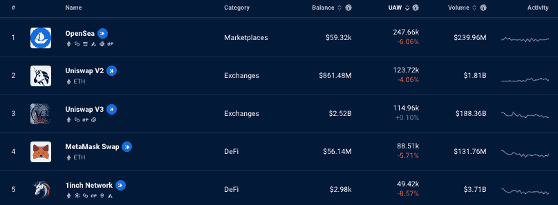
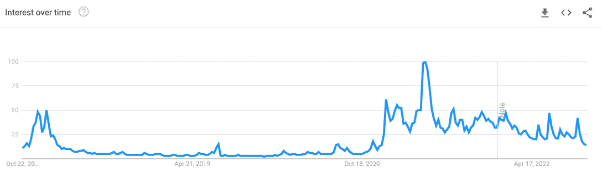

# 以太坊合并一个月后:有什么不同？

> 原文：<https://web.archive.org/web/https://dappradar.com/blog/ethereum-merge-one-month-on-whats-different>

## 期待已久的合并现在完成了，但是对用户来说改变了什么呢？

随着以太坊主网和信标链的合并，以太坊区块链完成了从工作证明到利益证明的转变。合并发生在 2022 年 9 月 15 日，因为网络转移到 PoS 而没有问题，看到基于硬件的矿工被股份 ETH 的验证器取代。

区块链和密码领域最相关的问题是，接下来会发生什么？以太坊基金会一直致力于发展里程碑的长期路线图，合并也不例外。仅仅一个月后，该基金会宣布上海升级，其中 Staked Ether (sETH)退出和较低的天然气费是一些预期的发展。

Check out Ethereum Dapps

在世界上最知名的智能合约区块链可能是最重要的事件之后，了解普通用户发生了什么变化至关重要。

合并有几个原因:价值创造和安全解除[难度定时炸弹](https://web.archive.org/web/20221130125937/https://dappradar.com/blog/what-is-the-ethereum-merge)是核心原因。但是用户和更广泛的世界可以期待更多的好处:

*   一个巨大的优势是，乙醚现在是一种通货紧缩货币，随着费用不再交给矿业公司，供应量不断减少。
*   随着更多升级的推出，汽油费将会降低，而分片将于 2023 年上线。

*   交易验证所需的能量将会减少。一些消息来源称，合并发生后，交易所需的能源将减少约 99.95%。
*   长期可持续性是合并的一个重要原因。以太坊的开发者现在所做的改变将会带来长期的好处，并使团队能够进入他们路线图的下一个阶段。没有合并，合并后的升级将是不可能的。
*   从 dapp 的角度来看，DappRadar 希望看到更多的 dapp 在以太坊上推出。

[Discover Ranking Dapps](https://web.archive.org/web/20221130125937/https://dappradar.com/rankings/protocol/ethereum)

## ETH 变得通货紧缩

通货紧缩加密资产是加密货币、硬币和代币，每当代币转移发生时，总供应量就会减少。简而言之，以太坊不再被创造，这意味着货币变得越来越稀缺，反过来，随着时间的推移越来越有价值。

这并没有立即发生，但在 10 月中旬，比特币基地的一份报告显示，ETH 达到了合并后的里程碑，因为它自区块链以太坊转向股权证明以来首次出现通缩。

它变成了通货紧缩，因为用于验证交易的 ETH 比同期创造的要多。这使得 10 月第二周的供应量减少了 0.13%，相当于约 4000 枚代币。自合并以来，新 ETH 的创建率下降了近 90%。

Source: [UltraSound Money](https://web.archive.org/web/20221130125937/https://ultrasound.money/)

## 汽油费

尽管以太坊主要开发商在合并前发表了许多不同的评论，但合并后的天然气费用有望大幅下降。蒂姆·贝科告诉《财富》杂志，合并不会立即大幅降低天然气费用。

这些减少将(显然)在明年碎片链引入时发生。这将使以太坊更具可扩展性，并减少每个以太坊用户都知道并支付的拥塞问题。

尽管如此，天然气费用同比下降了 75%以上，与 2022 年夏天 NFT 狂热高峰期见证的 50 美元以上的费用相去甚远。以太坊现在的平均油费约为 20 gwei。

Source: YCharts

## 以太坊上的更多 dapps

从 dapp 的角度来看，一个期望是更多的 dapp 将在合并后的以太坊上启动，而不是在第 1 层或第 2 层解决方案上启动。虽然现在看到任何有意义的影响还为时过早，但我们看到了稳定的活动。以太坊拥有约 50 万个与其 dapps 连接的独立活跃日常钱包。

以太坊上领先的 dapps 已经存在一段时间了。 [Uniswap V2](https://web.archive.org/web/20221130125937/https://dappradar.com/ethereum/exchanges/uniswap-1) 和 [V3](https://web.archive.org/web/20221130125937/https://dappradar.com/ethereum/exchanges/uniswap-v3) 领先 dex， [Opensea 领先 NFT 交易](https://web.archive.org/web/20221130125937/https://dappradar.com/ethereum/marketplaces/opensea)，清晰展现了以太坊上加密用户的趋势。

有趣的是，我们看到 [Polygon Bridge 做得很好](https://web.archive.org/web/20221130125937/https://dappradar.com/ethereum/defi/polygon-pos-bridge),因为用户将资产桥到 Polygon，在那里他们发现低费用和 dapps 提供相同的服务。这表明，虽然以太坊可能已经转危为安，但它仍然不是普通用户的首选平台。

数据显示，与顶级以太坊 dapp 连接的独立活跃钱包数量逐月下降约 6%。如前所述，期待大幅上涨还为时过早。观察未来几个月的发展会很有趣。

在技术和成本节约层面，以太坊基金会已经指出了 dapp 构建者在[以太坊生态系统](https://web.archive.org/web/20221130125937/https://dappradar.com/rankings/protocol/ethereum)合并后的诸多优势:

*   块结构:电源块将不再存在。取而代之的是，“功率块的先前内容变成了在信标链上创建的块的组成部分。”
*   时隙/块计时:平均块时间将会改变。目前，它们需要大约 13 秒。合并后，阻塞时间将正好是 12 秒。
*   操作码变化:当前以太坊脚本中的一些操作码将变得无关紧要，其他的将保留。
*   链上随机性的来源:这将发生在链上，从而降低 dapps 的成本。
*   安全头和终结块的概念:这影响到终结块变得规范的速度。有了 PoS，这将加快速度。

面对上述所有变化，开发人员必须调整他们的代码以适应新的范例。然而，以太坊基金会淡化了 dapps、 [NFTs](https://web.archive.org/web/20221130125937/https://dappradar.com/nft) 和[区块链游戏平台](https://web.archive.org/web/20221130125937/https://dappradar.com/topic/games)大规模中断的风险。根据他们网站上的说法，“合并只会对以太坊上部署的合同子集产生最小的影响，其中没有一个会被破坏。”

## 以太坊合并总结

区块链以太坊是密码行业的基础支柱，每年都变得越来越主流。ETH 是第二受欢迎的加密货币，人们平均每月在谷歌上搜索以太坊 200 万次。

Source: [Google Trends for Ethereum](https://web.archive.org/web/20221130125937/https://trends.google.com/trends/explore?date=today%205-y&q=Ethereum)

ETH 的市值已经超过 1000 亿美元，以太坊区块链成为开发人员构建去中心化应用程序和推出 NFT 集合的热门选择。

此外，尽管其他区块链和 dapps 的崛起，以太坊仍然拥有令人垂涎的 OG 地位，仍然是推出 NFT 系列的首选平台。

以太坊合并从根本上改变了以太坊区块链，以追求更大的可扩展性和安全性，同时需要更少的能源使用。这一举动可能会对更广泛的密码行业产生连锁反应，可以密切关注。

如果你想了解更多关于以太坊区块链的知识，你可以阅读我们的以太坊终极指南，或者直接进入[以太坊 dapp 排名](https://web.archive.org/web/20221130125937/https://dappradar.com/rankings/protocol/ethereum)，看看哪些 dapp 创造了价值并留住了他们的受众。

## 随身携带您的 Web3 之旅

使用 DappRadar 移动应用程序，再也不会错过 Web3。查看最受欢迎的 dapps 的性能，并关注您投资组合中的 NFT。您在 DappRadar 上的帐户会与我们的移动应用程序同步，这样您很快就可以选择实时接收提醒。

[Download the DappRadar app now](https://web.archive.org/web/20221130125937/https://dappradar.app.link/blog)[<picture></picture>](https://web.archive.org/web/20221130125937/https://play.google.com/store/apps/details?id=com.portfolio.dappradar)

**以上不构成投资建议。此处给出的信息仅供参考。请行使尽职调查，做你的研究。作者持有 ETH、BTC、AGIX、HEX、LINK、GRT、CRO、OMI、不可变 X、GALA、AVASTR、GMEE、CUBE、RADAR、FLOW、FTM、BNB、SPS、WRLD、ATOM 和 ADA。**