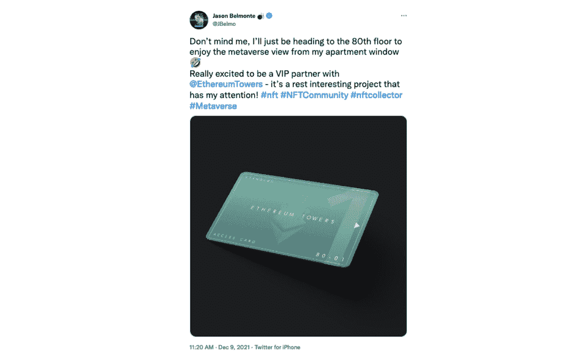

# 以太坊塔强调他们的社区

> 原文：<https://web.archive.org/web/https://dappradar.com/blog/ethereum-towers-puts-emphasis-on-their-community>

## 一个以社区为中心的元宇宙为你的梦想虚拟公寓

以太坊塔为他们的元宇宙世界增添了更多以社区为中心的元素。一些元宇宙项目一直面临着社区整合度和用户保留率低的挑战。通过高度可定制的虚拟公寓，该团队旨在通过开创公共生活的垂直模式来打破元宇宙的想法。

以太坊塔是一个以社区为中心的垂直元宇宙，由两个相同的 101 层塔楼组成。居民将以不可替代的代币形式拥有他们虚拟公寓的所有权(NFT)。这些国家森林公园将授予所有者进入元宇宙以太坊的权利。每个 NFT 公寓都被部署为以太坊网络上的一个 ERC-721 令牌。

## 强大的社区

去年 11 月，元宇宙的一块虚拟土地以 430 万美元的天价售出。元宇宙为人们创造了一个可以玩耍、工作和与他人联系的地方，不受任何地理界限的限制。以太坊塔将为业主提供一个完全可定制的空间，他们可以在那里举办活动或将其作为逃避日常工作的场所。

以太坊塔所描绘的未来社交网络和生活方式的蓝图已经引起了许多既定项目和个人的关注。澳大利亚职业保龄球手杰森·贝尔蒙特现在“住”在第 80 层。NBA 球员迈克尔·卡特·威廉姆斯和橄榄球明星尼科·桑切斯也是这个社区的成员。MLB 运动员 Lance McCullers 和 NFL 的 Jeremy Chinn 都搬进了以太坊大厦。

元宇宙最大的分权组织 vEmpire 的 Dominic Ryder 现在是一名顾问，提供丰富的经验和社交机会。以太坊塔的合作网络不断扩大，妇女的世界，老板美女，捷利康加入网络，还有更多尚未宣布。

没有强大的社区支持，几乎不可能有一个成功的 NFT 项目。它们一起茁壮成长。一个高度参与的社区的力量可以破坏并潜在地形成新的互动方式。此外，这些关系可以实现更加公平和创新的业务方法。

## 垂直世界相对于水平世界的优势

随着元宇宙成长为一个全功能的虚拟世界，基于不同的用例使元宇宙多样化是合理的。人们相信会有各种类型的元诗句吸引不同的观众。一些元诗句有重要的内容，如游戏，而其他可能是博物馆和艺术中心。以太坊塔的世界提供了一个社区，用户对他们完美家园的想象可以在这里实现。

现存的元宇宙世界中的土地通常以水平方式延伸。这种开放的宇宙设置似乎赋予了用户无限的创新空间，但它通常缺乏社区整合，组织松散。结果，成千上万块土地相互之间没有有机联系。此外，它极大地降低了用户体验，最终可能会影响用户保留率。

与水平的元宇宙模型相比，垂直的模型可以与人们对现实世界财产的感知相一致，例如公寓生活。这样，就降低了新用户进入元宇宙的知识壁垒。此外，以太坊塔的垂直元宇宙有一个精心设计但灵活的用户旅程。此外，它还自诩为一个平台，使以社区为中心的元宇宙社交网络。

## 以太坊塔作为社区建筑

以太坊塔楼结构由 4388 个居民拥有的公寓和各种公共区域组成。以太坊塔中有 3 种不同类型的公寓，它们的大小和塔的覆盖范围不同。每栋塔楼共有 101 层，1-99 层仅包含标准和豪华公寓。100-101 层仅包含顶层公寓。公寓供应量的差异决定了它们的稀有性。

公寓稀有度细分如下:

*   标准:每塔 1980(总共 3960)-90.24%
*   豪华:每座 198 英镑(总共 396 英镑)——9.02%
*   顶层公寓:每栋 16 套(共 32 套)——0.73%

## 关于以太坊塔

以太坊塔是一个以社区为中心的垂直结构，由 4388 个居民拥有的公寓和各种公共区域组成，位于元宇宙以太坊世界内。该项目将继续扩展，为所有用户提供一个不断发展的、令人兴奋的和社会动态的体验。

[网站](https://web.archive.org/web/20230117215129/https://ethereumtowers.com/)
[light paper](https://web.archive.org/web/20230117215129/https://ethereumtowers.com/#LIGHTPAPER)
[不和](https://web.archive.org/web/20230117215129/https://discord.gg/ethereumtowers)
[Opensea](https://web.archive.org/web/20230117215129/https://opensea.io/collection/ethereum-towers)

**免责声明** —这是一篇赞助文章。DappRadar 不认可本页面上的任何内容或产品。DappRadar 旨在提供准确的信息，但读者应该在采取行动之前总是自己做研究。DappRadar 的文章不能被认为是投资建议。