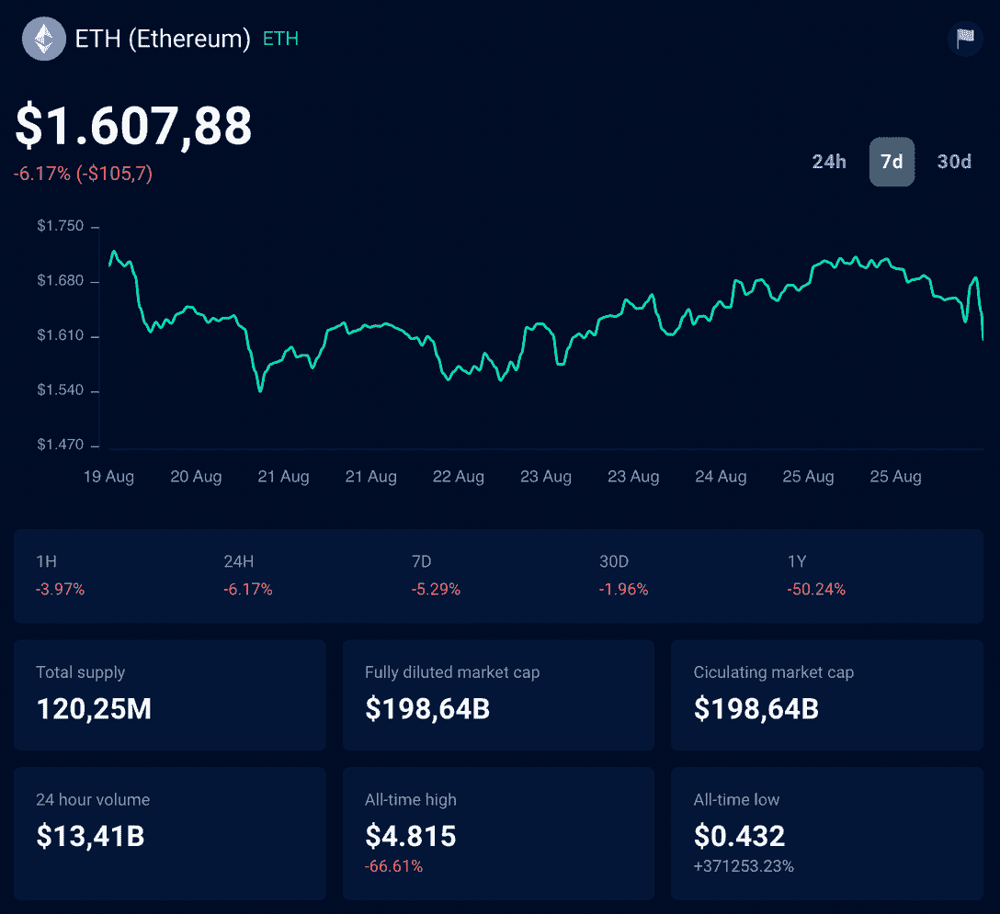
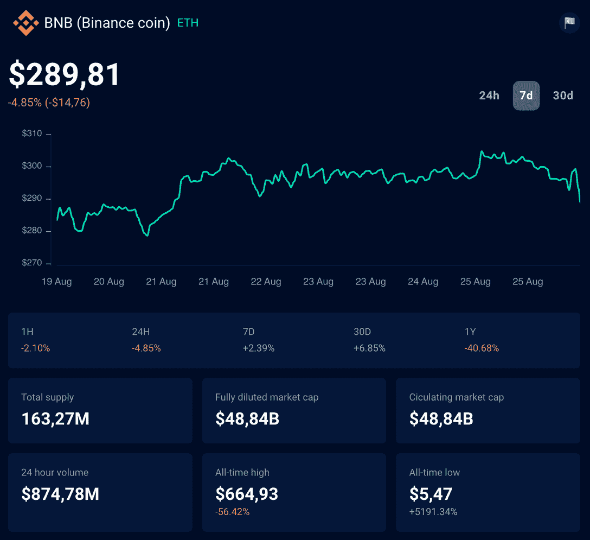
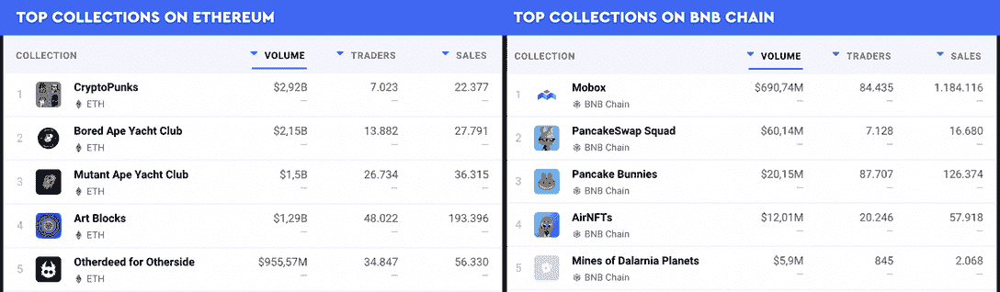

# 以太坊与 BNB 链:解释主要差异

> 原文：<https://web.archive.org/web/https://dappradar.com/blog/ethereum-vs-bnb-chain-key-differences-explained>

## 了解这两个主要的区块链，以及它们是如何脱颖而出的

**以太坊和 BNB 连锁店是世界上最受欢迎的两种区块链。虽然两者都在 DeFi 庞大而忠诚的社区中领先，以太坊与 BNB 的连锁讨论仍在区块链之战中持续进行。我们不参加这场战斗。这篇文章将清楚地比较区块链，让你可以做出自己的判断。**

## 目录

*   [区块链历史](https://web.archive.org/web/20220926164543/https://dappradar.com/blog/ethereum-vs-bnb-chain-key-differences-explained/#Blockchain-history)
*   [技术](https://web.archive.org/web/20220926164543/https://dappradar.com/blog/ethereum-vs-bnb-chain-key-differences-explained/#Technology)
*   [代币](https://web.archive.org/web/20220926164543/https://dappradar.com/blog/ethereum-vs-bnb-chain-key-differences-explained/#Tokens)
*   [Dapps](https://web.archive.org/web/20220926164543/https://dappradar.com/blog/ethereum-vs-bnb-chain-key-differences-explained/#Dapps-on-Ethereum-and-BNB-Chain)
*   [NFTs](https://web.archive.org/web/20220926164543/https://dappradar.com/blog/ethereum-vs-bnb-chain-key-differences-explained/#NFTs)
*   [以太坊 vs BNB 连锁](https://web.archive.org/web/20220926164543/https://dappradar.com/blog/ethereum-vs-bnb-chain-key-differences-explained/#Ethereum-vs-BNB-Chain)

## 区块链历史

首先，让我们深入了解每一个[区块链](https://web.archive.org/web/20220926164543/https://dappradar.com/blog/what-is-a-blockchain-dappradars-ultimate-guide)是如何创建的，他们迄今为止的旅程，以及未来的路线图。

### 以太坊

以太坊是世界上领先的智能合约区块链，在 2013 年的白皮书中首次被描述。2015 年正式上线时，创始人名单包括查尔斯·霍金森、安东尼·迪·伊奥里奥、米哈伊·阿利西、阿米尔·切特里特、加文·伍德、杰弗里·威尔克、约瑟夫·卢宾，以及他们的领导人维塔利克·布特林。

以太坊被理想化为“世界计算机”，是一个运行[智能合约](https://web.archive.org/web/20220926164543/https://dappradar.com/blog/what-is-a-smart-contract)的分散平台:应用程序完全按照编程运行，没有任何欺诈或第三方干扰的可能性。以太坊的区块链由以太坊虚拟机(EVM)提供支持，允许开发人员创建分散式应用程序(dapps)和令牌。

这是第一个允许创造 dapps 和 ERC-20 代币的主要区块链，以太坊的受欢迎程度从那时起就一直在增长。

*   **继续学习** : [什么是以太坊:达普拉达尔终极指南](https://web.archive.org/web/20220926164543/https://dappradar.com/blog/what-is-ethereum-dappradars-ultimate-guide)

### BNB 链

如你所知，BNB 连锁店是币安品牌重塑的结果。这发生在 2022 年 2 月，当时[币安智能连锁(BSC)和币安连锁合并为 BNB 连锁](https://web.archive.org/web/20220926164543/https://dappradar.com/blog/binance-chain-and-binance-smart-chain-become-bnb-chain)。该组织试图通过将每个区块链合二为一来解决它们的局限性。

BNB 链是以太坊虚拟机(EVM)兼容的，这意味着以太坊 dapps 可以很容易地移植。事实上，BNB 连锁餐厅模仿以太坊的餐厅是很常见的。

这里的关键区别在于每个区块链使用什么技术。

*   想要潜得更深吗？阅读我们的完整指南: [什么是 BNB 链，它是如何工作的？](https://web.archive.org/web/20220926164543/https://dappradar.com/blog/what-is-bnb-chain-and-how-does-it-work)

## 技术

将以太坊与 BNB 链进行比较，迫使我们考虑以太坊 2.0，也称为[以太坊共识层](https://web.archive.org/web/20220926164543/https://dappradar.com/blog/ethereum-2-0-five-things-you-need-to-know)。

[<picture></picture>](https://web.archive.org/web/20220926164543/https://dappradar.com/rankings)[<picture></picture>](https://web.archive.org/web/20220926164543/https://dappradar.com/hub/wallet)[<picture></picture>](https://web.archive.org/web/20220926164543/https://dappradar.com/hub/swap)

这种从工作证明(PoW)到利益证明(PoS)的转变是以太坊确保区块链更加可扩展、安全和环保的方式。经过多年的努力，以太坊主网将于 2022 年 9 月 6 日完成向以太坊共识层的迁移。

另一方面，币安的 BNB·区块链以比以太坊更快更便宜而闻名。这是由于它的委托利益证明(DPoS)一致算法，这使它能够每秒处理更多的事务(TPS)。

一旦以太坊开始使用以太坊共识层，以太坊对 BNB 的连锁讨论可能会被重新点燃。

## 代币

现在让我们来谈谈以太坊和 BNB 链的令牌，并深入了解它们是如何工作的。

### 醚

以太坊的令牌叫做[以太(ETH)](https://web.archive.org/web/20220926164543/https://dappradar.com/hub/token/eth/ETH) ，在网络上需要支付交易费用。开发者也用它来构建 dapps 和基于以太坊的令牌。

近年来，ETH 的价值增加了很多，它是第二大最有价值的加密货币，仅次于比特币。以太坊的总供应量上限约为 1.15 亿以太币，你可以在 DappRadar 的 Token Explorer 上追踪。

到目前为止，虽然以太坊使用的是工作验证一致算法，但以太坊矿工因验证块而获得 ETH 奖励。随着以太坊向以太坊共识层的过渡，赌注者将能够验证区块并获得 ETH。

*   **进一步阅读** : [以太币(ETH)是什么？](https://web.archive.org/web/20220926164543/https://dappradar.com/blog/what-is-the-ethereum-eth-coin)

### BNB

[币安代币(BNB)](https://web.archive.org/web/20220926164543/https://dappradar.com/hub/token/eth/BNB) 是币安生态系统的原生加密货币。它最初是作为以太坊 ERC-20 令牌创建的，为发展币安的加密货币交易所筹集资金。

随着币安链的推出，BNB 被移出以太坊，成为币安链的本土标志——其余的你可以想象。现在你可以使用 BNB 代币支付网络交易费用，在 BNB 连锁 dapps，并创造新的代币在 BNB 连锁。

*   **在完整文章中了解更多关于这种加密货币的信息** : [什么是 BNB 令牌](https://web.archive.org/web/20220926164543/https://dappradar.com/blog/what-is-the-bnb-token)

## 以太坊和 BNB 链上的 Dapps

如果你想直接比较每个区块链上构建的去中心化应用(dapps)，你不会找到比 [DappRadar 的排名](https://web.archive.org/web/20220926164543/https://dappradar.com/rankings)更好的工具了。

在 DappRadar 上，集成了以太坊和 BNB 链，你可以浏览最好的 dapps，按照特定的指标进行排名，如每日用户数、每日流量等。为了让你的研究更加容易，也可以通过 dapp 类别进行过滤——比如游戏和交流。

### 交换

以太坊和 BNB 链是支持 DeFi 项目的两个主要区块链，它们的交易所是使用最多的。

在 Terra 2022 的崩溃中，我们看到 BNB 链以 60 亿美元的总价值(TVL)成为第二大 DeFi 区块链。以太坊仍然是分散融资项目的领先区块链，TVL 为 370 亿美元。

一方面，一些用户更喜欢传统但不断更新的以太坊交易所，如 [Uniswap](https://web.archive.org/web/20220926164543/https://dappradar.com/blog/what-is-uniswap-and-how-to-use-it) 和 [Curve](https://web.archive.org/web/20220926164543/https://dappradar.com/blog/why-curve-is-the-leading-defi-dapp-when-considering-underlying-value-and-growth) 。然而，该网络的高额费用使得许多人远离了其他网络上的交易所。

通过这种方式，BNB 链条上的 DeFi 项目开始获得牵引力。像 [PancakeSwap](https://web.archive.org/web/20220926164543/https://dappradar.com/blog/what-is-pancakeswap-and-how-to-use-it) 和 [BakerySwap](https://web.archive.org/web/20220926164543/https://dappradar.com/blog/what-is-bakeryswap-and-how-does-it-work) 这样的 BNB 连锁交易所，本质上是受以太坊交易所的启发，在 2021 年变得相当受欢迎。

### 比赛

同样，以太坊也是游戏开发者最喜欢建造的区块链——即使有 PoW 的可扩展性和网络限制。

考虑到游戏 dapps [驱动了区块链所有活动的 52%](https://web.archive.org/web/20220926164543/https://dappradar.com/blog/dappradar-x-bga-games-report-q2-2022),以及区块链游戏在熊市期间证明了其弹性，我们可以期待以太坊 2.0 最终到来时游戏规则的改变。

以太坊上最受欢迎的游戏有[【分散王国】](https://web.archive.org/web/20220926164543/https://dappradar.com/ethereum/games/decentraland)[【王国联盟】](https://web.archive.org/web/20220926164543/https://dappradar.com/ethereum/games/league-of-kingdoms)和[米兰多斯](https://web.archive.org/web/20220926164543/https://dappradar.com/ethereum/games/mirandus)。

基于 BNB 链的游戏场景也没什么不同。正如你在 2022 年 8 月达普拉达的 [BNB 连锁报道](https://web.archive.org/web/20220926164543/https://dappradar.com/blog/bnb-chain-report-q2-2022)中读到的:

***“游戏是 BNB 第二重要的垂直市场，占所有在线活动的 25%。”*** 莎拉·格尔盖拉斯，达普拉达尔公司的分析师

[Mobox](https://web.archive.org/web/20220926164543/https://dappradar.com/binance-smart-chain/games/mobox-nft-farmer) 、 [Era7](https://web.archive.org/web/20220926164543/https://dappradar.com/binance-smart-chain/games/era7-game-of-truth) 和 [BombCrypto](https://web.archive.org/web/20220926164543/https://dappradar.com/binance-smart-chain/games/bomb-crypto) 是基于 BNB 链开发的[最受欢迎的游戏，尽管遭遇了 Crypto 熊市，它们仍然活跃并建立着自己的社区。](https://web.archive.org/web/20220926164543/https://dappradar.com/rankings/protocol/binance-smart-chain/category/games)

## WindowsNT 文件系统（NTFileSystem 的缩写）

第一个不可替代代币(NFT)是在区块链以太坊建造的，直到 2021 年底，我们才开始在 BNB 看到 NFT。

ERC-721 和 ERC-1155 令牌，通常被称为 NFTs，已经发展成为一个全新的行业，引领着 Web3 的采用。

然而，虽然最著名和最有价值的 NFT 收藏品是建立在以太坊上的，但其他收藏品也在区块链看到了优势，如[索拉纳](https://web.archive.org/web/20220926164543/https://dappradar.com/blog/what-is-solana)、[卡尔达诺](https://web.archive.org/web/20220926164543/https://dappradar.com/blog/what-is-cardano-a-simple-explanation)和 [BNB 连锁店](https://web.archive.org/web/20220926164543/https://dappradar.com/blog/what-is-bnb-chain-and-how-does-it-work)。

从 2021 年到 2022 年，BNB 连锁店的 NFT 交易量激增。尽管这个乐观的事实，这些代币的销售总量仍然远远低于以太坊上的收藏。

看看下面以太坊 vs BNB 链上最受欢迎的 NFT 系列:

如果你想探索不同链上的 NFT，请访问 [DappRadar NFT 概述](https://web.archive.org/web/20220926164543/https://dappradar.com/nft)获取一些令人惊叹的统计数据。

## 以太坊 vs BNB 连锁店

正如 Web3 社区已经讨论了一段时间的那样，[的未来是多链](https://web.archive.org/web/20220926164543/https://dappradar.com/blog/mass-adoption-the-multichain-paradigm-are-we-ready)。由于达普拉达尔并不支持哪一方的区块链更好，我们知道当这些对话发生时，空间变得更加丰富。也许以太坊与 BNB 的连锁讨论甚至不成立，但是通过比较，项目也找到了创新的燃料。

BNB 连锁店有更便宜的交易费和更快的操作，但这仍有待以太坊合并后观察。尽管区块链经历了几个月的良好增长(考虑到熊市)，以太坊仍然是一个巨人，在所有领域都处于领先地位。

尽管如此，考虑到我们仍处于 Web3 竞赛的早期阶段，这并不能定义区块链科技的未来。还有很长的路要走，DappRadar 会是你随叫随到的守望者。无论何时，如果您想了解更多关于 dapps 的精彩世界，请相信我们。

在我们的[博客](https://web.archive.org/web/20220926164543/https://dappradar.com/blog/)上，你会找到最好的教程、[报道](https://web.archive.org/web/20220926164543/https://dappradar.com/blog/category/reports)和热点新闻供你学习和更新。请务必在 [Twitter](https://web.archive.org/web/20220926164543/https://twitter.com/DappRadar) 上关注 DappRadar，订阅我们的时事通讯，成为第一个收到此类精彩内容的人。

***以上不构成投资建议。此处给出的信息仅供参考。请行使尽职调查，做你的研究。***

 NewsletterUnsubscribe at any time. [T&Cs](https://web.archive.org/web/20220926164543/https://dappradar.com/terms) and [Privacy Policy](https://web.archive.org/web/20220926164543/https://dappradar.com/privacy-policy)