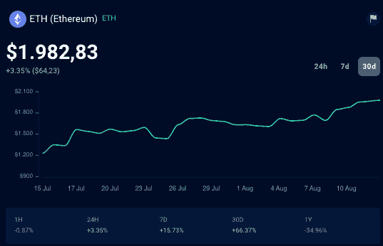

# 以太坊和以太坊经典有什么区别？

> 原文：<https://web.archive.org/web/https://dappradar.com/blog/ethereum-vs-ethereum-classic>

## 以太坊是世界上最大的区块链。但什么是以太坊经典？

随着人们期待已久的 2022 年 9 月向利益证明(PoS)共识机制过渡的临近，ETH 的价格正慢慢接近 2000 美元。但是它的对应物以太坊经典(ETC)是什么，它们又有什么不同呢？

以太坊是世界上第二大网络和最大的区块链。2021 年在交易数量上超过比特币。大多数 dapps 都是建立在以太坊上的，它占据了在区块链上开发和交易的 [NFT](https://web.archive.org/web/20220926004519/https://dappradar.com/nft/protocol/ethereum) 数量的首位。Dapps 是分散的应用程序，随着越来越多的人进入区块链领域，它越来越受欢迎。

[https://web.archive.org/web/20220926004519if_/https://www.youtube.com/embed/AbXzqHuKOus?feature=oembed](https://web.archive.org/web/20220926004519if_/https://www.youtube.com/embed/AbXzqHuKOus?feature=oembed)

而以太坊经典(ETC)则是一个更小的网络，市值远低于以太坊(ETH)，固定供应 210，700，000 个币。本文将比较以太坊和以太坊经典，以更好地了解合并前流行的区块链。

## **以太坊是什么？**

以太坊是一个开源的、分散的计算网络，允许用户使用智能合约和运行分散的应用程序进行交易。以太坊网络的原生令牌是 ETH。

ETH 令牌使用 ERC-20 技术标准，允许在区块链以太坊中交换支持智能合约的令牌。ETH 没有限量供应硬币；这些令牌可以与其他令牌互换，因此是可替换的。

使用[投资组合工具](https://web.archive.org/web/20220926004519/https://dappradar.com/hub/wallet/eth/0x0493a78f14bcb581d8ee9e133f85c1f8bc615324)中的 [DappRadar 的 Token Explorer](https://web.archive.org/web/20220926004519/https://dappradar.com/hub/tokens/ethereum/all/1) ，我们可以看到 [ETH 目前的交易价格为 1982，83 美元](https://web.archive.org/web/20220926004519/https://dappradar.com/hub/token/eth/ETH)，在过去的 24 小时内上涨了 3.35%。

portfolio tool 结合了[DappRadar](https://web.archive.org/web/20220926004519/https://dappradar.com/blog/things-you-can-do-with-dappradar)的所有功能，允许用户通过我们的可操作数据从不同的区块链监督和管理他们的数字资产。

您可以使用 DappRadar 令牌交换来交换以太坊和其他区块链上的令牌。

[https://web.archive.org/web/20220926004519if_/https://www.youtube.com/embed/ZHiHfYvNjJU?feature=oembed](https://web.archive.org/web/20220926004519if_/https://www.youtube.com/embed/ZHiHfYvNjJU?feature=oembed)

## 什么是智能合约？

智能合同是区块链上的数字合同，这是一种促进、验证或加强其谈判和执行的计算机协议。它们使权力下放成为可能，并允许没有第三方的可信交易。

由于智能合约，用户不再需要依赖“可信的”中间人。它们为用户提供了许多优势，比如避免了与使用第三方相关的费用。

以下是智能合约提供的优势:

### **1。速度**

智能合同使用代码来自动执行任务，并在各种日常业务流程中节省时间。

### **2。储蓄**

智能合同使用代码来自动执行任务，并在各种日常业务流程中节省时间。

### **3。信任**

共享分类帐会加密您的文档。

### **4。自主性**

网络自动管理执行，而不是由一个或多个可能有偏见的个人来管理。你是达成协议的人。没有必要依赖经纪人、律师或其他中介来确认。

### **5。备份**

想象一下，如果你的银行失去了你的储蓄账户。在区块链上，您的文档会被多次复制，并且可以轻松恢复。

### **6。安全**

密码术是一种用于网站加密的复杂而可靠的安全形式。简而言之，它可以保证你的文件安全。

### **7。精确度**

自动化合同不仅更快更便宜，而且避免了手动填写大量表格带来的错误。

## **什么是以太坊经典，它是如何开始的？**

以太坊区块链始于我们今天所知的以太坊经典，在一次大规模黑客攻击后，它分裂成两个独立的网络，攻击者从一个名为 DAO 的成功 ICO(首次硬币发行)项目中提取了大量 ETH。

以太坊社区出现了分歧，一方提议逆转以太坊区块链，以拯救受影响的投资者，另一方则认为道的投资者应该面对后果，而不是纾困。

下图显示了这两种网络的主要区别，以便快速了解。

Source: Robin Gonzalez Kristensen, DappRadar

最终，大多数人投票决定通过硬分叉来恢复资金。较新的网络被称为以太坊，使用 ETH 或 ether 作为其加密货币。较老和较小的一个，称为以太坊经典，使用等。

## **为什么很多以太坊用户不同意硬叉？**

区块链技术的支柱是不变性和去中心化。对于许多密码爱好者来说，以太坊领导层的干预直接违背了这些原则，将密码恢复到了盗窃之前。

那些不同意新升级的用户决定保留旧的编程，并成为现在的以太坊经典。以太坊和以太坊经典最显著的区别之一是，以太坊有计划从工作证明(PoW)迁移到一个名为利益证明(PoS)的系统。而以太坊经典公司打算在其区块链保留传统采矿。

## **关闭**

以太坊可以被认为是区块链的事务和操作层，可以说它比以往任何时候都更加重要。重要的是，一个最大的区别是以太坊经典版(ETC)并不遵循与以太坊(ETH)相同的价格轨迹。

这两个生态系统都有自己的社区和不同的本地加密令牌价格。虽然以太坊和以太坊经典都提供智能合约，但以太坊的 ETH 是交易最广泛的资产。

以太坊区块链的采用率和[用例显著高于任何其他区块链网络。此外，用户更倾向于以太坊，而不是以太坊经典，因为它相关的安全和保障。](https://web.archive.org/web/20220926004519/https://dappradar.com/rankings/protocol/ethereum)

最后，[以太坊合并](https://web.archive.org/web/20220926004519/https://dappradar.com/blog/what-is-the-ethereum-merge/)旨在带来重大更新，使以太坊在未来更具吸引力。

 NewsletterUnsubscribe at any time. [T&Cs](https://web.archive.org/web/20220926004519/https://dappradar.com/terms) and [Privacy Policy](https://web.archive.org/web/20220926004519/https://dappradar.com/privacy-policy)