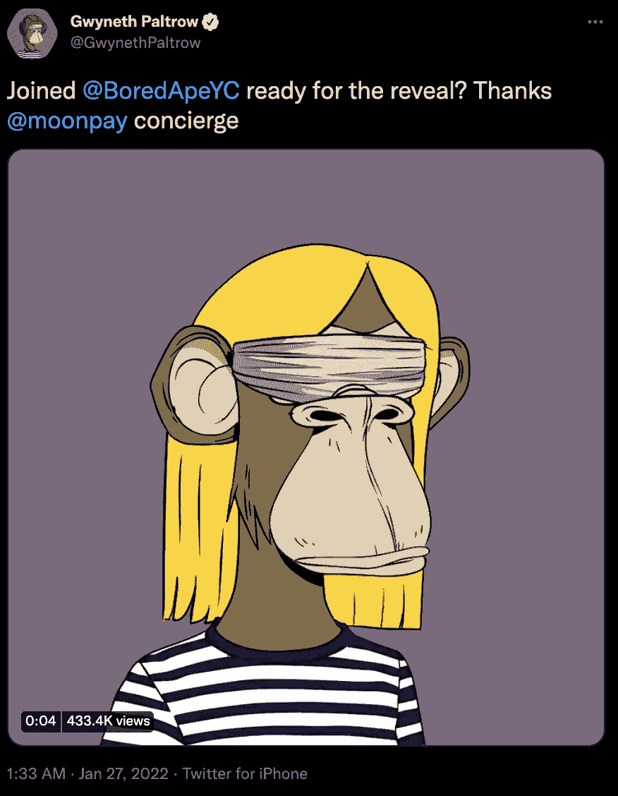
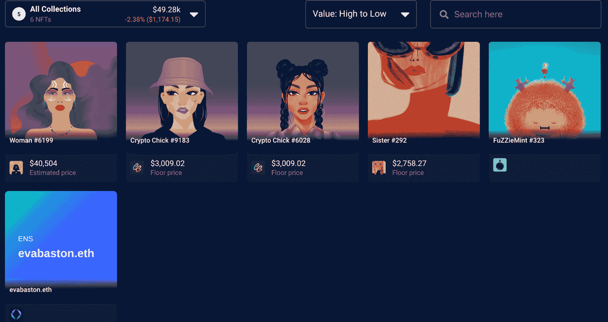
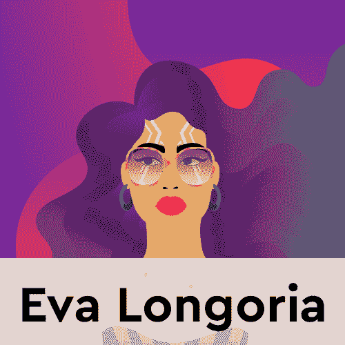
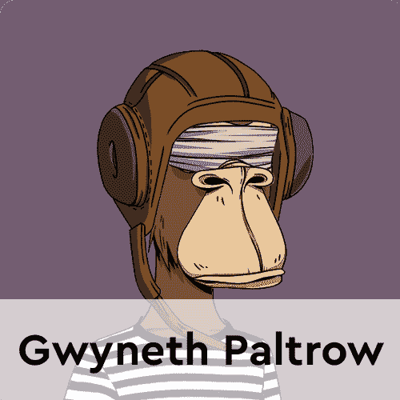
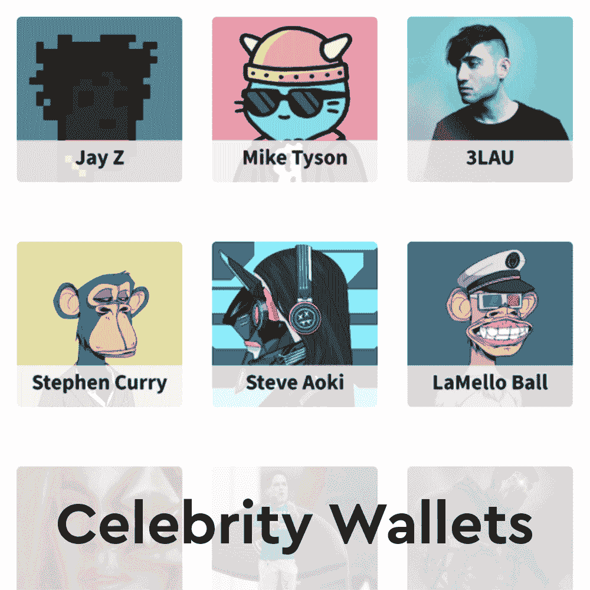

# 伊娃·朗格利亚和格温妮丝·帕特洛进入 NFT 空间

> 原文：<https://web.archive.org/web/https://dappradar.com/blog/eva-longoria-and-gwyneth-paltrow-enter-the-nft-space>

## 这两位电影明星都是用 Moonpay 来获得他们的第一笔非功能性汇款的

随着伊娃·朗格利亚和格温妮丝·帕特洛的加入，加入 NFT 空间的名人越来越多。两人看起来都像女性主题系列的粉丝，并决定在加密公司 Moonpay 的帮助下进入这个领域。

格温妮丝·帕特洛选择了通过加密公司 Moonpay 购买的 NFT 无聊猿游艇俱乐部来展示她的 NFT。这种策略已经成为名人空间的黄金标准。本周早些时候我们看到凯文·哈特在 Moonpay 的帮助下收购 [BAYC #9258](https://web.archive.org/web/20221006034639/https://dappradar.com/hub/assets/eth/0xbc4ca0eda7647a8ab7c2061c2e118a18a936f13d/9258) 时走了同样的路。除了在这个[推特帖子](https://web.archive.org/web/20221006034639/https://twitter.com/GwynethPaltrow/status/1486482496883625984)中分享的 BAYC，帕特洛还拥有几个其他的 NFT，很可能是粉丝们送的礼物。

以同样的方式，伊娃·朗格利亚选择使用 Moonpay 的服务来购买女人。Moonpay 促成了这次购买。然而，伊娃·朗格利亚似乎真的有兴趣更多地了解 NFT 空间。她甚至在[的 Twitter 帖子](https://web.archive.org/web/20221006034639/https://twitter.com/evalongoria/status/1486490115182673921?s=24)中调侃 Instagram 与她最喜欢的个人资料的合作。

## 探索伊娃·朗格利亚和格温妮丝·帕特洛的作品集

随着越来越多的名人加入 NFT 空间，越来越明显的是，非物质文化遗产正在渗入主流。重要的是，许多 NFT 项目也宣扬重要的社会变革使命。从两位女演员的作品来看，她们都非常关注女性权利。

虽然[格温妮丝·帕特洛的钱包](https://web.archive.org/web/20221006034639/https://dappradar.com/hub/wallet/eth/0x31185f782a7c11044566d70dfcf1c8175486f451)里有[四张世界女性 NFT](https://web.archive.org/web/20221006034639/https://dappradar.com/hub/wallet/eth/0x31185f782a7c11044566d70dfcf1c8175486f451/nfts/1/universeofwomen)，但这些似乎是礼物，因为没有与转移相关的付款。尽管如此，这位女演员已经正式宣布进入这个空间，甚至把她的 Twitter 个人资料图片改为 BAYC #6141。令人印象深刻的是，她还花时间使用了[推特 NFT 验证工具](https://web.archive.org/web/20221006034639/https://dappradar.com/blog/twitter-launches-nft-profile-picture-verification/)，这意味着她现在有了一个六边形的个人资料相框。

另一方面，伊娃·朗格利亚已经决定带着 NFT 女性进军 NFT。在 Moonpay 的帮助下，第 6199 号女士再次成为朗格利亚作品中最昂贵的 NFT。此外，她还购买了[两只隐形小鸡](https://web.archive.org/web/20221006034639/https://dappradar.com/hub/wallet/eth/0xaa1b056286a66a9e6752c26776ac034c662a51d5/nfts/1/crypto-chicks)。

令人印象深刻的是，伊娃·朗格利亚信守承诺，似乎正在积极探索 NFT 空间。除了 NFT 收藏品，她还购买了地址为的 evabaston.eth ENS。这是一个很好的小接触，显示了女演员的奉献精神，以了解更多的空间和探索它提供的可能性。

随着越来越多的名人加入炒作行列，并从知名收藏中购买代币，DappRadar 将继续关注 NFT 空间。如果你想浏览我们追踪的名人投资组合的完整列表，请查看这个页面。此外，你可以在 Twitter 上关注 DappRadar，并加入我们的 T2 不和谐社区，首先找到最新的 NFT 名人新闻。

[<picture></picture>](https://web.archive.org/web/20221006034639/https://dappradar.com/hub/wallet/eth/0x31185f782a7c11044566d70dfcf1c8175486f451)[<picture></picture>](https://web.archive.org/web/20221006034639/https://dappradar.com/hub/wallet/eth/0xaa1b056286a66a9e6752c26776ac034c662a51d5)[<picture></picture>](https://web.archive.org/web/20221006034639/https://dappradar.com/blog/celebrity-wallets-a-dive-into-crypto-hollywood) NewsletterUnsubscribe at any time. [T&Cs](https://web.archive.org/web/20221006034639/https://dappradar.com/terms) and [Privacy Policy](https://web.archive.org/web/20221006034639/https://dappradar.com/privacy-policy)