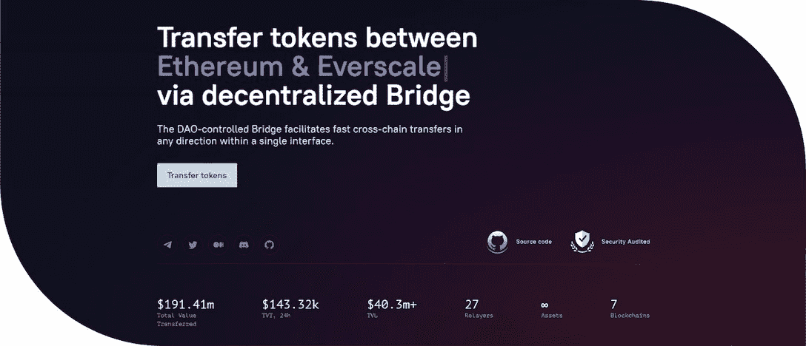
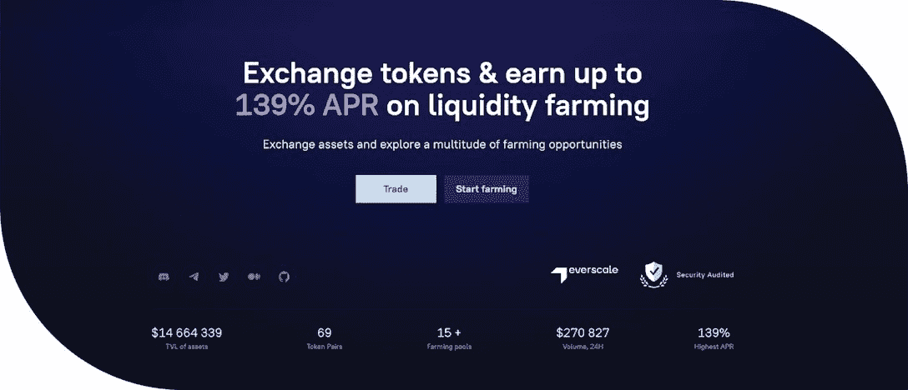
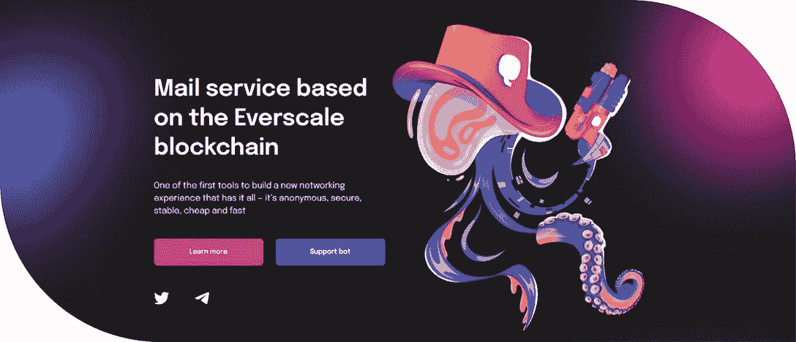

# Everscale 的 CBDC、DeFi 和私人通信解决方案概述

> 原文：<https://web.archive.org/web/https://dappradar.com/blog/everscales-cbdc-defi-and-private-communications-solutions-in-a-nutshell>

## 获得在 Everscale 上开发强大 dapps 的完整装备

Everscale 的生态系统已经因来自不同领域的项目而蓬勃发展。他们利用区块链强大的解决方案和出色的网络性能来构建具有最佳用户体验的产品。如果你想知道如何利用这些工具，请继续阅读。

**目录**

*   *[为什么项目要建立在 Everscale 上？](https://web.archive.org/web/20221130030225/https://dappradar.com/blog/everscales-cbdc-defi-and-private-communications-solutions-in-a-nutshell/#why)*
*   [*八支桥*](https://web.archive.org/web/20221130030225/https://dappradar.com/blog/everscales-cbdc-defi-and-private-communications-solutions-in-a-nutshell/#octus)
*   *[flat qube](https://web.archive.org/web/20221130030225/https://dappradar.com/blog/everscales-cbdc-defi-and-private-communications-solutions-in-a-nutshell/#flatqube)*
*   *[卡蒙](https://web.archive.org/web/20221130030225/https://dappradar.com/blog/everscales-cbdc-defi-and-private-communications-solutions-in-a-nutshell/#qamon)*
*   *[接下来是什么？](https://web.archive.org/web/20221130030225/https://dappradar.com/blog/everscales-cbdc-defi-and-private-communications-solutions-in-a-nutshell/#what)*

我们很高兴你已经读到了我们四篇系列文章中的第三篇。在这个过程中，你将开始探索 Everscale 区块链提供的无限可能。像许多支持智能合约的平台一样，Everscale 已经有了一个发展良好、快速增长的 dapps 生态系统，其中许多完全符合 DeFi 和高效用利基。成功运营并显示出最大潜力的前 3 项服务如下:

*   [**八通桥**(跨链转移)](https://web.archive.org/web/20221130030225/https://octusbridge.io/)
*   [**【分散交换】**](https://web.archive.org/web/20221130030225/https://flatqube.io/)
*   **[**卡蒙**(邮寄服务)](https://web.archive.org/web/20221130030225/https://qamon.io/)**

 **首先，我们将简要提醒您什么是分散式应用程序(dapps)。

顾名思义，dapps 不受中央政府的控制。他们通过由网络参与者自己管理的分散的区块链开展工作。这样有效减少了中介和监管机构，使得系统点对点。

dapps 的主要目的是促进包容性，并提供更容易和更便宜的广泛服务。

## 快速提醒，解释为什么在 Everscale 上构建具有不同效用值的项目

在众多独特的特征中，有两个架构元素使 Everscale 与众不同。

### **首先，仓储费**

在 Everscale 上，每个智能合约都为其在网络上的存储付费( [**详见我们的第二篇文章**](/web/20221130030225/https://dappradar.com/blog/a-look-at-everscales-architecture-how-it-addresses-existing-blockchains-drawbacks/) )。因此，限制网络上的录制速度是没有意义的。

智能合同根据需要支付存储费用。当资金用完时，相应的联系人就会被删除。因此，Everscale 可以以一定的价格在网络上提供录音，无需用户之间相互竞争。

### **第二，无限分片**

由于 Everscale 上的碎片是动态添加的，区块链每秒可以处理大量事务。然而，它们不是免费的，有时完成起来比较慢。

也就是说，随着大量碎片的添加，执行事务的时间增加，而每秒的事务数量非常大。这一功能仍在实施过程中。工作链之间需要正常的相互作用。

### **结果**

将这两个因素结合起来，我们得到了一个区块链，它可以以不变的价格每秒处理大量的事务，尽管负载峰值有所下降——它涉及一个事务的处理时间，而不是总体吞吐量。

此外，这样的架构允许 Everscale 区块链保持运行几十年。同时，与使用汇总不同，区块链将保持分散。

## Octus 桥

Octus 网桥能够将任何信息(任何令牌)从一个网络传输到另一个网络。例如，您可以将 USDT 代币从以太坊网络转移到 Everscale 网络，然后在 DEX 上交易这些代币。

价格将是一个集，而创建池。此外，与智能合约交互的佣金很少。目前，网桥支持以下网络的双向传输:

*   以太坊
*   BNB 链
*   Fantom Opera
*   多边形
*   Everscale
*   雪崩
*   乳球菌
*   索拉纳

为了方便用户，当部分代币自动转换为 EVERs 并发送到用户的 EVER 钱包时，有信用气体选项。这些 EVERs 是在 Everscale 网络上处理天然气付款所必需的。

[Learn more about Octus Bridge](https://web.archive.org/web/20221130030225/https://octusbridge.io/)

## 弗拉特库贝

FlatQube 是一个分散的数字资产交易所，为用户提供了一个方便快捷(5 秒传输)的平台来交换他们的加密货币和法定货币。DEX 还为用户提供了过多的选择，通过其耕作和赌注机制赚取被动收入。

目前，最受欢迎的兑换货币是 EVER 和 QUBE 硬币、USDT 和 USDC 稳定硬币以及菲律宾比索、欧元和美元法定货币。为了确保汇率稳定，即使是在巨额外汇交易的情况下，一种被称为稳定互换池的特殊机制应运而生。

在这些池的帮助下，几乎任何数量的稳定硬币都可以以尽可能低的滑动率进行交换。

[Learn more about FlatQube](https://web.archive.org/web/20221130030225/https://flatqube.io/)

## Qamon

使用 Qamon，每条消息都被加密并存储在分布式注册表中。这种方法基于加密方法，确保只有您可以访问您的邮件。没有人可以干预，改变或执行任何其他行动的信息。

Qamon 提供了比传统邮件服务更好的隐私保护。例如，Gmail 提供了一些基本的加密功能。然而，他们甚至无法保护用户免受谷歌的攻击。相反，在区块链的邮件服务中，数据是在更基本的层面上加密的。

另外，Qamon 提供了永久的信息存储，这要感谢保存信息的 Everscale 区块链。显然，你不会自己删除重要的电子邮件。永久存储基本上可以确保 Qamon 邮件服务无法删除您的邮件——无论是有意还是无意。

[Learn more about Qamon](https://web.archive.org/web/20221130030225/https://qamon.io/)

## 下一步是什么？

目前，Everscale 特别关注 B2B 解决方案。目的是向私营和公共部门的公司和机构提供提高效率的服务。也就是说，这些是 CBDCs 以及工作链，具有广泛的实际应用。

在下一篇文章中，您将详细了解它们。如果你想加入 Everscale，构建一流的去中心化解决方案，请加入官方[**Telegram on boarding chat**。](https://web.archive.org/web/20221130030225/https://t.me/everscaleonboarding)

**了解更多关于 Everscale 的信息**

*   [网站](https://web.archive.org/web/20221130030225/https://everscale.network/)
*   [推特](https://web.archive.org/web/20221130030225/https://twitter.com/Everscale_net)
*   [不和](https://web.archive.org/web/20221130030225/https://discord.com/invite/GSPAGVTuqQ)

**免责声明** —这是一篇赞助文章。DappRadar 不认可本页面上的任何内容或产品。DappRadar 旨在提供准确的信息，但读者应该在采取行动之前总是自己做研究。DappRadar 的文章不能被认为是投资建议。**