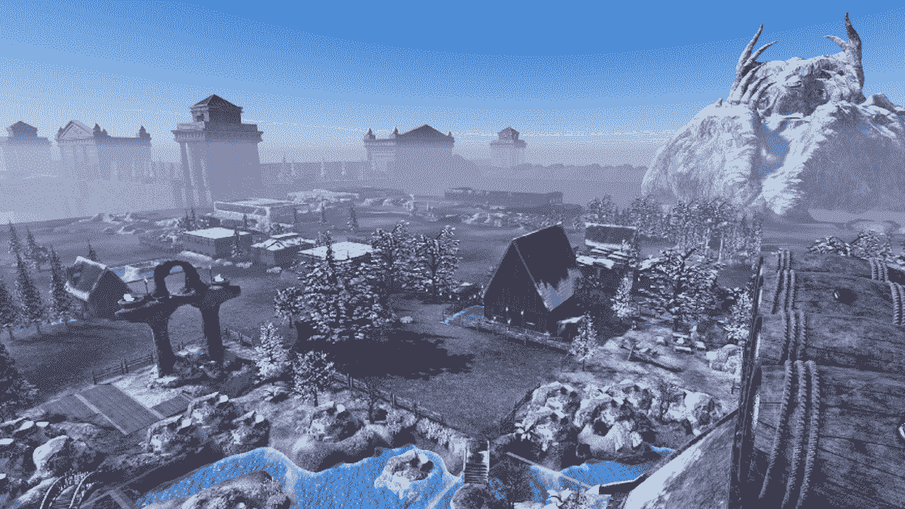
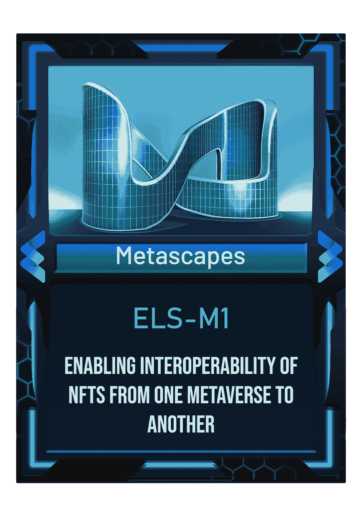
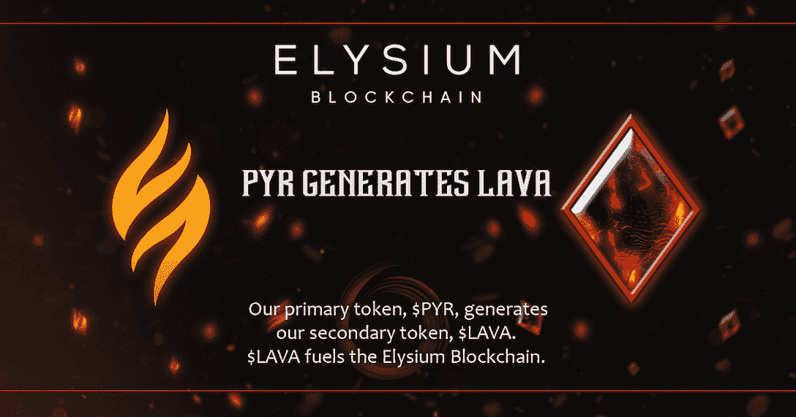
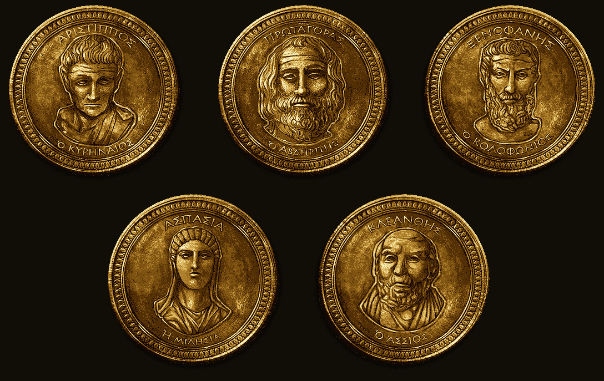

# 每个人都可以从极乐世界以游戏为中心的生态系统中受益，以下是方法

> 原文：<https://web.archive.org/web/https://dappradar.com/blog/everyone-can-benefit-from-elysiums-game-centric-ecosystem-and-here-is-how>

## 极乐世界的生态友好型生态系统用象征性的树木抵消二氧化碳。

使用区块链作为网络基础设施的 Web3 游戏有着巨大的潜力有待开发。火神锻造公司建造了区块链极乐世界，为游戏用户、开发者和对该领域感兴趣的投资者提供一个让所有人受益的游戏生态系统。

## 目录

*   [什么是极乐世界——利用 PoA 共识的生态友好型区块链](https://web.archive.org/web/20221201051742/https://dappradar.com/blog/everyone-can-benefit-from-elysiums-game-centric-ecosystem-and-here-is-how/#what)
*   [极乐世界如何推动元宇宙&游戏的繁荣？](https://web.archive.org/web/20221201051742/https://dappradar.com/blog/everyone-can-benefit-from-elysiums-game-centric-ecosystem-and-here-is-how/#how)
    *   [元场景](https://web.archive.org/web/20221201051742/https://dappradar.com/blog/everyone-can-benefit-from-elysiums-game-centric-ecosystem-and-here-is-how/#metascapes)
    *   [多种 NFT 令牌标准](https://web.archive.org/web/20221201051742/https://dappradar.com/blog/everyone-can-benefit-from-elysiums-game-centric-ecosystem-and-here-is-how/#multiple)
    *   [协议](https://web.archive.org/web/20221201051742/https://dappradar.com/blog/everyone-can-benefit-from-elysiums-game-centric-ecosystem-and-here-is-how/#protocols)
    *   [游戏 SDK](https://web.archive.org/web/20221201051742/https://dappradar.com/blog/everyone-can-benefit-from-elysiums-game-centric-ecosystem-and-here-is-how/#game)
    *   [发射台](https://web.archive.org/web/20221201051742/https://dappradar.com/blog/everyone-can-benefit-from-elysiums-game-centric-ecosystem-and-here-is-how/#launchpad)
*   [普通用户如何从极乐世界生态系统中受益](https://web.archive.org/web/20221201051742/https://dappradar.com/blog/everyone-can-benefit-from-elysiums-game-centric-ecosystem-and-here-is-how/#how)
    *   [持有 PYR 生成熔岩令牌](https://web.archive.org/web/20221201051742/https://dappradar.com/blog/everyone-can-benefit-from-elysiums-game-centric-ecosystem-and-here-is-how/#holding)
    *   拥有足够的 PYR 让一个人成为哲学家委员会的成员
    *   [获得一个节点层](https://web.archive.org/web/20221201051742/https://dappradar.com/blog/everyone-can-benefit-from-elysiums-game-centric-ecosystem-and-here-is-how/#gain)
    *   [有资格获得 NFTs 优惠](https://web.archive.org/web/20221201051742/https://dappradar.com/blog/everyone-can-benefit-from-elysiums-game-centric-ecosystem-and-here-is-how/#become)
    *   [进入极乐世界发射台](https://web.archive.org/web/20221201051742/https://dappradar.com/blog/everyone-can-benefit-from-elysiums-game-centric-ecosystem-and-here-is-how/#access)
*   [加入极乐世界的 Web3 游戏潮流](https://web.archive.org/web/20221201051742/https://dappradar.com/blog/everyone-can-benefit-from-elysiums-game-centric-ecosystem-and-here-is-how/#join)

## 什么是极乐世界——利用 PoA 共识的生态友好型区块链

极乐世界是权威的证明。这种共识机制赋予少数指定数量的区块链参与者验证交易和更新其分布式分类账的权力。在极乐世界的生态系统中，这项功能落在克洛诺斯节点的肩上，这是一个由 51 个权威节点组成的网络。

作为对他们贡献的回报，这些权威节点将获得极乐世界区块链产生的部分交易费。此外，这些节点还将从极乐世界获得一定比例的版税。

[Learn how to become an authority node](https://web.archive.org/web/20221201051742/https://vulcanforgedco.medium.com/elysium-node-program-introduction-56a078b32126)

瓦肯锻造公司与库莱斯特公司合作，让极乐世界实现碳中和。极乐世界交易的天然气费将用于种植象征性的现实世界树木，抵消区块链排放的二氧化碳。所以在 Elysium 上使用去中心化的服务时，用户不需要担心给我们脆弱的环境带来额外的负担。

## 极乐世界如何推动元宇宙和游戏的繁荣？

Vulcan Forged 拥有丰富的游戏开发经验，对游戏用户和开发者的需求有着深刻的理解。因此，它的极乐世界区块链是为游戏工作室量身定制的，确保速度和安全性，同时提供各种工具来帮助游戏和元空间项目蓬勃发展。

目前，超过 40 个项目已经在极乐世界启动或即将启动，带来了超过 100 万个 NFT 供用户探索。名单上的名字包括 VulcanVerse，HUSL，重金属，银河战斗联盟，等等。

### 气象景观

MetaScapes 是极乐世界上的一个元宇宙即服务引擎(MaaS)。任何创意团队和个人都可以利用这个引擎来构建自己的元宇宙，以满足用户的需求。

### 多令牌标准

ELS 是区块链极乐世界的象征。Elysium 为开发者提供多种 NFT 令牌标准，以满足游戏开发需求。

ELS-M1 是一个获得专利的 NFT 协议，它使得元和元之间的 NFTs 的互操作性成为可能。此外，它还将整个绘图数据存储和加载到开发人员的 MetaScapes 引擎中。

以下协议旨在支持可替换和不可替换资产在智能合约中进行交互。

*   ELS-20 —代表单一实体的可替换、可互换的令牌。
*   ELS-721——标准极乐世界不可替代令牌(NFTs)。
*   ELS-1155——具有动态元数据的 NFT 有助于游戏，允许通过例如游戏的进展来改变或升级数据。

### 协议

Magma 是一个协议，该协议使一个过程能够将所有极乐世界本地令牌转换为所有 Agora(极乐世界上的数字资产市场)交易的 PYR。这是通过 ElysiumSwap 实现的，Elysium 上的分散式交换(DEX)在后端使用 ElysiumSwap，分散式交换(DEX)。

简单来说，当 ElysiumSwap 自动为用户用任何 ELS-20 令牌交换用户购买 NFT 时，在 PYR(或 LAVA)结算的交易费就产生了。ELS 是极乐世界采用的象征标准。

Elysium GIFT 协议支持本地费用委托，这意味着它允许用户交易产生的汽油费用由其他人赞助，例如项目所有者。有了这个功能，用户可以在不了解区块链基础知识的情况下流畅体验 dapps，就像我们不需要了解互联网的原理就可以使用 web 服务一样。

Surge 协议允许用户使用任何钱包内的代币作为他们的汽油费。用户只需选择一个可用的令牌，它将在后端转换为 LAVA，然后用作 gas 来处理交易。

### 游戏 SDK

Elysium 为游戏开发者提供了一个强大的游戏软件开发工具包(SDK)。这是一套用于极乐世界区块链的软件构建工具，包括构建块、调试器等等。SDK 可以帮助团队快速将区块链交易集成到他们的游戏中。

### 发射台

Elysium Launchpad 是 Elysium 上的一个数字资产筹款平台，旨在支持和建议团队顺利启动他们的项目。有了 Launchpad，团队不仅拥有强大的工具和资本资源，还可以接触全球用户和项目开发导师。

[Learn more about Elysium Launchpad](https://web.archive.org/web/20221201051742/https://vulcanforgedco.medium.com/why-is-elysium-blockchain-different-ffd64bd6a6ab)

## 普通用户如何从极乐世界生态系统中受益

普通用户可以通过多种方式参与极乐世界生态系统并从中受益。首先，区块链极乐世界上种类繁多的游戏和 NFT 项目非常值得一试。通常这些项目为用户提供由密码驱动的经济利益。

[Check out the games on Elysium](https://web.archive.org/web/20221201051742/https://vulcanforged.com/)

另一种方式是通过持有极乐世界的生态系统令牌 PYR，这里看看这是如何为用户带来额外津贴。

### 持有 PYR 产生熔岩令牌

将 PYR 放在我的锻造钱包中可以生成熔岩，这是极乐世界生态系统中的第二个令牌。熔岩是区块链极乐世界“引擎”的燃料。它有一个固定的美元价值，以支付交易费或极乐世界的汽油费。

### 拥有足够的 PYR 能让人成为哲学家委员会的成员

如果用户钱包里至少有 80，000 PYR，他们可以申请瓦肯伪造哲学家委员会的席位。作为一名哲学家享受额外待遇，如与 Vulcan Forged 首席执行官和高级职员共享私人不和谐频道，访问独家内容，在 VulcanVerse 中穿的独特服装，特殊的不和谐标签，等等。

### 获得一个节点层

赌注 2000 PYR，用户可以获得第一层的台风节点。此操作允许用户持续接收 LAVA 令牌。值得一提的是，Typhon 节点有六层；等级越高，奖励就越多。在这里阅读所有相关内容。

[Read more about Elysium Node reward program](https://web.archive.org/web/20221201051742/https://vulcanforgedco.medium.com/elysium-node-program-introduction-56a078b32126)

### 有资格享受 NFTs 优惠

如果你需要更多的 PYR 来成为台风节点，这是可以的。您可以选择将您的 PYR 委托给其中一个克洛诺斯节点。克洛诺斯节点拥有者可以空投 NFT 和/或代币/熔岩奖励给将他们的 PYR 委托给他们的用户。

简而言之，守住 PYR 将增加你未来获得 NFT 空投资格的机会。

### 进入极乐世界发射台

如前所述，Launchpad 旨在帮助和建议创业团队快速顺利地加入极乐世界生态系统。开发人员可以通过一个与美元快照相关联的分层系统访问该平台，以便在发布前进行 PYR 锁定。

## 与极乐世界一起加入 Web3 游戏潮流

对分散式游戏的需求日益增长。9 月份，游戏行业继续主导区块链的使用。根据 DappRadar 第三季度 BGA 报告，游戏的平均每日唯一活跃钱包(UAW)达到 912，000，比上个月增长 8%，占区块链活动的 48%。

[Read the full report](https://web.archive.org/web/20221201051742/https://dappradar.com/blog/dappradar-x-bga-games-report-q3-2022)

这样的趋势在极乐世界也是可见的。越来越多的项目正在加入极乐世界大家庭，以利用其高效、环保、可持续的生态系统和代币经济。各种 dapps 正在这个区块链上涌现，从而吸引了越来越多的用户。

无论你是游戏玩家、开发者，还是仅仅对网络游戏感兴趣，你都可以通过下面的链接了解更多关于火神锻造和区块链极乐世界的信息。

*   [不和](https://web.archive.org/web/20221201051742/https://discord.gg/vulcanverse)
*   [推特](https://web.archive.org/web/20221201051742/http://twitter.com/vulcanforged)
*   [中等](https://web.archive.org/web/20221201051742/http://vulcanforgedco.medium.com/)
*   [电报](https://web.archive.org/web/20221201051742/http://tg.me/veriarti)
*   [极乐世界节点程序](https://web.archive.org/web/20221201051742/https://vulcanforgedco.medium.com/elysium-nodes-2-4-the-requirements-and-the-rewards-2064919b4fcc)