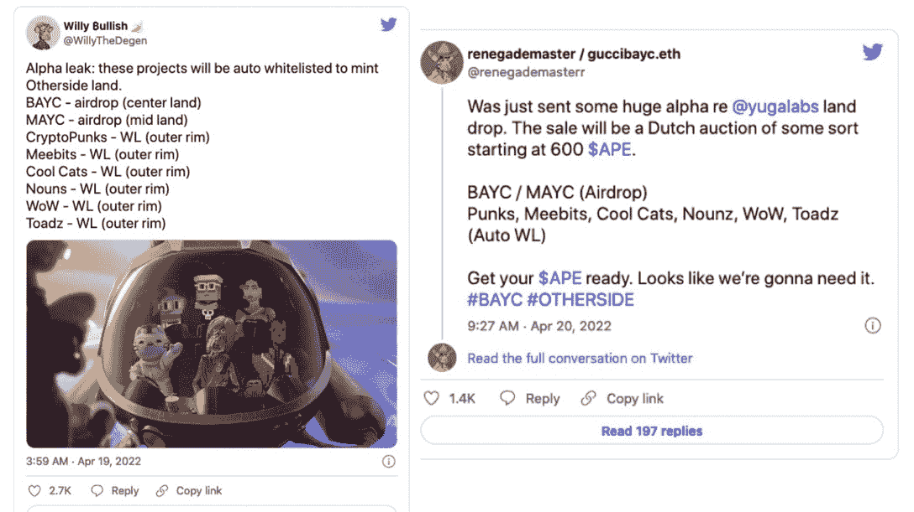
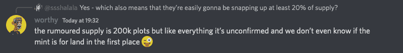
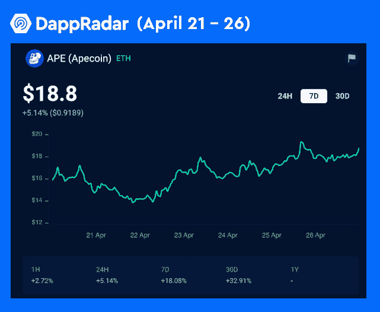
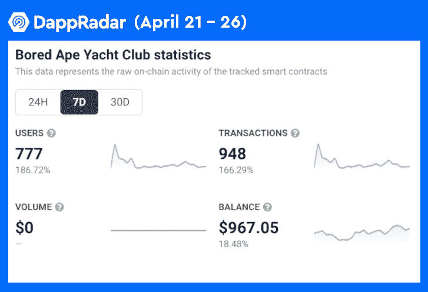

# 你需要知道的关于彼岸土地销售的一切

> 原文：<https://web.archive.org/web/https://dappradar.com/blog/everything-you-need-to-know-about-the-otherside-land-sale>

## 造币厂将于 4 月 30 日开始，ApeCoin 是官方支付方式

无聊猿游艇俱乐部的另一边元宇宙项目将于本周晚些时候启动，那些提前注册的人将获得一笔有保证的拨款。他们将使用 ApeCoin 作为所有初级销售的唯一支付方式。在一系列 alpha 泄露和另一次 BAYC 黑客攻击后，官方宣布了这一消息。

**概要:**

*   **根据 Otherside 的 Twitter 公告，Otherside 即将推出的薄荷将有一个[平薄荷价格为 305 便士](https://web.archive.org/web/20230120191414/https://dappradar.com/blog/bored-apes-otherside-metaverse-land-will-cost-305-ape-or-6500)每 NFT**
*   **土地出让将于[2022 年](https://web.archive.org/web/20230120191414/https://dappradar.com/blog/bored-apes-otherside-metaverse-land-will-cost-305-ape-or-6500)4 月 30 日开始。**
*   该团队强调，用户应该只通过官方推特账户来获取关于该项目的新闻。
*   这一消息也导致一只猩猩的价格攀升至 18 美元。

3 月 19 日，宇迦实验室，无聊猿游艇俱乐部(BAYC)团队，发布了一个即将到来的元宇宙项目[的预告。从那时起，粉丝们就一直热切期待着 Otherside 的揭露。上周，推特上流传着这样的流言:那些在预告片中客串过的蓝筹 NFT 系列将被自动列入“另一边降落”的白名单。还有人声称，他们得到内部消息，土地价格将从 600 APE 开始。](https://web.archive.org/web/20230120191414/https://dappradar.com/blog/bored-ape-metaverse-is-here-see-you-on-the-otherside)

今天，围绕备受期待的元宇宙项目的迷雾终于散去。Otherside 在其推特上宣布，造币厂将于 4 月 30 日开工。所以，让我们深入细节，看看是否有人能分一杯羹。

## 要加入彼岸铸币厂，你需要猿猴代币

通过一条 [Twitter 帖子](https://web.archive.org/web/20230120191414/https://twitter.com/OthersideMeta/status/1518733999405137920?s=20&t=VyiqQ4kjTubEp-8xVH3ksA)，OthersideMeta 透露了一些关于即将发行的造币厂的重要信息。以下是经过提炼的要点:

*   铸币将于美国东部时间 4 月 30 日中午 12 点开始， [Otherside 官方网站](https://web.archive.org/web/20230120191414/https://otherside.xyz/)是唯一合法的铸币场所。
*   用户必须在“有事正在酝酿”网站上通过 KYC 流程，才能参与周六的造币活动。
*   APE 将成为支付铸造费用的官方代币。
*   会有一个 [305 APE](https://web.archive.org/web/20230120191414/https://dappradar.com/blog/bored-apes-otherside-metaverse-land-will-cost-305-ape-or-6500) 的平铸币价格，第一波期间每个钱包只能铸币 2 NFTs。后续几波将会看到造币厂限额提高。
*   在铸币期间，总共将有 55，000 份土地非森林产品可供购买。
*   拍卖结束后的 21 天内，BAYC 和 MAYC 的持有者可以申请 NFT。KYC 并不是 BAYC 和 MAYC 持有者必须申请的。但如果他们想参与拍卖，那么 KYC 也适用于他们。

本周一， [BAYC 宣布其 Instagram 账户被黑](https://web.archive.org/web/20230120191414/https://dappradar.com/blog/more-than-3-million-stolen-in-another-bored-ape-yacht-club-nft-hack)，虚假造地消息开始在社区流传。为了进一步确保用户访问即将到来的 mint 的安全链接，Twitter 帖子多次强调， [OthersideMeta](https://web.archive.org/web/20230120191414/https://twitter.com/OthersideMeta) 、 [BAYC、](https://web.archive.org/web/20230120191414/https://twitter.com/BoredApeYC)、[宇迦实验室](https://web.archive.org/web/20230120191414/https://twitter.com/yugalabs)和 [Animoca Brands](https://web.archive.org/web/20230120191414/https://twitter.com/animocabrands) 的 Twitter 账户将是宣布项目相关新闻的唯一官方社交媒体。此外，Otherside 和 BAYC 的官方 Discord 服务器也会持续更新项目的最新状态。

暗示即将到来的造币厂的规模和定价的谣言已经在社交媒体上流传了几周。

另一方团队终于透露了更多关于造币厂的细节，让事情变得清晰起来。根据官方公告，总共将有 55，000 块土地分配给造币厂。每个要 305 便士。你可以在这里找到更多关于造币厂[技术流程的信息。](https://web.archive.org/web/20230120191414/https://dappradar.com/blog/bored-apes-otherside-metaverse-land-will-cost-305-ape-or-6500)

## 猿猴已经高飞一周了

自从上周 Otherside 即将发行造币厂的消息泄露后，ApeCoin 开始攀升。不出所料，官方声明导致了象征性价格的进一步上涨。目前，ApeCoin 的价格为 18.8 美元，过去 7 天上涨了 18%，30 天内上涨了 32%。

与此同时，BAYC 也在 7 天内见证了数量的增长，用户数量增长了 186%，交易量增长了 166%。一辆 BAYC NFT 的最新底价是 139.8 ETH(400.97 美元)。值得注意的是，在过去的 24 小时里，猿的交易价格远远高于这一数字，其中[猿#8780](https://web.archive.org/web/20230120191414/https://dappradar.com/hub/assets/eth/0xbc4ca0eda7647a8ab7c2061c2e118a18a936f13d/8780) 以 190 ETH 出售，[猿#1835](https://web.archive.org/web/20230120191414/https://dappradar.com/hub/assets/eth/0xbc4ca0eda7647a8ab7c2061c2e118a18a936f13d/1835) 以 180 ETH 出售，[猿#2153](https://web.archive.org/web/20230120191414/https://dappradar.com/hub/assets/eth/0xbc4ca0eda7647a8ab7c2061c2e118a18a936f13d/2153) 以 180 ETH 出售。

DappRadar 将继续关注 Otherside、BAYC 和 ApeCoin 的最新进展。在 [Twitter](https://web.archive.org/web/20230120191414/https://twitter.com/dappradar) 、 [Discord](https://web.archive.org/web/20230120191414/https://discord.gg/4ybbssrHkm) 和 [Youtube](https://web.archive.org/web/20230120191414/https://www.youtube.com/c/DappRadar) 上关注我们，跟上区块链世界的动态。

 NewsletterUnsubscribe at any time. [T&Cs](https://web.archive.org/web/20230120191414/https://dappradar.com/terms) and [Privacy Policy](https://web.archive.org/web/20230120191414/https://dappradar.com/privacy-policy)