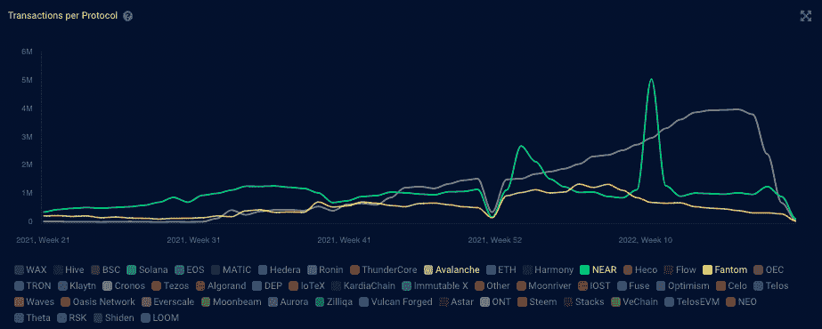
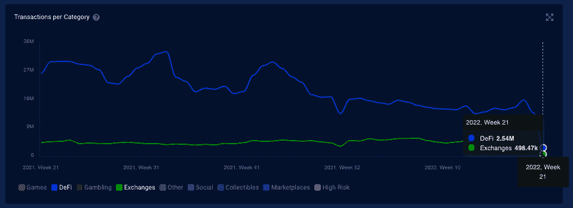

# 交易所拥抱 DeFi &打造定制区块链

> 原文：<https://web.archive.org/web/https://dappradar.com/blog/exchanges-embracing-defi-building-custom-blockchains>

## 在用户数量下降的情况下，交易所采取了自己的措施

几家领先的加密交易所正在涉足竞争激烈的 dapp 入职和开发领域。霍比和币安今年启动了各自的生态系统基金来帮助 dapp 的发展。现在，KuCoin 已经成为最新一家投入 1.5 亿美元帮助开发者建立 KuCoin 社区链(KCC)的交易所。

KCC 连锁已经拥有一个多元化的 dapps 生态系统，总价值超过 6100 万美元(TVL)。MojitoSwap 是领头羊，拥有该网络 90%以上的 TVL。

截至发稿时，KuCoin 尚未提供将从 1.5 亿美元中拿出多少资金来鼓励开发商增长。然而，KCC 表示，它将转向跨链模式，支持来自多个区块链的应用程序，并建立一个第二层系统，以更低的费用实现更快的交易。这听起来像是 KuCoin 的策略的一部分，将是追求其他连锁店已经成功的 dapps，并吸引他们过来。

## 区块链剧本

这一举措类似于区块链 like [NEAR](https://web.archive.org/web/20220815081020/https://dappradar.com/rankings/protocol/near) 、 [Avalanche](https://web.archive.org/web/20220815081020/https://dappradar.com/rankings/protocol/avalanche) 和 [Fantom](https://web.archive.org/web/20220815081020/https://dappradar.com/rankings/protocol/fantom) 推出增长基金，帮助他们各自的网络带来更多 dapps。他们已经在三家公司之间投入了超过 6 亿美元的 dapp 基金，过去 12 个月的 TVL 和用户活动的结果不言自明。

Source: [DappRadar](https://web.archive.org/web/20220815081020/https://dappradar.com/industry-overview)

随着市场反复震荡，试图找到阻力位，领先网络的交易量也在下降。因此，[DeFi daps 和交易所](https://web.archive.org/web/20220815081020/https://dappradar.com/rankings/category/defi)感到手头拮据。在 2022 年初，通过 [DeFi 和 exchange dapps](https://web.archive.org/web/20220815081020/https://dappradar.com/rankings/category/exchanges) 的交易数量约为每周 2300 万笔，在撰写本文时降至每周约 300 万笔。

Source: [DappRadar](https://web.archive.org/web/20220815081020/https://dappradar.com/industry-overview)

尽管在熊市条件确立后不久看到使用率下降并不奇怪。这些 dapps 和网络需要努力保持相关性，或许在好时光重现或投资者信心得到恢复之前，它们还会踩水。因此，有效利用资金和利用用户获取的举措。原则上，无非是“建起来，他们就会来”的理论。

看看什么样的 dapps 很快就会来到 KCC，以及 KuCoin 计划为这些动作分配多少资金，这将是最有趣的。可以说，这些网络可以很好地接受来自[不断增长的游戏赚取、游戏或移动赚取类别](/web/20220815081020/https://dappradar.com/blog/dapp-industry-report-april-2022/)的 dapps，以帮助增加他们的观众。在 [DappRadar 游戏排名](https://web.archive.org/web/20220815081020/https://dappradar.com/rankings/category/games)中，我们看到许多 dapps 在过去的一个月中有所增长，尽管加密市场低迷。最终，如果你在开发一个产品并寻求长期成功，用户数量比代币价值更重要。

 NewsletterUnsubscribe at any time. [T&Cs](https://web.archive.org/web/20220815081020/https://dappradar.com/terms) and [Privacy Policy](https://web.archive.org/web/20220815081020/https://dappradar.com/privacy-policy)

***以上不构成投资建议。此处给出的信息仅供参考。请行使尽职调查，做你的研究。作者持有多种加密货币的头寸，包括 BTC、瑞士法郎和雷达。***