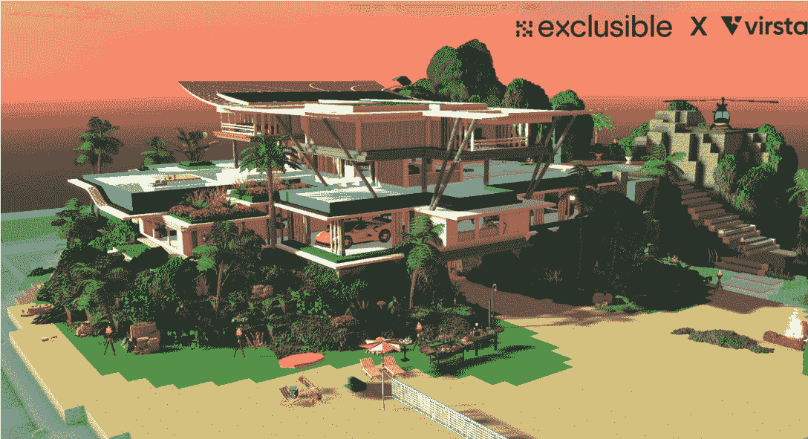
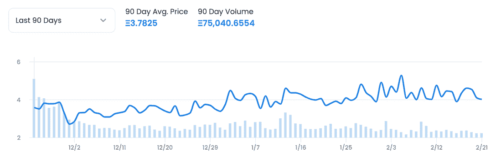
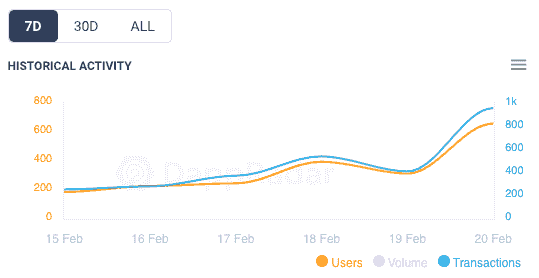

# Exclusible 以 290 万美元的价格向名人和明星出售私人岛屿

> 原文：<https://web.archive.org/web/https://dappradar.com/blog/exclusible-sells-out-private-islands-to-celebrities-and-stars-for-2-9-million>

## 明星们已经接受了设计师在沙盒元宇宙中的奢华视觉

在 [**沙盒**](https://web.archive.org/web/20221006040559/https://dappradar.com/ethereum/games/the-sandbox) **为富人和名人独家设计建造豪华虚拟别墅。我们看看谁拥有那里的财产，以及沙盒如何为自己找到另一个合适的合作伙伴。**

Exclusible 已经宣布其所有的 25 个私人岛屿已经以 290 万美元的总价售出。销售仅限于拥有至少 100 万社交媒体粉丝的人，新来者将享受以下数字盛宴:

*   直升机起飞及降落场
*   私人港口
*   高档家具
*   可定制的内部和外部

在 OpenSea 上 9 ETH 的底价和众多名人居住在他们的虚拟别墅中，[独有的](https://web.archive.org/web/20221006040559/https://dappradar.com/ethereum/collectibles/exclusible-alpha?source=dappradar-dashboard&medium=portfolio&campaign=clickout)可以宣称是 NFT 顶级奢侈品牌之一。该社区横跨 25 个岛屿，可以在元宇宙享受游戏化的奢华。

Don’t ask why someone needs a car in the metaverse

一些体育明星、媒体人士甚至一家金融公司都在 Exclusible's islands 购买了自己的豪宅。如果你有机会去的话，以下是一些值得注意的名字:

*   斯坦尼斯拉斯·瓦林卡:瑞士网球运动员
*   **金斯利·科曼**:拜仁足球运动员
*   莎拉·桑帕约:维多利亚的秘密模特
*   马尔科·维拉蒂:巴黎圣日耳曼足球运动员
*   **阿娜·伊万诺维奇**:前世界头号网球选手
*   eToro :一家以色列社交交易和经纪公司
*   **丹·霍尔兹曼**:连续创业家和足球俱乐部老板

## 大牌合作伙伴看起来是沙盒的一个好策略

正如[上周指出的](https://web.archive.org/web/20221006040559/https://dappradar.com/blog/esport-platform-chain-games-brings-ecosystem-into-the-sandbox)，沙盒一直在与强大的内容提供商和知名人士稳定合作，以努力吸引观众到它的平台。这是否会是一个成功的长期策略仍有待观察。但随着交易量在过去 90 天稳步增长，目前看跌的区块链市场的转变可能会给沙盘投资者带来巨大收益。

90 Day volume and price of LAND

从更短的时间尺度来看，4.3132 ETH 的最新 7 天平均土地价格高于 90 天平均价格。如果我们看一下那个时期的用户数量和交易，我们也看到了稳定的增长，这给未来带来了希望。

7 Day user and transaction numbers have gone up

最后，沙盒继续与世界上最可爱的单人品牌 Snoop Dogg 建立伙伴关系。小狗是沙盒自说唱歌手加入平台以来推广的一系列史努比狗狗主题化身中的最新一个。

目前还没有关于史努比是否会得到一栋专属别墅的消息。但如果你看到他躺在虚拟泳池附近，在沙盒中最专属的私人岛屿之一放松，不要感到惊讶。