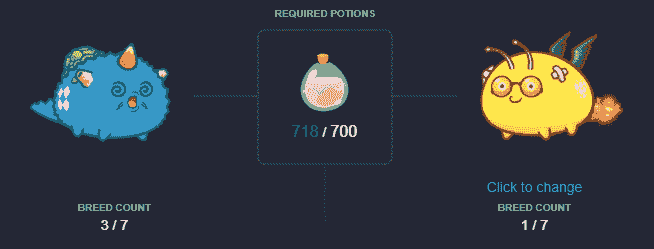
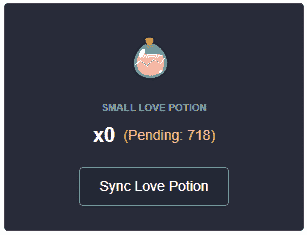
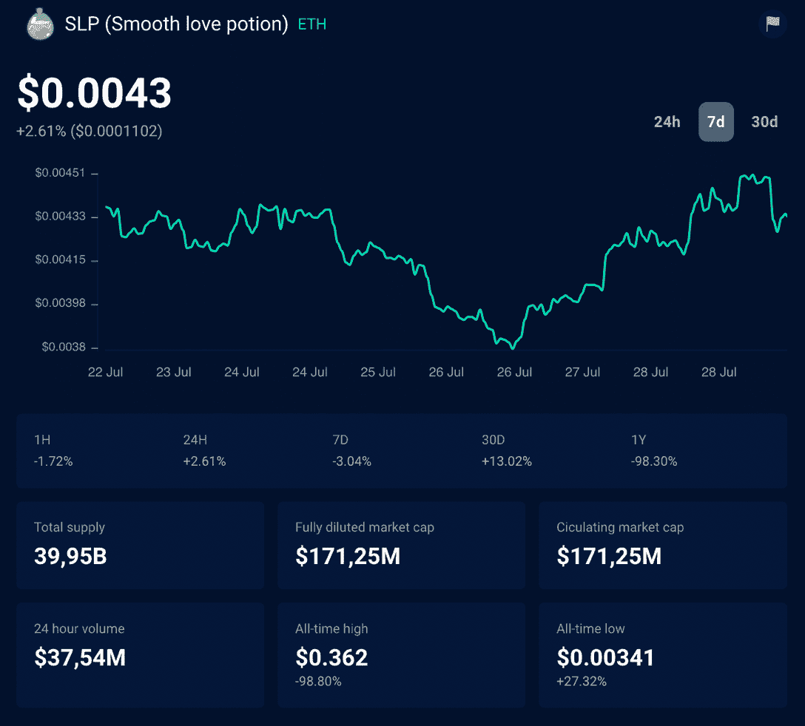
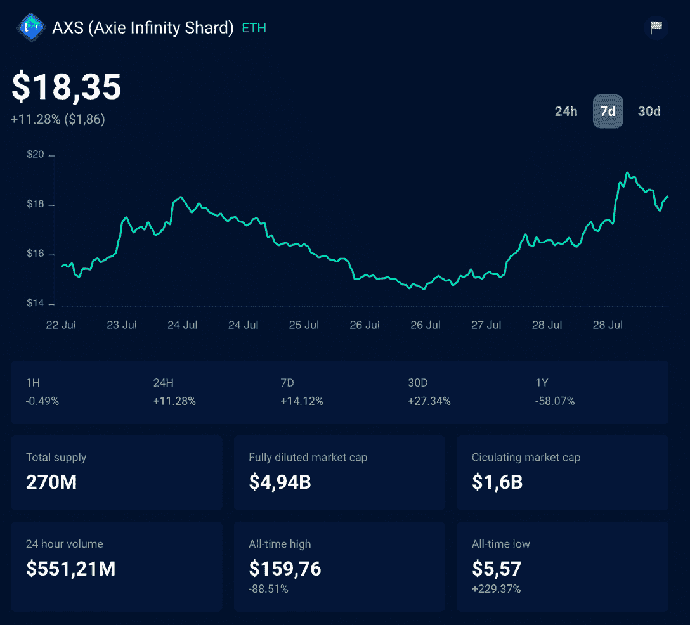
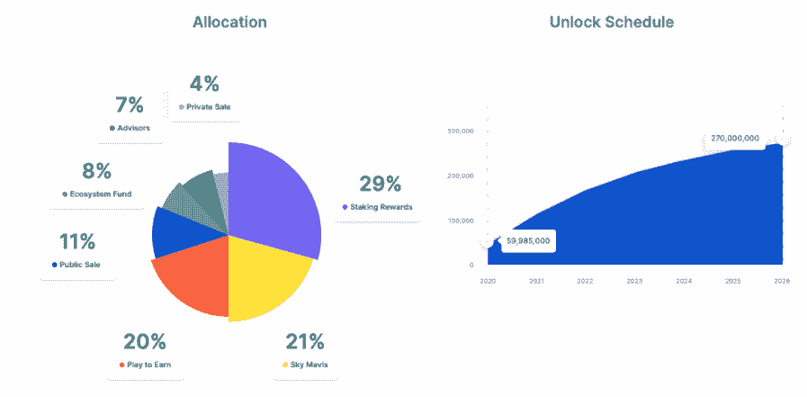

# Axie 无限 SLP 和 AXS 代币解释

> 原文：<https://web.archive.org/web/https://dappradar.com/blog/explained-axie-infinity-slp-and-axs-tokens>

## 你需要知道的关于热门区块链游戏代币的一切

Axie Infinity 宇宙强调了区块链技术通过游戏赚取游戏性和玩家拥有的经济的好处。但是 Axie Infinity 的令牌是什么，如何获取？这篇文章将告诉你关于 Axie Infinity 的 SLP 和 AXS 代币的一切。让我们开始吧！

## 什么是 Axie Infinity？

Axie Infinity 是一个受口袋妖怪启发的数字宠物世界，玩家在各种游戏中使用他们可爱的角色 Axie。这是一个越南项目，在 2021 年成为世界上玩得最多的区块链游戏。

因此，它在将游戏中的 Web3 技术带给更多观众方面发挥了巨大的作用。正如你在 [DappRadar 顶级区块链游戏排名](https://web.archive.org/web/20221209162407/https://dappradar.com/rankings/category/games)上看到的，Axie Infinity 已经连续几个月稳坐榜首。

*   请阅读我们的完整文章[了解更多关于 Axie Infinity 的信息，什么是 Axie Infinity 以及它是如何工作的？](https://web.archive.org/web/20221209162407/https://dappradar.com/blog/what-is-axie-infinity-and-how-does-it-work)

[<picture></picture>](https://web.archive.org/web/20221209162407/https://dappradar.com/ethereum/games/axie-infinity)[<picture></picture>](https://web.archive.org/web/20221209162407/https://dappradar.com/blog/axie-infinity-biggest-contributor-to-august-game-nft-trading/)[<picture></picture>](https://web.archive.org/web/20221209162407/https://dappradar.com/hub/swap/eth/ETH/AXS?to=0xbb0e17ef65f82ab018d8edd776e8dd940327b28b)

## Axie Infinity 的 SLP 令牌是什么？

光滑的爱情药水，又名 SLP，是一个不封顶的实用令牌，可以在游戏中用来繁殖新的 Axies。

该代币可以通过[玩 Axie Infinity](https://web.archive.org/web/20221209162407/https://land.axieinfinity.com/?r=DappRadar) 获得，通过 [Uniswap](https://web.archive.org/web/20221209162407/https://dappradar.com/blog/what-is-uniswap-and-how-to-use-it) 购买，或者通过参加各种促销活动或锦标赛获得。

每当你希望繁殖新的 Axies，你需要光滑的爱情药水。在这种情况下，用过的 SLP 将被烧掉并换上新的轴。

在引入 SLP 之前，Axies 使用通过最初的自动战斗系统获得的经验点或 XP 来繁殖。

随着 2019 年 12 月 19 日社区 Alpha 的发布，XP 被赋予了新的目的，因此 SLP 被注入以取代其作为育种背后的新“货币”的位置。

### 与 SLP 配种

用户每繁殖一个 Axie，SLP 就被消耗一次。每个品种的成本取决于父母双方的品种数量-父母双方的品种数量越多，使用的 SLP 就越多。

根据以下信息乘以每个亲代品种的数量，以确定所需药剂的数量:

**(第一代父母品种数 x 所需药剂数)x(第二代父母品种数 x 所需药剂数)=所需 SLP 总量**

见下表，以确定每个亲代品种数量的成本:

*   第一个品种:100
*   第二个品种:200
*   第三种:300
*   第四种:500
*   第五种:800
*   第六种:1300
*   第七种:2100

[<picture></picture>](https://web.archive.org/web/20221209162407/https://land.axieinfinity.com/?r=DappRadar)

**进一步阅读:** [Axie Infinity 助 SLP 调整养殖费用](https://web.archive.org/web/20221209162407/https://dappradar.com/blog/axie-infinity-boosts-slp-token-with-breeding-fee-adjustments)

### 购买和交易 SLP

要交易您的 SLP，您必须首先将其与您的以太坊钱包同步。

[<picture></picture>](https://web.archive.org/web/20221209162407/https://land.axieinfinity.com/?r=DappRadar)

进入你的[个人资料面板](https://web.archive.org/web/20221209162407/https://marketplace.axieinfinity.com/profile/dashboard)，点击左下角写着“同步爱情药剂”的按钮。这将把你的 SLP 从游戏钱包移到以太坊钱包。现在可以交易了。

你现在可以去 uni swap，这是目前唯一可以买卖 SLP 的地方。

光滑爱情药剂的价格是 Axie Infinity 活动的重要驱动力，因为它使玩家能够从玩游戏中赚取价值，因为他们可以向需要它来繁殖 Axie 的玩家出售 SLP 令牌。

[Track AXS with DappRadar’s Token Explorer](https://web.archive.org/web/20221209162407/https://dappradar.com/hub/token/eth/SLP)

没有 SLP，使用者就无法繁殖后代，而繁殖后代出售已经成为一些人的流行消遣。

看看这些数据，很容易理解为什么有些轴的价格会超过 6 万美元。此外，通过分割单个轴，允许部分所有权。

看看 Axie Infinity 在以太坊短暂的生命周期中累积的$ number 美元，很明显区块链游戏已经在一个由少数人主导的市场中找到了自己的位置。

Axie Infinity 已经创造了超过 6500 ETH 或 280 万美元的收入。也许更令人惊讶的是这种收入在各种流中的权重。

土地销售显然产生了最大的社区利益和收入，有趣的是它代表了游戏中的未来活动。

## Axie Infinity 的 AXS 令牌是什么？

Axie Infinity 生态系统也有自己的**独特治理令牌**，被称为 [Axie Infinity 碎片](https://web.archive.org/web/20221209162407/https://dappradar.com/hub/token/eth/AXS/) (AXS)。这些用于参与关键的治理投票，并将给予持有人在如何使用 Axie 社区国库中的资金方面的发言权。

Axie Infinity 碎片(AXS)于 2020 年 11 月在币安推出，是 Axie 宇宙的 ERC 20 治理令牌。

持有人将通过表明他们对生态系统升级的支持和指导社区金库的使用来塑造 Axie Infinity 的未来。

[Track AXS with DappRadar’s Token Explorer](https://web.archive.org/web/20221209162407/https://dappradar.com/hub/token/eth/AXS/)

AXS 持有者将能够要求奖励，如果他们赌注他们的代币，玩游戏，并参与关键的治理投票。当玩家在 Axie Infinity 宇宙中玩各种游戏时，他们还可以通过用户生成的内容获得$AXS。

AXS 赌注是持有 AXS 和支持生态系统的一种激励。利益相关者将收到最新发布的 AXS，并能够对各种改进 Axie Infinity 的提案表示支持。AXS 利益攸关方最终将直接使用社区金库。

Source: [Axie Infinity](https://web.archive.org/web/20221209162407/https://www.notion.so/Infographic-6d93a97be54c4957aeb95f1d433841ff)

## Axie Infinity 奖励玩家

一个游戏需要玩家，通过简单的游戏，用户为网络增加了价值，应该得到回报。Axie Infinity 已经[改变了生命](https://web.archive.org/web/20221209162407/https://www.coindesk.com/nft-game-filipinos-covid)。现在,“为挣钱而玩”正在流行起来，Axie 希望将这一模式推广到数百万玩家，而 AXS 是这一使命的基础。

【Axie 背后的团队设想玩家通过以下方式获得 AXS:

*   完成任务和地下城。
*   赢得锦标赛。
*   与你的土地互动并照料它们。
*   使用 Axie Infinity 产品，如 Marketplace。
*   创建内容和构建工具/体验。

Axie Infinity 是一个吸引人的项目，吸引了大量的观众，并成功地建立在游戏赚钱的模式上。随着社区掌握 AXS 令牌和赌注功能，观察未来几个月的发展将会非常有趣。

## 继续用 DappRadar 跟踪 Axie Infinity 令牌

一如既往，我们 DappRadar 将继续跟踪和监测 Axie Infinity 领域的发展。

[https://web.archive.org/web/20221209162407if_/https://www.youtube.com/embed/jXmS7UWma3s?feature=oembed](https://web.archive.org/web/20221209162407if_/https://www.youtube.com/embed/jXmS7UWma3s?feature=oembed)

你想在区块链游戏这个激动人心的世界里了解更多最好的项目吗？关注 DappRadar [博客](https://web.archive.org/web/20221209162407/https://dappradar.com/blog/)、 [YouTube](https://web.archive.org/web/20221209162407/https://www.youtube.com/c/DappRadar) 频道和 [Twitter](https://web.archive.org/web/20221209162407/https://twitter.com/dappradar) 。

***以上不构成投资建议。此处给出的信息仅供参考。请行使尽职调查，做你的研究。***

 NewsletterUnsubscribe at any time. [T&Cs](https://web.archive.org/web/20221209162407/https://dappradar.com/terms) and [Privacy Policy](https://web.archive.org/web/20221209162407/https://dappradar.com/privacy-policy)