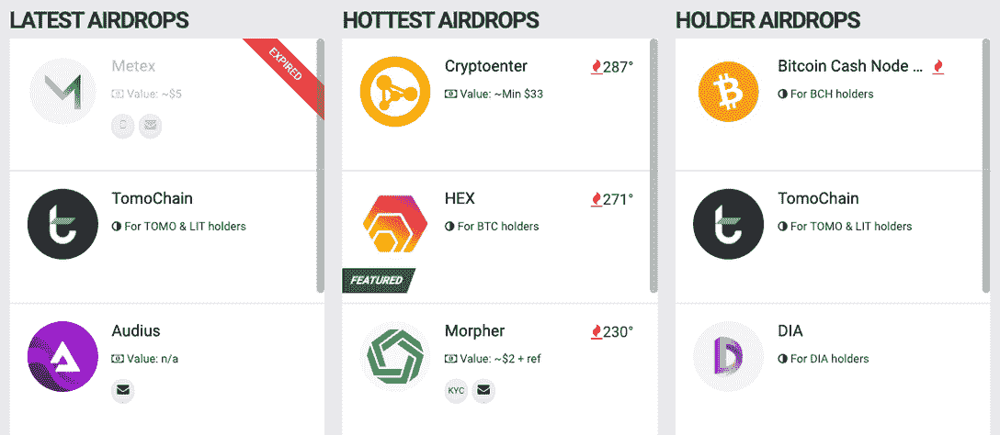
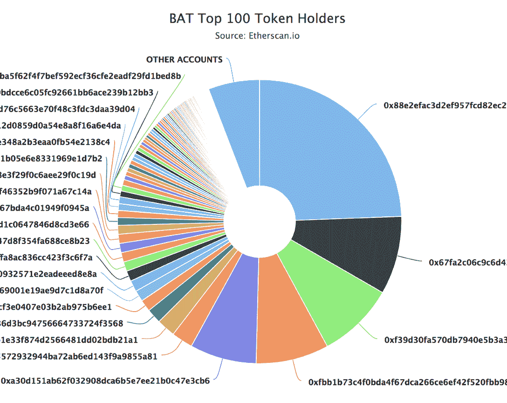

# 什么是加密空投&如何获得它们

> 原文：<https://web.archive.org/web/https://dappradar.com/blog/explained-cryptocurrency-crypto-airdrops>

## 为开发者和投资者了解更多关于 2022 年加密空投的信息

加密货币和去中心化应用最近风靡一时。你可能听说过 Web3 项目提供空投，人们拼命寻找新的索赔。空投是了解加密货币的一个很好的方式，并有可能在这个过程中获得一些免费代币。但是在排队购买之前，**首先什么是加密空投**？这篇博文将解释所有关于空投的内容，以及你如何参与其中。敬请期待！

## 什么是加密空投？

加密空投基本上是一种公司将其令牌分发到某些用户钱包中的手段，通常完全免费。

对于任何看过老式战争电影的人来说，你会记得看到巨大的大力神飞机向下面的土地投掷包裹。这些箱子装满了供应品，为了帮助那些陷入冲突的人，它们被免费投放。

在加密领域，同样的基本提议是正确的，但加密空投被用作一种营销形式，并在开发的早期阶段围绕项目建立社区。

或者，最近，治理令牌已经空投给平台的用户，允许他们在项目的治理中发挥更大的作用，并因他们的忠诚或早期采用而获得奖励。

### 加密空投和苹果空投有关系吗？

不。区分苹果 Mac 和 iOS 文件共享产品“Airdrop”和我们在这里讨论的 Airdrop 是很重要的。他们没有任何联系。

## 加密空投是用来做什么的？

从开发者的角度来看，crypto-verse 中的空投是出于营销原因而采用的，其好处包括产生意识、更深入地理解用户、筹集资金、奖励忠诚度以及实现令牌的更广泛分发。

从用户的角度来看，这很简单。空投为用户提供了参与在线赚钱的机会，并从一开始就投资于潜在的有利可图的项目。

在本文的后面，我们将更深入地探讨对各方的好处，但首先，理解空投的种类是至关重要的。

## 不同类型的加密空投

问题*‘什么是加密空投’*太简单了，无法用一种方式来回答。在秘密宇宙中有不同类型的空投。所以，每一种都需要不同的行为来获得回报。看看下面这些:

*   标准空投
*   赏金空投
*   持有人空投
*   Hardfork 空投
*   独家空投

### **标准空投**

这些加密空投需要你注册一份时事通讯或类似的。感兴趣的人可以简单地注册一个名字和电子邮件 ID，并立即获得空投资格。这将是 [DappRadar 空投的最初风格，你可以在这里](https://web.archive.org/web/20221209062847/https://dappradar.com/hub/airdrops)注册，以便在 11 月中旬第一次空投时得到提醒。

### **赏金空投**

在这种情况下，您需要执行一项活动来获得加密空投的资格。最常见的活动包括在推特上发布项目信息。

### **支架空投**

这种空投发生在你的钱包里装着某些代币的时候。比如说；基于 EOS 的加密空投为你提供一些免费的代币，前提是你的钱包里有 EOS 代币。

### **Hardfork 空投**

当一枚硬币硬脱离其原始协议时，原始硬币的持有者也有资格空投新硬币。比特币持有者身上的[比特币现金空投](https://web.archive.org/web/20221209062847/https://airdrops.io/bitcoin-cash/)就是一个完美的例子。

### **独家空投**

假设你是某个特定项目、网站、俱乐部等的忠实会员。你可能有资格进行独家空投，而其他人可能没有。顾名思义，这种空投是专门为某一特定群体保留的。例如，Uniswap 在 2020 年 9 月向忠实用户奖励了 2500 个 UNI 令牌。在交货当天，这笔钱相当于 1250 美元，没有任何附加条件。

## 如何获得加密空投？

任何人都可以参加空投，但在开始之前有一些基本要求。要参加，你首先需要三样东西:

*   加密钱包；
*   一些加密货币，比如比特币，EOS，或者以太坊；
*   关于新空投的信息资源。

### 我怎样才能得到一个加密钱包？

加密货币钱包是一种数字钱包，可以用来存储、发送和接收各种加密货币。查看我们下面的视频，获得一些关于 web3 钱包的视觉见解:

[https://web.archive.org/web/20221209062847if_/https://www.youtube.com/embed/Odixm1ehnfw?feature=oembed](https://web.archive.org/web/20221209062847if_/https://www.youtube.com/embed/Odixm1ehnfw?feature=oembed)

关于选择安全的加密钱包，你可以参考我们的文章【2022 年最佳加密货币钱包。

### 我应该拥有哪些令牌来参与加密空投？

以太坊和比特币是根代币的好例子，如果你想参加空投，那么你需要有这些代币。你现在可以去任何一家交易所，用菲亚特交易这两种股票。它们几乎随处可见。Crypto.Com 的比特币基地和泽里翁是开始的好地方。

请记住，在某些情况下，您将获得与您的股份(您拥有的根令牌数)成比例的空投令牌。虽然我们不提倡你把一生的积蓄都放在那里，但如果只是为了获得更多的回报，而不是重复支付交换费，拥有一笔可观的金额是有用的。

### 我在哪里可以找到加密空投？

关于资源，有主机可用。真正掌握参与推特的密码世界的脉搏几乎是必不可少的。它是唯一允许围绕区块链和加密货币进行免费推广和讨论的社交媒体网站之一。

也有专门的网站如 [Airdrops.io](https://web.archive.org/web/20221209062847/https://airdrops.io/) 完全专注于这些信息。重要的是要明白，这些网站通常与开发商达成交易，并收取费用来上市和营销空投物资。

[Airdrops.io](https://web.archive.org/web/20221209062847/https://airdrops.io/)

虽然这不是一个问题，但为了找到最好的和最有利可图的选择，你不能打败一些老式的努力工作和互联网搜索。

## 为什么加密项目要发展空投？

如前所述，空投可以成为任何项目营销工作的重要组成部分。让我们看看他们可以帮助开发者围绕他们的产品建立一个强大的社区的 5 种主要方式。

### 1.提高认识

由于越来越多的项目争夺加密领域的空间，提高对项目的认识对营销团队来说至关重要。空投可以为任何多方面的营销活动增加非常活跃的一层。

投资者不断被拉向各个方向，阅读和观察每一个新的、可能改变世界的项目。对它们进行评估是不可能的。但是如果一个项目空投给你一些免费的代币呢？

立即投入到一个项目中无疑会增加兴趣。有经验的投资者会希望更多地了解他们现在投资的项目，这本身就能提高对项目的认识。

### 2.理解用户

大多数空投系统要求那些希望获得代币的人提交一些关于他们自己的基本信息。Twitter、电子邮件地址、电报名称、钱包地址，或许还有更多关于他们最初如何发现空投的个性化数据。

通过填写该表格并提供有意义的数据，公司将获得关于潜在用户的更多信息。帮助他们为他们的理想受众创建更有针对性的营销解决方案。

### 3.筹集资金

事实证明，空投是从项目一开始就筹集资金的有效方式。让我们看看这个过程在现实世界中是如何工作的，以帮助获得更详细的视角。

假设您正在构建一个运行在以太坊区块链上的 dapp，该 dapp 将使用一个本地令牌，比如 ABC 令牌。从一开始，该项目就发行了 1 亿个 ABC 代币，发行后价值 0.20 美元。

因此，代币的总市值为 1 亿 x 0.20 = 2000 万美元。

一旦启动，该项目可以向以太坊空投 1000 万代币或 200 万美元。在这一点上，你可能会想“为什么我要在发布后立即赠送 200 万美元的代币？”这样，总资本将从 2000 万美元减少到 1800 万美元。

但是，随着空投运动的继续，社交媒体上充斥着关于代币的新闻，更多的人最终会看到这个项目。

如果你有一个良好的基础和商业模式，将会有更多的人发布关于这个项目的帖子，并研究提供什么。因此增加了代币的感知价值。

即使每个 ABC 代币的价值从 0.02 美元上升到 0.04 美元，代币的总价值也会上升(0.04 x 90)= 3600 万美元。因此，从这个新值中减去原来的金额，剩下 1800 万美元。

通过赠送 10%的代币，你已经筹集了 3600 万美元——1800 万美元= 1800 万美元，却连一个代币都没卖出去！这就是空投筹款的工作方式。

### 4.奖励忠诚

这种方法的一个有趣的例子在加密宇宙中激起了涟漪，因为流行的分散式交换 Uniswap 的不知情用户突然得到了 2500 个 UNI 令牌，或者在那个时间点大约 1250 美元——免费的！

[UNI WAP 发布了 UNI 治理令牌](https://web.archive.org/web/20221209062847/https://dappradar.com/blog/exchange-protocol-uniswap-launches-uni-governance-token)，该令牌允许所有之前的用户参与协议的未来决策。或者，那些收到奖金的人可以把它换成法币或者把代币换成股份。激励赌注机制使 Uniswap 能够在生态系统中保留代币并创造流动性，但不幸的是，似乎大多数人只是卖掉了代币并把钱带到了其他地方。

此后，这种模式在区块链科技领域的其他领域得到了重复，而且似乎越来越流行。例如， [$RARI 治理令牌](https://web.archive.org/web/20221209062847/https://dappradar.com/blog/how-to-claim-rari-tokens)被分发给[稀有平台](https://web.archive.org/web/20221209062847/https://dappradar.com/ethereum/marketplaces/rarible)的用户，作为一种奖励加密艺术买家和卖家的方式

加密用户的忠诚度很难获得。普通用户希望通过不断寻找“下一个大令牌”来尽可能多地赚钱。一些空投是以这样一种方式构建的，你持有的代币越多，你在随后的空投中收到的代币就越多。

因此，如果用户确实对代币很忠诚，并在钱包中保留了大量代币，公司可以奖励他们更多代币。MakerDAO 通过广受欢迎的钱包运营一个系统，以这种方式奖励将戴放在钱包中的用户，每天都有奖励。

与此同时，空投可以激发用户的忠诚度，因为他们现在实际上有购买和保留代币的动机。这个地区的进化和发展时机已经成熟。

### 5.更广泛的令牌分发

以代币形式出售部分公司的任何项目面临的一个主要问题是，鲸鱼买家持有大量头寸，从根本上侮辱了分权。一个著名的例子是蝙蝠图标。

蝙蝠图标有很多炒作，因为它是布伦丹艾希的项目。布伦丹·艾希是 JavaScript 和 Mozilla Firefox 的创始人。当 BAT ICO 出现时，一个鲸鱼买家控制了现存 BAT 代币的 20.7%。

仅仅 5 个账户就拥有超过 50%的 BAT 代币！分散项目的一个大问题。空投可以通过投放与现有财产成比例的代币来提供帮助。

空投可以有效地实现广泛、均匀的分发，因为所有这些公司和 dapps 都是建立在母公司区块链的基础上，如 TRON、EOS、Ethereum 等。那些区块链分布相对较好。例如，公司可以通过向母公司区块链代币持有者空投代币来利用这种分配。这里使用一个真实世界的例子将有助于理解。

想想一种受欢迎的早餐麦片，比如水果圈。Fruit Loops 拥有广泛、多样的全球受众，他们喜欢该产品。通常在产品内部或外部，会有与另一家公司的营销搭售。例如，迪士尼乐园九折优惠券。

迪士尼乐园只是确保 10%的代金券在各种各样的观众中公平、平等地分配。同样，dapp 项目可以利用他们正在操作的特定区块链或区块链的用户。

这种方法意味着项目可以尝试确保他们的令牌被尽可能广泛地分发，并且他们确保一个分布良好且多样化的人群正在测试他们的产品。

## 当心加密空投钓鱼骗局

有很多骗子会伪装成一个合法的项目，并向您索取个人信息，以便向您“发送”免费令牌。他们甚至会创建一个假的 Twitter 账户或一个看起来与真实项目网站一模一样的假网站。

不幸的是，这种策略在 2022 年变得流行起来，你必须时刻小心。就在 2022 年 7 月，800 万美元在 [Uniswap 网络钓鱼攻击](https://web.archive.org/web/20221209062847/https://dappradar.com/blog/8m-taken-in-uniswap-phishing-attack)中被取走。

您可以做一些关键的事情来保持安全，例如:

*   [永远不要分享你的加密钱包密码和种子短语](https://web.archive.org/web/20221209062847/https://dappradar.com/blog/4-tips-on-blockchain-cybersecurity-stay-safe-in-crypto)；
*   [考虑一个冷加密钱包服务](https://web.archive.org/web/20221209062847/https://dappradar.com/blog/4-tips-on-blockchain-cybersecurity-stay-safe-in-crypto)；
*   多样化你的投资组合。
*   [检查您将要使用的 dapps 的完整性](https://web.archive.org/web/20221209062847/https://dappradar.com/blog/4-tips-on-blockchain-cybersecurity-stay-safe-in-crypto)。

要小心授予哪些权限。你应该总是做自己的研究，以确保空投是合法的。

## 什么是加密空投？总结

加密空投是公司用来提高认知度和分发的工具。对用户来说，这是一种从一开始就投入资金并在网上赚钱的方式。

大多数情况下，这种安排似乎对双方都是一种双赢的局面，但正如密码世界中的任何事情一样，有欺诈者和骗子试图利用天真的投资者。

看看这段视频吧，它可以直观地解释什么是加密空投，它发布在我们的官方 YouTube 频道上:

[https://web.archive.org/web/20221209062847if_/https://www.youtube.com/embed/wYwI8RaqyBo?feature=oembed](https://web.archive.org/web/20221209062847if_/https://www.youtube.com/embed/wYwI8RaqyBo?feature=oembed)

记住永远要自学，做自己的研究。如果你的功课做对了，那么作为投资人，你可以从空投中赚钱。如果你是一个 dapp 开发者，那么如果执行正确，airdrops 将帮助你获得远远超过传统广告的用户群和分销。

如果你有兴趣了解更多令人兴奋的去中心化应用世界，请关注 DappRadar 的博客和 T2 的 YouTube 频道。我们会让你了解最好的[空投新闻](https://web.archive.org/web/20221209062847/https://dappradar.com/blog/tag/crypto-airdrops)。

此外，访问 [DappRadar 空投中心](https://web.archive.org/web/20221209062847/https://dappradar.com/hub/airdrops)以获得免费和经过验证的加密空投。有机会获得最新的代币，重点是 DeFi 空投和 NFT。

 NewsletterUnsubscribe at any time. [T&Cs](https://web.archive.org/web/20221209062847/https://dappradar.com/terms) and [Privacy Policy](https://web.archive.org/web/20221209062847/https://dappradar.com/privacy-policy)