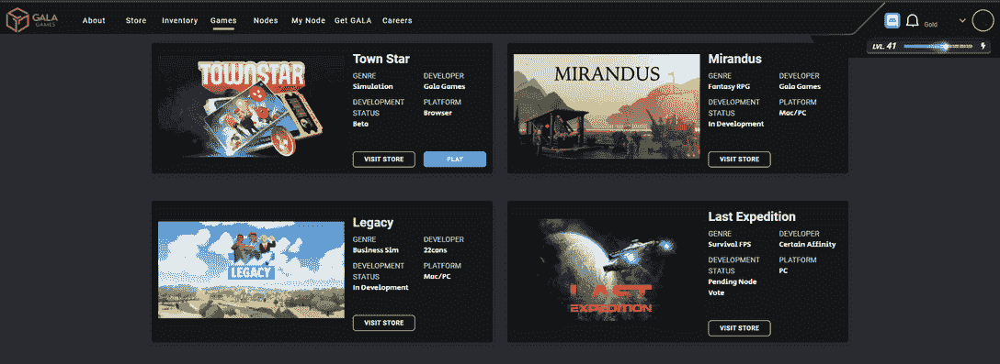

# 什么是 Gala，GALA 游戏的原生标志

> 原文：<https://web.archive.org/web/https://dappradar.com/blog/explained-gala-games-gala-token>

## 对庆典游戏和庆典令牌的完整解释

作为一种支付方式以及对分散式游戏网络贡献的奖励，GALA token 的存在为 GALA 游戏生态系统提供了动力。Gala Games 是一家游戏公司，希望通过赋予游戏玩家所有权来增强他们的能力，在顶级游戏中充分利用 NFT 和代币经济。全部由本地的 GALA 令牌驱动。

## 摘要

*   Gala Games ( [GALA](https://web.archive.org/web/20230305210522/https://dappradar.com/hub/token/eth/GALA?from=0x15d4c048f83bd7e37d49ea4c83a07267ec4203da) )是一家游戏发行商和开发商。他们使用 GALA token 作为 NFTs 的支付选项和对贡献者的奖励。
*   Gala 和 GALA 游戏生态系统最初在区块链以太坊推出，但现在已经扩展到 T2 BSC。
*   最终，他们将推出他们的分散网络，目前被称为 [GalaChain 或 Project Gyri](https://web.archive.org/web/20230305210522/https://dappradar.com/blog/gala-games-presents-its-blockchain-what-is-project-gyri/) 。
*   Gala Games 并不关注 GameFi，而是希望在“普通玩家”会玩的游戏中加入“边玩边赚”的机制。
*   Gala Games [与皮特·莫利纽克斯(寓言、黑&白)、威尔·莱特(模拟人生、模拟城市、孢子)、某些 Affinity(光环无限、光环:大总管合集)签订合作关系](https://web.archive.org/web/20230305210522/https://dappradar.com/blog/explained-gala-games-gala-token/#developers)。

## 节日游戏和节日介绍

Gala Games 是由 Zynga 的联合创始人埃里克·施迈尔(Eric Schiermeyer)创立的。前 Farmville 首席设计师迈克尔·麦卡锡领导开发内部项目，如城镇之星和即将到来的 MMORPG 米兰多斯。最终，Gala Games 希望通过区块链技术赋予游戏玩家力量，让他们成为生态系统的一部分。玩家可以购买 NFT，成为游戏项目基础的一部分，并从未来的成功中受益。同时，新玩家可以从他们的游戏内活动中获利。联欢晚会在这一切中扮演着重要的角色。

此外， [GALA](https://web.archive.org/web/20230305210522/https://dappradar.com/hub/token/eth/GALA?from=0x15d4c048f83bd7e37d49ea4c83a07267ec4203da) 将成为一个未命名的区块链生态系统的本地标志，由 GALA 游戏生态系统的用户提供动力。用户可以使用他们的 GALA 游戏帐户购买使用 Gala 令牌的节点的许可证。这些成千上万的节点将成为 Gala Games 网络，由社区标记为 GalaChain。在内部，他们称即将到来的连锁项目为[项目 Gyri](https://web.archive.org/web/20230305210522/https://dappradar.com/blog/gala-games-presents-its-blockchain-what-is-project-gyri) 。

再次，春晚将成为这个网络背后的奖励和驱动力。与此同时，Gala Games 通过其姐妹组织 Gala Labs 将其足迹扩展到其他娱乐行业。例如，他们致力于 [Gala Music](https://web.archive.org/web/20230305210522/https://dappradar.com/blog/snoop-dogg-and-gala-music-drop-nft-stash-boxes/) ，一个分散的音乐分发和流媒体平台。

## 晚会多链

原本 [GALA](https://web.archive.org/web/20230305210522/https://dappradar.com/hub/token/eth/GALA?from=0x15d4c048f83bd7e37d49ea4c83a07267ec4203da) 只存在于以太坊网络上。然而，由于高昂的汽油费阻碍了以太坊，Gala Games 不得不做出一些改变，最终使他们和最终用户都受益。因此他们向 BSC 发布了 GALA，允许用户用本地 GALA 令牌以较低的费用进行交易，比如在 [PancakeSwap](https://web.archive.org/web/20230305210522/https://dappradar.com/binance-smart-chain/defi/pancakeswap) 上。

本地 GalaChain 是 Gala 游戏和 GALA token 的多链未来的核心。他们希望允许用户将 GalaChain 连接到 BSC、Flare Network、Polygon、NEAR 和该团队正在讨论的其他区块链生态系统。

## 盛大游戏的游戏愿景

我们都知道那些简单的 GameFi 游戏，在那里你做一些事情，然后必须等待，然后才能进行下一步。这些游戏很慢，也没有那么多乐趣。Gala Games 希望成为一个以玩家为中心的平台，在这个平台上，乐趣是第一位的，游戏和赚钱机制是第二位的。《城镇之星》是一款具有挑战性和竞技性的农耕游戏，[米兰多斯](https://web.archive.org/web/20230305210522/https://dappradar.com/ethereum/games/mirandus)将成为一个完整的 MMORPG，《蜘蛛坦克》是一款基于团队的 MOBA 游戏。

同时，Gala Games 与现有的游戏工作室合作。随着威尔·莱特和皮特·莫利纽克斯，他们吸引了传奇的游戏设计师数百万的销售额。他们制作了模拟城市、模拟人生、寓言和黑白等游戏。某些亲和力目前正致力于一个游戏叫做最后的远征。这些开发人员参与了各种在线多人射击游戏，如使命召唤和光环系列。

Gala Games 和他们的 [GALA](https://web.archive.org/web/20230305210522/https://dappradar.com/hub/token/eth/GALA?from=0x15d4c048f83bd7e37d49ea4c83a07267ec4203da) token 想要将自己定位为市场上最大的 AAA 级区块链游戏发行商。他们开发的不是被动游戏或 GameFi 项目，而是每个玩家都想玩的游戏。但是，这些游戏通过非功能性游戏和游戏赚钱经济得到了增强。

[回到区块链顶级游戏代币](https://web.archive.org/web/20230305210522/https://dappradar.com/blog/top-blockchain-game-defi-tokens)

 NewsletterUnsubscribe at any time. [T&Cs](https://web.archive.org/web/20230305210522/https://dappradar.com/terms) and [Privacy Policy](https://web.archive.org/web/20230305210522/https://dappradar.com/privacy-policy)