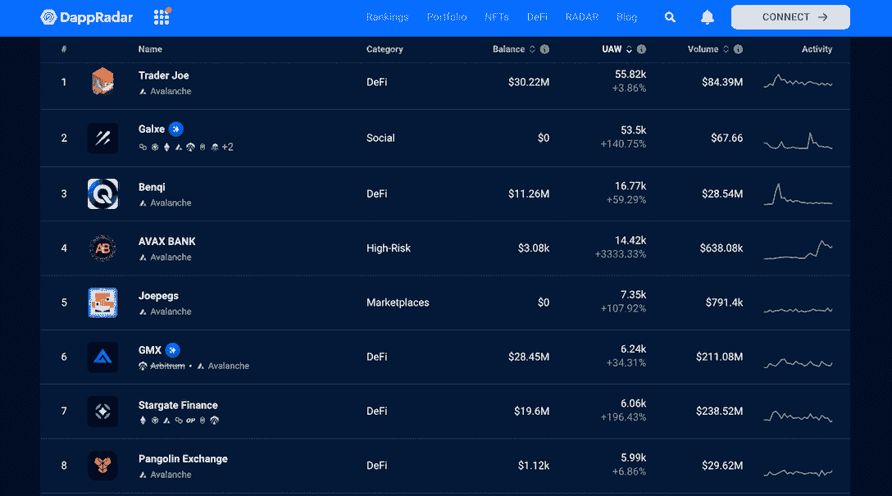
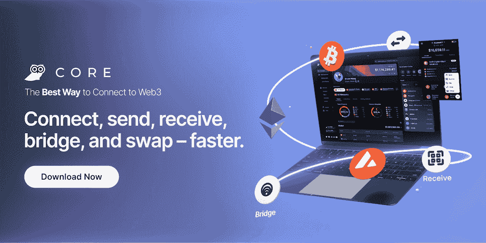

# 探索 Avalanche Dapps、NFT、Bridges 和所有 EVM 兼容的带 Core 的区块链

> 原文：<https://web.archive.org/web/https://dappradar.com/blog/explore-avalanche-dapps-nfts-with-core>

## 核心钱包支持 40 多种法定货币和各种支付方式

**艾娃实验室推出 Core，这是一款多功能一体化钱包，适用于 Avalanche 和所有 EVM 兼容的区块链生态系统，为用户提供一个 Web3 门户和一系列工具来增强他们的体验。**

**目录**

*   *[雪崩的生机勃勃的生态系统](https://web.archive.org/web/20221211195558/https://dappradar.com/blog/explore-avalanche-dapps-nfts-with-core/#eco)*
*   [*核心是什么？*](https://web.archive.org/web/20221211195558/https://dappradar.com/blog/explore-avalanche-dapps-nfts-with-core/#core)
*   [*Core 有什么特点？*](https://web.archive.org/web/20221211195558/https://dappradar.com/blog/explore-avalanche-dapps-nfts-with-core/#features)
*   *[有用链接](https://web.archive.org/web/20221211195558/https://dappradar.com/blog/explore-avalanche-dapps-nfts-with-core/#links)*

## 雪崩充满活力的生态系统

Avalanche 的生态系统经历了快速扩张，在多个领域都有显著增长，如 NFT、DeFi 和 Web3 Social。此外，许多 dApps 利用子网(Avalanche 的创新扩展解决方案)升级到自己的区块链，旨在优化性能和改善用户体验。

例如，业内最受欢迎的 GameFi dapps 之一的 [DeFi Kingdoms](https://web.archive.org/web/20221211195558/https://dappradar.com/avalanche/games/defi-kingdoms) ，利用子网技术推出了它在 DFK 区块链的连锁店。游戏专用的区块链最近接近日均交易量 200 万。

雪崩生态系统中另一个备受瞩目的项目是 [Galxe](https://web.archive.org/web/20221211195558/https://dappradar.com/avalanche/social/galxe) ，这是一个 Web3 凭证基础设施，使用游戏化来帮助用户了解 DeFi，找到 NFT 交易等等。此外，Galxe 通过组织和分析用户的链上活动，帮助用户在不损害隐私的情况下建立自己的 Web3 身份。

Galxe 在 Avalanche 上的 30 天独特活动钱包数量飙升，超过 50，000 个钱包与其智能合约互动。

如果用户希望无缝、安全地参与由 Avalanche 驱动的 Web3 并从中获益，那么拥有一个核心钱包是一个有效的开始。但核心不仅仅是为了雪崩；它是所有 EVM 兼容网络的用户网关。

[Learn more about Core](https://web.archive.org/web/20221211195558/https://extension.core.app/?utm_source=dappradar&utm_medium=display)

## 更有甚者

[<picture></picture>](https://web.archive.org/web/20221211195558/https://extension.core.app/?utm_source=dappradar&utm_medium=display)

由艾娃实验室支持，核心是雪崩生态系统的自我保管钱包。但是，不仅如此，Core 还是 Web3 的一个包罗万象的指挥中心。它将 Avalanche dapps、子网、网桥和 NFT 整合在一个无缝的高性能浏览器体验中，使用户能够以最流畅的方式探索 Web3 世界。

用户在使用 Core 时不会发现任何繁琐的功能。相反，他们只需安装核心浏览器扩展，立即体验其直观的界面和自动化的交易工具，查看资产组合，等等。

[Check out Core](https://web.archive.org/web/20221211195558/https://extension.core.app/?utm_source=dappradar&utm_medium=display)

## Core 有什么特点？

Core 最初的设计包括促进 Web3 生态系统中的互操作性，拉平用户学习曲线，以及推动 Web3 应用程序的采用。因此，它不仅仅是一个钱包，而是一个连接所有 Web3 元素的便捷平台。Core 目前提供了九个基本特性，在未来的版本中还会有更多的特性。

1.  大桥。用户可以通过 Core 将以太坊网络中的 BTC 和资产连接到雪崩网络。
2.  交换。Core 由 ParaSwap 提供支持，允许用户直接在软件界面内交换数百个 Avalanche 令牌。
3.  购买。Core 提供 40 多种法定货币供用户购买 AVAX，包括信用卡、银行转账或 Apple Pay，所有这些都由 MoonPay 提供支持。
4.  启用分类帐。Core 与业界领先的安全硬件钱包兼容。
5.  投资组合。用户可以在统一的界面中查看他们的所有资产，而无需添加令牌地址或手动切换网络。
6.  收藏品画廊。它允许在一个整合的门户中管理和显示 NFT。
7.  子网。核心为子网提供本地支持，包括 DFK 和游泳者，动态支持即将推出。
8.  通讯录。用户可以创建联系人来保存常用的可信地址。
9.  帐户切换器。钱包还允许用户使用相同的恢复短语创建和管理多个地址。

[Start using Core now](https://web.archive.org/web/20221211195558/https://extension.core.app/?utm_source=dappradar&utm_medium=display)

## 有用的链接

*   [核心推特](https://web.archive.org/web/20221211195558/https://twitter.com/coreapp)
*   [电报](https://web.archive.org/web/20221211195558/https://t.me/avalancheavax)
*   [中等](https://web.archive.org/web/20221211195558/https://medium.com/avalancheavax)
*   [不和](https://web.archive.org/web/20221211195558/https://chat.avax.network/)
*   [雪崩](https://web.archive.org/web/20221211195558/https://www.avax.network/)
*   [雪崩子网](https://web.archive.org/web/20221211195558/https://docs.avax.network/subnets)

**免责声明** —这是一篇赞助文章。DappRadar 不认可本页面上的任何内容或产品。DappRadar 旨在提供准确的信息，但读者应该在采取行动之前总是自己做研究。DappRadar 的文章不能被认为是投资建议。