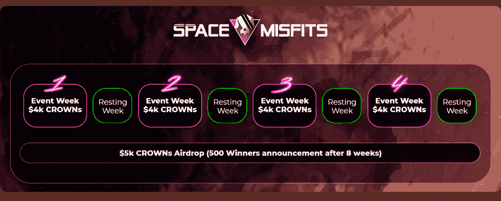
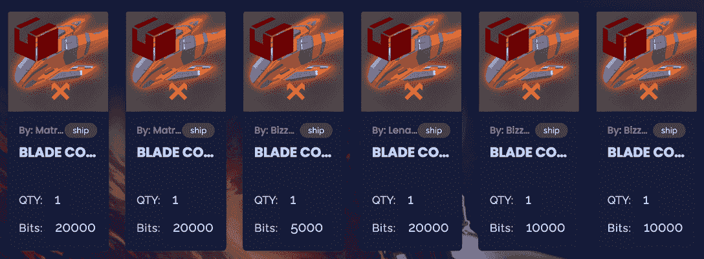

# 探索和竞争太空错位和赚取 21，000 皇冠代币

> 原文：<https://web.archive.org/web/https://dappradar.com/blog/explorer-and-compete-in-space-misfits-and-earn-21000-crown-tokens>

## 该活动将于 3 月 16 日开始，持续 8 周

****即将推出的太空探索游戏 Space Misfits 已经宣布了一项 play-to-earn 活动，在此期间，他们将向玩家分发 21，000 枚皇冠代币。**通过这次活动，他们想推广这款游戏并测试新功能，以帮助团队完成新空间站的创建。**

开发人员多年来一直致力于空间错位，在过去的 6 个月里，团队推出了新的游戏经济，NFTs 和更多的游戏选项。《太空错位》似乎有潜力成为市场上最好的游戏，但他们需要进一步改进游戏。这就是这种“玩即赚”活动发挥作用的地方。

玩家将有机会报名参加皇冠空投，但也通过参与游戏内的活动来增加他们获胜的机会。玩家排行榜将向表现最好的玩家分发活动代币，他们可以在每个空投周结束时用这些代币兑换皇冠代币。

太空错位小组已经决定将空投事件分成四个活动周，每个活动周之间有一个休息周。因此，这种“玩到赚”空投将持续总共两个月。

在每个活动周结束时，团队将分发 4，000 枚皇冠代币，并在 8 周结束时空投另外 5，000 枚皇冠。重要的是，4，000 克朗将根据玩家收集到的活动代币数量在玩家中分配。例如，如果所有参与者在第一周收集了总共 1，000 个事件代币，则 1 个事件代币将被兑换成 4 个皇冠。

要注册 Space Misfits airdrop，请查看 Gleam 活动[此处](https://web.archive.org/web/20221007162250/https://gleam.io/EPGO7/space-misfits-a-staked-claim-16k-crown-event-5k-crown-airdrop)，并填写注册表。

## 空间错位提升玩家参与度

Space Misfits play-to-earn 活动非常注重玩家的参与度。每个活动周都将有不同的任务，让玩家提高他们的成功。关于完整任务列表的细节还没有发布，但是，太空不适应者社区可以在这里跟踪更新。

第一个活动周将持续到 3 月 16 日至 3 月 23 日，将要求玩家建立太空错位舰队。为了获得活动代币，玩家需要制造船只并将其交付给警长哈洛维。制作宇宙飞船需要比特代币和一个活跃的金恩钱包。

向警长 Halloway 的舰队提交船只将为玩家赢得活动令牌，这些令牌可以在休息周期间兑换数字皇冠令牌。这意味着你向舰队派遣的船只越多，你就能从空投中获得越多的皇冠代币。

[https://web.archive.org/web/20221007162250if_/https://www.youtube.com/embed/gInBRMCNgm8?feature=oembed](https://web.archive.org/web/20221007162250if_/https://www.youtube.com/embed/gInBRMCNgm8?feature=oembed)

DappRadar 将继续监测太空错位生态系统，因为玩家们会参加“玩到赚”的皇冠空投活动。如果你想探索更多的区块链游戏，请查看完整的 [DappRadar 顶级区块链游戏](https://web.archive.org/web/20221007162250/https://dappradar.com/rankings/category/games)排名。此外，你可以在[推特](https://web.archive.org/web/20221007162250/https://twitter.com/dappradar)上关注 DappRadar，第一时间了解最新的游戏新闻。

 NewsletterUnsubscribe at any time. [T&Cs](https://web.archive.org/web/20221007162250/https://dappradar.com/terms) and [Privacy Policy](https://web.archive.org/web/20221007162250/https://dappradar.com/privacy-policy)