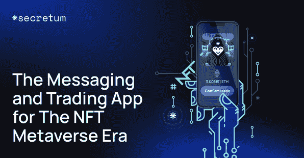

# 探索与 Secretum 相连的元宇宙

> 原文：<https://web.archive.org/web/https://dappradar.com/blog/exploring-a-connected-metaverse-with-secretum>

## Secretum 是元宇宙时代的信息和交易应用

Secretum 旨在为用户提供探索互联元宇宙的能力。这个由区块链驱动的消息应用程序不仅重视隐私，还希望它的用户通过 NFTs 和其他技术进步连接到元宇宙。

如今，元宇宙不再是科技爱好者的小众概念。无论是游戏还是艺术，工作还是娱乐，我们已经在探索元宇宙。我们都需要更高效、更便捷的 it 连接。Secretum 旨在为元宇宙的通信提供创新的解决方案。

技术上的新想法是如此令人兴奋，以至于在我们完全理解它们之前，我们往往会过度使用它们。同样的现象也适用于元宇宙。事实上，元宇宙不仅仅是一个凭空冒出来的花哨行话。

去年，脸书更名为 Meta。科技巨头将他们的未来押在了元宇宙上。远见者将元宇宙描绘成一个新的领域，那里的社会规范和价值体系将人们从政治、文化和经济僵化中解放出来。但首先，我们需要在元宇宙保持联系。一般来说，Web3 在消息传递或信息交换方面需要自己的版本。有了[secret](https://web.archive.org/web/20220929102836/https://secretum.io/)，元宇宙的通信将变得安全而经济。

## 窥视元宇宙

毫无疑问，博彩业是目前元宇宙最受期待的行业。元宇宙游戏平台为用户带来了前所未有的游戏体验自由度。元宇宙游戏平台可以同时作为游戏和活动的场所、内容创作的引擎和交易的市场。最重要的是，用户最终可以以不可替代的令牌(NFT)的形式享有他们游戏内工具和资产的真正所有权。

一方面，像 Axie Infinity 和沙盒这样的游戏提供了一个全新的游戏生态系统，为玩家提供了真正的经济价值。最近的新闻显示，Axie Infinity 年收入达 27 亿美元，主要来自 NFT 的销售。另一个同样令人印象深刻的元宇宙世界是沙盒。2021 年，该平台在 NFT[的土地销售额激增超过 1600%，日销售额超过 300 万美元](https://web.archive.org/web/20220929102836/https://beincrypto.com/secretum-messaging-and-trading-app-for-the-nft-metaverse-era/)。

另一方面，诸如 Bored Ape 游艇俱乐部(BAYC)等 NFT 项目的出现是元宇宙的另一个里程碑。去年春天，苏富比拍卖行[以超过 2400 万美元的价格卖出了](https://web.archive.org/web/20220929102836/https://www.sothebys.com/en/buy/auction/2021/ape-in/101-bored-ape-yacht-club)一套 107 只猿。这些猿头像的持有者包括吉米·法伦、阿姆、沙奎尔·奥尼尔、波斯特·马龙、史努比·道格、马克·库班、斯蒂芬·库里，最近还有贾斯汀比伯。人们普遍对劝说的尝试持怀疑态度，尤其是这种非理性的争论。然而，值得一提的是，这些 NFT 项目正在改变元宇宙背景下品牌建设的传统逻辑。

## 未来:一个有秘密的互联元宇宙

随着元宇宙在不同领域不断取得突破性发展。一个更具活力、互联互通的虚拟世界即将到来。为了自由和安全地体验它，我们也需要以一种通用的方式交流。Secretum 推出了一款完全加密的 P2P 消息应用。这款应用建立在索拉纳·区块链的基础上，不仅能保护用户的隐私，还能让加密交易更具成本效益。它为元宇宙游戏玩家和 NFT 交易者提供了无与伦比的功能和优势。

#### **节约成本**

该消息应用程序还可以作为 NFTs 和其他加密资产的 P2P 交易平台。通过这种方式，该应用程序创建了一个生态系统，NFT 交易和 metaverses 社交可以无缝进行。特别值得一提的是，利用索拉纳，平均交易费用仅为 0.00025 美元。节约成本的特性明显优于以太坊 100 多倍。

#### **私密安全**

Secretum 采用匿名注册，以钱包地址作为用户的唯一身份。它非常适合成为积极保护隐私的元宇宙社区的交流媒介。此外，NFT 存储将发生在分布式节点的网络上，消除了中心故障点和加密窃取的风险。

#### **可扩展**

Secretum 也是一个为规模化而构建的 NFT 交易平台，这要归功于 Solana 每秒处理高达 700，000 笔交易的能力。它是以太坊的 4 万多倍。此外，索拉纳是跨链兼容币安智能链和以太坊。因此，它将有助于 Secretum 从推出之日起渗透 NFT 游戏市场。

Web3 革命激励人们重新审视他们应该如何在网络世界中展示自己。进入元宇宙时代，我们需要回答的一个问题是人与人之间应该如何联系。Secretum 为人们提供了一个经济安全的通信和交易解决方案。该团队的最终目标是成为全元宇宙通讯的首选应用。

## 服务代币私人销售第 3 轮

SER token 的私下出售仍在进行。这是私人销售的最后一个阶段，有可能实现增值。对于第三轮，将以 0.50 美元价格出售 3，000，000 个服务代币。

**截止日期**:2022 年 2 月 28 日 22:00 UTC 或分配的 SER 令牌售出前。

更多信息:
[网站](https://web.archive.org/web/20220929102836/https://secretum.io/)
[电报](https://web.archive.org/web/20220929102836/https://t.me/secretum_global)

**免责声明** —这是一篇赞助文章。DappRadar 不认可本页面上的任何内容或产品。DappRadar 旨在提供准确的信息，但读者应该在采取行动之前总是自己做研究。DappRadar 的文章不能被认为是投资建议。