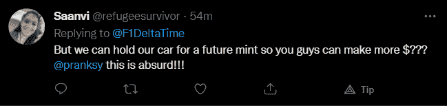

# 赛车游戏 F1 德尔塔时间明天关闭

> 原文：<https://web.archive.org/web/https://dappradar.com/blog/f1-delta-time-closes-down>

## Animoca Brands 无法更新许可证

在 Animoca Brands 结束这个项目之前，NFT 驱动的赛车游戏 F1 Delta Time 的投资者和玩家只剩下 24 个多小时了。这家区块链博彩公司无法更新一级方程式赛车的许可，因此被迫放弃了启动这一切的项目。

Animoca Brands 和他们的 F1 Delta Time 游戏首次成为新闻是在 2019 年，当时他们以 11.1 万美元的价格向 Vignesh Sundaresan(又名 MetaKovan)出售了[NFT 1-1-1](https://web.archive.org/web/20220706172442/https://dappradar.com/hub/assets/eth/0x3c62e8de798721963b439868d3ce22a5252a7e03/111)汽车。另一项重大的 NFT 初选销售发生在 F1 Delta Time 出售赛道段时，为 2020 年 1A 摩纳哥一级方程式大奖赛净得 900 万 REVV 或 223，000 美元。梅塔科万也拥有这辆 NFT，旁边还有各种[其他](https://web.archive.org/web/20220706172442/https://dappradar.com/hub/assets/eth/0x3c62e8de798721963b439868d3ce22a5252a7e03/1929) [NFT](https://web.archive.org/web/20220706172442/https://dappradar.com/hub/assets/eth/0x3c62e8de798721963b439868d3ce22a5252a7e03/1988) [赛车](https://web.archive.org/web/20220706172442/https://dappradar.com/hub/assets/eth/0x3c62e8de798721963b439868d3ce22a5252a7e03/1028) [赛车](https://web.archive.org/web/20220706172442/https://dappradar.com/hub/assets/eth/0x3c62e8de798721963b439868d3ce22a5252a7e03/1963)。

F1 Delta Time NFT 收藏由 1，800 多名用户管理着 40，500 多项资产。在过去的 90 天里，该项目的交易额超过了 11 万美元。昨天，有人花了 16，000 REVV 或 1，627 美元买了一个涡轮增压器汽车零件。由印度 NFT 投资者发起的 Team MetaKovan 车队，这支以比赛赚钱的车队，甚至在两天前收购了一辆价值 2000 美元的 NFT 汽车，增加了他们的 F1 Delta Time NFT 收藏。

很明显，Animoca Brands 的声明是无中生有的，这对社区中的人来说是一个巨大的惊喜。游戏玩家仍然可以赢得 REVV 和 SHRD 代币，直到赛车游戏于 2022 年 3 月 16 日太平洋时间晚上 11:59 正式关闭。

## 那些投资呢？

这是一个非常好的问题。Animoca Brands 已经制定了详细的计划来补偿游戏玩家和投资者，至少是部分补偿。例如，所有 F1 Delta Time 车主都将收到可用于 REVV 赛车的替换车。此外，F1 Delta Time 玩家可以用他们的 NFT 兑换一张比赛通行证，从而获得未来的 NFT 薄荷糖和空投。那些购买赛道段的人将在 REVV Racing 的未来版本中收到赛道段的代金券。本质上，Animoca Brands 将其 F1 Delta 时间社区转化为 REVV 赛车用户。关于所有替换汽车、NFT 和通行证的更详细阅读，[我们建议您参考 Animoca Brands 的官方博客文章](https://web.archive.org/web/20220706172442/https://f1deltatime.medium.com/f1-delta-time-to-cease-operations-announces-rewards-for-supporters-2fbf307fe89f)。

当然，这个消息并不为社区中的每个人所接受。

## 获得许可的 NFT 的问题

除了 MLB 冠军，F1 Delta Time 是市场上首批获得许可的 NFT 产品之一。然而，当一个许可证没有更新时，产品本身就需要退出。这强调了对在这种数字环境中形成的加密本地产品的需求。

看看元数据会发生什么变化会很有趣。这些图形会保留在 NFT 上吗，还是需要移除官方的一级方程式品牌提及？这样的发展将突出对 Web3 本地产品的需求，最好是 100%的链上产品[,如网络经纪人 NFT 系列](https://web.archive.org/web/20220706172442/https://dappradar.com/blog/why-cyberbrokers-paid-250000-to-make-nfts-completely-on-chain)。

在推特上的评论中，有人建议人们应该投入到 [CryptoMotors](https://web.archive.org/web/20220706172442/https://dappradar.com/ethereum/other/cryptomotors) 中，Animoca Brands 也是这个项目的投资者之一。他们的游戏目前正在制作中，他们可能会在今年晚些时候推出早期版本。F1 Delta Time 甚至不是今年第一个关闭的赛车游戏，因为[战斗赛车在二月](https://web.archive.org/web/20220706172442/https://dappradar.com/blog/battle-racers-shuts-down-what-about-these-5-alternatives)关闭了它的大门。我们建议其他赛车游戏，包括[暴动赛车](https://web.archive.org/web/20220706172442/https://dappradar.com/polygon/games/riot-racers)、[新星拉力赛](https://web.archive.org/web/20220706172442/https://dappradar.com/wax/games/nova-rally)和 [REVV 赛车](https://web.archive.org/web/20220706172442/https://dappradar.com/polygon/games/revv-racing)。